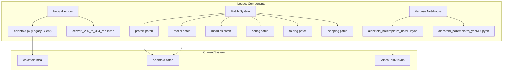
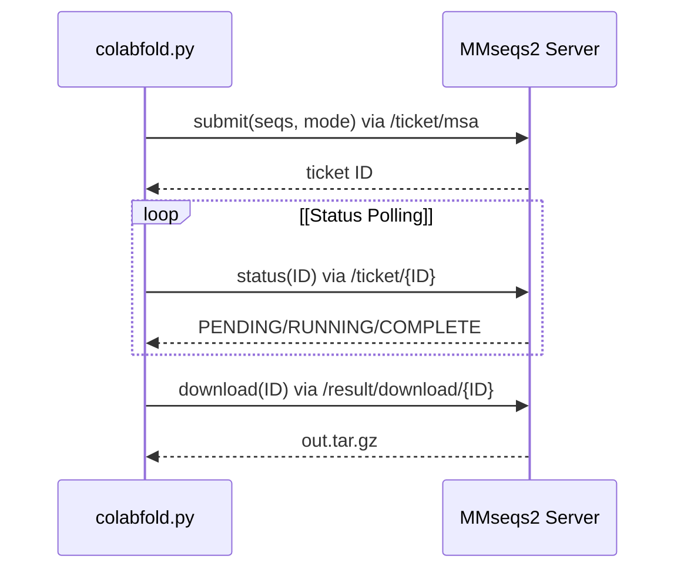

# Legacy Components

> **Relevant source files**
> * [beta/colabfold.py](https://github.com/sokrypton/ColabFold/blob/0c788a0e/beta/colabfold.py)
> * [beta/config.patch](https://github.com/sokrypton/ColabFold/blob/0c788a0e/beta/config.patch)
> * [beta/convert_256_to_384_rep.ipynb](https://github.com/sokrypton/ColabFold/blob/0c788a0e/beta/convert_256_to_384_rep.ipynb)
> * [beta/folding.patch](https://github.com/sokrypton/ColabFold/blob/0c788a0e/beta/folding.patch)
> * [beta/mapping.patch](https://github.com/sokrypton/ColabFold/blob/0c788a0e/beta/mapping.patch)
> * [beta/model.patch](https://github.com/sokrypton/ColabFold/blob/0c788a0e/beta/model.patch)
> * [beta/modules.patch](https://github.com/sokrypton/ColabFold/blob/0c788a0e/beta/modules.patch)
> * [beta/protein.patch](https://github.com/sokrypton/ColabFold/blob/0c788a0e/beta/protein.patch)
> * [colabfold/__init__.py](https://github.com/sokrypton/ColabFold/blob/0c788a0e/colabfold/__init__.py)
> * [verbose/alphafold_noTemplates_noMD.ipynb](https://github.com/sokrypton/ColabFold/blob/0c788a0e/verbose/alphafold_noTemplates_noMD.ipynb)
> * [verbose/alphafold_noTemplates_yesMD.ipynb](https://github.com/sokrypton/ColabFold/blob/0c788a0e/verbose/alphafold_noTemplates_yesMD.ipynb)

This document covers deprecated and legacy systems within ColabFold that are maintained for compatibility reasons. These components include experimental implementations in the `beta/` directory, patch-based modifications to core AlphaFold components, the `verbose/` notebook series, and retired API clients.

For information about current active components, see [Core Components](/sokrypton/ColabFold/3-core-components). For development practices around managing these legacy systems, see [Project Structure](/sokrypton/ColabFold/6.1-project-structure).

## Overview of Legacy Architecture

The ColabFold legacy system consists of experimental beta implementations, patch-based modifications to upstream AlphaFold code, and "verbose" notebooks that exposed internal mechanics. These components were either early prototypes or workarounds for upstream limitations that have since been replaced by more robust implementations in the main codebase.

### Legacy Component Mapping



Sources: [beta/colabfold.py L1-L40](https://github.com/sokrypton/ColabFold/blob/0c788a0e/beta/colabfold.py#L1-L40)

 [beta/model.patch L1-L10](https://github.com/sokrypton/ColabFold/blob/0c788a0e/beta/model.patch#L1-L10)

 [verbose/alphafold_noTemplates_noMD.ipynb L1-L20](https://github.com/sokrypton/ColabFold/blob/0c788a0e/verbose/alphafold_noTemplates_noMD.ipynb#L1-L20)

## Beta API Client: colabfold.py

The `beta/colabfold.py` file contains the legacy implementation of the MMseqs2 API client and visualization utilities. While many functions have been moved to `colabfold.batch` and `colabfold.msa`, this file remains a reference for the original ColabFold API logic.

### Key Legacy Functions

* `run_mmseqs2`: The original client for interacting with `https://a3m.mmseqs.com`. It handles job submission, status polling, and result downloading [beta/colabfold.py L66-L177](https://github.com/sokrypton/ColabFold/blob/0c788a0e/beta/colabfold.py#L66-L177)
* `rm(x)` / `to(x, device)`: Low-level JAX utility functions to manually manage device memory buffers [beta/colabfold.py L46-L54](https://github.com/sokrypton/ColabFold/blob/0c788a0e/beta/colabfold.py#L46-L54)
* `clear_mem(device)`: A brute-force memory clearing utility that deletes all live buffers on the specified XLA backend [beta/colabfold.py L55-L58](https://github.com/sokrypton/ColabFold/blob/0c788a0e/beta/colabfold.py#L55-L58)

### MMseqs2 API Interaction Flow

The legacy client follows a strict polling pattern to retrieve MSAs from the server:



Sources: [beta/colabfold.py L69-L109](https://github.com/sokrypton/ColabFold/blob/0c788a0e/beta/colabfold.py#L69-L109)

 [beta/colabfold.py L138-L177](https://github.com/sokrypton/ColabFold/blob/0c788a0e/beta/colabfold.py#L138-L177)

## Patch-Based Modification System

Before ColabFold integrated its own pipeline, it relied on runtime patches to modify AlphaFold's internal `haiku` modules. These patches were applied to the standard DeepMind AlphaFold installation to enable features like custom recycling and multi-chain handling.

### Core Patches

| Patch File | Target Module | Primary Purpose |
| --- | --- | --- |
| `protein.patch` | `alphafold.common.protein` | Implements multi-chain PDB support via `CHAIN_IDs` and chain break detection [beta/protein.patch L7-L126](https://github.com/sokrypton/ColabFold/blob/0c788a0e/beta/protein.patch#L7-L126) |
| `model.patch` | `alphafold.model.model` | Modifies `RunModel.predict` to support custom `random_seed` and manual recycling loops [beta/model.patch L27-L70](https://github.com/sokrypton/ColabFold/blob/0c788a0e/beta/model.patch#L27-L70) |
| `modules.patch` | `alphafold.model.modules` | Replaces the internal `hk.while_loop` for recycling with a manual call structure to allow intermediate output access [beta/modules.patch L16-L66](https://github.com/sokrypton/ColabFold/blob/0c788a0e/beta/modules.patch#L16-L66) |
| `config.patch` | `alphafold.model.config` | Adds `recycle_tol` (recycling tolerance) to the model configuration [beta/config.patch L3-L10](https://github.com/sokrypton/ColabFold/blob/0c788a0e/beta/config.patch#L3-L10) |
| `folding.patch` | `alphafold.model.folding` | Replaces the iterative folding loop with `hk.scan` for better performance and memory management [beta/folding.patch L7-L34](https://github.com/sokrypton/ColabFold/blob/0c788a0e/beta/folding.patch#L7-L34) |
| `mapping.patch` | `alphafold.model.mapping` | Updates JAX tree utility calls from `tree_multimap` to the modern `tree_map` API [beta/mapping.patch L7-L63](https://github.com/sokrypton/ColabFold/blob/0c788a0e/beta/mapping.patch#L7-L63) |

### Multi-Chain Support (protein.patch)

The `protein.patch` is critical for legacy multimer support. It defines `CHAIN_IDs` using `ascii_uppercase + ascii_lowercase` [beta/protein.patch L7-L9](https://github.com/sokrypton/ColabFold/blob/0c788a0e/beta/protein.patch#L7-L9)

 and introduces a `PARAM_CHAIN_BREAK` constant (set to 100) to offset residue indices between different chains [beta/protein.patch L52-L91](https://github.com/sokrypton/ColabFold/blob/0c788a0e/beta/protein.patch#L52-L91)

Sources: [beta/protein.patch L52-L91](https://github.com/sokrypton/ColabFold/blob/0c788a0e/beta/protein.patch#L52-L91)

 [beta/model.patch L49-L70](https://github.com/sokrypton/ColabFold/blob/0c788a0e/beta/model.patch#L49-L70)

## Verbose Notebooks

The `verbose/` directory contains notebooks designed for educational purposes or "quick" demos that bypass parts of the standard pipeline.

* **`alphafold_noTemplates_noMD.ipynb`**: A stripped-down version of AlphaFold that disables templates and Amber Molecular Dynamics (MD) refinement [verbose/alphafold_noTemplates_noMD.ipynb L50-L57](https://github.com/sokrypton/ColabFold/blob/0c788a0e/verbose/alphafold_noTemplates_noMD.ipynb#L50-L57)  It uses a `mk_mock_template` function to generate blank template features [verbose/alphafold_noTemplates_noMD.ipynb L124-L135](https://github.com/sokrypton/ColabFold/blob/0c788a0e/verbose/alphafold_noTemplates_noMD.ipynb#L124-L135)
* **`alphafold_noTemplates_yesMD.ipynb`**: Similar to the above but includes a manual setup for `openmm` and `pdbfixer` to perform structure relaxation [verbose/alphafold_noTemplates_yesMD.ipynb L143-L151](https://github.com/sokrypton/ColabFold/blob/0c788a0e/verbose/alphafold_noTemplates_yesMD.ipynb#L143-L151)

Sources: [verbose/alphafold_noTemplates_noMD.ipynb L47-L64](https://github.com/sokrypton/ColabFold/blob/0c788a0e/verbose/alphafold_noTemplates_noMD.ipynb#L47-L64)

 [verbose/alphafold_noTemplates_yesMD.ipynb L79-L87](https://github.com/sokrypton/ColabFold/blob/0c788a0e/verbose/alphafold_noTemplates_yesMD.ipynb#L79-L87)

## Utilities

### Representation Conversion

The `beta/convert_256_to_384_rep.ipynb` utility is used to upgrade internal protein representations. Specifically, it converts the `single` representation from a dimension of 256 to 384 by applying the weights and biases from the Evoformer's `single_activations` layer [beta/convert_256_to_384_rep.ipynb L65-L71](https://github.com/sokrypton/ColabFold/blob/0c788a0e/beta/convert_256_to_384_rep.ipynb#L65-L71)

**Implementation Logic:**

```markdown
# From beta/convert_256_to_384_rep.ipynbw = model_params['alphafold/alphafold_iteration/evoformer/single_activations//weights']b = model_params['alphafold/alphafold_iteration/evoformer/single_activations//bias']single_rep_384 = data["representations"]["single"] @ w + b
```

Sources: [beta/convert_256_to_384_rep.ipynb L65-L71](https://github.com/sokrypton/ColabFold/blob/0c788a0e/beta/convert_256_to_384_rep.ipynb#L65-L71)