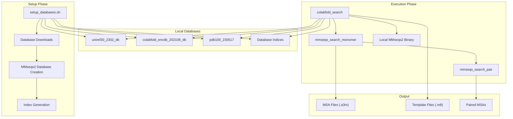
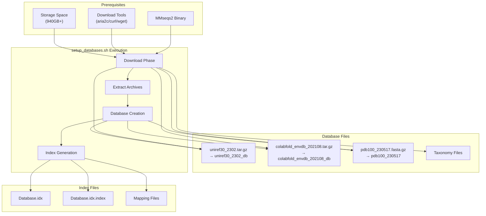
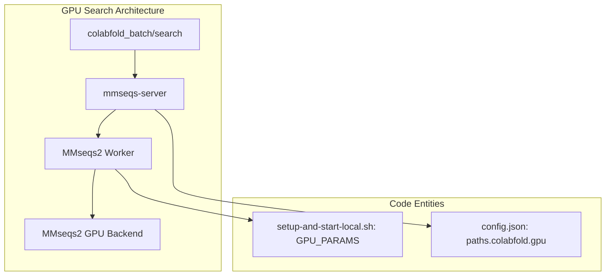

# Local Execution

> **Relevant source files**
> * [MsaServer/README.md](https://github.com/sokrypton/ColabFold/blob/0c788a0e/MsaServer/README.md?plain=1)
> * [MsaServer/config.json](https://github.com/sokrypton/ColabFold/blob/0c788a0e/MsaServer/config.json)
> * [MsaServer/restart-systemd.sh](https://github.com/sokrypton/ColabFold/blob/0c788a0e/MsaServer/restart-systemd.sh)
> * [MsaServer/setup-and-start-local.sh](https://github.com/sokrypton/ColabFold/blob/0c788a0e/MsaServer/setup-and-start-local.sh)
> * [MsaServer/systemd-example-mmseqs-server.service](https://github.com/sokrypton/ColabFold/blob/0c788a0e/MsaServer/systemd-example-mmseqs-server.service)
> * [colabfold_search.sh](https://github.com/sokrypton/ColabFold/blob/0c788a0e/colabfold_search.sh)
> * [setup_databases.sh](https://github.com/sokrypton/ColabFold/blob/0c788a0e/setup_databases.sh)

This document covers running ColabFold with local databases and compute resources instead of relying on the public MSA server. Local execution enables large-scale protein structure prediction workflows with full control over computational resources and data privacy.

## Overview

Local execution in ColabFold consists of two main phases: database setup and local MSA generation. This approach is essential for high-throughput predictions, situations requiring data privacy, or when the public MSA server is unavailable.

### Local Execution Architecture



**Local Execution Components**
The local execution system operates independently of the public MSA server, providing complete control over the protein structure prediction pipeline.

Sources: [setup_databases.sh L1-L3](https://github.com/sokrypton/ColabFold/blob/0c788a0e/setup_databases.sh#L1-L3)

## Database Setup Process

Local execution requires downloading and setting up multiple large databases. The `setup_databases.sh` script automates this process, handling downloads via `aria2c`, `curl`, or `wget` [setup_databases.sh L38-L44](https://github.com/sokrypton/ColabFold/blob/0c788a0e/setup_databases.sh#L38-L44)

### Database Setup Workflow



**Database Setup Configuration**

| Environment Variable | Purpose | Default |
| --- | --- | --- |
| `MMSEQS_NO_INDEX=1` | Skip index creation for batch searches [setup_databases.sh L3](https://github.com/sokrypton/ColabFold/blob/0c788a0e/setup_databases.sh#L3-L3) | unset |
| `GPU=1` | Setup GPU-compatible databases [setup_databases.sh L21](https://github.com/sokrypton/ColabFold/blob/0c788a0e/setup_databases.sh#L21-L21) | unset |
| `FAST_PREBUILT_DATABASES=1` | Use prebuilt databases that support CPU/GPU [setup_databases.sh L20](https://github.com/sokrypton/ColabFold/blob/0c788a0e/setup_databases.sh#L20-L20) | `1` |
| `DOWNLOADS_ONLY=1` | Download only, skip processing [setup_databases.sh L17](https://github.com/sokrypton/ColabFold/blob/0c788a0e/setup_databases.sh#L17-L17) | unset |
| `DEBUG_MINI_DB=1` | Download tiny SwissProt database for testing [setup_databases.sh L76-L77](https://github.com/sokrypton/ColabFold/blob/0c788a0e/setup_databases.sh#L76-L77) | unset |

Sources: [setup_databases.sh L1-L187](https://github.com/sokrypton/ColabFold/blob/0c788a0e/setup_databases.sh#L1-L187)

### Memory Management with vmtouch

For low-latency MSA generation (few seconds), databases must be resident in system memory. The index files (`.idx`) for UniRef30 and ColabFoldDB require significant RAM (approx. 768GB-1024GB).
The `vmtouch` tool is recommended to lock these indices in the system cache:

```
cd databasessudo vmtouch -f -w -t -l -d -m 1000G *.idx
```

Sources: [MsaServer/README.md L51-L60](https://github.com/sokrypton/ColabFold/blob/0c788a0e/MsaServer/README.md?plain=1#L51-L60)

## MSA Server Configuration

The `MsaServer` is a Go-based backend (often called `mmseqs-server`) that provides an API for MSA generation. It can be run in `-local` mode to combine the server and worker processes [MsaServer/setup-and-start-local.sh L105-L106](https://github.com/sokrypton/ColabFold/blob/0c788a0e/MsaServer/setup-and-start-local.sh#L105-L106)

### Configuration (config.json)

The `config.json` file controls the behavior of the server, including database paths, parallelization, and GPU support.

| Key | Description |
| --- | --- |
| `server.address` | The bind address/port (default `127.0.0.1:8080`) [MsaServer/config.json L6](https://github.com/sokrypton/ColabFold/blob/0c788a0e/MsaServer/config.json#L6-L6) |
| `worker.paralleldatabases` | How many databases to search in parallel [MsaServer/config.json L40](https://github.com/sokrypton/ColabFold/blob/0c788a0e/MsaServer/config.json#L40-L40) |
| `paths.colabfold.uniref` | Path to the local UniRef30 database [MsaServer/config.json L67](https://github.com/sokrypton/ColabFold/blob/0c788a0e/MsaServer/config.json#L67-L67) |
| `paths.colabfold.environmental` | Path to the local ColabFoldDB [MsaServer/config.json L69](https://github.com/sokrypton/ColabFold/blob/0c788a0e/MsaServer/config.json#L69-L69) |
| `paths.colabfold.gpu.server` | Enable `gpuserver` to save overhead (~1.5s) [MsaServer/config.json L54-L55](https://github.com/sokrypton/ColabFold/blob/0c788a0e/MsaServer/config.json#L54-L55) |

Sources: [MsaServer/config.json L1-L111](https://github.com/sokrypton/ColabFold/blob/0c788a0e/MsaServer/config.json#L1-L111)

### GPU Server Setup

ColabFold supports GPU-accelerated MSA searches. This requires MMseqs2 release 16 or newer [setup_databases.sh L128-L131](https://github.com/sokrypton/ColabFold/blob/0c788a0e/setup_databases.sh#L128-L131)



To enable GPU mode, set `export GPU=1` in `setup-and-start-local.sh` [MsaServer/setup-and-start-local.sh L9](https://github.com/sokrypton/ColabFold/blob/0c788a0e/MsaServer/setup-and-start-local.sh#L9-L9)

 This adds `--paths.colabfold.gpu.gpu 1 --paths.colabfold.gpu.server 1` to the server startup [MsaServer/setup-and-start-local.sh L101-L103](https://github.com/sokrypton/ColabFold/blob/0c788a0e/MsaServer/setup-and-start-local.sh#L101-L103)

Sources: [MsaServer/README.md L18-L20](https://github.com/sokrypton/ColabFold/blob/0c788a0e/MsaServer/README.md?plain=1#L18-L20)

 [MsaServer/setup-and-start-local.sh L38-L40](https://github.com/sokrypton/ColabFold/blob/0c788a0e/MsaServer/setup-and-start-local.sh#L38-L40)

## Execution Scripts

### colabfold_search.sh

While users are encouraged to use the Python-based `colabfold_search` CLI, the underlying logic involves several MMseqs2 stages:

1. `createdb`: Initialize query database [colabfold_search.sh L36](https://github.com/sokrypton/ColabFold/blob/0c788a0e/colabfold_search.sh#L36-L36)
2. `search`: Perform initial alignment against UniRef30 [colabfold_search.sh L37](https://github.com/sokrypton/ColabFold/blob/0c788a0e/colabfold_search.sh#L37-L37)
3. `expandaln`: Expand alignments for better coverage [colabfold_search.sh L38](https://github.com/sokrypton/ColabFold/blob/0c788a0e/colabfold_search.sh#L38-L38)
4. `align`: Re-align expanded profiles [colabfold_search.sh L41](https://github.com/sokrypton/ColabFold/blob/0c788a0e/colabfold_search.sh#L41-L41)
5. `filterresult`: Filter for high-quality hits [colabfold_search.sh L42](https://github.com/sokrypton/ColabFold/blob/0c788a0e/colabfold_search.sh#L42-L42)
6. `result2msa`: Convert results to A3M format [colabfold_search.sh L43](https://github.com/sokrypton/ColabFold/blob/0c788a0e/colabfold_search.sh#L43-L43)

### Systemd Integration

For production environments, the server should be managed as a system service.

* **Service Unit**: `MsaServer/systemd-example-mmseqs-server.service` defines the execution environment and automatic restart policy [MsaServer/systemd-example-mmseqs-server.service L1-L16](https://github.com/sokrypton/ColabFold/blob/0c788a0e/MsaServer/systemd-example-mmseqs-server.service#L1-L16)
* **Restart Logic**: `MsaServer/restart-systemd.sh` clears the `jobs` directory before restarting the service to ensure a clean state [MsaServer/restart-systemd.sh L1-L5](https://github.com/sokrypton/ColabFold/blob/0c788a0e/MsaServer/restart-systemd.sh#L1-L5)

Sources: [colabfold_search.sh L31-L63](https://github.com/sokrypton/ColabFold/blob/0c788a0e/colabfold_search.sh#L31-L63)

 [MsaServer/README.md L44-L50](https://github.com/sokrypton/ColabFold/blob/0c788a0e/MsaServer/README.md?plain=1#L44-L50)