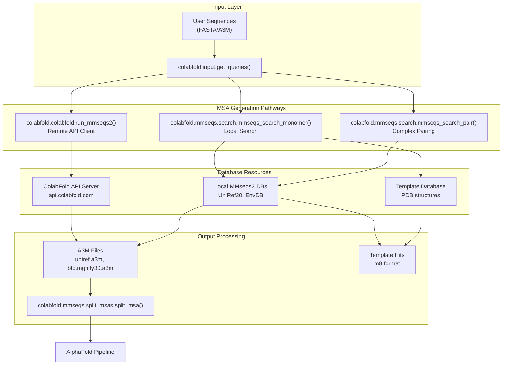
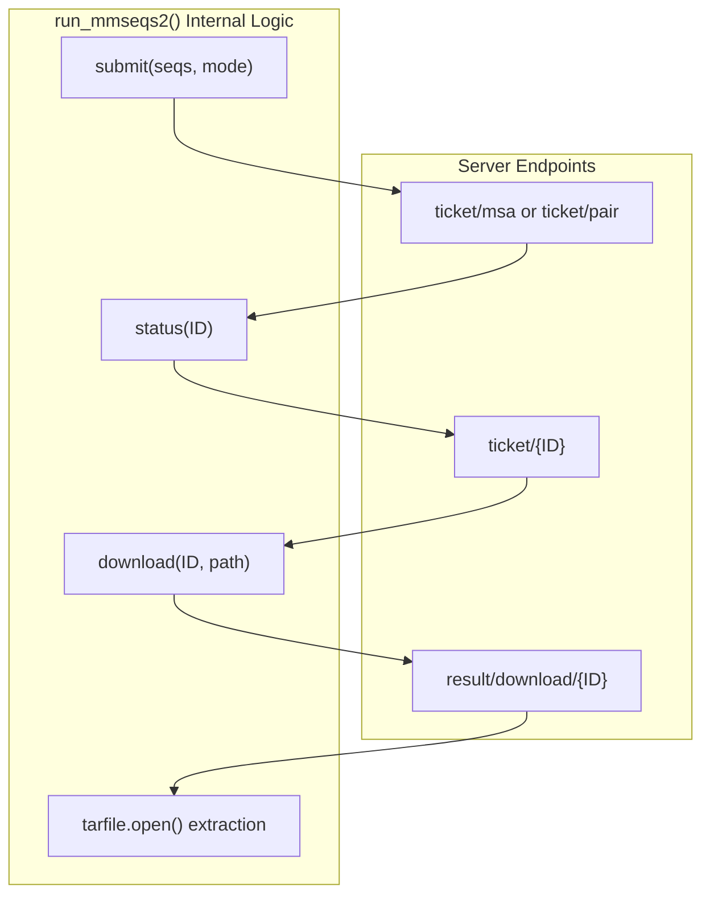

# MSA Generation and Search

> **Relevant source files**
> * [beta/pairmsa.py](https://github.com/sokrypton/ColabFold/blob/0c788a0e/beta/pairmsa.py)
> * [colabfold/alphafold/__init__.py](https://github.com/sokrypton/ColabFold/blob/0c788a0e/colabfold/alphafold/__init__.py)
> * [colabfold/alphafold/extra_ptm.py](https://github.com/sokrypton/ColabFold/blob/0c788a0e/colabfold/alphafold/extra_ptm.py)
> * [colabfold/alphafold/msa.py](https://github.com/sokrypton/ColabFold/blob/0c788a0e/colabfold/alphafold/msa.py)
> * [colabfold/colabfold.py](https://github.com/sokrypton/ColabFold/blob/0c788a0e/colabfold/colabfold.py)
> * [colabfold/mmseqs/__init__.py](https://github.com/sokrypton/ColabFold/blob/0c788a0e/colabfold/mmseqs/__init__.py)
> * [colabfold/mmseqs/merge_and_split_msas.py](https://github.com/sokrypton/ColabFold/blob/0c788a0e/colabfold/mmseqs/merge_and_split_msas.py)
> * [colabfold/mmseqs/search.py](https://github.com/sokrypton/ColabFold/blob/0c788a0e/colabfold/mmseqs/search.py)
> * [colabfold/mmseqs/split_msas.py](https://github.com/sokrypton/ColabFold/blob/0c788a0e/colabfold/mmseqs/split_msas.py)
> * [colabfold/pdb.py](https://github.com/sokrypton/ColabFold/blob/0c788a0e/colabfold/pdb.py)
> * [colabfold/plot.py](https://github.com/sokrypton/ColabFold/blob/0c788a0e/colabfold/plot.py)

This document covers the Multiple Sequence Alignment (MSA) generation and homology search functionality in ColabFold. The system provides both remote API-based and local database search capabilities using MMseqs2, supporting single protein sequences, protein complexes, and template-based modeling.

For information about input processing and sequence handling, see [Input Processing and Utilities](/sokrypton/ColabFold/3.4-input-processing-and-utilities). For batch processing workflows that orchestrate MSA generation, see [Batch Processing System](/sokrypton/ColabFold/3.1-batch-processing-system).

## Architecture Overview

The MSA generation system operates through two primary pathways: remote server-based searches via the ColabFold API and local searches using downloaded MMseqs2 databases. Both approaches generate A3M format alignments that feed into the AlphaFold prediction pipeline.

### System Mapping: Data Flow to Code Entities

The following diagram maps the conceptual search process to the specific functions and classes implemented in the codebase.



Sources: [colabfold/colabfold.py L68-L71](https://github.com/sokrypton/ColabFold/blob/0c788a0e/colabfold/colabfold.py#L68-L71)

 [colabfold/mmseqs/search.py L50-L72](https://github.com/sokrypton/ColabFold/blob/0c788a0e/colabfold/mmseqs/search.py#L50-L72)

 [colabfold/mmseqs/search.py L211-L235](https://github.com/sokrypton/ColabFold/blob/0c788a0e/colabfold/mmseqs/search.py#L211-L235)

 [colabfold/mmseqs/split_msas.py L14-L31](https://github.com/sokrypton/ColabFold/blob/0c788a0e/colabfold/mmseqs/split_msas.py#L14-L31)

## Remote API-Based Search

The primary MSA generation method uses the ColabFold MMseqs2 API server through the `run_mmseqs2()` function [colabfold/colabfold.py L68](https://github.com/sokrypton/ColabFold/blob/0c788a0e/colabfold/colabfold.py#L68-L68)

 This approach handles job submission, polling, and result retrieval automatically.

### Core API Client Implementation

The `run_mmseqs2` function manages the lifecycle of a remote search job:



The function supports multiple search modes controlled by parameters:

| Parameter | Purpose | Code Reference |
| --- | --- | --- |
| `use_env` | Include environmental sequences | [colabfold/colabfold.py L68](https://github.com/sokrypton/ColabFold/blob/0c788a0e/colabfold/colabfold.py#L68-L68) |
| `use_filter` | Apply quality filtering | [colabfold/colabfold.py L68](https://github.com/sokrypton/ColabFold/blob/0c788a0e/colabfold/colabfold.py#L68-L68) |
| `use_pairing` | Enable complex pairing | [colabfold/colabfold.py L69](https://github.com/sokrypton/ColabFold/blob/0c788a0e/colabfold/colabfold.py#L69-L69) |
| `pairing_strategy` | "greedy" or "complete" | [colabfold/colabfold.py L69](https://github.com/sokrypton/ColabFold/blob/0c788a0e/colabfold/colabfold.py#L69-L69) |

The client implements robust error handling for `requests` timeouts and server-side rate limits [colabfold/colabfold.py L87-L103](https://github.com/sokrypton/ColabFold/blob/0c788a0e/colabfold/colabfold.py#L87-L103)

 [colabfold/colabfold.py L201-L206](https://github.com/sokrypton/ColabFold/blob/0c788a0e/colabfold/colabfold.py#L201-L206)

Sources: [colabfold/colabfold.py L68-L331](https://github.com/sokrypton/ColabFold/blob/0c788a0e/colabfold/colabfold.py#L68-L331)

## Local Database Search

For users requiring local execution, the system supports MMseqs2 database searches using the `colabfold_search` CLI entrypoint, which calls `mmseqs_search_monomer` [colabfold/mmseqs/search.py L50](https://github.com/sokrypton/ColabFold/blob/0c788a0e/colabfold/mmseqs/search.py#L50-L50)

 or `mmseqs_search_pair` [colabfold/mmseqs/search.py L211](https://github.com/sokrypton/ColabFold/blob/0c788a0e/colabfold/mmseqs/search.py#L211-L211)

### Local Search Pipeline Logic

The `mmseqs_search_monomer` function orchestrates a series of MMseqs2 module calls to produce a filtered A3M:

1. **Search**: `mmseqs search` against UniRef30 [colabfold/mmseqs/search.py L131](https://github.com/sokrypton/ColabFold/blob/0c788a0e/colabfold/mmseqs/search.py#L131-L131)
2. **Expansion**: `mmseqs expandaln` to increase alignment diversity [colabfold/mmseqs/search.py L134](https://github.com/sokrypton/ColabFold/blob/0c788a0e/colabfold/mmseqs/search.py#L134-L134)
3. **Realignment**: `mmseqs align` to refine hits [colabfold/mmseqs/search.py L135](https://github.com/sokrypton/ColabFold/blob/0c788a0e/colabfold/mmseqs/search.py#L135-L135)
4. **Filtering**: `mmseqs filterresult` based on identity and score [colabfold/mmseqs/search.py L136](https://github.com/sokrypton/ColabFold/blob/0c788a0e/colabfold/mmseqs/search.py#L136-L136)
5. **Conversion**: `mmseqs result2msa` to generate the final A3M format [colabfold/mmseqs/search.py L140](https://github.com/sokrypton/ColabFold/blob/0c788a0e/colabfold/mmseqs/search.py#L140-L140)

If `use_env` is enabled, the process repeats for the metagenomic database (e.g., ColabFold EnvDB) [colabfold/mmseqs/search.py L150-L166](https://github.com/sokrypton/ColabFold/blob/0c788a0e/colabfold/mmseqs/search.py#L150-L166)

### Local Pairing Logic

For multimer prediction, `mmseqs_search_pair` identifies co-occurring sequences:

* It uses the `pairaln` module to match sequences by taxonomy ID [colabfold/mmseqs/search.py L255](https://github.com/sokrypton/ColabFold/blob/0c788a0e/colabfold/mmseqs/search.py#L255-L255)
* It supports both UniRef and environmental databases for pairing [colabfold/mmseqs/search.py L237-L287](https://github.com/sokrypton/ColabFold/blob/0c788a0e/colabfold/mmseqs/search.py#L237-L287)

Sources: [colabfold/mmseqs/search.py L50-L287](https://github.com/sokrypton/ColabFold/blob/0c788a0e/colabfold/mmseqs/search.py#L50-L287)

## MSA Processing and Utilities

### A3M Parsing and Filtering

The `beta/pairmsa.py` file contains utilities for handling A3M files, particularly for manual pairing or filtering:

* `parse_a3m()`: Extracts sequences, names, and deletion matrices from A3M files [beta/pairmsa.py L7-L72](https://github.com/sokrypton/ColabFold/blob/0c788a0e/beta/pairmsa.py#L7-L72)
* `uni_num()`: Converts UniProt accessions into numerical hashes to facilitate cross-chain pairing [beta/pairmsa.py L92-L120](https://github.com/sokrypton/ColabFold/blob/0c788a0e/beta/pairmsa.py#L92-L120)
* `_stitch()`: Implements the logic for joining two MSAs based on matching UniProt IDs or genomic proximity [beta/pairmsa.py L201-L230](https://github.com/sokrypton/ColabFold/blob/0c788a0e/beta/pairmsa.py#L201-L230)

### Splitting Merged MSAs

When running large batch searches, MMseqs2 often produces a single large database or a merged A3M file where individual MSAs are separated by null characters (`\0`).

The `split_msa` utility [colabfold/mmseqs/split_msas.py L14](https://github.com/sokrypton/ColabFold/blob/0c788a0e/colabfold/mmseqs/split_msas.py#L14-L14)

 reads these merged files and writes them out as individual `.a3m` files:

* It uses a streaming approach to avoid loading massive files into memory [colabfold/mmseqs/split_msas.py L17-L30](https://github.com/sokrypton/ColabFold/blob/0c788a0e/colabfold/mmseqs/split_msas.py#L17-L30)
* It sanitizes filenames by replacing forward slashes and removing leading `>` characters [colabfold/mmseqs/split_msas.py L23](https://github.com/sokrypton/ColabFold/blob/0c788a0e/colabfold/mmseqs/split_msas.py#L23-L23)

```mermaid
flowchart TD

A["Read merged.a3m"]
B["Contains \0?"]
C["Buffer line"]
D["Extract Header"]
E["Write to {Header}.a3m"]
F["Clear Buffer"]

subgraph colabfold.mmseqs.split_msas.split_msa() ["colabfold.mmseqs.split_msas.split_msa()"]
    A
    B
    C
    D
    E
    F
    A --> B
    B --> C
    B --> D
    D --> E
    E --> F
end
```

Sources: [colabfold/mmseqs/split_msas.py L1-L55](https://github.com/sokrypton/ColabFold/blob/0c788a0e/colabfold/mmseqs/split_msas.py#L1-L55)

 [beta/pairmsa.py L7-L230](https://github.com/sokrypton/ColabFold/blob/0c788a0e/beta/pairmsa.py#L7-L230)

## MSA Visualization

ColabFold provides sequence coverage plots to help users assess the quality of the generated MSA.

* `plot_msa_v2()`: Creates a heatmap of sequence identity to the query across the entire alignment [colabfold/plot.py L20-L78](https://github.com/sokrypton/ColabFold/blob/0c788a0e/colabfold/plot.py#L20-L78)
* It calculates `qid` (query identity) per position and handles multimer alignments by drawing vertical black lines at chain boundaries [colabfold/plot.py L42-L70](https://github.com/sokrypton/ColabFold/blob/0c788a0e/colabfold/plot.py#L42-L70)
* It uses `matplotlib.imshow` with the `rainbow_r` colormap to visualize coverage depth and identity [colabfold/plot.py L63-L66](https://github.com/sokrypton/ColabFold/blob/0c788a0e/colabfold/plot.py#L63-L66)

Sources: [colabfold/plot.py L20-L78](https://github.com/sokrypton/ColabFold/blob/0c788a0e/colabfold/plot.py#L20-L78)