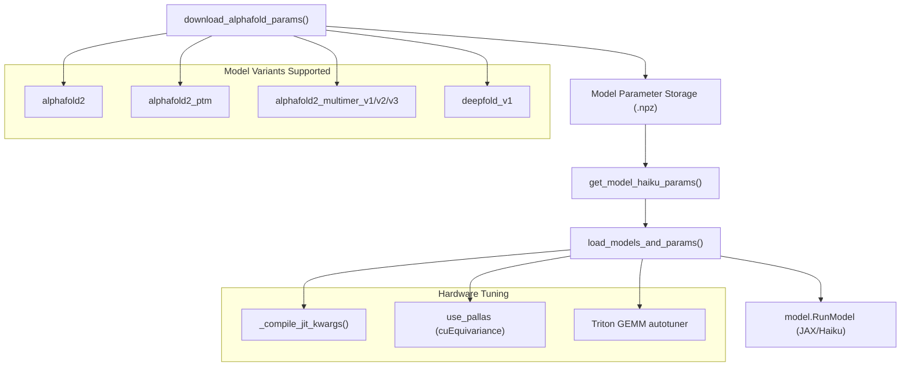
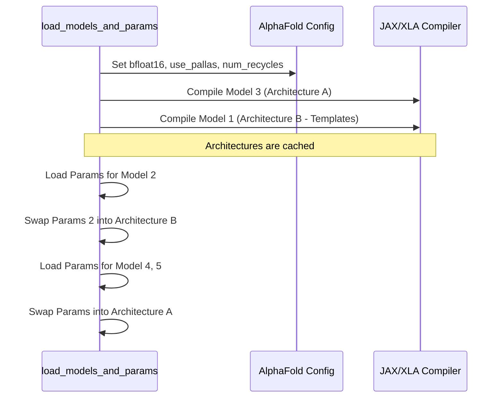

# Model Management

> **Relevant source files**
> * [colabfold/alphafold/models.py](https://github.com/sokrypton/ColabFold/blob/0c788a0e/colabfold/alphafold/models.py)
> * [colabfold/citations.py](https://github.com/sokrypton/ColabFold/blob/0c788a0e/colabfold/citations.py)
> * [colabfold/download.py](https://github.com/sokrypton/ColabFold/blob/0c788a0e/colabfold/download.py)
> * [utils/convert_deepfold_weights.py](https://github.com/sokrypton/ColabFold/blob/0c788a0e/utils/convert_deepfold_weights.py)

This document describes the model management system in ColabFold, which handles downloading, loading, configuring, and organizing AlphaFold model parameters. This system provides the foundation for the structure prediction pipeline by ensuring the correct models are available and properly configured for various hardware backends.

## 1. Overview of Model Management

The model management system in ColabFold handles the complete lifecycle of AlphaFold models, from download to runtime configuration. The system provides:

1. Automated download and caching of model parameters [colabfold/download.py L38-L132](https://github.com/sokrypton/ColabFold/blob/0c788a0e/colabfold/download.py#L38-L132)
2. Support for multiple AlphaFold model variants, including Multimer and DeepFold [colabfold/alphafold/models.py L40-L54](https://github.com/sokrypton/ColabFold/blob/0c788a0e/colabfold/alphafold/models.py#L40-L54)
3. Optimized model loading with parameter reuse to minimize JAX compilation time [colabfold/alphafold/models.py L101-L108](https://github.com/sokrypton/ColabFold/blob/0c788a0e/colabfold/alphafold/models.py#L101-L108)
4. Hardware-specific tuning via JAX compilation strategies (Triton, Pallas) [colabfold/alphafold/models.py L9-L23](https://github.com/sokrypton/ColabFold/blob/0c788a0e/colabfold/alphafold/models.py#L9-L23)
5. Configuration management for recycles, ensembles, and memory limits [colabfold/alphafold/models.py L124-L175](https://github.com/sokrypton/ColabFold/blob/0c788a0e/colabfold/alphafold/models.py#L124-L175)

### Model Management Architecture

Sources: [colabfold/download.py L38-L140](https://github.com/sokrypton/ColabFold/blob/0c788a0e/colabfold/download.py#L38-L140)

 [colabfold/alphafold/models.py L9-L201](https://github.com/sokrypton/ColabFold/blob/0c788a0e/colabfold/alphafold/models.py#L9-L201)

## 2. Model Types and Parameter Files

ColabFold supports multiple AlphaFold model variants, each with different capabilities and parameter files. The system manages these through standardized naming conventions.

### 2.1 Supported Model Types

| Model Type | Description | Parameter File Pattern | Download Source |
| --- | --- | --- | --- |
| `alphafold2` | Original AlphaFold2 model | `params_model_{n}.npz` | `alphafold_params_2021-07-14.tar` |
| `alphafold2_ptm` | AlphaFold2 with pTM confidence head | `params_model_{n}_ptm.npz` | `alphafold_params_2021-07-14.tar` |
| `alphafold2_multimer_v1` | AlphaFold-Multimer v1 | `params_model_{n}_multimer.npz` | `alphafold_params_colab_2021-10-27.tar` |
| `alphafold2_multimer_v2` | AlphaFold-Multimer v2 | `params_model_{n}_multimer_v2.npz` | `alphafold_params_colab_2022-03-02.tar` |
| `alphafold2_multimer_v3` | AlphaFold-Multimer v3 | `params_model_{n}_multimer_v3.npz` | `alphafold_params_colab_2022-12-06.tar` |
| `deepfold_v1` | DeepFold enhanced model | `deepfold_model_{n}.npz` | `deepfold_v1/` (steineggerlab) |

Sources: [colabfold/alphafold/models.py L40-L54](https://github.com/sokrypton/ColabFold/blob/0c788a0e/colabfold/alphafold/models.py#L40-L54)

 [colabfold/download.py L40-L68](https://github.com/sokrypton/ColabFold/blob/0c788a0e/colabfold/download.py#L40-L68)

### 2.2 Model-to-Configuration Name Mapping

The `model_to_config_name` function maps model types to their corresponding internal AlphaFold configuration names. For example, `deepfold_v1` maps to standard `model_{n}` configs [colabfold/alphafold/models.py L72-L73](https://github.com/sokrypton/ColabFold/blob/0c788a0e/colabfold/alphafold/models.py#L72-L73)

Sources: [colabfold/alphafold/models.py L61-L76](https://github.com/sokrypton/ColabFold/blob/0c788a0e/colabfold/alphafold/models.py#L61-L76)

## 3. Model Parameter Download System

The `download_alphafold_params` function handles the retrieval of weights. It implements parallel downloads for DeepFold models using `multiprocessing.Process` [colabfold/download.py L88-L96](https://github.com/sokrypton/ColabFold/blob/0c788a0e/colabfold/download.py#L88-L96)

### 3.1 Storage and Caching

Model parameters are stored in a `params/` subdirectory within the `default_data_dir` (usually managed via `appdirs`) [colabfold/download.py L12-L39](https://github.com/sokrypton/ColabFold/blob/0c788a0e/colabfold/download.py#L12-L39)

 A success marker file (e.g., `download_finished.txt`) is touched upon successful extraction to prevent redundant downloads [colabfold/download.py L131](https://github.com/sokrypton/ColabFold/blob/0c788a0e/colabfold/download.py#L131-L131)

Sources: [colabfold/download.py L1-L132](https://github.com/sokrypton/ColabFold/blob/0c788a0e/colabfold/download.py#L1-L132)

## 4. JAX Compilation and Hardware Tuning

ColabFold optimizes the structure prediction runtime through specific JAX compilation strategies.

### 4.1 Compilation Modes

The `_compile_jit_kwargs` function provides three modes for the XLA compiler [colabfold/alphafold/models.py L9-L23](https://github.com/sokrypton/ColabFold/blob/0c788a0e/colabfold/alphafold/models.py#L9-L23)

:

* **fast**: Disables Triton GEMM.
* **tuned**: Uses a specific GEMM autotuner string (e.g., `block_m: 64 block_n: 64 ...`) optimized for GB10/L40S/A100 GPUs.
* **full**: Default XLA behavior.

### 4.2 Pallas Kernels

The system supports `use_pallas`, which enables `cuEquivariance` fused kernels within the AlphaFold global configuration [colabfold/alphafold/models.py L139](https://github.com/sokrypton/ColabFold/blob/0c788a0e/colabfold/alphafold/models.py#L139-L139)

Sources: [colabfold/alphafold/models.py L9-L23](https://github.com/sokrypton/ColabFold/blob/0c788a0e/colabfold/alphafold/models.py#L9-L23)

 [colabfold/alphafold/models.py L139](https://github.com/sokrypton/ColabFold/blob/0c788a0e/colabfold/alphafold/models.py#L139-L139)

## 5. Optimized Model Loading Strategy

The `load_models_and_params` function implements a strategy to avoid redundant JAX recompilation.

### 5.1 Compilation Minimization

Because JAX compilation is expensive, ColabFold only compiles the minimum number of required model architectures [colabfold/alphafold/models.py L101-L105](https://github.com/sokrypton/ColabFold/blob/0c788a0e/colabfold/alphafold/models.py#L101-L105)

:

1. **Monomer**: Models 1 & 2 use templates, while 3, 4, & 5 do not. Therefore, if templates are used, it compiles one template-enabled model (Model 1) and one template-disabled model (Model 3) [colabfold/alphafold/models.py L119-L120](https://github.com/sokrypton/ColabFold/blob/0c788a0e/colabfold/alphafold/models.py#L119-L120)
2. **Multimer**: Only one compilation is typically needed (Model 3) as all multimer models share the same architecture [colabfold/alphafold/models.py L117](https://github.com/sokrypton/ColabFold/blob/0c788a0e/colabfold/alphafold/models.py#L117-L117)

### 5.2 Parameter Swapping

After compilation, parameters for the other models (e.g., Model 2, 4, 5) are swapped into the existing `RunModel` instances [colabfold/alphafold/models.py L107](https://github.com/sokrypton/ColabFold/blob/0c788a0e/colabfold/alphafold/models.py#L107-L107)

Sources: [colabfold/alphafold/models.py L78-L201](https://github.com/sokrypton/ColabFold/blob/0c788a0e/colabfold/alphafold/models.py#L78-L201)

## 6. DeepFold Variant Support

ColabFold supports the `DeepFold-v1` model, which uses optimized loss functions and template features [colabfold/citations.py L106-L117](https://github.com/sokrypton/ColabFold/blob/0c788a0e/colabfold/citations.py#L106-L117)

### 6.1 Weight Conversion

DeepFold weights are distributed in a format that requires mapping to standard AlphaFold keys. The `utils/convert_deepfold_weights.py` script automates this by replacing `deepfold` prefixes with `alphafold` and stripping batch prefixes [utils/convert_deepfold_weights.py L1-L9](https://github.com/sokrypton/ColabFold/blob/0c788a0e/utils/convert_deepfold_weights.py#L1-L9)

Sources: [utils/convert_deepfold_weights.py L1-L9](https://github.com/sokrypton/ColabFold/blob/0c788a0e/utils/convert_deepfold_weights.py#L1-L9)

 [colabfold/alphafold/models.py L50-L52](https://github.com/sokrypton/ColabFold/blob/0c788a0e/colabfold/alphafold/models.py#L50-L52)

## 7. Configuration Options

| Parameter | Description | Code Reference |
| --- | --- | --- |
| `use_fuse` | Fuses projection weights in Triangle Multiplication. | [colabfold/alphafold/models.py L142-L143](https://github.com/sokrypton/ColabFold/blob/0c788a0e/colabfold/alphafold/models.py#L142-L143) |
| `use_bfloat16` | Enables bfloat16 precision for global config. | [colabfold/alphafold/models.py L136](https://github.com/sokrypton/ColabFold/blob/0c788a0e/colabfold/alphafold/models.py#L136-L136) |
| `stop_at_score` | Early stopping threshold for recycles. | [colabfold/alphafold/models.py L129](https://github.com/sokrypton/ColabFold/blob/0c788a0e/colabfold/alphafold/models.py#L129-L129) |
| `max_seq` | Sets `max_msa_clusters` (monomer) or `num_msa` (multimer). | [colabfold/alphafold/models.py L149-L153](https://github.com/sokrypton/ColabFold/blob/0c788a0e/colabfold/alphafold/models.py#L149-L153) |
| `use_dropout` | Enables dropout during evaluation. | [colabfold/alphafold/models.py L133](https://github.com/sokrypton/ColabFold/blob/0c788a0e/colabfold/alphafold/models.py#L133-L133) |

Sources: [colabfold/alphafold/models.py L124-L175](https://github.com/sokrypton/ColabFold/blob/0c788a0e/colabfold/alphafold/models.py#L124-L175)