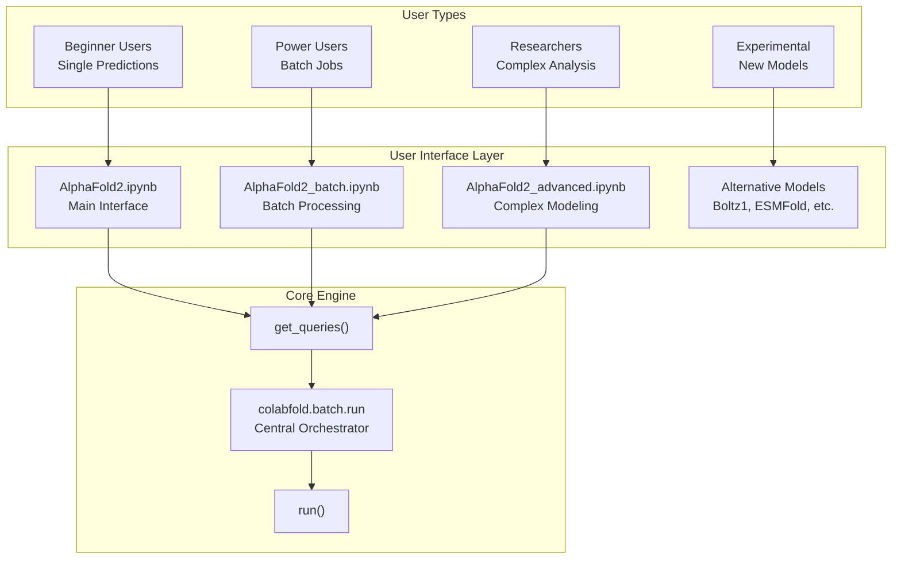
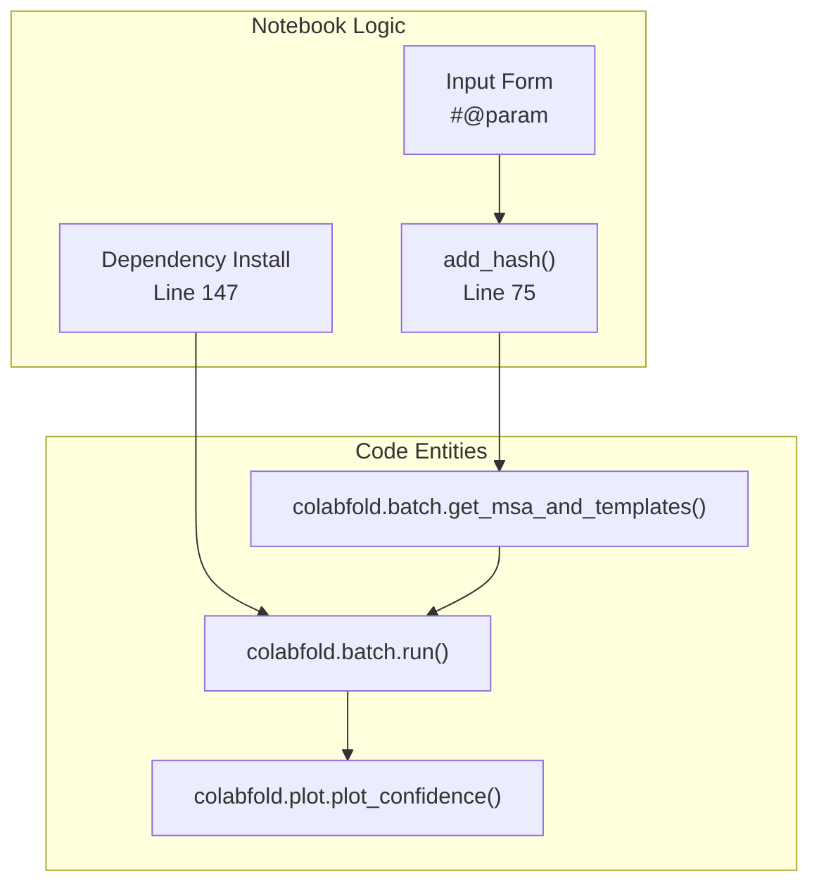

# Notebook Interfaces

> **Relevant source files**
> * [.gitignore](https://github.com/sokrypton/ColabFold/blob/0c788a0e/.gitignore)
> * [AlphaFold2.ipynb](https://github.com/sokrypton/ColabFold/blob/0c788a0e/AlphaFold2.ipynb)
> * [Boltz1.ipynb](https://github.com/sokrypton/ColabFold/blob/0c788a0e/Boltz1.ipynb)
> * [batch/AlphaFold2_batch.ipynb](https://github.com/sokrypton/ColabFold/blob/0c788a0e/batch/AlphaFold2_batch.ipynb)
> * [beta/AlphaFold2_advanced.ipynb](https://github.com/sokrypton/ColabFold/blob/0c788a0e/beta/AlphaFold2_advanced.ipynb)
> * [beta/alphafold_output_at_each_recycle.ipynb](https://github.com/sokrypton/ColabFold/blob/0c788a0e/beta/alphafold_output_at_each_recycle.ipynb)

The notebook interfaces provide interactive Google Colab environments for protein structure prediction using the ColabFold system. These Jupyter notebooks serve as the primary user-facing interfaces, offering form-based controls and visual outputs for different prediction scenarios. For information about the underlying batch processing system that powers these notebooks, see [Batch Processing System](/sokrypton/ColabFold/3.1-batch-processing-system). For details about command-line interfaces, see [Command Line Interface](/sokrypton/ColabFold/4-command-line-interface).

## Overview

The notebook ecosystem consists of several specialized interfaces that cater to different user needs and models. While the primary focus is AlphaFold2, ColabFold has expanded to support alternative folding models like Boltz-1 and ESMFold.

Sources: [AlphaFold2.ipynb L1-L56](https://github.com/sokrypton/ColabFold/blob/0c788a0e/AlphaFold2.ipynb#L1-L56)

 [batch/AlphaFold2_batch.ipynb L1-L64](https://github.com/sokrypton/ColabFold/blob/0c788a0e/batch/AlphaFold2_batch.ipynb#L1-L64)

 [beta/AlphaFold2_advanced.ipynb L1-L50](https://github.com/sokrypton/ColabFold/blob/0c788a0e/beta/AlphaFold2_advanced.ipynb#L1-L50)

 [Boltz1.ipynb L1-L43](https://github.com/sokrypton/ColabFold/blob/0c788a0e/Boltz1.ipynb#L1-L43)

## AlphaFold2 Notebooks

The primary suite of notebooks for protein structure prediction using the AlphaFold2 and AlphaFold2-multimer models.

* **AlphaFold2.ipynb**: The standard interface for single-sequence or simple complex predictions. It features an interactive form for sequence input, job naming, and template selection [AlphaFold2.ipynb L63-L133](https://github.com/sokrypton/ColabFold/blob/0c788a0e/AlphaFold2.ipynb#L63-L133)
* **AlphaFold2_batch.ipynb**: Optimized for high-throughput processing, this notebook mounts Google Drive to process entire directories of FASTA or A3M files [batch/AlphaFold2_batch.ipynb L72-L108](https://github.com/sokrypton/ColabFold/blob/0c788a0e/batch/AlphaFold2_batch.ipynb#L72-L108)

For details, see [AlphaFold2 Notebooks](/sokrypton/ColabFold/3.2.1-alphafold2-notebooks).

Sources: [AlphaFold2.ipynb L63-L133](https://github.com/sokrypton/ColabFold/blob/0c788a0e/AlphaFold2.ipynb#L63-L133)

 [batch/AlphaFold2_batch.ipynb L72-L108](https://github.com/sokrypton/ColabFold/blob/0c788a0e/batch/AlphaFold2_batch.ipynb#L72-L108)

## Advanced AlphaFold2 Notebooks

Notebooks designed for researchers requiring fine-grained control over the folding process or experimental features.

* **AlphaFold2_advanced.ipynb**: Provides experimental support for modeling complexes (homo and hetero-oligomers) using a modified AlphaFold codebase [beta/AlphaFold2_advanced.ipynb L36-L50](https://github.com/sokrypton/ColabFold/blob/0c788a0e/beta/AlphaFold2_advanced.ipynb#L36-L50)  It applies custom patches to the core AlphaFold modules to enable advanced recycling and configuration options [beta/AlphaFold2_advanced.ipynb L112-L120](https://github.com/sokrypton/ColabFold/blob/0c788a0e/beta/AlphaFold2_advanced.ipynb#L112-L120)
* **alphafold_output_at_each_recycle.ipynb**: A specialized tool for analyzing the folding trajectory by extracting structure module outputs at every recycle step [beta/alphafold_output_at_each_recycle.ipynb L51-L56](https://github.com/sokrypton/ColabFold/blob/0c788a0e/beta/alphafold_output_at_each_recycle.ipynb#L51-L56)

For details, see [Advanced AlphaFold2 Notebooks](/sokrypton/ColabFold/3.2.2-advanced-alphafold2-notebooks).

Sources: [beta/AlphaFold2_advanced.ipynb L36-L50](https://github.com/sokrypton/ColabFold/blob/0c788a0e/beta/AlphaFold2_advanced.ipynb#L36-L50)

 [beta/AlphaFold2_advanced.ipynb L112-L120](https://github.com/sokrypton/ColabFold/blob/0c788a0e/beta/AlphaFold2_advanced.ipynb#L112-L120)

 [beta/alphafold_output_at_each_recycle.ipynb L51-L56](https://github.com/sokrypton/ColabFold/blob/0c788a0e/beta/alphafold_output_at_each_recycle.ipynb#L51-L56)

## Alternative Model Notebooks

ColabFold provides interfaces for several state-of-the-art protein folding and design models beyond AlphaFold2.

* **Boltz1.ipynb**: A work-in-progress interface for the Boltz-1 model, supporting protein sequences, ligands (via SMILES or CCD codes), and DNA sequences [Boltz1.ipynb L34-L81](https://github.com/sokrypton/ColabFold/blob/0c788a0e/Boltz1.ipynb#L34-L81)
* **Other Models**: The ecosystem includes notebooks for **ESMFold**, **RoseTTAFold**, **OmegaFold**, and **BioEmu**.

For details, see [Alternative Model Notebooks](/sokrypton/ColabFold/3.2.3-alternative-model-notebooks).

Sources: [Boltz1.ipynb L34-L81](https://github.com/sokrypton/ColabFold/blob/0c788a0e/Boltz1.ipynb#L34-L81)

## Core Interface Components

All notebooks share a common structural pattern to ensure compatibility with the Google Colab environment and the ColabFold backend.

### Input Mapping and Hashing

Notebooks use the `add_hash()` function to create unique identifiers for jobs based on the sequence content [AlphaFold2.ipynb L74-L75](https://github.com/sokrypton/ColabFold/blob/0c788a0e/AlphaFold2.ipynb#L74-L75)

 Input sequences are parsed for chain breaks (denoted by `:`) to support multimer modeling [AlphaFold2.ipynb L78](https://github.com/sokrypton/ColabFold/blob/0c788a0e/AlphaFold2.ipynb#L78-L78)

### Dependency Orchestration

Each notebook includes a cell to install the `colabfold` package and its specific model dependencies (e.g., `alphafold-minus-jax`) [AlphaFold2.ipynb L145-L154](https://github.com/sokrypton/ColabFold/blob/0c788a0e/AlphaFold2.ipynb#L145-L154)

 This ensures the environment is provisioned with the correct versions of JAX, Haiku, and MMseqs2 clients.

### Visualization and Output

Notebooks leverage `py3Dmol` for interactive 3D structure visualization [AlphaFold2.ipynb L405-L455](https://github.com/sokrypton/ColabFold/blob/0c788a0e/AlphaFold2.ipynb#L405-L455)

 and `matplotlib` for generating confidence plots (pLDDT and PAE) [AlphaFold2.ipynb L464-L509](https://github.com/sokrypton/ColabFold/blob/0c788a0e/AlphaFold2.ipynb#L464-L509)

Sources: [AlphaFold2.ipynb L74-L85](https://github.com/sokrypton/ColabFold/blob/0c788a0e/AlphaFold2.ipynb#L74-L85)

 [AlphaFold2.ipynb L145-L154](https://github.com/sokrypton/ColabFold/blob/0c788a0e/AlphaFold2.ipynb#L145-L154)

 [AlphaFold2.ipynb L405-L455](https://github.com/sokrypton/ColabFold/blob/0c788a0e/AlphaFold2.ipynb#L405-L455)

 [AlphaFold2.ipynb L464-L509](https://github.com/sokrypton/ColabFold/blob/0c788a0e/AlphaFold2.ipynb#L464-L509)