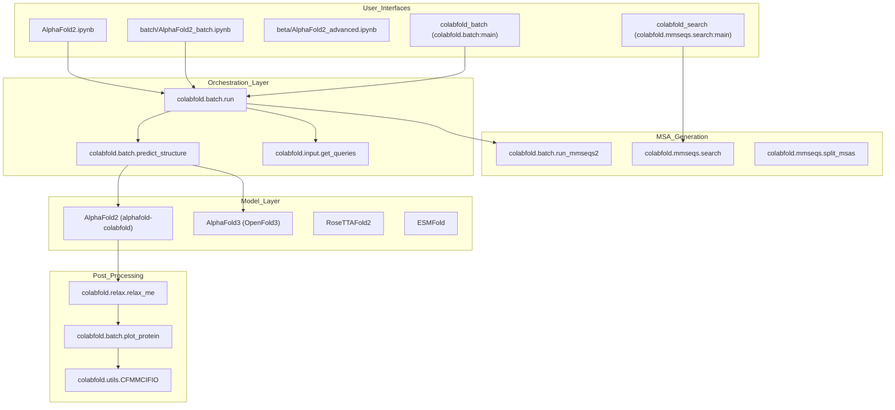
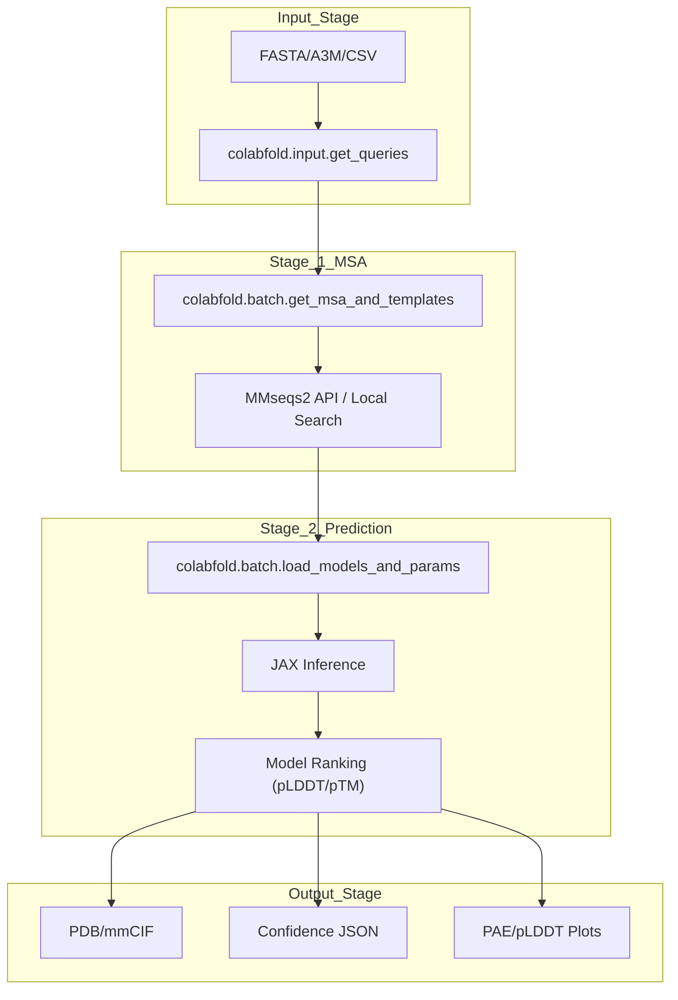

# Overview

> **Relevant source files**
> * [README.md](https://github.com/sokrypton/ColabFold/blob/0c788a0e/README.md?plain=1)
> * [pyproject.toml](https://github.com/sokrypton/ColabFold/blob/0c788a0e/pyproject.toml)

## Purpose and Scope

ColabFold is a comprehensive protein structure prediction system designed to make advanced folding models accessible through both interactive Google Colab notebooks and high-performance command-line interfaces. By integrating fast Multiple Sequence Alignment (MSA) generation via MMseqs2 with state-of-the-art models like AlphaFold2, AlphaFold3 (OpenFold3), RoseTTAFold2, and ESMFold, ColabFold significantly accelerates the structural biology workflow [README.md L1-L23](https://github.com/sokrypton/ColabFold/blob/0c788a0e/README.md?plain=1#L1-L23)

The system is architected to handle single sequences, protein complexes (multimers), and batch processing, providing a unified pipeline from raw sequence input to refined 3D structures and confidence metrics [README.md L9-L23](https://github.com/sokrypton/ColabFold/blob/0c788a0e/README.md?plain=1#L9-L23)

## System Architecture

ColabFold operates as a modular ecosystem. The core logic resides in the `colabfold` Python package, which orchestrates sequence parsing, MSA generation, model inference via JAX, and output serialization.

### Core Component Architecture

This diagram maps the high-level functional blocks to their specific implementation entities within the codebase.

**Sources:** [pyproject.toml L55-L59](https://github.com/sokrypton/ColabFold/blob/0c788a0e/pyproject.toml#L55-L59)

 [README.md L11-L23](https://github.com/sokrypton/ColabFold/blob/0c788a0e/README.md?plain=1#L11-L23)

 [pyproject.toml L29-L39](https://github.com/sokrypton/ColabFold/blob/0c788a0e/pyproject.toml#L29-L39)

### Data Flow and Processing Pipeline

The pipeline follows a two-stage process: MSA generation (Stage 1) and Structure Prediction (Stage 2).

**Sources:** [README.md L68-L79](https://github.com/sokrypton/ColabFold/blob/0c788a0e/README.md?plain=1#L68-L79)

 [pyproject.toml L21-L40](https://github.com/sokrypton/ColabFold/blob/0c788a0e/pyproject.toml#L21-L40)

## Key Components

### Notebook Interfaces

ColabFold provides specialized notebooks for different modeling needs, abstracting the complexity of environment setup and hardware allocation.

| Notebook | Model Support | Key Features |
| --- | --- | --- |
| `AlphaFold2.ipynb` | AF2, AF2-Multimer | Standard monomer/complex prediction [README.md L11](https://github.com/sokrypton/ColabFold/blob/0c788a0e/README.md?plain=1#L11-L11) |
| `AlphaFold3_of3.ipynb` | OpenFold3 | Latest AF3 architecture support [README.md L12](https://github.com/sokrypton/ColabFold/blob/0c788a0e/README.md?plain=1#L12-L12) |
| `AlphaFold2_batch.ipynb` | AF2 | High-throughput sequence processing [README.md L13](https://github.com/sokrypton/ColabFold/blob/0c788a0e/README.md?plain=1#L13-L13) |
| `RoseTTAFold2.ipynb` | RTF2 | Experimental RoseTTAFold support [README.md L19](https://github.com/sokrypton/ColabFold/blob/0c788a0e/README.md?plain=1#L19-L19) |
| `Boltz1.ipynb` | Boltz-1 | Alternative biomolecular modeling [README.md L20](https://github.com/sokrypton/ColabFold/blob/0c788a0e/README.md?plain=1#L20-L20) |

### Command Line Interface (CLI)

For local or HPC usage, ColabFold exposes entrypoints defined in the project configuration:

* `colabfold_batch`: The primary tool for running structure predictions locally [pyproject.toml L56](https://github.com/sokrypton/ColabFold/blob/0c788a0e/pyproject.toml#L56-L56)
* `colabfold_search`: Handles MSA generation against local databases [pyproject.toml L57](https://github.com/sokrypton/ColabFold/blob/0c788a0e/pyproject.toml#L57-L57)
* `colabfold_relax`: Standalone tool for Amber energy minimization [pyproject.toml L59](https://github.com/sokrypton/ColabFold/blob/0c788a0e/pyproject.toml#L59-L59)
* `colabfold_split_msas`: Utility for manipulating large A3M files [pyproject.toml L58](https://github.com/sokrypton/ColabFold/blob/0c788a0e/pyproject.toml#L58-L58)

### MSA Generation System

ColabFold uses MMseqs2 for rapid sequence searching. It supports two modes:

1. **API Mode**: Queries the ColabFold MMseqs2 server (`colabfold.mmseqs.com`), reducing local compute requirements [README.md L35-L38](https://github.com/sokrypton/ColabFold/blob/0c788a0e/README.md?plain=1#L35-L38)
2. **Local Mode**: Uses `colabfold_search` to query local databases (UniRef30, ColabFoldDB, Environmental DB) [README.md L83-L112](https://github.com/sokrypton/ColabFold/blob/0c788a0e/README.md?plain=1#L83-L112)

## Execution Environments

### Google Colab

Leverages free GPU/TPU resources. The notebooks handle the installation of dependencies like `jax`, `openmm`, and `alphafold-colabfold` dynamically [README.md L7-L23](https://github.com/sokrypton/ColabFold/blob/0c788a0e/README.md?plain=1#L7-L23)

### Local and Docker

ColabFold can be installed via `conda` or `pip` with specific extras for hardware acceleration:

* `pip install colabfold[alphafold,openmm]`: Installs the core prediction engine [README.md L72-L76](https://github.com/sokrypton/ColabFold/blob/0c788a0e/README.md?plain=1#L72-L76)
* **Docker**: A pre-configured image `ghcr.io/sokrypton/colabfold` is provided for reproducible execution [README.md L84](https://github.com/sokrypton/ColabFold/blob/0c788a0e/README.md?plain=1#L84-L84)

## Input and Output Formats

### Supported Inputs

* **FASTA**: Standard protein sequences.
* **A3M**: Pre-computed MSAs.
* **CSV**: Batch files containing identifiers and sequences.
* **Complexes**: Defined using a colon (`:`) separator between chains [README.md L51-L52](https://github.com/sokrypton/ColabFold/blob/0c788a0e/README.md?plain=1#L51-L52)

### Generated Outputs

* **Structures**: PDB or mmCIF files containing coordinates.
* **Metrics**: JSON files containing pLDDT (predicted Local Distance Difference Test) and PAE (Predicted Aligned Error) [README.md L31](https://github.com/sokrypton/ColabFold/blob/0c788a0e/README.md?plain=1#L31-L31)
* **Visuals**: PNG plots for MSA coverage, pLDDT per residue, and PAE heatmaps.

**Sources:** [README.md L31-L49](https://github.com/sokrypton/ColabFold/blob/0c788a0e/README.md?plain=1#L31-L49)

 [pyproject.toml L25-L28](https://github.com/sokrypton/ColabFold/blob/0c788a0e/pyproject.toml#L25-L28)