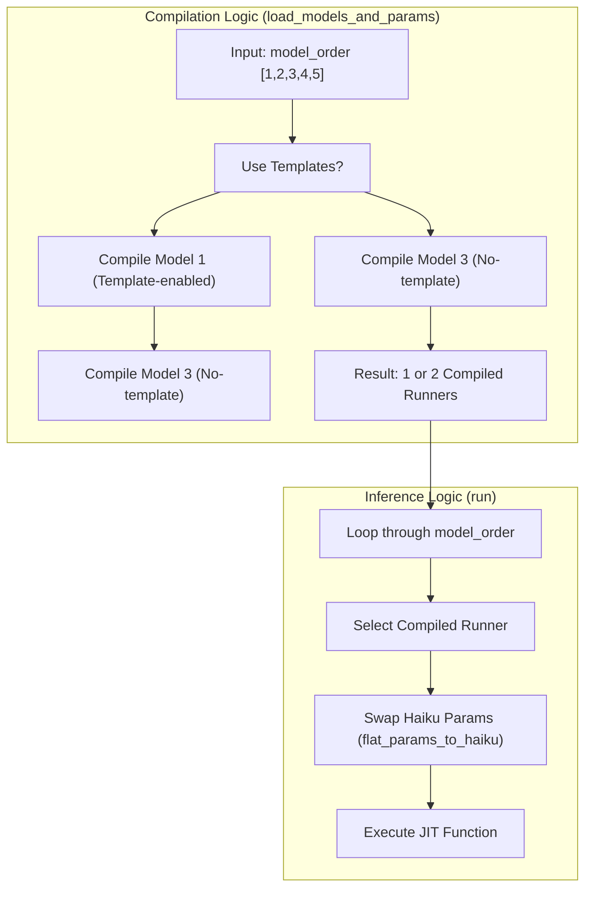
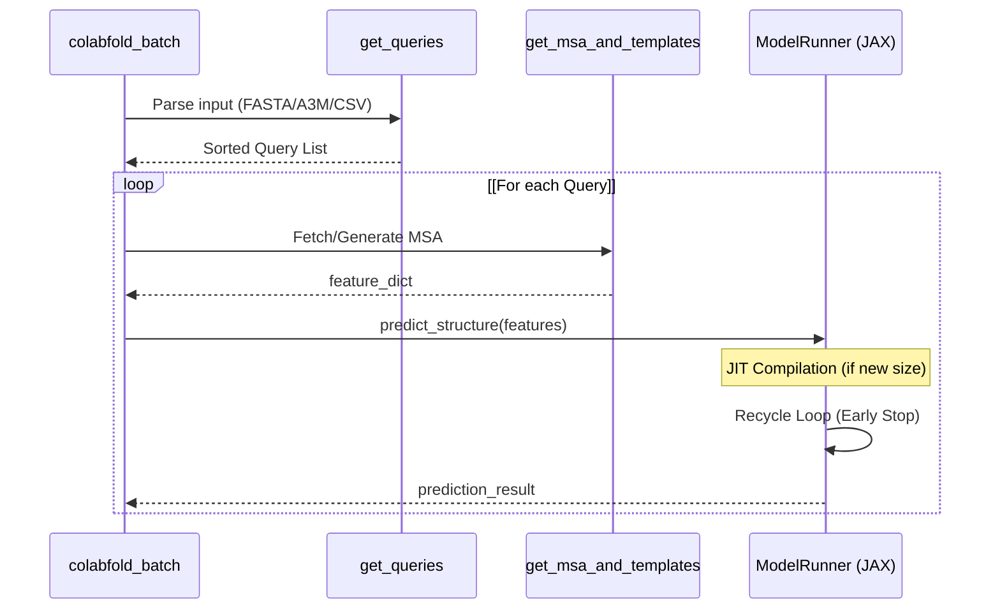

# Performance Optimization

> **Relevant source files**
> * [README.md](https://github.com/sokrypton/ColabFold/blob/0c788a0e/README.md?plain=1)
> * [colabfold/alphafold/models.py](https://github.com/sokrypton/ColabFold/blob/0c788a0e/colabfold/alphafold/models.py)
> * [colabfold/batch.py](https://github.com/sokrypton/ColabFold/blob/0c788a0e/colabfold/batch.py)

This document provides technical guidance on optimizing ColabFold's performance. It covers hardware acceleration, JAX compilation management, memory optimization techniques, and high-throughput MSA generation.

## 1. Hardware and JAX Optimization

ColabFold leverages JAX for structure prediction, which requires careful management of GPU memory and compilation overhead.

### 1.1 GPU Acceleration and Precision

ColabFold utilizes JAX-based AlphaFold models, supporting both `float32` and `bfloat16` precision. `bfloat16` is enabled by default in `load_models_and_params` to improve performance on modern GPUs (e.g., A100, H100) without significant loss in accuracy [colabfold/alphafold/models.py L93](https://github.com/sokrypton/ColabFold/blob/0c788a0e/colabfold/alphafold/models.py#L93-L93)

For high-performance matrix multiplications, ColabFold supports specialized kernels:

* **Pallas/Triton Kernels**: Enabled via `--use-pallas`, this allows the use of `cuEquivariance` fused kernels within the Evoformer blocks [colabfold/alphafold/models.py L98](https://github.com/sokrypton/ColabFold/blob/0c788a0e/colabfold/alphafold/models.py#L98-L98)  [colabfold/alphafold/models.py L139](https://github.com/sokrypton/ColabFold/blob/0c788a0e/colabfold/alphafold/models.py#L139-L139)
* **Tuned GEMM**: The `compile_mode` parameter (default: "tuned") applies optimized Triton GEMM configurations, specifically targeting block sizes (`block_m`, `block_n`, `block_k`) and warp counts for GB10/L40S/A100 architectures [colabfold/alphafold/models.py L9-L23](https://github.com/sokrypton/ColabFold/blob/0c788a0e/colabfold/alphafold/models.py#L9-L23)

### 1.2 Memory Management

To prevent memory fragmentation and ensure stability, `colabfold_batch` sets specific environment variables at startup:

* `TF_FORCE_UNIFIED_MEMORY="1"`: Allows swapping to host memory if VRAM is exhausted.
* `XLA_PYTHON_CLIENT_MEM_FRACTION="4.0"`: Configures JAX to allow memory growth beyond a fixed fraction [colabfold/batch.py L4-L6](https://github.com/sokrypton/ColabFold/blob/0c788a0e/colabfold/batch.py#L4-L6)

## 2. JAX Compilation Management

JAX compilation is a significant bottleneck. ColabFold employs two primary strategies to mitigate this: **Parameter Swapping** and **Recompile-Padding**.

### 2.1 Model Parameter Swapping

AlphaFold models 1-5 have different configurations (e.g., models 1 & 2 support templates, while 3-5 do not). Instead of compiling five separate models, ColabFold compiles only the unique architectures required and swaps the Haiku parameters in memory [colabfold/alphafold/models.py L101-L105](https://github.com/sokrypton/ColabFold/blob/0c788a0e/colabfold/alphafold/models.py#L101-L105)

Sources: [colabfold/alphafold/models.py L100-L120](https://github.com/sokrypton/ColabFold/blob/0c788a0e/colabfold/alphafold/models.py#L100-L120)

 [colabfold/alphafold/models.py L58](https://github.com/sokrypton/ColabFold/blob/0c788a0e/colabfold/alphafold/models.py#L58-L58)

### 2.2 Query Sorting and Padding

To minimize recompilation during batch runs, queries are sorted by length using the `--sort-queries-by` flag (options: `none`, `length`, `random`) [colabfold/batch.py L734](https://github.com/sokrypton/ColabFold/blob/0c788a0e/colabfold/batch.py#L734-L734)

 This ensures that sequences of similar lengths are processed together.

ColabFold then pads these sequences to specific "buckets" to reuse compiled JIT kernels. The `pad_input` function determines the optimal padding length based on the current sequence and the rest of the batch [colabfold/batch.py L301-L331](https://github.com/sokrypton/ColabFold/blob/0c788a0e/colabfold/batch.py#L301-L331)

Sources: [colabfold/batch.py L301-L331](https://github.com/sokrypton/ColabFold/blob/0c788a0e/colabfold/batch.py#L301-L331)

 [colabfold/batch.py L734](https://github.com/sokrypton/ColabFold/blob/0c788a0e/colabfold/batch.py#L734-L734)

## 3. MSA Search Efficiency

MSA generation via MMseqs2 is often the longest step in the pipeline. ColabFold optimizes this through subsampling and local/remote execution modes.

### 3.1 MSA Subsampling

To manage memory and compute time, ColabFold limits the number of sequences passed to the model:

* `max_msa_clusters`: Limits the number of sequences in the main MSA stack (default is model-dependent, e.g., 512 for monomers) [colabfold/alphafold/models.py L151-L153](https://github.com/sokrypton/ColabFold/blob/0c788a0e/colabfold/alphafold/models.py#L151-L153)
* `max_extra_msa`: Limits the number of extra sequences used for processing (e.g., 1024 or 5120) [colabfold/alphafold/models.py L155-L159](https://github.com/sokrypton/ColabFold/blob/0c788a0e/colabfold/alphafold/models.py#L155-L159)

### 3.2 Turbo Mode (Parameter Swapping)

In the advanced notebooks, "Turbo Mode" refers to the ability to skip MSA generation for similar sequences or to reuse alignments. The batch system implements this by allowing users to provide pre-computed A3M files, bypassing the `run_mmseqs2` or `colabfold_search` steps entirely [colabfold/batch.py L848-L861](https://github.com/sokrypton/ColabFold/blob/0c788a0e/colabfold/batch.py#L848-L861)

## 4. Execution Pipeline Optimization

The structure prediction loop in `run()` is designed for efficiency:

Sources: [colabfold/batch.py L720-L740](https://github.com/sokrypton/ColabFold/blob/0c788a0e/colabfold/batch.py#L720-L740)

 [colabfold/batch.py L848-L950](https://github.com/sokrypton/ColabFold/blob/0c788a0e/colabfold/batch.py#L848-L950)

 [colabfold/batch.py L417-L450](https://github.com/sokrypton/ColabFold/blob/0c788a0e/colabfold/batch.py#L417-L450)

### 4.1 Recycle Early Stopping

During inference, the `predict_structure` function monitors the change in predicted structure between recycles. If the `recycle_early_stop_tolerance` is met (meaning the structure has converged), the loop terminates early to save GPU time [colabfold/batch.py L438-L445](https://github.com/sokrypton/ColabFold/blob/0c788a0e/colabfold/batch.py#L438-L445)

### 4.2 Multi-GPU Execution

While a single `colabfold_batch` process typically targets one GPU, users can parallelize by splitting input files and using the `CUDA_VISIBLE_DEVICES` environment variable. The `colabfold_search` utility is also optimized for multi-threaded CPU environments when generating MSAs locally [README.md L135-L145](https://github.com/sokrypton/ColabFold/blob/0c788a0e/README.md?plain=1#L135-L145)

Sources: [colabfold/batch.py L102](https://github.com/sokrypton/ColabFold/blob/0c788a0e/colabfold/batch.py#L102-L102)

 [README.md L135-L145](https://github.com/sokrypton/ColabFold/blob/0c788a0e/README.md?plain=1#L135-L145)