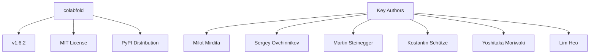
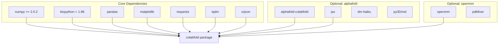
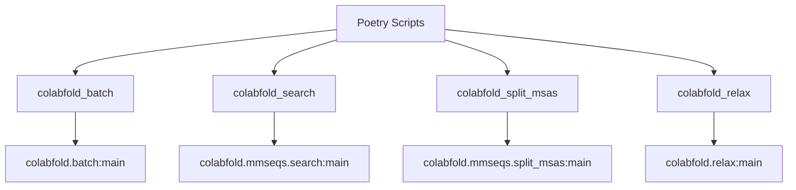
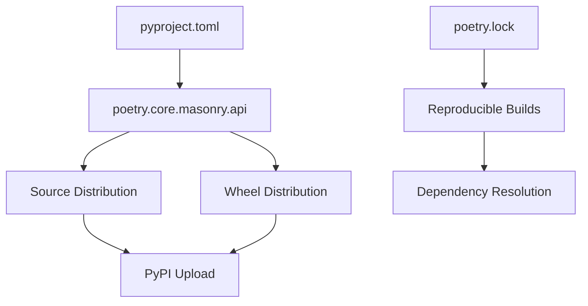

# Project Structure

> **Relevant source files**
> * [.gitattributes](https://github.com/sokrypton/ColabFold/blob/0c788a0e/.gitattributes)
> * [Contributing.md](https://github.com/sokrypton/ColabFold/blob/0c788a0e/Contributing.md?plain=1)
> * [colabfold/openstructure/LGPL.txt](https://github.com/sokrypton/ColabFold/blob/0c788a0e/colabfold/openstructure/LGPL.txt)
> * [colabfold/openstructure/README.md](https://github.com/sokrypton/ColabFold/blob/0c788a0e/colabfold/openstructure/README.md?plain=1)
> * [colabfold/openstructure/stereo_chemical_props.txt](https://github.com/sokrypton/ColabFold/blob/0c788a0e/colabfold/openstructure/stereo_chemical_props.txt)
> * [pyproject.toml](https://github.com/sokrypton/ColabFold/blob/0c788a0e/pyproject.toml)
> * [tests/reindent_ipynb.py](https://github.com/sokrypton/ColabFold/blob/0c788a0e/tests/reindent_ipynb.py)

This document describes the organization of the ColabFold codebase, including package configuration, dependency management, development setup, and build system. For information about the core components and their interactions, see [Core Components](/sokrypton/ColabFold/3-core-components). For details about the continuous integration and release processes, see [Continuous Integration](/sokrypton/ColabFold/6.3-continuous-integration).

## Package Configuration and Management

ColabFold uses Poetry for modern Python packaging and dependency management. The project configuration is centralized in `pyproject.toml`, which defines the package metadata, dependencies, development tools, and CLI entry points.

### Project Metadata

The project is configured as a standard Python package with the following key properties:



Sources: [pyproject.toml L1-L15](https://github.com/sokrypton/ColabFold/blob/0c788a0e/pyproject.toml#L1-L15)

### Dependency Architecture

The project employs a modular dependency structure with optional components for different use cases. Note the recent shift to `numpy >= 2.0.2` and `biopython < 1.86`.



Sources: [pyproject.toml L21-L50](https://github.com/sokrypton/ColabFold/blob/0c788a0e/pyproject.toml#L21-L50)

### CLI Entry Points

The package defines four main command-line interfaces through Poetry's script configuration:



Sources: [pyproject.toml L55-L59](https://github.com/sokrypton/ColabFold/blob/0c788a0e/pyproject.toml#L55-L59)

## Development Tooling Configuration

### Code Formatting with Black

The project uses Black for consistent code formatting with specific inclusion and exclusion rules to protect legacy logic:

| Configuration | Value | Purpose |
| --- | --- | --- |
| Include Paths | `colabfold/`, `tests/` | Format only new package code |
| Exclude Paths | `__pycache__/`, `colabfold/colabfold.py` | Skip generated files and legacy API client |
| Format Control | `# fmt: off` comments | Override exclusion where needed inside `colabfold.py` |

Sources: [pyproject.toml L61-L75](https://github.com/sokrypton/ColabFold/blob/0c788a0e/pyproject.toml#L61-L75)

### Testing and Notebook Utilities

The project uses `pytest` for unit testing and includes specialized scripts for managing notebook quality.

* **`pytest`**: Configured with `--tb=short` for concise error reporting [pyproject.toml L52-L53](https://github.com/sokrypton/ColabFold/blob/0c788a0e/pyproject.toml#L52-L53)
* **`reindent_ipynb.py`**: A utility script located in `tests/` that recursively finds `.ipynb` files and standardizes their JSON indentation to 2 spaces [tests/reindent_ipynb.py L4-L8](https://github.com/sokrypton/ColabFold/blob/0c788a0e/tests/reindent_ipynb.py#L4-L8)

## Build and Distribution System

### Poetry Build Backend

The project uses Poetry's modern build system for package creation and distribution:



Sources: [pyproject.toml L77-L79](https://github.com/sokrypton/ColabFold/blob/0c788a0e/pyproject.toml#L77-L79)

### Optional Dependency Groups (Extras)

The project defines optional dependency groups for different installation scenarios:

| Group | Dependencies | Use Case |
| --- | --- | --- |
| `alphafold` | `alphafold-colabfold`, `jax`, `absl-py`, `dm-tree`, `dm-haiku`, `py3Dmol` | Full AlphaFold functionality |
| `alphafold-minus-jax` | `alphafold-colabfold`, `absl-py`, `dm-tree`, `dm-haiku`, `py3Dmol` | AlphaFold without JAX (e.g., for specific environment builds) |
| `openmm` | `openmm`, `pdbfixer` | Required for structure relaxation |

Sources: [pyproject.toml L47-L50](https://github.com/sokrypton/ColabFold/blob/0c788a0e/pyproject.toml#L47-L50)

## OpenStructure Stereo-Chemical Data

ColabFold includes static data from the **OpenStructure** project to handle protein geometry validation and stereo-chemical properties.

* **Location**: `colabfold/openstructure/`
* **Data File**: `stereo_chemical_props.txt` contains mean and standard deviation values for bonds and angles across all standard amino acid residues [colabfold/openstructure/stereo_chemical_props.txt L1-L260](https://github.com/sokrypton/ColabFold/blob/0c788a0e/colabfold/openstructure/stereo_chemical_props.txt#L1-L260)
* **Licensing**: This component is licensed under the **GNU Lesser General Public License v3.0** [colabfold/openstructure/LGPL.txt L1-L12](https://github.com/sokrypton/ColabFold/blob/0c788a0e/colabfold/openstructure/LGPL.txt#L1-L12)

## Development Setup

The project supports two primary development modes: local machine setup using Poetry and direct development within Google Colab.

### Local Setup

Developers are encouraged to use Poetry for dependency isolation:

1. `poetry install -E alphafold` to install the core package and AlphaFold extras [Contributing.md L15](https://github.com/sokrypton/ColabFold/blob/0c788a0e/Contributing.md?plain=1#L15-L15)
2. `pip install "jax[cuda]"` must be run manually after poetry updates to ensure correct GPU support [Contributing.md L24-L27](https://github.com/sokrypton/ColabFold/blob/0c788a0e/Contributing.md?plain=1#L24-L27)

### Colab Development

For testing directly in the cloud, a "hack" is provided to symlink the local repository into the site-packages directory, allowing live code changes without repeated re-installation:

```javascript
site_packages=$(python -c 'import site; print(site.getsitepackages()[0])')rm -r ${site_packages}/colabfoldln -s $(pwd)/_colabfold/colabfold ${site_packages}/colabfold
```

Sources: [Contributing.md L72-L76](https://github.com/sokrypton/ColabFold/blob/0c788a0e/Contributing.md?plain=1#L72-L76)