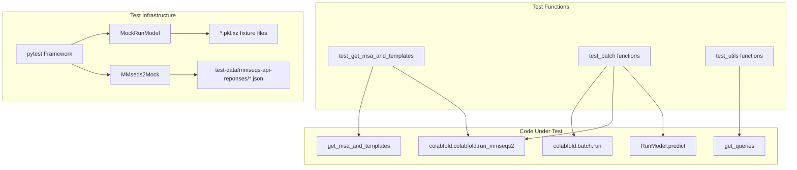
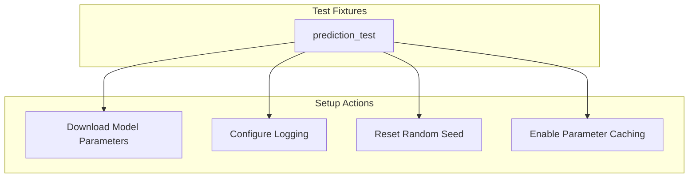
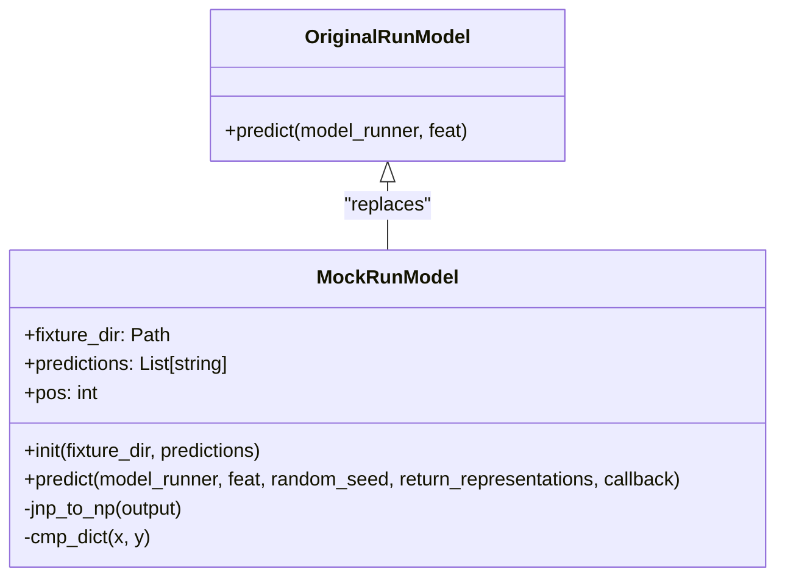
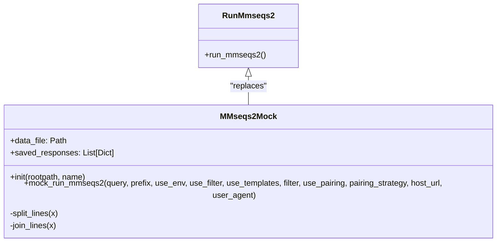

# Testing Framework

> **Relevant source files**
> * [colabfold/alphafold/ipsae.py](https://github.com/sokrypton/ColabFold/blob/0c788a0e/colabfold/alphafold/ipsae.py)
> * [test-data/a3m/5AWL1.a3m](https://github.com/sokrypton/ColabFold/blob/0c788a0e/test-data/a3m/5AWL1.a3m)
> * [test-data/a3m/6A5J.a3m](https://github.com/sokrypton/ColabFold/blob/0c788a0e/test-data/a3m/6A5J.a3m)
> * [test-data/a3m/empty.a3m](https://github.com/sokrypton/ColabFold/blob/0c788a0e/test-data/a3m/empty.a3m)
> * [test-data/batch/input/5AWL_1.fasta](https://github.com/sokrypton/ColabFold/blob/0c788a0e/test-data/batch/input/5AWL_1.fasta)
> * [test-data/batch/input/empty.fasta](https://github.com/sokrypton/ColabFold/blob/0c788a0e/test-data/batch/input/empty.fasta)
> * [test-data/mmseqs-api-reponses/batch.json](https://github.com/sokrypton/ColabFold/blob/0c788a0e/test-data/mmseqs-api-reponses/batch.json)
> * [test-data/mmseqs-api-reponses/complex.json](https://github.com/sokrypton/ColabFold/blob/0c788a0e/test-data/mmseqs-api-reponses/complex.json)
> * [tests/mock.py](https://github.com/sokrypton/ColabFold/blob/0c788a0e/tests/mock.py)
> * [tests/test_colabfold.py](https://github.com/sokrypton/ColabFold/blob/0c788a0e/tests/test_colabfold.py)
> * [tests/test_msa.py](https://github.com/sokrypton/ColabFold/blob/0c788a0e/tests/test_msa.py)
> * [tests/test_utils.py](https://github.com/sokrypton/ColabFold/blob/0c788a0e/tests/test_utils.py)

## Purpose and Scope

The ColabFold testing framework is designed to ensure the reliability and correctness of the protein structure prediction pipeline. This page documents the testing infrastructure, mock objects, test cases, and how to extend the testing framework. The framework focuses on validating core functionality while avoiding dependencies on external services and expensive computations during routine testing.

The testing strategy employs snapshot testing and mocking to provide deterministic validation of the batch processing pipeline, MSA generation, and model prediction components without requiring live API calls or GPU-intensive computations.

Sources: [tests/mock.py L1-L214](https://github.com/sokrypton/ColabFold/blob/0c788a0e/tests/mock.py#L1-L214)

 [tests/test_msa.py L1-L40](https://github.com/sokrypton/ColabFold/blob/0c788a0e/tests/test_msa.py#L1-L40)

 [tests/test_colabfold.py L1-L190](https://github.com/sokrypton/ColabFold/blob/0c788a0e/tests/test_colabfold.py#L1-L190)

## Testing Infrastructure Overview

Sources: [tests/mock.py L1-L214](https://github.com/sokrypton/ColabFold/blob/0c788a0e/tests/mock.py#L1-L214)

 [tests/test_msa.py L1-L40](https://github.com/sokrypton/ColabFold/blob/0c788a0e/tests/test_msa.py#L1-L40)

 [tests/test_utils.py L1-L141](https://github.com/sokrypton/ColabFold/blob/0c788a0e/tests/test_utils.py#L1-L141)

## Key Components

### Test Fixtures

The testing framework uses pytest fixtures to set up the test environment:

The `prediction_test` fixture:

1. Sets up logging to the `INFO` level and suppresses JAX device search logs [tests/test_colabfold.py L27-L29](https://github.com/sokrypton/ColabFold/blob/0c788a0e/tests/test_colabfold.py#L27-L29)
2. Downloads AlphaFold parameters for `alphafold2_multimer_v1` and `alphafold2_ptm` [tests/test_colabfold.py L31-L32](https://github.com/sokrypton/ColabFold/blob/0c788a0e/tests/test_colabfold.py#L31-L32)
3. Resets the AlphaFold `SeedMaker` to 0 to ensure deterministic input features [tests/test_colabfold.py L36](https://github.com/sokrypton/ColabFold/blob/0c788a0e/tests/test_colabfold.py#L36-L36)
4. Patches `alphafold.model.data.get_model_haiku_params` with a cached version to speed up parameter loading [tests/test_colabfold.py L39-L41](https://github.com/sokrypton/ColabFold/blob/0c788a0e/tests/test_colabfold.py#L39-L41)

Sources: [tests/test_colabfold.py L25-L42](https://github.com/sokrypton/ColabFold/blob/0c788a0e/tests/test_colabfold.py#L25-L42)

### Mock Objects

The framework includes two primary mock objects that replace expensive external dependencies:

#### MockRunModel

The `MockRunModel` class replaces the AlphaFold model inference to provide deterministic testing without GPU computation:

Key features:

* Stores pre-computed predictions in compressed pickle files (`model_feat.pkl.xz` and `model_pred.pkl.xz`) [tests/mock.py L70-L71](https://github.com/sokrypton/ColabFold/blob/0c788a0e/tests/mock.py#L70-L71)
* Uses `jnp_to_np()` to recursively convert JAX arrays to NumPy arrays for serialization [tests/mock.py L32-L39](https://github.com/sokrypton/ColabFold/blob/0c788a0e/tests/mock.py#L32-L39)
* Implements `cmp_dict()` for deep comparison of nested dictionaries using `np.allclose()` [tests/mock.py L93-L114](https://github.com/sokrypton/ColabFold/blob/0c788a0e/tests/mock.py#L93-L114)
* Excludes `msa_feat` and `msa` from comparisons due to non-deterministic variance between machines [tests/mock.py L99-L100](https://github.com/sokrypton/ColabFold/blob/0c788a0e/tests/mock.py#L99-L100)
* Supports snapshot updates via `UPDATE_SNAPSHOTS` or `PRED_TEST` environment variables [tests/mock.py L73-L85](https://github.com/sokrypton/ColabFold/blob/0c788a0e/tests/mock.py#L73-L85)

Sources: [tests/mock.py L44-L125](https://github.com/sokrypton/ColabFold/blob/0c788a0e/tests/mock.py#L44-L125)

#### MMseqs2Mock

The `MMseqs2Mock` class replaces calls to the MMseqs2 remote API with pre-recorded responses:

Key features:

* Loads API responses from JSON files in `test-data/mmseqs-api-reponses/` [tests/mock.py L138-L142](https://github.com/sokrypton/ColabFold/blob/0c788a0e/tests/mock.py#L138-L142)
* Matches API requests by configuration parameters including `query`, `use_env`, `use_filter`, and `pairing_strategy` [tests/mock.py L169-L177](https://github.com/sokrypton/ColabFold/blob/0c788a0e/tests/mock.py#L169-L177)
* Uses `split_lines()` and `join_lines()` to store multi-line responses as arrays for JSON readability [tests/mock.py L213-L228](https://github.com/sokrypton/ColabFold/blob/0c788a0e/tests/mock.py#L213-L228)
* Updates snapshots via the `UPDATE_SNAPSHOTS` environment variable [tests/mock.py L191-L208](https://github.com/sokrypton/ColabFold/blob/0c788a0e/tests/mock.py#L191-L208)

Sources: [tests/mock.py L126-L228](https://github.com/sokrypton/ColabFold/blob/0c788a0e/tests/mock.py#L126-L228)

## Test Case Categories

### Batch Processing Tests

The primary test function `test_batch` validates the full end-to-end pipeline:

1. **Input**: Uses queries for `5AWL_1` and `6A5J` [tests/test_colabfold.py L46](https://github.com/sokrypton/ColabFold/blob/0c788a0e/tests/test_colabfold.py#L46-L46)
2. **Mocking**: Patches `RunModel.predict` and `run_mmseqs2` [tests/test_colabfold.py L52-L56](https://github.com/sokrypton/ColabFold/blob/0c788a0e/tests/test_colabfold.py#L52-L56)
3. **Execution**: Calls `run()` with specific recycle counts and model orders [tests/test_colabfold.py L57-L64](https://github.com/sokrypton/ColabFold/blob/0c788a0e/tests/test_colabfold.py#L57-L64)
4. **Validation**: * Checks log messages for sequence length, padding, and reranking [tests/test_colabfold.py L67-L82](https://github.com/sokrypton/ColabFold/blob/0c788a0e/tests/test_colabfold.py#L67-L82) * Verifies PDB file generation and line counts (coordinate validation) [tests/test_colabfold.py L85-L100](https://github.com/sokrypton/ColabFold/blob/0c788a0e/tests/test_colabfold.py#L85-L100) * Confirms `config.json` creation [tests/test_colabfold.py L101](https://github.com/sokrypton/ColabFold/blob/0c788a0e/tests/test_colabfold.py#L101-L101)

Sources: [tests/test_colabfold.py L45-L102](https://github.com/sokrypton/ColabFold/blob/0c788a0e/tests/test_colabfold.py#L45-L102)

### MSA Generation Tests

`test_get_msa_and_templates` validates MSA generation across different modes:

* **mmseqs2_uniref_env**: Expected 12 alignment lines [tests/test_msa.py L11](https://github.com/sokrypton/ColabFold/blob/0c788a0e/tests/test_msa.py#L11-L11)
* **mmseqs2_uniref**: Expected 8 alignment lines [tests/test_msa.py L12](https://github.com/sokrypton/ColabFold/blob/0c788a0e/tests/test_msa.py#L12-L12)
* **single_sequence**: Expected 2 alignment lines [tests/test_msa.py L13](https://github.com/sokrypton/ColabFold/blob/0c788a0e/tests/test_msa.py#L13-L13)

Sources: [tests/test_msa.py L7-L40](https://github.com/sokrypton/ColabFold/blob/0c788a0e/tests/test_msa.py#L7-L40)

### Utility and Input Tests

The `tests/test_utils.py` file covers data parsing and format conversion:

* **Query Parsing**: Validates `get_queries` for FASTA directories, empty A3M files, and CSV inputs [tests/test_utils.py L6-L39](https://github.com/sokrypton/ColabFold/blob/0c788a0e/tests/test_utils.py#L6-L39)
* **Format Conversion**: Tests `convert_pdb_to_mmcif` by comparing generated CIFs against expected fixtures [tests/test_utils.py L64-L74](https://github.com/sokrypton/ColabFold/blob/0c788a0e/tests/test_utils.py#L64-L74)
* **mmCIF Validation**: Tests `validate_and_fix_mmcif` for missing revision dates or required fields like `_entity_poly_seq.mon_id` [tests/test_utils.py L77-L123](https://github.com/sokrypton/ColabFold/blob/0c788a0e/tests/test_utils.py#L77-L123)

Sources: [tests/test_utils.py L1-L141](https://github.com/sokrypton/ColabFold/blob/0c788a0e/tests/test_utils.py#L1-L141)

## Environment Variables

| Variable | Purpose |
| --- | --- |
| `UPDATE_SNAPSHOTS` | Updates MMseqs2 API responses and model prediction fixtures [tests/mock.py L143](https://github.com/sokrypton/ColabFold/blob/0c788a0e/tests/mock.py#L143-L143)    [tests/mock.py L191](https://github.com/sokrypton/ColabFold/blob/0c788a0e/tests/mock.py#L191-L191) |
| `PRED_TEST` | Runs actual AlphaFold model predictions and compares them against stored snapshots [tests/mock.py L73](https://github.com/sokrypton/ColabFold/blob/0c788a0e/tests/mock.py#L73-L73)    [tests/mock.py L120](https://github.com/sokrypton/ColabFold/blob/0c788a0e/tests/mock.py#L120-L120) |

Sources: [tests/mock.py L73-L191](https://github.com/sokrypton/ColabFold/blob/0c788a0e/tests/mock.py#L73-L191)

## Snapshot Testing Mechanism

### Model Prediction Snapshots

The framework implements a `cmp_dict` function that performs an "allclose" check on nested dictionaries [tests/mock.py L93-L114](https://github.com/sokrypton/ColabFold/blob/0c788a0e/tests/mock.py#L93-L114)

 It uses `jax.tree_util.tree_flatten` to ensure every leaf in the feature/prediction tree matches the snapshot [tests/mock.py L114](https://github.com/sokrypton/ColabFold/blob/0c788a0e/tests/mock.py#L114-L114)

### API Response Snapshots

MMseqs2 responses are stored in `test-data/mmseqs-api-reponses/`. The `MMseqs2Mock` class ensures that if a query configuration (e.g., `use_pairing`, `filter`) changes, the test will fail unless snapshots are updated, preventing silent changes in MSA retrieval logic [tests/mock.py L188-L210](https://github.com/sokrypton/ColabFold/blob/0c788a0e/tests/mock.py#L188-L210)

Sources: [tests/mock.py L93-L210](https://github.com/sokrypton/ColabFold/blob/0c788a0e/tests/mock.py#L93-L210)

 [test-data/mmseqs-api-reponses/batch.json L1-L40](https://github.com/sokrypton/ColabFold/blob/0c788a0e/test-data/mmseqs-api-reponses/batch.json#L1-L40)