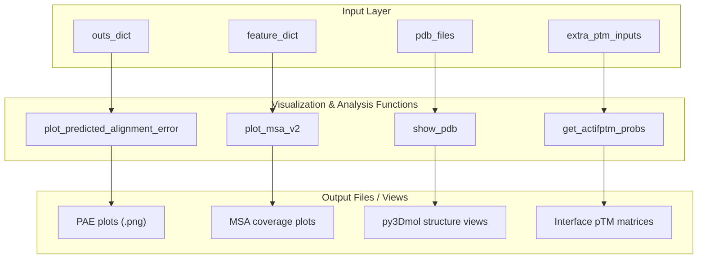
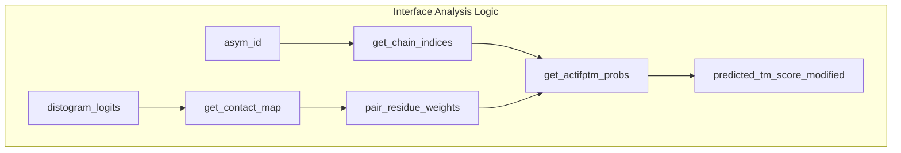

# Visualization and Output

> **Relevant source files**
> * [colabfold/alphafold/extra_ptm.py](https://github.com/sokrypton/ColabFold/blob/0c788a0e/colabfold/alphafold/extra_ptm.py)
> * [colabfold/alphafold/models.py](https://github.com/sokrypton/ColabFold/blob/0c788a0e/colabfold/alphafold/models.py)
> * [colabfold/colabfold.py](https://github.com/sokrypton/ColabFold/blob/0c788a0e/colabfold/colabfold.py)
> * [colabfold/pdb.py](https://github.com/sokrypton/ColabFold/blob/0c788a0e/colabfold/pdb.py)
> * [colabfold/plot.py](https://github.com/sokrypton/ColabFold/blob/0c788a0e/colabfold/plot.py)
> * [utils/3G5O_A_3G5O_B_unrelaxed_rank_1_model_1_scores.json](https://github.com/sokrypton/ColabFold/blob/0c788a0e/utils/3G5O_A_3G5O_B_unrelaxed_rank_1_model_1_scores.json)
> * [utils/plot_scores.ipynb](https://github.com/sokrypton/ColabFold/blob/0c788a0e/utils/plot_scores.ipynb)

This page documents ColabFold's visualization and output systems, which transform prediction results into visual representations and structured output formats. The system provides functions for plotting confidence metrics, visualizing multiple sequence alignments (MSAs), and displaying 3D protein structures, as well as advanced interface analysis.

For information about the core prediction pipeline that generates these results, see [Batch Processing System](/sokrypton/ColabFold/3.1-batch-processing-system). For details about input processing and data formats, see [Input Processing and Utilities](/sokrypton/ColabFold/3.4-input-processing-and-utilities).

## Purpose and Scope

The visualization and output system serves four main functions:

1. **Confidence Visualization** - Plotting prediction confidence metrics like PAE (Predicted Alignment Error).
2. **MSA Analysis** - Visualizing sequence coverage and alignment quality.
3. **3D Structure Display** - Interactive molecular visualization of predicted protein structures.
4. **Interface Analysis** - Detailed calculation of interface metrics (ipTM) using contact probabilities.

## Output Data Flow

**Sources:** [colabfold/plot.py L7-L19](https://github.com/sokrypton/ColabFold/blob/0c788a0e/colabfold/plot.py#L7-L19)

 [colabfold/plot.py L22-L79](https://github.com/sokrypton/ColabFold/blob/0c788a0e/colabfold/plot.py#L22-L79)

 [colabfold/pdb.py L1-L69](https://github.com/sokrypton/ColabFold/blob/0c788a0e/colabfold/pdb.py#L1-L69)

 [colabfold/alphafold/extra_ptm.py L122-L160](https://github.com/sokrypton/ColabFold/blob/0c788a0e/colabfold/alphafold/extra_ptm.py#L122-L160)

## Confidence Metric Visualization

### PAE Plot Generation

The `plot_predicted_alignment_error` function creates heatmap visualizations of Predicted Alignment Error (PAE) matrices for each model:

| Parameter | Type | Description |
| --- | --- | --- |
| `jobname` | str | Base name for output files |
| `num_models` | int | Number of models to plot |
| `outs` | dict | Model outputs containing PAE data |
| `result_dir` | Path | Output directory for plots |
| `show` | bool | Whether to display plots interactively |

The function generates a grid layout with one PAE heatmap per model, using a blue-white-red (`bwr`) colormap with values ranging from 0 to 30 Ångströms [colabfold/plot.py L12](https://github.com/sokrypton/ColabFold/blob/0c788a0e/colabfold/plot.py#L12-L12)

**Sources:** [colabfold/plot.py L7-L19](https://github.com/sokrypton/ColabFold/blob/0c788a0e/colabfold/plot.py#L7-L19)

## MSA Coverage Visualization

### Modern MSA Plotting (plot_msa_v2)

The `plot_msa_v2` function provides advanced MSA visualization with support for multi-chain complexes. It processes the `feature_dict` to calculate sequence identity and coverage across different asymmetric units (chains).

Key processing steps:

1. **Chain Boundary Detection**: Uses the `asym_id` field to identify chain boundaries and calculate cumulative lengths [colabfold/plot.py L24-L33](https://github.com/sokrypton/ColabFold/blob/0c788a0e/colabfold/plot.py#L24-L33)
2. **Coverage Grouping**: Groups sequences by identical gap patterns across chains to optimize the plot layout [colabfold/plot.py L45-L57](https://github.com/sokrypton/ColabFold/blob/0c788a0e/colabfold/plot.py#L45-L57)
3. **Sequence Identity Calculation**: Computes the mean sequence identity to the query for non-gap positions [colabfold/plot.py L49](https://github.com/sokrypton/ColabFold/blob/0c788a0e/colabfold/plot.py#L49-L49)
4. **Visualization**: Creates a rainbow-colored heatmap. It plots black vertical lines at chain boundaries [colabfold/plot.py L67-L68](https://github.com/sokrypton/ColabFold/blob/0c788a0e/colabfold/plot.py#L67-L68)  and black horizontal lines between different coverage groups [colabfold/plot.py L69-L70](https://github.com/sokrypton/ColabFold/blob/0c788a0e/colabfold/plot.py#L69-L70)

**Sources:** [colabfold/plot.py L20-L78](https://github.com/sokrypton/ColabFold/blob/0c788a0e/colabfold/plot.py#L20-L78)

### Legacy MSA Plotting (plot_msa)

The legacy `plot_msa` function provides similar functionality but requires manual specification of chain lengths via `seq_len_list` [colabfold/plot.py L80-L86](https://github.com/sokrypton/ColabFold/blob/0c788a0e/colabfold/plot.py#L80-L86)

 It sorts sequences based on the maximum sequence identity across all chains [colabfold/plot.py L115-L125](https://github.com/sokrypton/ColabFold/blob/0c788a0e/colabfold/plot.py#L115-L125)

**Sources:** [colabfold/plot.py L80-L158](https://github.com/sokrypton/ColabFold/blob/0c788a0e/colabfold/plot.py#L80-L158)

## 3D Structure Visualization

### Interactive Molecular Display

The `show_pdb` function creates interactive 3D visualizations using `py3Dmol`. It handles both relaxed (AMBER) and unrelaxed structures [colabfold/pdb.py L13-L16](https://github.com/sokrypton/ColabFold/blob/0c788a0e/colabfold/pdb.py#L13-L16)

### Supported Coloring Schemes

| Scheme | Description | Implementation |
| --- | --- | --- |
| `lDDT` | Confidence-based coloring (red-orange-yellow-green-blue) | Maps B-factor (pLDDT) from 50 to 90 [colabfold/pdb.py L21-L33](https://github.com/sokrypton/ColabFold/blob/0c788a0e/colabfold/pdb.py#L21-L33) |
| `rainbow` | Spectrum coloring from N to C terminus | Uses py3Dmol `spectrum` [colabfold/pdb.py L34-L35](https://github.com/sokrypton/ColabFold/blob/0c788a0e/colabfold/pdb.py#L34-L35) |
| `chain` | Individual colors per chain | Cycles through `lime`, `cyan`, `magenta`, `yellow`, etc. [colabfold/pdb.py L36-L42](https://github.com/sokrypton/ColabFold/blob/0c788a0e/colabfold/pdb.py#L36-L42) |

### Structure Display Options

* **Sidechains**: Displays stick representations for non-glycine/proline residues while hiding backbone atoms [colabfold/pdb.py L43-L53](https://github.com/sokrypton/ColabFold/blob/0c788a0e/colabfold/pdb.py#L43-L53)
* **Mainchains**: Displays sticks for C, O, N, and CA atoms [colabfold/pdb.py L62-L66](https://github.com/sokrypton/ColabFold/blob/0c788a0e/colabfold/pdb.py#L62-L66)
* **Glycine/Proline**: Glycine CA is shown as a sphere; Proline is shown as sticks excluding backbone O and C [colabfold/pdb.py L54-L61](https://github.com/sokrypton/ColabFold/blob/0c788a0e/colabfold/pdb.py#L54-L61)

**Sources:** [colabfold/pdb.py L1-L69](https://github.com/sokrypton/ColabFold/blob/0c788a0e/colabfold/pdb.py#L1-L69)

## Advanced Interface Analysis (extra_ptm)

ColabFold includes specialized functions in `colabfold/alphafold/extra_ptm.py` to perform granular interface analysis, which is particularly useful for protein complexes.

### Interface Metrics Calculation

The system can calculate modified Predicted TM-scores (pTM) and Interface pTM (ipTM) using contact maps derived from the distogram [colabfold/alphafold/extra_ptm.py L12-L26](https://github.com/sokrypton/ColabFold/blob/0c788a0e/colabfold/alphafold/extra_ptm.py#L12-L26)

* **`predicted_tm_score_modified`**: A flexible implementation of the TM-score calculation that supports per-residue weights and pair-residue weights [colabfold/alphafold/extra_ptm.py L42-L104](https://github.com/sokrypton/ColabFold/blob/0c788a0e/colabfold/alphafold/extra_ptm.py#L42-L104)
* **`get_actifptm_probs`**: Calculates the interface pTM score for a specific chain pair using the contact probability map rather than binary contacts [colabfold/alphafold/extra_ptm.py L122-L160](https://github.com/sokrypton/ColabFold/blob/0c788a0e/colabfold/alphafold/extra_ptm.py#L122-L160)
* **`get_actifptm_contacts`**: A variant that calculates interface scores based on binary contacts (threshold $\ge 0.6$) [colabfold/alphafold/extra_ptm.py L163-L205](https://github.com/sokrypton/ColabFold/blob/0c788a0e/colabfold/alphafold/extra_ptm.py#L163-L205)

**Sources:** [colabfold/alphafold/extra_ptm.py L12-L160](https://github.com/sokrypton/ColabFold/blob/0c788a0e/colabfold/alphafold/extra_ptm.py#L12-L160)

## JSON Output Formatting

ColabFold produces a `_scores.json` file for every predicted structure. This file contains raw numerical data for visualization:

* `max_pae`: The maximum predicted alignment error value [utils/3G5O_A_3G5O_B_unrelaxed_rank_1_model_1_scores.json L1](https://github.com/sokrypton/ColabFold/blob/0c788a0e/utils/3G5O_A_3G5O_B_unrelaxed_rank_1_model_1_scores.json#L1-L1)
* `pae`: A 2D matrix of predicted alignment errors [utils/3G5O_A_3G5O_B_unrelaxed_rank_1_model_1_scores.json L1](https://github.com/sokrypton/ColabFold/blob/0c788a0e/utils/3G5O_A_3G5O_B_unrelaxed_rank_1_model_1_scores.json#L1-L1)
* `plddt`: Per-residue confidence scores.

Users can manually plot these using the `utils/plot_scores.ipynb` notebook [utils/plot_scores.ipynb L1-L45](https://github.com/sokrypton/ColabFold/blob/0c788a0e/utils/plot_scores.ipynb#L1-L45)

**Sources:** [utils/3G5O_A_3G5O_B_unrelaxed_rank_1_model_1_scores.json L1](https://github.com/sokrypton/ColabFold/blob/0c788a0e/utils/3G5O_A_3G5O_B_unrelaxed_rank_1_model_1_scores.json#L1-L1)

 [utils/plot_scores.ipynb L33](https://github.com/sokrypton/ColabFold/blob/0c788a0e/utils/plot_scores.ipynb#L33-L33)