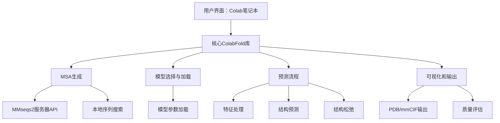

---
slug:1-overview
blog_type:normal
---

ColabFold是一个项目，旨在通过提供易于使用的最新算法实现，通过Google Colab笔记本，使更多人能够访问最先进的蛋白质结构预测技术。它使研究人员、学生和科学家能够在不需要专用硬件或复杂设置程序的情况下预测蛋白质结构。

## 什么是ColabFold？

ColabFold将多种强大的蛋白质结构预测工具整合在一个易于访问的格式中，利用Google Colab的免费GPU资源。其核心是AlphaFold2、RoseTTAFold和ESMFold等模型的优化实现集合，允许用户：

- 预测单个蛋白质（单体）的3D结构
- 建模蛋白质复合物（多聚体）
- 生成高质量的多个序列比对（MSAs）
- 可视化和分析预测结果
- 批量处理多个序列

该项目旨在消除这些尖端工具的访问障碍，使蛋白质结构预测对任何有互联网连接的人开放。

来源：[README.md](README.md)

## ColabFold的重要性

蛋白质结构预测通过深度学习方法如AlphaFold2得到了革命性的发展，这些方法可以预测接近实验精度的结构。然而，运行这些模型通常需要：

1. 显著的计算资源（强大的GPU）
2. 复杂的各种生物信息学工具设置
3. 生成大量的多个序列比对
4. 在计算和结构生物学方面的技术专长

ColabFold通过以下方式解决了这些挑战：

- 利用Google Colab的免费GPU资源
- 提供预配置的笔记本，只需 minimal setup
- 通过专用服务器提供优化的MSA生成访问
- 使用用户友好的界面简化整个工作流程

这使得没有专用计算基础设施和技术专长的研究人员也能进行高级蛋白质结构预测。

来源：[batch.py](colabfold/batch.py), [colabfold.py](colabfold/colabfold.py)

## 支持的模型和功能

ColabFold集成了多种领先的蛋白质结构预测模型：

| 模型 | 描述 | 最适用于 |
|------|-------------|----------|
| **AlphaFold2** | DeepMind的开创性模型，高精度 | 通用结构预测 |
| **RoseTTAFold** | Baker实验室的AlphaFold2替代方案 | 替代预测，验证 |
| **ESMFold** | Meta AI的快速单序列模型 | 无需MSA的快速预测 |
| **BioEmu, Boltz** | 实验性模型（beta） | 测试新方法 |

**主要功能：**

- **MSA生成**：与MMseqs2集成，实现快速有效的序列比对
- **模板支持**：可以使用结构模板以改进预测
- **复合物预测**：建模蛋白质-蛋白质相互作用和复合物
- **批量处理**：高效处理多个序列
- **可视化**：内置工具以检查和分析预测
- **松弛**：可选的Amber结构松弛

来源：[README.md](README.md), [colabfold/batch.py](colabfold/batch.py)

## 架构概览

ColabFold由多个关键组件构成：

该项目提供了用于交互使用的笔记本界面和用于程序化集成到工作流程中的Python包。模块化设计允许用户灵活地访问功能。

来源：[colabfold.py](colabfold/colabfold.py), [download.py](colabfold/download.py)

## 入门途径

根据您的需求，有多种使用ColabFold的方式：

1. **Google Colab笔记本**：最简单的选项，只需一个Google账户
   - [AlphaFold2_mmseqs2](https://colab.research.google.com/github/sokrypton/ColabFold/blob/main/AlphaFold2.ipynb)
   - [AlphaFold2_batch](https://colab.research.google.com/github/sokrypton/ColabFold/blob/main/batch/AlphaFold2_batch.ipynb)
   - [ESMFold](https://colab.research.google.com/github/sokrypton/ColabFold/blob/main/ESMFold.ipynb)

2. **本地安装**：适用于拥有本地GPU硬件或需要处理大量结构的人
   - [LocalColabFold](https://github.com/YoshitakaMo/localcolabfold) 提供了一个简单的安装程序
   - Docker容器可用于平台无关的部署

3. **本地MSA服务器**：适用于大规模结构预测项目
   - 设置您自己的MSA数据库以加快处理速度
   - 适用于高通量应用

<CgxTip>
虽然Google Colab对于入门非常方便，但在运行时间和GPU可用性上有限制。对于需要多次预测的严肃研究项目，考虑本地安装或使用与Google Drive集成的批量笔记本以保存进度。
</CgxTip>

来源：[README.md](README.md)

## 用例

ColabFold旨在解决结构生物学中的几种常见情况：

1. **预测未知结构的蛋白质结构**
   - 在实验数据不可用时从序列预测结构
   - 生成对实验方法有抗性的蛋白质模型

2. **建模蛋白质复合物**
   - 预测多个蛋白质如何相互作用并形成复合物
   - 研究蛋白质-蛋白质界面和相互作用机制

3. **使用模板的同源建模**
   - 利用相关蛋白质的已知结构改进预测
   - 基于部分实验数据细化模型

4. **大规模结构基因组学**
   - 使用批量模式处理整个蛋白质组或蛋白质家族
   - 生成用于比较分析的结构数据库

5. **教育用途**
   - 学习蛋白质结构预测和折叠
   - 交互式可视化和探索蛋白质结构

来源：[batch.py](colabfold/batch.py), [README.md](README.md)

## 下一步

要开始使用ColabFold：

1. 按照快速入门指南([Quick Start](2-quick-start))运行您的首次预测
2. 如果您需要本地部署，了解不同的安装选项([Installation Options](3-installation-options))
3. 探索使用AlphaFold2([Using AlphaFold2](4-using-alphafold2))或ESMFold([Using ESMFold](5-using-esmfold))的特定指南
4. 为了更深入的了解，查看蛋白质结构预测概念([Protein Structure Prediction Concepts](9-protein-structure-prediction-concepts))部分

ColabFold社区在[Discord](https://discord.gg/gna8maru7d)上活跃，您可以在那里向其他用户提问和分享经验。