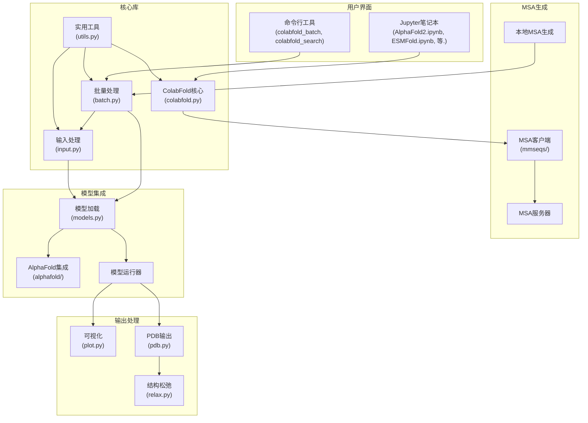
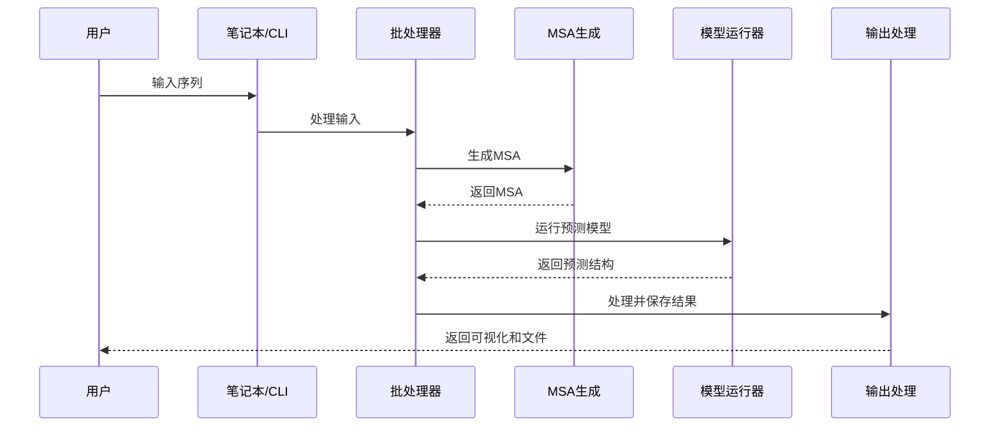
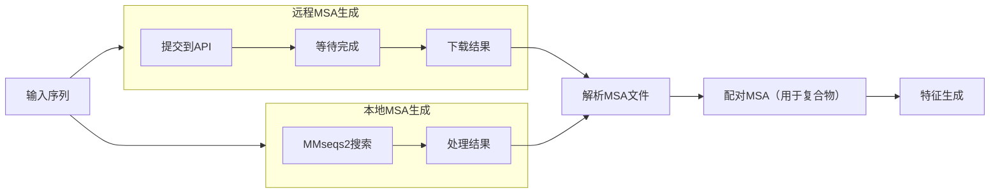
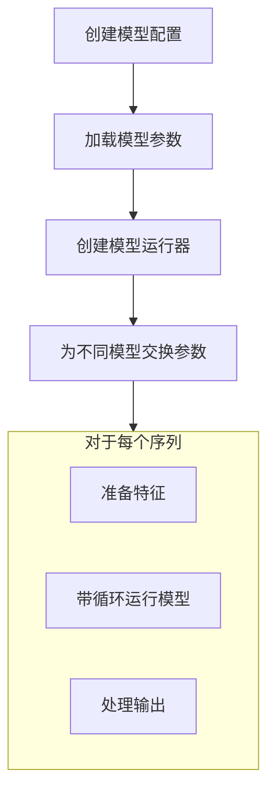

---
slug:10-colabfold-architecture
blog_type:normal
---

ColabFold是一个集成平台，用于蛋白质结构预测，通过Google Colab笔记本使最先进的蛋白质折叠方法对所有用户可访问。本文档介绍了ColabFold的架构、组件交互和内部工作流程，以帮助开发者了解其工作原理。

## 高级架构概述

ColabFold将多种蛋白质折叠算法整合到一个统一且用户友好的框架中。架构由几个关键组件组成，它们协同工作，提供端到端的蛋白质结构预测流程：

## 核心组件

### 1. 用户界面

ColabFold为用户提供两种主要界面：

1. **Jupyter笔记本**：大多数用户的主要入口点，这些笔记本为不同的蛋白质折叠模型提供交互界面：
   - `AlphaFold2.ipynb`：使用MMseqs2的AlphaFold2主笔记本
   - `ESMFold.ipynb`：ESMFold模型的接口
   - `RoseTTAFold.ipynb`和`RoseTTAFold2.ipynb`：RoseTTAFold模型的接口
   - `beta/`目录中的几个专用笔记本，用于高级用例

2. **命令行界面**：用于批量处理和程序化使用：
   - `colabfold_batch`：批量模式处理多个预测
   - `colabfold_search`：使用本地数据库生成MSA

来源：[AlphaFold2.ipynb](AlphaFold2.ipynb), [batch/AlphaFold2_batch.ipynb](batch/AlphaFold2_batch.ipynb)

### 2. 核心库

核心功能在几个Python模块中实现：

#### `colabfold.py`

这是实现核心功能的主要模块，特别是与MSA服务器的交互。它包含关键的`run_mmseqs2()`函数，该函数与ColabFold API服务器通信以生成多序列比对。

主要函数：
- `run_mmseqs2()`：将蛋白质序列发送到MMseqs2服务器并检索MSA结果
- 内存管理函数如`rm()`、`to()`和`clear_mem()`，用于处理GPU/CPU内存

来源：[colabfold/colabfold.py](colabfold/colabfold.py#L69-L73)

#### `batch.py`

处理多个蛋白质结构预测的批量处理。这是一个大型模块（约2000行），负责整个预测流程的协调，从输入解析到模型执行再到输出生成。

主要函数：
- `predict_structure()`：结构预测的主要入口点
- `mk_mock_template()`和`mk_template()`：为AlphaFold生成模板
- 各种辅助函数，用于模型参数处理和特征处理

来源：[colabfold/batch.py](colabfold/batch.py#L89-L123)

#### `input.py`

专门处理输入数据，特别是FASTA序列和MSA文件，为结构预测模型做准备。

主要函数：
- `parse_fasta()`：将FASTA文件解析为序列和描述
- `pair_sequences()`和`pad_sequences()`：处理具有多个链的复杂输入
- `get_queries()`：处理输入路径以提取查询序列

来源：[colabfold/input.py](colabfold/input.py#L88-L116)

#### `utils.py`

包含各种支持核心功能的实用函数，如日志记录、文件处理和配置。

主要组件：
- `setup_logging()`：为应用程序配置日志记录
- `CFMMCIFIO`：扩展的mmCIF文件输出，用于结构结果
- 常量如`DEFAULT_API_SERVER`和信息消息

来源：[colabfold/utils.py](colabfold/utils.py#L46-L62)

### 3. MSA生成

多序列比对（MSA）生成是蛋白质结构预测的关键步骤。ColabFold提供多种生成MSA的方式：

1. **远程MSA服务器**：默认方法，使用ColabFold API服务器
   - 在`colabfold.py`中的`run_mmseqs2()`中实现
   - 支持多种模式：环境基础、配对、过滤等

2. **本地MSA生成**：使用`colabfold_search`和本地数据库
   - 需要下载大型序列数据库（约940GB）
   - 提供更多控制和更高吞吐量

来源：[colabfold/colabfold.py#L69-L200](colabfold/colabfold.py#L69-L200), [README.md#L66-L102](README.md#L66-L102)

### 4. 模型集成

ColabFold集成了多种蛋白质折叠模型，其中AlphaFold2是主要模型：

#### `alphafold/models.py`

处理加载和配置不同模型类型：
- AlphaFold2
- AlphaFold2多聚体（v1, v2, v3）
- AlphaFold2 PTM
- DeepFold

主要函数：
- `get_model_haiku_params()`：从检查点文件加载模型参数
- `load_models_and_params()`：加载模型及其参数，具有特定配置
- `model_to_config_name()`：将模型类型/编号转换为配置名称

来源：[colabfold/alphafold/models.py](colabfold/alphafold/models.py#L9-L59)

### 5. 输出处理

模型预测后，需要处理结果：

1. **结构输出**：从模型输出生成PDB/mmCIF文件
2. **可视化**：创建预测结构和置信度指标的图表
3. **松弛**：可选的结构松弛，以改善几何形状

## 关键工作流程

### 1. 蛋白质结构预测工作流程

1. **输入处理**：
   - 解析FASTA/CSV输入文件
   - 提取单个序列或复合物

2. **MSA生成**：
   - 将序列提交到MSA服务器或使用本地搜索
   - 处理和配对MSA，用于复合物预测

3. **特征处理**：
   - 将MSA和模板转换为模型特征
   - 应用特征转换

4. **模型预测**：
   - 运行选定模型（AlphaFold2, ESMFold等）
   - 按指定进行多次循环

5. **输出生成**：
   - 将预测结构转换为PDB/mmCIF格式
   - 生成置信度可视化（pLDDT, PAE）
   - 可选松弛，优化结构几何形状

来源：[colabfold/batch.py](colabfold/batch.py), [colabfold/input.py](colabfold/input.py)

### 2. MSA生成过程

MSA生成过程是影响预测质量的关键步骤：

ColabFold支持两种主要MSA生成方法：

1. **远程MSA生成**：
   - 使用ColabFold API服务器
   - 更简单，但有速率限制
   - 在`colabfold.py`中的`run_mmseqs2()`中实现

2. **本地MSA生成**：
   - 需要下载大型数据库
   - 更多控制和更高吞吐量
   - 在`colabfold_search`中实现

对于复合物预测，需要配对MSA，这在`input.py`中的专用函数中处理。

来源：[colabfold/colabfold.py#L69-L200](colabfold/colabfold.py#L69-L200), [colabfold/input.py#L51-L73](colabfold/input.py#L51-L73)

### 3. 模型加载和执行

ColabFold优化模型加载，避免重新编译相同的模型架构：

`models.py`中的`load_models_and_params()`函数实现了一个巧妙的优化：它只编译最小数量的模型架构，然后为不同模型交换参数，以避免重新编译的开销。

来源：[colabfold/alphafold/models.py#L61-L200](colabfold/alphafold/models.py#L61-L200)

## 部署选项

ColabFold可以通过多种方式部署：

1. **Google Colab**：主要预期用例，使用交互式笔记本
2. **本地安装**：使用`pip install colabfold`
3. **LocalColabFold**：第三方安装脚本，便于本地设置
4. **Docker**：使用提供的Dockerfile进行容器化部署

对于MSA生成，也有多种选项：
1. **公共MSA服务器**：默认选项，但有速率限制
2. **自托管MSA服务器**：适用于更高吞吐量需求
3. **本地MSA生成**：使用下载的数据库

来源：[README.md#L63-L77](README.md#L63-L77), [MsaServer/README.md](MsaServer/README.md)

## 架构考虑

### 性能优化

ColabFold包括几种优化以提高性能：

1. **内存管理**：`rm()`、`to()`和`clear_mem()`等函数帮助管理GPU/CPU内存使用
2. **模型编译**：通过重用模型架构和不同参数来最小化JIT编译
3. **批量处理**：支持批量模式处理多个序列
4. **GPU加速**：支持GPU加速的MSA搜索

来源：[colabfold/colabfold.py#L49-L61](colabfold/colabfold.py#L49-L61), [README.md#L155-L198](README.md#L155-L198)

### 可扩展性

架构允许以多种方式扩展ColabFold：

1. **新模型**：集成额外的蛋白质折叠模型
2. **自定义MSA生成**：支持不同的MSA生成方法
3. **高级配置**：微调模型参数

<CgxTip>
如果你正在使用ColabFold进行开发，请特别关注batch.py文件，因为它包含了预测流程的主要协调逻辑。理解这个文件将帮助你有效扩展或自定义ColabFold的行为。
</CgxTip>

## 总结

ColabFold的架构旨在使蛋白质结构预测变得易于访问，同时保持灵活性和性能。通过整合多种蛋白质折叠模型，并提供交互式和程序化界面，ColabFold使不同需求和技能背景的用户能够进行最先进的蛋白质结构预测。

关键组件在模块化架构中协同工作，支持不同的部署选项、输入格式和预测模型。MSA生成和模型执行组件的精心设计有助于克服与蛋白质结构预测相关的计算挑战。