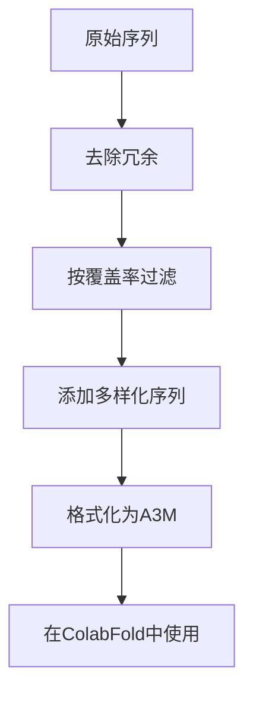

---
slug:13-custom-msa-generation
blog_type:normal
---


多序列比对（MSA）对于准确的蛋白质结构预测至关重要。虽然ColabFold使用MMseqs2自动生成MSA，但在某些情况下，您可能希望使用自定义MSA。本文档解释了如何准备并将自定义MSA与ColabFold集成。

## 为什么使用自定义MSA？

ColabFold的默认MSA生成针对大多数蛋白质的速度和准确性进行了优化。然而，自定义MSA在以下几种情况下可能非常有价值：

- 当您拥有默认数据库未涵盖的专用序列数据库时
- 当处理具有少量同源物的困难目标时
- 当您希望包含或排除特定序列时
- 用于基准测试或比较不同MSA输入的结果时
- 当您拥有来自专用工具的预计算MSA时

## ColabFold中的MSA格式

ColabFold使用A3M格式进行MSA。A3M格式包含：

- 以">"开头，后跟序列标识符的标题行
- 查询序列中无间隙的蛋白质序列
- 用短横线"-"表示对齐序列中的间隙

一个最小A3M文件的示例：

```
>query
PIAQIHILEGRSDEQKETLIREVSEAISRSLDAPLTSVRVIITEMAKGHFGIGGELASK
>homolog1
PLAQIHILEGRTDEQKETLIREVSEAISRSLDAPLTSVRVIITEMAKGHFGIGGELASK
>homolog2
PIAQIHIL--RSNEQKETLIREVS----RSLDAPLTSVRVIITE---GHFGIGGELASK
```

来源：[colabfold/input.py](colabfold/input.py)

## 在ColabFold中使用自定义MSA

ColabFold提供了几种使用自定义MSA的方法：

### 1. 上传自定义MSA文件

在主AlphaFold2.ipynb笔记本中，您可以将MSA模式设置为"custom"并上传您自己的A3M文件：

```python
msa_mode = "custom" #@param ["mmseqs2_uniref_env", "mmseqs2_uniref", "single_sequence", "custom"]
```

当您选择"custom"时，系统会提示您上传A3M文件。ColabFold将使用此MSA，而不是自动生成一个。

来源：[AlphaFold2.ipynb](AlphaFold2.ipynb)

### 2. MSA配对选项

处理蛋白质复合物时，您有三种处理MSA的选项：

```python
pair_mode = "unpaired_paired" #@param ["unpaired_paired", "paired", "unpaired"]
```

- **unpaired_paired**：将同一物种的序列（配对）与未配对的MSA结合
- **paired**：仅使用配对序列（同一物种的序列）
- **unpaired**：为每条链生成单独的MSA

这在建模多链蛋白质或蛋白质-蛋白质复合物时至关重要，因为配对模式会影响链间进化信息的利用方式。

来源：[AlphaFold2.ipynb](AlphaFold2.ipynb)

## 准备自定义MSA

### A3M格式要求

要准备A3M格式的自定义MSA：

1. 第一个序列必须是您的查询序列，且无间隙
2. 所有其他序列应相对于查询序列对齐，使用短横线"-"表示间隙
3. MSA序列中的小写字母表示与查询序列中的间隙对齐的残基
4. 每个序列应在标题行中具有唯一的标识符

以下是正确格式的A3M内容示例：

```
>query
MAVLSQQALRRSLEERQIPYHNCITLNQEDPRTRRSQVARECMRLMNRFEFLLAQPVPE
>homolog1
MAVLSQQALRRSLEERQIPYHNCITLNQEDPRTRRSQVARECMRLMNRFEFLLtlpep
>homolog2
--VLSQQALRRS--ERQIPYHNCITLNQEDPRTRRSQVARECMRLMNRFEFylarefp
```

来源：[colabfold/input.py](colabfold/input.py)

### 复杂MSA

对于蛋白质复合物，您需要准备特殊的MSA：

1. **配对MSA**：包含同物种中两条链的同源序列
2. **未配对MSA**：仅包含一条链有同源序列的情况

对于复合物中的配对MSA，格式使用制表符分隔链：

```
>query_chain_A
SEQUENCE_A
>query_chain_B
SEQUENCE_B
>homolog1_chain_A
ALIGNED_SEQUENCE_A
>homolog1_chain_B
ALIGNED_SEQUENCE_B
```

来源：[colabfold/input.py#L2-L44](colabfold/input.py#L2-L44)

## 自定义MSA生成工具

您可以使用各种工具生成自定义MSA：

### 在本地使用MMseqs2

ColabFold包括在本地运行MMseqs2的功能：

```python
from colabfold.mmseqs import search
search.mmseqs_search_monomer(
    dbbase=Path("path/to/databases"),
    base=Path("output_directory"),
    uniref_db=Path("uniref30_2202_db"),
    use_env=True,
    use_templates=False
)
```

这允许您使用自定义参数和数据库生成MSA。

来源：[colabfold/mmseqs/search.py#L41-L105](colabfold/mmseqs/search.py#L41-L105)

### 其他MSA生成工具

您可以使用其他流行工具并将它们的输出转换为A3M格式：

- **HHblits/HHsuite**：特别适合远程同源物
- **BLAST/PSI-BLAST**：用于更简单的MSA生成
- **JackHMMER**：MMseqs2的替代品，具有不同的敏感性
- **Clustal Omega**：用于较小、更精细的比对

<CgxTip>
生成自定义MSA时，包含多样化的序列通常比包含非常相似的序列更有益。考虑过滤掉高同源性（>90%）的序列，以减少冗余并提高进化信号。</CgxTip>

## 高级MSA操作

### 合并多个MSA

您可以使用ColabFold中的工具合并来自不同源的MSA：

```python
from colabfold.mmseqs.merge_and_split_msas import merge_a3ms

merged_msa = merge_a3ms(["first.a3m", "second.a3m"], "merged.a3m")
```

这在您希望结合来自不同数据库搜索或工具的MSA时非常有用。

来源：[colabfold/mmseqs/merge_and_split_msas.py](colabfold/mmseqs/merge_and_split_msas.py)

### MSA过滤和处理

ColabFold对MSA应用了几个过滤步骤：

1. **按序列同源性过滤**：移除冗余序列
2. **按查询覆盖率过滤**：确保序列覆盖足够的查询部分
3. **按最小序列数过滤**：确保包含足够多样化的序列

在准备自定义MSA时，考虑应用类似的过滤以提高质量：



来源：[colabfold/mmseqs/search.py#L106-L180](colabfold/mmseqs/search.py#L106-L180)

## 最佳实践

1. **从默认开始**：首先尝试默认的MMseqs2 MSA生成
2. **比较结果**：使用自定义和默认MSA生成预测进行比较
3. **检查MSA质量**：验证您的MSA具有足够的多样性和覆盖率
4. **深度与多样性**：在拥有许多序列和多样化序列之间取得平衡
5. **复合物的配对模式**：对于蛋白质复合物，配对MSA可以提供关键的协同进化信息

## 故障排除

### 自定义MSA的常见问题

| 问题 | 可能的解决方案 |
|------|----------------|
| MSA未被识别 | 确保A3M格式正确，查询序列为第一个序列 |
| 预测质量差 | 检查MSA的多样性和深度；尝试不同的MSA生成方法 |
| 内存问题 | 通过过滤冗余序列减少MSA大小 |
| 序列错位 | 验证对齐质量，尤其是在插入/缺失周围 |
| 输出中缺失残基 | 检查MSA中查询序列的间隙 |

来源：[colabfold/input.py](colabfold/input.py)

自定义MSA生成和操作为提高结构预测结果提供了强大的方法，尤其是对于具有挑战性的目标。通过了解ColabFold中可用的格式和选项，您可以利用您的领域知识和专用序列数据，获得更准确的预测。