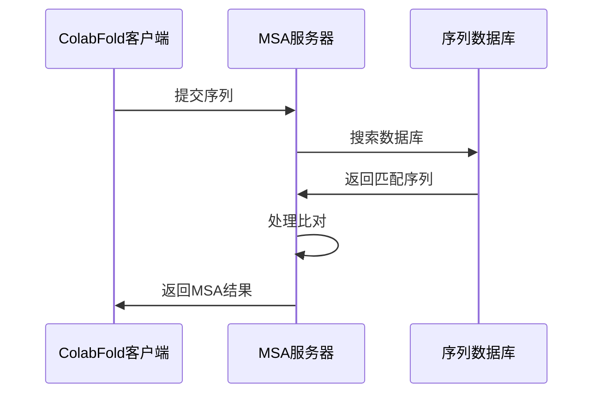

---
slug:14-msa-server-setup-and-configuration
blog_type:normal
---


多序列比对（MSA）是ColabFold中蛋白质结构预测的关键部分。默认情况下，ColabFold使用公共API服务器生成MSA，但您可能需要自己的服务器以实现更高的吞吐量、满足隐私要求或进行自定义数据库配置。本指南将指导您如何设置和配置自己的MSA服务器。

## 了解ColabFold MSA服务器

MSA服务器提供了一个高性能API，用于生成蛋白质结构预测中使用的多序列比对。它通过MMseqs2在序列数据库（如UniRef30和ColabFoldDB）中搜索，以找到进化上相关的序列。



## 硬件要求

<CgxTip>
MSA服务器需要大量的计算资源以实现最佳性能。为了在几秒钟内获得交互式响应，请确保您的系统满足以下要求。
</CgxTip>

| 资源 | 最低要求 | 推荐配置 | 备注 |
|------|----------|----------|------|
| RAM | 64GB | 768GB-1024GB | 用于将数据库索引保持在内存中 |
| CPU | 8核 | 16+核 | 更多核心允许更高的并行处理 |
| 存储 | 1TB | 2TB+ SSD | 用于数据库和临时文件 |
| 网络 | 1Gbps | 10Gbps | 用于更快的数据库下载 |

对于批量处理或较小的工作负载，较低配置可能足够。

来源：[README.md](MsaServer/README.md)

## 设置您的MSA服务器

### 前置条件

在设置MSA服务器之前，请确保已安装以下工具：

- Go编程语言
- Git
- aria2c（用于快速下载）
- curl
- vmtouch（可选但推荐以提高性能）

### 安装步骤

1. **下载仓库**：
   ```bash
   git clone https://github.com/sokrypton/ColabFold.git
   cd ColabFold/MsaServer
   ```

2. **运行设置脚本**：
   仓库包含一个设置脚本，可以自动化大部分安装过程：
   ```bash
   ./setup-and-start-local.sh
   ```
   
   该脚本执行以下关键任务：
   - 检查所需软件
   - 下载与ColabFold测试过的特定MMseqs2版本
   - 下载必要的数据库（UniRef30和ColabFoldDB）
   - 下载并编译API服务器二进制文件
   - 启动API服务器

来源：[README.md](MsaServer/README.md)

## 配置选项

### 基本配置

MSA服务器通过JSON文件进行配置。仓库包含一个示例`config.json`，您可以进行修改：

```json
{
    "app": "colabfold",
    "verbose": true,
    "server": {
        "address": "127.0.0.1:80",
        "dbmanagment": false,
        "cors": true
    },
    "paths": {
        "databases": "~/databases",
        "results": "~/jobs",
        "temporary": "~/tmp",
        "colabfold": {
            "parallelstages": true,
            "uniref": "~/databases/uniref30_2202_db",
            "pdb": "~/databases/pdb100_230517",
            "environmental": "~/databases/colabfold_envdb_202108_db",
            "pdb70": "~/databases/pdb100",
            "pdbdivided": "~/databases/pdb/divided",
            "pdbobsolete": "~/databases/pdb/obsolete"
        },
        "mmseqs": "~/mmseqs/bin/mmseqs"
    },
    "local": {
        "workers": 16
    }
}
```

### 关键配置参数

| 参数 | 描述 | 推荐设置 |
|------|------|----------|
| server.address | 服务器的IP和端口 | "127.0.0.1:80"用于本地访问或"0.0.0.0:80"用于远程访问 |
| local.workers | 并行作业数量 | 设置为可用的CPU核心数 |
| paths.databases | 数据库的基目录 | 具有足够存储空间的路径 |
| colabfold.parallelstages | 启用并行处理 | true以提高性能，但会增加CPU使用 |

来源：[config.json](MsaServer/config.json)

## 设置为系统服务

为了生产使用，建议将MSA服务器设置为systemd服务，以便自动启动和管理。

1. **编辑服务文件**：
   修改提供的systemd示例文件以匹配您的环境：
   ```
   [Unit]
   Description=MMseqs2服务器
   After=network.target
   
   [Service]
   User=user
   Group=user
   WorkingDirectory=/path-to-mmseqs-server-home
   Environment="MMSEQS_NUM_THREADS=1"
   ExecStart=/path-to-mmseqs-server-home/msa-server -local -config /path-to-mmseqs-server-home/config.json
   Type=simple
   Restart=on-failure
   RestartSec=10s
   
   [Install]
   WantedBy=multi-user.target
   ```

2. **安装服务**：
   ```bash
   sudo cp systemd-example-mmseqs-server.service /etc/systemd/system/mmseqs-server.service
   sudo systemctl daemon-reload
   sudo systemctl start mmseqs-server.service
   sudo systemctl enable mmseqs-server.service
   ```

3. **监控服务**：
   ```bash
   sudo systemctl status mmseqs-server.service
   sudo journalctl -u mmseqs-server.service
   ```

来源：[systemd-example-mmseqs-server.service](MsaServer/systemd-example-mmseqs-server.service), [README.md](MsaServer/README.md)

## 性能优化

### 将数据库保持在内存中

为了最佳性能，数据库应保持在系统内存中。可以使用`vmtouch`工具确保数据库文件留在RAM中：

```bash
cd databases
sudo vmtouch -f -w -t -l -d -m 1000G *.idx
```

### 数据库索引优化

为了更好的性能，确保数据库索引创建时没有分割：

1. **检查分割文件**：
   查找类似`uniref30_2103_db.idx.{0,1,...}`或`colabfold_envdb_202108_db.idx.{0,1,...}`的文件

2. **必要时重新创建索引**：
   ```bash
   cd databases
   rm uniref30_2103_db.idx* colabfold_envdb_202108_db.idx*
   mmseqs createindex uniref30_2103_db tmp --remove-tmp-files 1 --split 1
   mmseqs createindex colabfold_envdb_202108_db tmp --remove-tmp-files 1 --split 1
   ```

来源：[README.md](MsaServer/README.md)

## 使用您的自定义MSA服务器

一旦您的MSA服务器运行，您可以配置ColabFold使用它而不是公共API：

### 在ColabFold笔记本中

在“运行预测”单元格的`run()`函数中添加`host_url`参数：

```python
run(..., host_url="http://your-server-address")
```

### 使用colabfold_batch命令行工具

使用`--host-url`参数：

```bash
colabfold_batch --host-url http://your-server-address sequences.fasta output_dir
```

来源：[colabfold.py](colabfold/colabfold.py), [README.md](MsaServer/README.md)

## 故障排除

### 常见问题及解决方案

| 问题 | 可能的解决方案 |
|------|---------------|
| 响应时间慢 | 使用vmtouch确保数据库在内存中 |
| 内存不足错误 | 减少工作数量或增加RAM |
| 连接超时 | 检查网络配置和防火墙设置 |
| 数据库错误 | 验证config.json中的数据库路径 |

### 调试

1. **检查服务器日志**：
   ```bash
   sudo journalctl -u mmseqs-server.service -f
   ```

2. **验证数据库访问**：
   ```bash
   ls -la ~/databases/
   ```

3. **测试API端点**：
   ```bash
   curl http://localhost:80/ticket/msa -d "q=>test\nMKLPVRW"
   ```

## 结论

设置自己的MSA服务器可以更好地控制ColabFold中的蛋白质结构预测过程。虽然它需要大量的计算资源，但它能够实现更快的处理、自定义数据库配置，并消除对公共API的依赖。

如需进一步自定义和高级功能，请探索ColabFold仓库和MMseqs2文档。