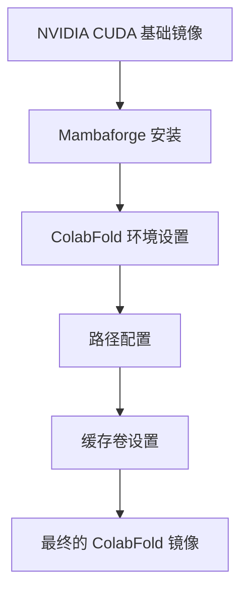

---
slug:15-docker-deployment
blog_type:normal
---


Docker 提供了一种便捷的方式来在一致的环境中运行 ColabFold，无需担心依赖问题。本指南将指导您使用 Docker 部署 ColabFold，确保您能在容器化环境中高效运行蛋白质结构预测。

## 前置条件

在开始之前，请确保您已具备以下条件：

* 系统中已安装 Docker
* NVIDIA Docker 运行时（如果使用 GPU 加速）
* CUDA 兼容的 GPU（以获得最佳性能）
* 足够的磁盘空间用于数据库（完整安装最多需 1TB）

## 了解 ColabFold Docker 镜像

ColabFold Docker 镜像基于 NVIDIA 的 CUDA 基础镜像构建，专为 GPU 加速的蛋白质结构预测优化。该镜像配置了所有必需的依赖项，提供了一个可直接使用的环境来运行 ColabFold。



Dockerfile 定义了镜像构建过程：

1. 使用 NVIDIA CUDA 作为基础镜像
2. 安装所需的系统依赖项
3. 设置 Mambaforge（一个更快的 Conda 替代品）
4. 创建专用的 ColabFold 环境
5. 配置路径和环境变量
6. 设置缓存卷以存储持久数据

来源：[Dockerfile](Dockerfile)

## 构建 Docker 镜像

虽然您可以从 Docker Hub 拉取预构建的镜像，但您可能希望构建自己的镜像以进行定制。要构建 ColabFold Docker 镜像：

```bash
# 克隆仓库
git clone https://github.com/sokrypton/ColabFold.git
cd ColabFold

# 构建 Docker 镜像
docker build -t colabfold:latest .
```

您可以在构建时指定 CUDA 和 ColabFold 版本：

```bash
docker build \
  --build-arg CUDA_VERSION=11.8.0 \
  --build-arg COLABFOLD_VERSION=1.5.5 \
  -t colabfold:1.5.5-cuda11.8 .
```

来源：[Dockerfile](Dockerfile)

## 在 Docker 中运行 ColabFold

根据您的需求，有几种方法可以在 Docker 中运行 ColabFold：

### 基本用法

对于简单的预测，设置最少：

```bash
docker run --gpus all \
  -v /path/to/input:/input \
  -v /path/to/output:/output \
  -v /path/to/cache:/cache \
  colabfold:latest \
  colabfold_batch /input/sequence.fasta /output
```

### 高级用法（带数据库访问）

对于使用本地数据库的运行（推荐用于大规模预测）：

```bash
# 首先设置数据库
docker run --gpus all \
  -v /path/to/databases:/databases \
  colabfold:latest \
  MMSEQS_NO_INDEX=1 ./setup_databases.sh /databases

# 然后使用本地数据库进行预测
docker run --gpus all \
  -v /path/to/input:/input \
  -v /path/to/output:/output \
  -v /path/to/databases:/databases \
  -v /path/to/cache:/cache \
  colabfold:latest \
  colabfold_search --mmseqs /usr/local/envs/colabfold/bin/mmseqs /input/sequence.fasta /databases /output/msas

docker run --gpus all \
  -v /path/to/output:/output \
  -v /path/to/cache:/cache \
  colabfold:latest \
  colabfold_batch /output/msas /output/predictions
```

来源：[README.md#L95-L99](README.md#L95-L99)

## 在 Docker 中使用 GPU 加速的 MSA 搜索

为了获得更快的性能，您可以使用 GPU 加速的 MSA 搜索：

```bash
# 设置 GPU 数据库
docker run --gpus all \
  -v /path/to/databases:/databases \
  colabfold:latest \
  GPU=1 ./setup_databases.sh /databases

# 运行 GPU 加速搜索
docker run --gpus all \
  -v /path/to/input:/input \
  -v /path/to/output:/output \
  -v /path/to/databases:/databases \
  -v /path/to/cache:/cache \
  colabfold:latest \
  colabfold_search --mmseqs /usr/local/envs/colabfold/bin/mmseqs /input/sequence.fasta /databases /output/msas --gpu 1
```

来源：[README.md#L155-L177](README.md#L155-L177)

## 在 Docker 中设置 GPU 服务器

对于频繁的搜索，运行专用的 GPU 服务器可以提升性能：

```bash
# 在容器中启动 GPU 服务器进程
docker run -d --gpus all \
  -v /path/to/databases:/databases \
  -v /path/to/cache:/cache \
  --name colabfold-gpuserver \
  colabfold:latest \
  bash -c "mmseqs gpuserver /databases/colabfold_envdb_202108_db --max-seqs 10000 --db-load-mode 0 --prefilter-mode 1 & \
           mmseqs gpuserver /databases/uniref30_2302_db --max-seqs 10000 --db-load-mode 0 --prefilter-mode 1 & \
           tail -f /dev/null"  # 保持容器运行

# 使用 GPU 服务器进行搜索
docker exec colabfold-gpuserver \
  colabfold_search /usr/local/envs/colabfold/bin/mmseqs /input/sequence.fasta /databases /output/msas --gpu 1 --gpu-server 1
```

来源：[README.md#L179-L201](README.md#L179-L201)

## 卷挂载和配置

适当的卷挂载对于 Docker 部署至关重要：

| 卷路径 | 描述 | 必需 |
|--------|------|------|
| `/input` | 包含输入 FASTA 文件的目录 | 是 |
| `/output` | 用于输出预测的目录 | 是 |
| `/cache` | MSA 和模型的缓存目录 | 是 |
| `/databases` | 本地数据库存储（用于大规模使用） | 可选 |

<CgxTip>
**性能提示：** 将缓存目录挂载到快速存储设备（如 SSD）上以提高性能。缓存卷在 Dockerfile 中定义，并映射到环境变量，以确保最佳运行。
</CgxTip>

来源：[Dockerfile#L16-L18](Dockerfile#L16-L18)

## 环境变量

几个环境变量可以控制 ColabFold 的行为：

| 变量 | 描述 | 默认值 |
|------|------|--------|
| `CUDA_VISIBLE_DEVICES` | 控制使用哪些 GPU | 所有可用的 |
| `XDG_CACHE_HOME` | 缓存文件的位置 | `/cache` |
| `MMSEQS_NO_INDEX` | 禁用 MMseqs2 预索引 | 未设置 |
| `GPU` | 启用 GPU 数据库设置 | 未设置 |

例如：

```bash
docker run --gpus all \
  -e CUDA_VISIBLE_DEVICES=0,1 \
  -e XDG_CACHE_HOME=/fast_cache \
  -v /path/to/fast_cache:/fast_cache \
  -v /path/to/input:/input \
  -v /path/to/output:/output \
  colabfold:latest \
  colabfold_batch /input/sequence.fasta /output
```

来源：[Dockerfile#L16-L18](Dockerfile#L16-L18), [README.md#L174-L177](README.md#L174-L177)

## Docker 部署故障排除

### 常见问题

1. **GPU 未识别：**
   - 确保已安装 NVIDIA Docker 运行时
   - 验证您的 GPU 驱动程序是否为最新版本
   - 检查您的 docker run 命令中是否包含 `--gpus all`

2. **内存不足错误：**
   - 减少批量大小
   - 使用 `--max-msa` 选项限制 MSA 大小
   - 使用具有更多 GPU 内存的机器

3. **数据库搜索缓慢：**
   - 使用 GPU 加速搜索
   - 为频繁搜索设置 GPU 服务器
   - 对于小规模预测，考虑使用 MSA 服务器

4. **容器崩溃：**
   - 检查 Docker 日志：`docker logs <container_id>`
   - 确保有足够的系统资源
   - 验证所有必需的卷是否已正确挂载

## 结论

Docker 部署提供了一种便捷且可靠的方式来运行 ColabFold，确保环境一致且易于扩展。通过遵循本指南，您应能够成功使用 Docker 部署 ColabFold，并在容器化环境中利用其蛋白质结构预测能力。

如需进一步帮助，请查看 [ColabFold GitHub 仓库](https://github.com/sokrypton/ColabFold/) 或加入 README 中提到的 [Discord 社区](https://discord.gg/gna8maru7d)。