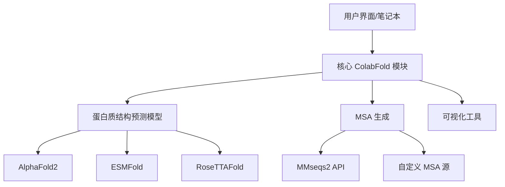

---
slug:17-extending-colabfold
blog_type:normal
---


ColabFold 是一个强大的工具，它将 AlphaFold2、ESMFold 和其他蛋白质结构预测方法的功能与用户友好的界面相结合。本指南将帮助开发者了解如何通过自定义组件扩展 ColabFold，集成新功能，或修改现有功能以满足特定研究需求。

## 了解 ColabFold 的架构

在扩展 ColabFold 之前，了解其架构非常重要。ColabFold 由几个关键组件组成：



该存储库的结构支持通过一致的界面支持多种预测方法，核心功能与模型特定实现之间有清晰的分离。

来源：[colabfold.py](colabfold/colabfold.py)

## 设置开发环境

在扩展 ColabFold 之前，您需要设置一个合适的开发环境：

1. **安装 Poetry 用于依赖管理**：
   ```bash
   curl -sSL https://install.python-poetry.org | python3 -
   poetry config virtualenvs.in-project true
   ```

2. **克隆并设置存储库**：
   ```bash
   git clone https://github.com/sokrypton/ColabFold
   cd ColabFold
   poetry install -E alphafold
   source .venv/bin/activate
   ```

3. **安装带 CUDA 支持的 JAX**：
   ```bash
   pip install -q "jax[cuda]>=0.3.8,<0.4" -f https://storage.googleapis.com/jax-releases/jax_cuda_releases.html
   ```

对于涉及 AlphaFold 修改的更高级开发：
```bash
git clone https://github.com/steineggerlab/alphafold
pip install -e alphafold
```

来源：[Contributing.md](Contributing.md)

## 扩展点

ColabFold 提供了多种扩展其功能的方式。以下是主要的扩展点：

### 1. 自定义 MSA 生成

默认的 MSA 生成使用 MMseqs2 API，但您可以创建自定义 MSA 源，方法如下：

1. **创建一个新的 MSA 生成函数**，其接口与 `colabfold.py` 中的 `run_mmseqs2()` 相同
2. **集成到现有流程中**，通过修改 MSA 提供给预测模型的方式

自定义 MSA 生成器函数签名的示例：

```python
def custom_msa_generator(sequences, output_dir, 
                         use_env=True, use_filter=True):
    """
    从自定义源生成 MSAs
    
    参数：
        sequences: 蛋白质序列列表或单个序列
        output_dir: 存储结果的目录
        use_env: 是否包含环境序列
        use_filter: 是否过滤序列
        
    返回：
        A3M 格式的 MSA 字符串列表
    """
    # 您的自定义 MSA 生成代码
    # ...
    return msa_strings
```

来源：[colabfold.py#L105-L292](colabfold/colabfold.py)

### 2. 自定义可视化方法

您可以通过以下方式扩展可视化功能：

1. **创建新的绘图函数**，可视化蛋白质结构预测的不同方面
2. **增强现有可视化**，添加额外功能

`colabfold.py` 中的现有可视化函数为创建您自己的函数提供了良好的模板：

```python
def custom_plot_function(prediction_data, output_path=None):
    """
    创建预测结果的定制可视化
    
    参数：
        prediction_data: 结构预测的输出
        output_path: 可选的保存图表路径
        
    返回：
        matplotlib 图表或如果提供 output_path 则为 None
    """
    # 您的自定义可视化代码
    # ...
    return plt
```

来源：[colabfold.py#L475-L531](colabfold/colabfold.py)

### 3. 自定义蛋白质处理

您可以添加蛋白质序列的自定义预处理或后处理步骤：

1. **序列操作**，如添加特殊残基或修改现有残基
2. **结构后处理**，分析或修改预测的结构

例如，现有的同源寡聚化函数展示了如何操作序列：

```python
def custom_protein_processor(sequences, options):
    """
    对蛋白质序列应用自定义预处理
    
    参数：
        sequences: 蛋白质序列列表
        options: 处理选项字典
        
    返回：
        处理后的序列
    """
    # 您的自定义处理代码
    # ...
    return processed_sequences
```

来源：[colabfold.py#L305-L365](colabfold/colabfold.py)

### 4. 集成新的预测模型

要添加对新的蛋白质结构预测模型的支持：

1. **创建一个包装模块**，将模型适配到 ColabFold 的接口
2. **添加模型特定配置**，处理独特参数
3. **创建类似现有笔记本的界面**（如 AlphaFold2.ipynb, ESMFold.ipynb）

beta 文件夹包含实验性集成的示例，您可以作为参考。

来源：[beta/](beta/)

## 创建自定义扩展

让我们通过一个示例来了解如何为 ColabFold 创建自定义扩展。这里，我们将创建一个简单的扩展，添加一个新的可视化方法：

### 示例：自定义结构质量可视化

```python
import matplotlib.pyplot as plt
import numpy as np
from colabfold.colabfold import plot_plddt_legend

def plot_structure_quality_comparison(
    models, 
    metric='plddt', 
    title='模型质量比较',
    figsize=(10, 6),
    dpi=100
):
    """
    创建跨模型的结构质量指标比较图
    
    参数：
        models: {模型名称: 预测数据} 的字典
        metric: 要绘制的指标（'plddt' 或 'pae'）
        title: 图表标题
        figsize: 图表大小
        dpi: 图表的 DPI
        
    返回：
        matplotlib 图表
    """
    plt.figure(figsize=figsize, dpi=dpi)
    plt.title(title)
    
    # 绘制每个模型的数据
    for name, data in models.items():
        if metric == 'plddt':
            plt.plot(data['plddt'], label=name)
        elif metric == 'pae' and 'pae' in data:
            # 对于 PAE，绘制每个残基的平均误差
            mean_pae = np.mean(data['pae'], axis=1)
            plt.plot(mean_pae, label=name)
    
    plt.xlabel('残基')
    plt.ylabel(metric.upper())
    if metric == 'plddt':
        plt.ylim(0, 100)
    plt.legend()
    
    return plt
```

使用此扩展：

```python
# 在您的笔记本或脚本中
from custom_extension import plot_structure_quality_comparison

# 生成预测后
models = {
    "模型 1": prediction_1,
    "模型 2": prediction_2,
    "模型 3": prediction_3,
}

plot = plot_structure_quality_comparison(models)
plot.savefig("质量比较.png")
plot.show()
```

### 与笔记本集成

要将您的扩展集成到 ColabFold 笔记本中：

1. 将您的扩展模块放置在合适的位置（例如，项目中的自定义文件夹）
2. 在笔记本中导入您的扩展
3. 根据需要替换或扩展默认功能

<CgxTip>
在用自定义功能扩展 ColabFold 时，考虑创建一个单独的 Python 包，而不是直接修改源代码。这样可以更容易地管理您的扩展，并在发布新版本时更新 ColabFold。
</CgxTip>

## 测试自定义扩展

ColabFold 包含一个测试套件，您可以扩展它来测试您的自定义功能：

1. **在 `tests/` 目录中创建测试文件**，遵循现有模式
2. **使用 `test-data/` 目录中的测试数据**，或添加您自己的测试数据
3. **使用 `pytest` 运行测试**，验证您的扩展按预期工作

自定义 MSA 生成器的示例测试：

```python
def test_custom_msa_generator():
    from custom_extension import custom_msa_generator
    
    # 使用已知序列进行测试
    test_seq = "MTYKLILNGKTLKGETTTEAVDAATAEKVFKQYANDNGVDGEWTYDDATKTFTVTE"
    output_dir = "test_output"
    
    # 运行自定义 MSA 生成器
    msa_results = custom_msa_generator([test_seq], output_dir)
    
    # 验证结果
    assert len(msa_results) == 1
    assert len(msa_results[0]) > 0
    assert test_seq in msa_results[0]
```

使用以下命令运行测试：
```bash
pytest tests/ -v
```

来源：[tests/](tests/)

## 为 ColabFold 做贡献

如果您开发了其他开发者可能受益的有用扩展：

1. **分叉存储库**并为您的新扩展创建一个分支
2. **遵循现有代码库的编码风格**
3. **为您的扩展添加测试**
4. **更新文档**以解释您的扩展
5. **提交一个 pull request**，并清晰地描述您的扩展

提交 pull request 时：
- 解释您扩展的目的和好处
- 提供使用示例
- 描述您的扩展引入的任何依赖项
- 包括证明您的扩展正常工作的测试结果

来源：[Contributing.md](Contributing.md)

## 高级扩展：MSA 服务器定制

对于更高级的扩展，您可以定制 ColabFold 使用的 MSA 服务器：

1. **使用 `MsaServer/` 目录中的模板设置自定义 MSA 服务器**
2. **修改服务器配置**，使用不同的数据库或搜索参数
3. **更新 ColabFold 客户端**以连接到您的自定义服务器

这种方法适用于希望：
- 因隐私或性能原因运行自己的 MSA 服务器的实验室
- 使用公共 API 不可用的专业序列数据库
- 实施自定义序列搜索算法

来源：[MsaServer/](MsaServer/)

## 结论

扩展 ColabFold 可以帮助您定制和增强蛋白质结构预测工作流程，以满足特定的研究需求。通过了解架构和扩展点，您可以在利用 ColabFold 坚实基础的同时，创建强大的自定义解决方案。

请记住将您有用的扩展贡献回社区，以帮助推进蛋白质结构预测领域的发展。