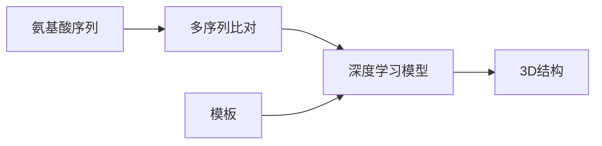
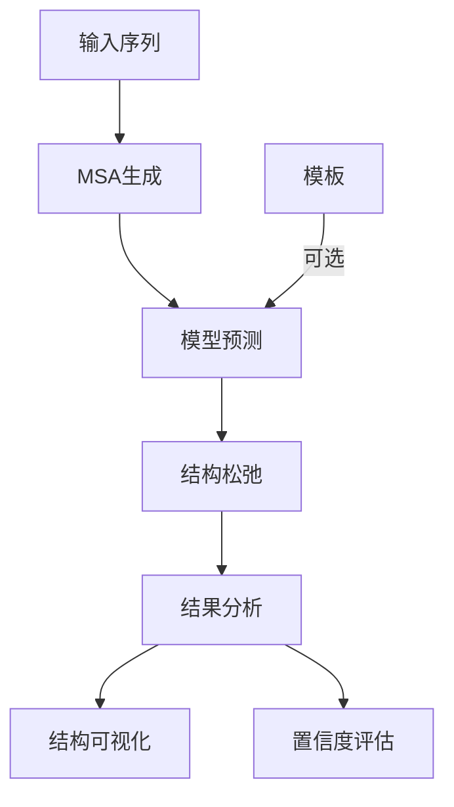

---
slug:9-protein-structure-prediction-concepts
blog_type:normal
---


蛋白质结构预测近年来发生了革命性变化，从生物学的一大挑战逐渐转变为一个日益解决的问题。ColabFold使这些前沿方法对所有研究人员都触手可及。在本指南中，我们将探讨蛋白质结构预测的基本概念，以及它们在ColabFold框架中的实现方式。

## 蛋白质结构预测简介

核心上，蛋白质结构预测试图仅基于氨基酸序列来确定蛋白质的三维结构。这是理解蛋白质功能的关键步骤，因为结构在很大程度上决定了生物世界中的功能。



ColabFold流程实现了AlphaFold2、ESMFold和RoseTTAFold等最先进的方法，这些方法极大地提高了预测准确性。这些模型结合了进化信息和深度学习，以生成高度准确的蛋白质结构预测。

来源：[README.md](README.md)

## 蛋白质结构预测的关键概念

### 从一级结构到三级结构

蛋白质是由氨基酸链折叠成特定三维形状的。蛋白质结构的层次包括：

1. **一级结构**：氨基酸的线性序列
2. **二级结构**：局部结构元素（α-螺旋，β-折叠）
3. **三级结构**：蛋白质的整体3D构象
4. **四级结构**：多个蛋白质亚基在复合物中的排列

像ColabFold中的现代预测方法旨在直接从一级序列预测三级结构。

### 多序列比对（MSAs）

多序列比对是蛋白质结构预测的基石。MSA对进化上相关的蛋白质序列进行比对，以揭示保守模式。

<CgxTip>
MSAs提供了关键的进化信息。对结构或功能重要的残基往往在进化中保守或显示相关突变，为结构预测提供了强有力的信号。
</CgxTip>

在ColabFold中，MSAs是使用MMseqs2生成的，MMseqs2是一个快速且敏感的序列搜索工具：

```python
# ColabFold中MSA生成的基本流程
a3m_lines = run_mmseqs2(query_sequence, jobname, use_env=True, use_templates=use_templates)
```

`run_mmseqs2`函数将查询序列发送到服务器，该服务器对大型蛋白质数据库（UniRef30、BFD、MGnify等）进行序列搜索，并将结果作为A3M格式的比对文件返回。

来源：[colabfold.py#L71-L276](colabfold/colabfold.py#L71-L276)

### 结构模板

模板是已知的蛋白质结构，可以指导预测。当查询蛋白质与已知结构的蛋白质在进化上相似时，这些模板可以提高预测准确性，尤其是对于置信度较低的区域。

ColabFold支持三种模板模式：
- **None**：不使用模板
- **PDB100**：自动在PDB100数据库中检测模板
- **Custom**：使用用户提供的模板

模板信息被提取并准备用于模型：

```python
# 使用模板进行结构预测
if use_templates:
    template_paths = ...  # 模板路径
    # 模板处理以供模型输入
```

来源：[AlphaFold2.ipynb](AlphaFold2.ipynb)

### 深度学习方法

现代蛋白质结构预测方法利用专门设计用于学习蛋白质折叠模式的深度神经网络。这些模型学会将序列和进化信息转换为空间坐标。

## ColabFold中的核心预测方法

### AlphaFold2

由DeepMind开发的AlphaFold2代表了基本上解决单链蛋白质折叠问题的突破。该模型使用了一种新颖的架构，结合了：

1. **Evoformer块**：处理MSAs以提取进化模式
2. **结构模块**：将这些模式转换为3D坐标
3. **循环**：迭代精化，将预测反馈回模型

ColabFold将AlphaFold2作为其主要预测方法实现，使其可通过Google Colab笔记本访问。

### ESMFold

ESMFold是一种替代预测方法，利用蛋白质语言模型。与AlphaFold2不同，ESMFold可以直接从序列进行预测，而无需生成MSA，使其更快，但对于困难目标有时准确性较低。


ColabFold通过专用笔记本提供ESMFold作为替代选项。

### RoseTTAFold

RoseTTAFold是另一种基于深度学习的结构预测方法，作为受AlphaFold2启发的独立实现开发。它使用三轨网络架构，同时处理1D序列、2D距离图和3D坐标信息。

ColabFold包括RoseTTAFold作为另一预测选项，提供原始和更新的RoseTTAFold2实现。

来源：[README.md](README.md)

## 评估与评价

### pLDDT分数

AlphaFold2中的每个残基置信度指标称为预测LDDT（pLDDT）。这个分数范围从0到100，反映了每个残基位置的置信度：

| pLDDT范围 | 置信度 | 典型解释 |
|-----------|--------|----------|
| 90-100    | 非常高 | 高度准确，可与实验结构相比 |
| 70-90     | 高     | 适用于大多数应用，包括结合位点分析 |
| 50-70     | 低     | 整体折叠可能正确，但细节不太可靠 |
| 0-50      | 非常低 | 不应解释，可能是无序区域 |

ColabFold通过给结构着色和绘制每个残基的图表来可视化pLDDT分数：

```python
# 可视化pLDDT分数
plot_plddt = plot_confidence(plddt, pae)
```

来源：[colabfold.py#L478-L492](colabfold/colabfold.py#L478-L492)

### 预测对齐误差（PAE）

PAE衡量每对残基之间相对位置的预期误差。它以2D矩阵形式可视化，低值（蓝色）表示对相对位置的置信度高，而高值（红色）表示不确定性。

PAE特别有价值于：
- 识别域边界
- 评估域间或蛋白质-蛋白质界面的置信度
- 确定多域蛋白质的整体排列是否置信

```python
# 可视化PAE
plot_paes([pae], Ls=Ls)
```

来源：[colabfold.py#L605-L611](colabfold/colabfold.py#L605-L611)

## 高级概念

### 蛋白质复合物

ColabFold支持蛋白质复合物的预测，包括同源寡聚体（同一蛋白质的多个拷贝）和异源寡聚体（不同蛋白质）。

复合物通过输入序列中的分隔符指定：
- 冒号`:`用于不同蛋白质之间的链断裂
- 斜杠`/`用于单个链内的分隔

例如，`PROTEIN_A:PROTEIN_B`指定了两个不同蛋白质的复合物，而`PROTEIN_A:PROTEIN_A`指定了同二聚体。

在预测复合物时，ColabFold以特殊方式生成MSAs，以考虑复合物组分之间的进化关系：

```python
# 处理复合物的MSAs
if len(sequence_chunks) > 1:
    # 使用特殊函数处理复合物的MSAs
    a3m_lines = homooligomerize_heterooligomer(a3m_lines, deletion_matrices, lengths, homooligomers)
```

来源：[colabfold.py#L319-L397](colabfold/colabfold.py#L319-L397)

### 同源寡聚体与异源寡聚体

- **同源寡聚体**是由同一蛋白质的多个拷贝形成的复合物。ColabFold通过复制每个拷贝的MSA并将它们连接起来进行处理。
  
- **异源寡聚体**是由不同蛋白质形成的复合物。ColabFold通过为每个组分生成单独的MSA，然后适当地将它们组合起来进行处理。

这种区分很重要，因为这两种复合类型的进化信号和预测策略不同。

## 结构松弛

初始预测后，可以使用分子力学力场对结构进行精化：

```python
# 使用Amber进行结构松弛
if use_amber:
    # 在顶部模型上运行Amber松弛
    amber_relaxer = relax.AmberRelaxation()
    relaxed_pdbs = amber_relaxer.process(...)
```

这一步优化了键长、角度，并消除了立体冲突，结果得到更物理真实的结构。ColabFold提供使用Amber力场松弛结构的选项。

来源：[AlphaFold2.ipynb](AlphaFold2.ipynb)

## 蛋白质结构预测的实际工作流程

使用ColabFold进行蛋白质结构预测的典型工作流程包括：

1. **输入准备**：提供蛋白质序列
2. **MSA生成**：运行MMseqs2创建多序列比对
3. **模板检测**（可选）：查找结构模板
4. **模型预测**：运行AlphaFold2或其他模型
5. **结构松弛**（可选）：使用Amber精化结构
6. **结果分析**：检查结构和置信度指标



ColabFold笔记本自动化了这一工作流程，使没有广泛生物信息学经验的用户也能使用。

## 结论

蛋白质结构预测已被AlphaFold2等深度学习方法彻底改变，使得几乎任何蛋白质序列的准确结构预测成为可能。ColabFold将这些强大方法打包成易于使用的格式，使研究人员能够将其应用于自己的生物学问题。

理解这些核心概念将帮助您充分利用ColabFold进行蛋白质结构预测，无论您是研究单个蛋白质还是复合组装体。