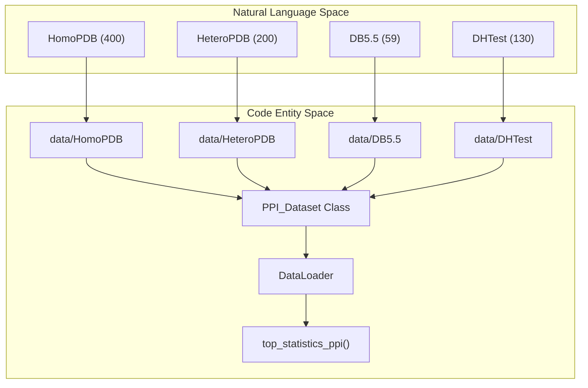
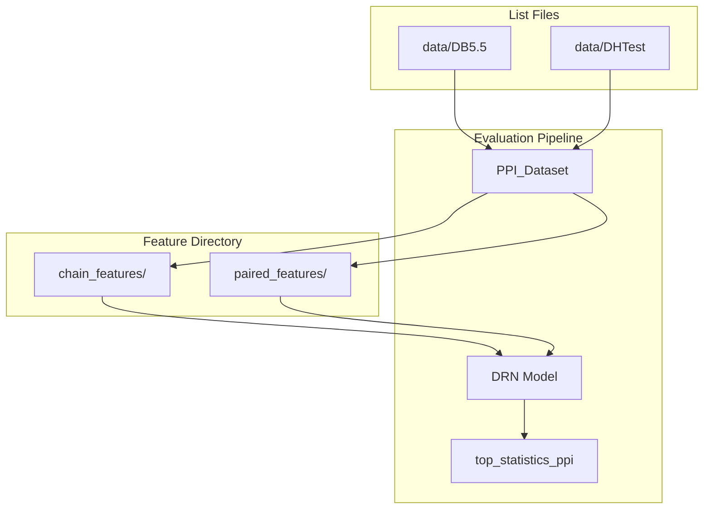

# Benchmark Test Sets

> **Relevant source files**
> * [data/DB5.5](https://github.com/ChengfeiYan/DRN-1D2D_Inter/blob/a54a43b8/data/DB5.5)
> * [data/DHTest](https://github.com/ChengfeiYan/DRN-1D2D_Inter/blob/a54a43b8/data/DHTest)
> * [data/HeteroPDB](https://github.com/ChengfeiYan/DRN-1D2D_Inter/blob/a54a43b8/data/HeteroPDB)
> * [data/HomoPDB](https://github.com/ChengfeiYan/DRN-1D2D_Inter/blob/a54a43b8/data/HomoPDB)
> * [data/README.md](https://github.com/ChengfeiYan/DRN-1D2D_Inter/blob/a54a43b8/data/README.md?plain=1)

The DRN-1D2D_Inter framework is evaluated across four distinct benchmark datasets to assess its performance on both homodimeric and heterodimeric protein complexes. These benchmarks provide a standardized basis for comparing the model's inter-protein contact prediction accuracy against other state-of-the-art methods.

### Overview of Evaluation Benchmarks

The system utilizes four primary test sets, totaling 789 protein dimers. These sets are categorized by their dimer composition (homo vs. hetero) and their source (PDB vs. established docking benchmarks).

| Dataset Name | Composition | Size | Description |
| --- | --- | --- | --- |
| **HomoPDB** | Homodimers | 400 | A large-scale set of homomeric complexes for testing symmetry-aware predictions. |
| **HeteroPDB** | Heterodimers | 200 | A diverse set of heteromeric complexes. |
| **DB5.5** | Heterodimers | 59 | Derived from Protein-Protein Docking Benchmark 5.5, filtered for redundancy. |
| **DHTest** | Heterodimers | 130 | Derived from the DeepHomo test set, filtered for redundancy against the training data. |

**Sources:** [data/README.md L1-L9](https://github.com/ChengfeiYan/DRN-1D2D_Inter/blob/a54a43b8/data/README.md?plain=1#L1-L9)

---

### Redundancy Removal Methodology

To ensure the integrity of the evaluation, a rigorous redundancy removal process was applied to the benchmarks, particularly for those derived from external sources like DB5.5 and DeepHomo.

1. **Training Set Exclusion:** Any dimer in the test benchmarks that exhibited significant sequence similarity or structural redundancy with the `trainset` (7362 dimers) was removed [data/README.md L7-L9](https://github.com/ChengfeiYan/DRN-1D2D_Inter/blob/a54a43b8/data/README.md?plain=1#L7-L9)
2. **DB5.5 Refinement:** The original Docking Benchmark 5.5 was filtered to 59 heterodimers to ensure no overlap with the training distribution [data/README.md L7](https://github.com/ChengfeiYan/DRN-1D2D_Inter/blob/a54a43b8/data/README.md?plain=1#L7-L7)  [data/DB5.5 L1-L59](https://github.com/ChengfeiYan/DRN-1D2D_Inter/blob/a54a43b8/data/DB5.5#L1-L59)
3. **DHTest Refinement:** The DeepHomo test set was reduced to 130 heterodimers using the same redundancy criteria relative to the DRN-1D2D_Inter training set [data/README.md L9](https://github.com/ChengfeiYan/DRN-1D2D_Inter/blob/a54a43b8/data/README.md?plain=1#L9-L9)  [data/DHTest L1-L130](https://github.com/ChengfeiYan/DRN-1D2D_Inter/blob/a54a43b8/data/DHTest#L1-L130)

---

### Benchmark Data Structures

The benchmark sets are defined as lists of protein complex identifiers. Each identifier follows the format `PDBID_ChainA_PDBID_ChainB`, which the `PPI_Dataset` class uses to locate corresponding feature files.

#### Homodimer Benchmark: HomoPDB

Contains 400 entries. Because these are homodimers, the sequences for Chain A and Chain B are identical, though they are treated as two distinct entities in the 2D interaction map.

**Example Entries:**

* `1U1X_A_1U1X_B` [data/HomoPDB L1](https://github.com/ChengfeiYan/DRN-1D2D_Inter/blob/a54a43b8/data/HomoPDB#L1-L1)
* `3I0Z_A_3I0Z_B` [data/HomoPDB L2](https://github.com/ChengfeiYan/DRN-1D2D_Inter/blob/a54a43b8/data/HomoPDB#L2-L2)

#### Heterodimer Benchmark: HeteroPDB

Contains 200 entries representing complexes with two different protein chains.

**Example Entries:**

* `6O1F_A_6O1F_I` [data/HeteroPDB L1](https://github.com/ChengfeiYan/DRN-1D2D_Inter/blob/a54a43b8/data/HeteroPDB#L1-L1)
* `5A1N_A_5A1N_B` [data/HeteroPDB L2](https://github.com/ChengfeiYan/DRN-1D2D_Inter/blob/a54a43b8/data/HeteroPDB#L2-L2)

#### Docking Benchmark: DB5.5

A specialized subset of 59 heterodimers often used in docking literature, allowing for cross-discipline performance comparison.

**Example Entries:**

* `1HE1_C_1HE1_A` [data/DB5.5 L1](https://github.com/ChengfeiYan/DRN-1D2D_Inter/blob/a54a43b8/data/DB5.5#L1-L1)
* `1GL1_A_1GL1_I` [data/DB5.5 L4](https://github.com/ChengfeiYan/DRN-1D2D_Inter/blob/a54a43b8/data/DB5.5#L4-L4)

#### DeepHomo Test Subset: DHTest

Contains 130 heterodimers. Despite originating from the "DeepHomo" project, these specific test cases are used to validate the model's generalization to heteromeric interfaces.

**Example Entries:**

* `5I1V_A_5I1V_B` [data/DHTest L1](https://github.com/ChengfeiYan/DRN-1D2D_Inter/blob/a54a43b8/data/DHTest#L1-L1)
* `2I00_A_2I00_B` [data/DHTest L2](https://github.com/ChengfeiYan/DRN-1D2D_Inter/blob/a54a43b8/data/DHTest#L2-L2)

**Sources:** [data/HomoPDB L1-L400](https://github.com/ChengfeiYan/DRN-1D2D_Inter/blob/a54a43b8/data/HomoPDB#L1-L400)

 [data/HeteroPDB L1-L200](https://github.com/ChengfeiYan/DRN-1D2D_Inter/blob/a54a43b8/data/HeteroPDB#L1-L200)

 [data/DB5.5 L1-L59](https://github.com/ChengfeiYan/DRN-1D2D_Inter/blob/a54a43b8/data/DB5.5#L1-L59)

 [data/DHTest L1-L130](https://github.com/ChengfeiYan/DRN-1D2D_Inter/blob/a54a43b8/data/DHTest#L1-L130)

---

### Data Flow: From Benchmarks to Evaluation

The following diagram illustrates how the benchmark list files interact with the codebase during the evaluation phase.

**Benchmark Loading Logic**

**Sources:** [data/README.md L1-L9](https://github.com/ChengfeiYan/DRN-1D2D_Inter/blob/a54a43b8/data/README.md?plain=1#L1-L9)

 [data/DB5.5 L1-L59](https://github.com/ChengfeiYan/DRN-1D2D_Inter/blob/a54a43b8/data/DB5.5#L1-L59)

 [data/DHTest L1-L130](https://github.com/ChengfeiYan/DRN-1D2D_Inter/blob/a54a43b8/data/DHTest#L1-L130)

 [data/HeteroPDB L1-L200](https://github.com/ChengfeiYan/DRN-1D2D_Inter/blob/a54a43b8/data/HeteroPDB#L1-L200)

 [data/HomoPDB L1-L400](https://github.com/ChengfeiYan/DRN-1D2D_Inter/blob/a54a43b8/data/HomoPDB#L1-L400)

---

### Implementation in Evaluation

When running evaluation, the `PPI_Dataset` class reads these list files to fetch the pre-computed features (PSSM, ESM representations, CCMpred, etc.) for each dimer.

**Benchmark Integration Workflow**

**Sources:** [data/README.md L1-L9](https://github.com/ChengfeiYan/DRN-1D2D_Inter/blob/a54a43b8/data/README.md?plain=1#L1-L9)

 [data/DB5.5 L1-L59](https://github.com/ChengfeiYan/DRN-1D2D_Inter/blob/a54a43b8/data/DB5.5#L1-L59)

 [data/DHTest L1-L130](https://github.com/ChengfeiYan/DRN-1D2D_Inter/blob/a54a43b8/data/DHTest#L1-L130)