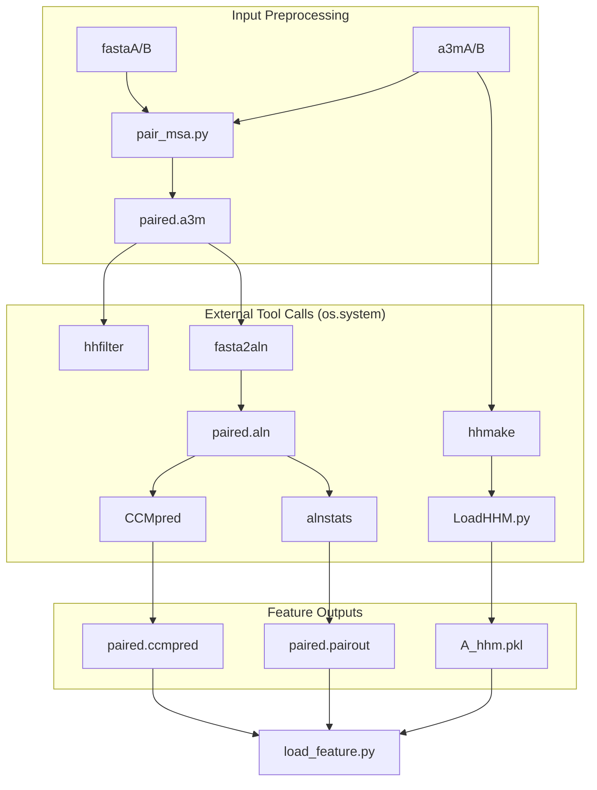
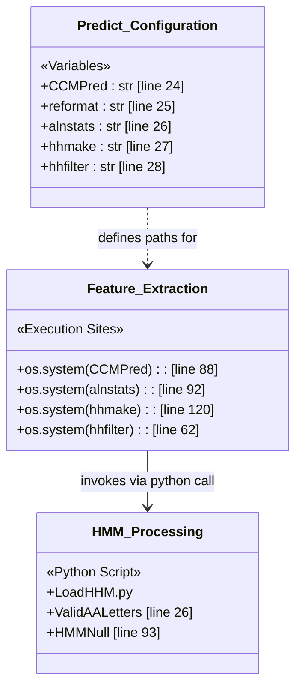

# Bioinformatics Tool Dependencies

> **Relevant source files**
> * [LICENSE](https://github.com/ChengfeiYan/DRN-1D2D_Inter/blob/a54a43b8/LICENSE)
> * [README.md](https://github.com/ChengfeiYan/DRN-1D2D_Inter/blob/a54a43b8/README.md?plain=1)
> * [paired/hhfilter_paired.py](https://github.com/ChengfeiYan/DRN-1D2D_Inter/blob/a54a43b8/paired/hhfilter_paired.py)
> * [plm/LoadHHM.py](https://github.com/ChengfeiYan/DRN-1D2D_Inter/blob/a54a43b8/plm/LoadHHM.py)
> * [predict.py](https://github.com/ChengfeiYan/DRN-1D2D_Inter/blob/a54a43b8/predict.py)

This page documents the external bioinformatics tools and binaries integrated into the `DRN-1D2D_Inter` pipeline. These tools are responsible for evolutionary coupling analysis, alignment statistics, and HMM profile generation, which serve as the primary evolutionary features for the Dimensional Hybrid Residual Network.

## Overview of External Toolchain

The inference pipeline orchestrated in `predict.py` relies on a suite of established bioinformatics tools to process Multiple Sequence Alignments (MSAs) and extract co-evolutionary signals. These tools are invoked via system calls and their outputs are parsed to form the input feature tensors.

### Primary Dependencies and Roles

| Tool | Role in Pipeline | Source Implementation |
| --- | --- | --- |
| **CCMpred** | Calculates evolutionary coupling (pseudo-likelihood maximization). | [predict.py L87-L88](https://github.com/ChengfeiYan/DRN-1D2D_Inter/blob/a54a43b8/predict.py#L87-L88) |
| **alnstats** | Generates alignment statistics (from the MetaPSICOV suite). | [predict.py L90-L92](https://github.com/ChengfeiYan/DRN-1D2D_Inter/blob/a54a43b8/predict.py#L90-L92) |
| **hhfilter** | Filters MSAs based on sequence identity and diversity. | [predict.py L62-L71](https://github.com/ChengfeiYan/DRN-1D2D_Inter/blob/a54a43b8/predict.py#L62-L71) |
| **hhmake** | Builds HMM profiles from A3M alignments. | [predict.py L120-L123](https://github.com/ChengfeiYan/DRN-1D2D_Inter/blob/a54a43b8/predict.py#L120-L123) |
| **fasta2aln** | Converts A3M/FASTA formats to ALN format for CCMpred. | [predict.py L64-L65](https://github.com/ChengfeiYan/DRN-1D2D_Inter/blob/a54a43b8/predict.py#L64-L65) |

---

## Configuration and Path Setup

The paths to these tools are hardcoded in the global scope of the prediction script. Users must modify these variables to match their local installation environment before execution.

### Tool Path Variables in predict.py

[predict.py L22-L31](https://github.com/ChengfeiYan/DRN-1D2D_Inter/blob/a54a43b8/predict.py#L22-L31)

```
CCMPred = '/home/yunda_si/self/software_p/CCMpred_pad/bin/ccmpred'reformat = '/home/Common_softwares/DeepMSA/bin/fasta2aln'alnstats = '/home/yunda_si/self/software_p/metapsicov-2.0.3/bin/alnstats'hhmake = '/home/yunda_si/self/software_p/hh-suite/build/bin/hhmake'hhfilter = '/home/Common_softwares/hh-suite/build/bin/hhfilter'LoadHHM = '/mnt/data/yunda_si/self/PythonProjects/PPI_contact/github/plm/LoadHHM.py'
```

**Sources:** [predict.py L22-L31](https://github.com/ChengfeiYan/DRN-1D2D_Inter/blob/a54a43b8/predict.py#L22-L31)

 [README.md L21-L22](https://github.com/ChengfeiYan/DRN-1D2D_Inter/blob/a54a43b8/README.md?plain=1#L21-L22)

---

## Implementation Details

### Evolutionary Coupling with CCMpred

The pipeline uses `CCMpred` to calculate the co-evolutionary relationship between residues across the two protein chains. It takes a paired alignment in `.aln` format and produces a `.ccmpred` matrix.

* **Execution**: `os.system(f'{CCMPred} -R {paired_aln} {paired_ccmpred}')` [predict.py L88](https://github.com/ChengfeiYan/DRN-1D2D_Inter/blob/a54a43b8/predict.py#L88-L88)
* **Data Flow**: The resulting matrix is later loaded via `load_feature.paired_feature()` to form a 2D feature map.

### Alignment Statistics with alnstats

Derived from the MetaPSICOV package, `alnstats` provides statistical summaries of the MSA, including conservation scores and gap frequencies.

* **Execution**: `os.system(f'{alnstats} {paired_aln} {alnstats_sing} {alnstats_pair}')` [predict.py L92](https://github.com/ChengfeiYan/DRN-1D2D_Inter/blob/a54a43b8/predict.py#L92-L92)
* **Outputs**: Produces both single-column (`.singout`) and pair-wise (`.pairout`) statistics [predict.py L90-L91](https://github.com/ChengfeiYan/DRN-1D2D_Inter/blob/a54a43b8/predict.py#L90-L91)

### HMM Profile Generation (HH-suite)

The pipeline generates Position-Specific Scoring Matrices (PSSM) using the HH-suite.

1. **hhmake**: Converts A3M files into HMM profiles (`.hhm`) [predict.py L120-L123](https://github.com/ChengfeiYan/DRN-1D2D_Inter/blob/a54a43b8/predict.py#L120-L123)
2. **LoadHHM.py**: A specialized parser that reads `.hhm` files to generate PSFM (Position-Specific Frequency Matrix) and PSSM [plm/LoadHHM.py L6-L15](https://github.com/ChengfeiYan/DRN-1D2D_Inter/blob/a54a43b8/plm/LoadHHM.py#L6-L15)  It handles amino acid mapping and background null models [plm/LoadHHM.py L92-L94](https://github.com/ChengfeiYan/DRN-1D2D_Inter/blob/a54a43b8/plm/LoadHHM.py#L92-L94)

### MSA Filtering and Formatting

* **hhfilter**: Used to reduce redundancy in the paired MSA using a diversity threshold (`-diff 256`) [predict.py L62](https://github.com/ChengfeiYan/DRN-1D2D_Inter/blob/a54a43b8/predict.py#L62-L62)  It is also applied individually to the MSAs of Chain A and Chain B [predict.py L68-L71](https://github.com/ChengfeiYan/DRN-1D2D_Inter/blob/a54a43b8/predict.py#L68-L71)
* **fasta2aln**: A utility (often from DeepMSA or HH-suite2) used to reformat the paired A3M file into the ALN format required by CCMpred and alnstats [predict.py L64-L65](https://github.com/ChengfeiYan/DRN-1D2D_Inter/blob/a54a43b8/predict.py#L64-L65)

---

## Tool Integration Logic

The following diagram illustrates how external binaries are orchestrated within the `predict.py` main execution flow.

### External Tool Execution Flow



**Sources:** [predict.py L44-L123](https://github.com/ChengfeiYan/DRN-1D2D_Inter/blob/a54a43b8/predict.py#L44-L123)

 [plm/LoadHHM.py L1-L15](https://github.com/ChengfeiYan/DRN-1D2D_Inter/blob/a54a43b8/plm/LoadHHM.py#L1-L15)

---

## Code Entity Mapping

This diagram maps the natural language descriptions of tool roles to the specific configuration variables and execution sites in the codebase.

### Tool Dependency Mapping



**Sources:** [predict.py L22-L31](https://github.com/ChengfeiYan/DRN-1D2D_Inter/blob/a54a43b8/predict.py#L22-L31)

 [predict.py L60-L125](https://github.com/ChengfeiYan/DRN-1D2D_Inter/blob/a54a43b8/predict.py#L60-L125)

 [plm/LoadHHM.py L26-L93](https://github.com/ChengfeiYan/DRN-1D2D_Inter/blob/a54a43b8/plm/LoadHHM.py#L26-L93)

### Summary of Requirements

As specified in the installation guide, users must ensure all binaries are executable (`chmod +x`) and their absolute paths are correctly mirrored in `predict.py`.

**Sources:** [README.md L12-L16](https://github.com/ChengfeiYan/DRN-1D2D_Inter/blob/a54a43b8/README.md?plain=1#L12-L16)

 [README.md L21-L22](https://github.com/ChengfeiYan/DRN-1D2D_Inter/blob/a54a43b8/README.md?plain=1#L21-L22)