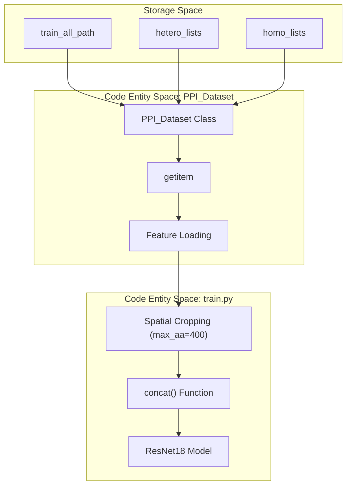
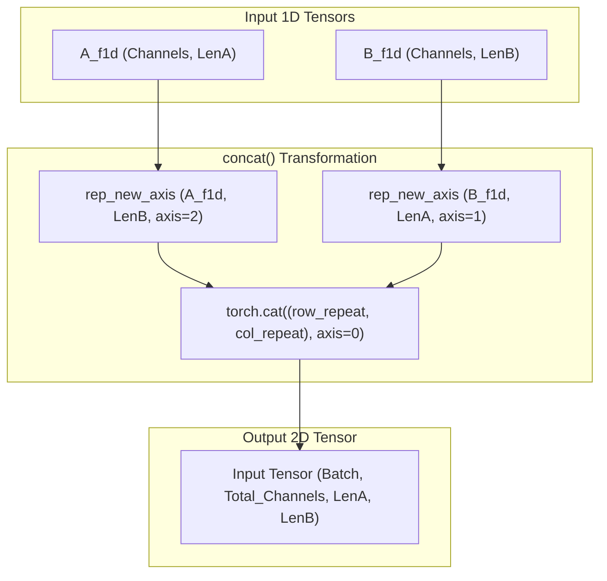

# Dataset and Data Loading

> **Relevant source files**
> * [data/HeteroPDB](https://github.com/ChengfeiYan/DRN-1D2D_Inter/blob/a54a43b8/data/HeteroPDB)
> * [data/HomoPDB](https://github.com/ChengfeiYan/DRN-1D2D_Inter/blob/a54a43b8/data/HomoPDB)
> * [data/README.md](https://github.com/ChengfeiYan/DRN-1D2D_Inter/blob/a54a43b8/data/README.md?plain=1)
> * [data/trainset](https://github.com/ChengfeiYan/DRN-1D2D_Inter/blob/a54a43b8/data/trainset)
> * [train.py](https://github.com/ChengfeiYan/DRN-1D2D_Inter/blob/a54a43b8/train.py)

The training and validation pipeline for DRN-1D2D_Inter relies on a structured data loading system designed to handle large-scale protein-protein interaction (PPI) features. The system utilizes a custom `PPI_Dataset` class to manage pre-computed 1D and 2D features, implements spatial cropping for memory efficiency, and employs a multi-threaded `DataLoader` for high-throughput training.

### Data Flow Overview

The following diagram illustrates the transition from the raw dataset files to the tensors consumed by the ResNet model during training.

**Training Data Pipeline**

**Sources:** [train.py L38-L72](https://github.com/ChengfeiYan/DRN-1D2D_Inter/blob/a54a43b8/train.py#L38-L72)

 [train.py L121-L146](https://github.com/ChengfeiYan/DRN-1D2D_Inter/blob/a54a43b8/train.py#L121-L146)

---

### Dataset Composition and Splitting

The training system utilizes a total of 7,362 dimers, categorized into homodimers and heterodimers [data/README.md L1](https://github.com/ChengfeiYan/DRN-1D2D_Inter/blob/a54a43b8/data/README.md?plain=1#L1-L1)

1. **Heterodimers**: Loaded from `hetero_path`. The first 500 entries are reserved for the validation set (`valid_list`), while the remainder (starting from index 500) form the training set (`train_list`) [train.py L40-L53](https://github.com/ChengfeiYan/DRN-1D2D_Inter/blob/a54a43b8/train.py#L40-L53)
2. **Homodimers**: Loaded from `homo_path` [train.py L39-L44](https://github.com/ChengfeiYan/DRN-1D2D_Inter/blob/a54a43b8/train.py#L39-L44)
3. **Global Feature Pool**: All feature files are stored in `train_all_path` [train.py L41](https://github.com/ChengfeiYan/DRN-1D2D_Inter/blob/a54a43b8/train.py#L41-L41)

The lists are shuffled using a fixed seed (`42`) to ensure reproducibility across training runs [train.py L37-L50](https://github.com/ChengfeiYan/DRN-1D2D_Inter/blob/a54a43b8/train.py#L37-L50)

**Sources:** [train.py L37-L53](https://github.com/ChengfeiYan/DRN-1D2D_Inter/blob/a54a43b8/train.py#L37-L53)

 [data/README.md L1-L9](https://github.com/ChengfeiYan/DRN-1D2D_Inter/blob/a54a43b8/data/README.md?plain=1#L1-L9)

---

### The PPI_Dataset Class

The `PPI_Dataset` class (imported from `ppi_dataloader.py`) is responsible for fetching the features for each protein pair. During each iteration, the dataset returns six key components:

| Component | Description |
| --- | --- |
| `_` | Identifier/Name of the protein pair. |
| `A_f1d` | 1D features for Chain A (PSSM, ESM-1b, MSA-1b). |
| `B_f1d` | 1D features for Chain B. |
| `p2d` | Pre-computed 2D features (CCMpred, alnstats, attention maps). |
| `mask_map` | Binary mask indicating valid residue positions. |
| `contact_map` | Ground truth inter-protein contact matrix. |

**Sources:** [train.py L19](https://github.com/ChengfeiYan/DRN-1D2D_Inter/blob/a54a43b8/train.py#L19-L19)

 [train.py L121](https://github.com/ChengfeiYan/DRN-1D2D_Inter/blob/a54a43b8/train.py#L121-L121)

---

### Spatial Cropping and Masking

To maintain a consistent memory footprint and handle proteins of varying lengths, the training loop applies a spatial cropping strategy:

* **Maximum Length**: The `max_aa` variable is set to 400 [train.py L63](https://github.com/ChengfeiYan/DRN-1D2D_Inter/blob/a54a43b8/train.py#L63-L63)
* **Random Cropping**: If the protein length exceeds `max_aa`, a random starting index (`starta`, `startb`) is generated [train.py L130-L132](https://github.com/ChengfeiYan/DRN-1D2D_Inter/blob/a54a43b8/train.py#L130-L132)
* **Tensor Slicing**: 1D features, 2D masks, and contact maps are sliced to the `max_aa` window [train.py L134-L138](https://github.com/ChengfeiYan/DRN-1D2D_Inter/blob/a54a43b8/train.py#L134-L138)

The `mask_map` is crucial for the loss calculation, ensuring that the `ppi_loss` function only considers valid residue interactions within the cropped window [train.py L147](https://github.com/ChengfeiYan/DRN-1D2D_Inter/blob/a54a43b8/train.py#L147-L147)

**Sources:** [train.py L63-L64](https://github.com/ChengfeiYan/DRN-1D2D_Inter/blob/a54a43b8/train.py#L63-L64)

 [train.py L130-L139](https://github.com/ChengfeiYan/DRN-1D2D_Inter/blob/a54a43b8/train.py#L130-L139)

 [train.py L147](https://github.com/ChengfeiYan/DRN-1D2D_Inter/blob/a54a43b8/train.py#L147-L147)

---

### DataLoader Configuration

The system uses `torch.utils.data.DataLoader` to parallelize data fetching. The configuration is optimized for high-speed I/O:

* **Parallelism**: `num_workers=6` allows multiple CPU processes to load data simultaneously [train.py L56-L61](https://github.com/ChengfeiYan/DRN-1D2D_Inter/blob/a54a43b8/train.py#L56-L61)
* **Prefetching**: `prefetch_factor=3` ensures that each worker prepares 3 batches in advance [train.py L56-L61](https://github.com/ChengfeiYan/DRN-1D2D_Inter/blob/a54a43b8/train.py#L56-L61)
* **Persistence**: `persistent_workers=True` keeps the worker processes alive between epochs, reducing overhead [train.py L57-L61](https://github.com/ChengfeiYan/DRN-1D2D_Inter/blob/a54a43b8/train.py#L57-L61)
* **Batching**: `batch_size=None` is used, implying the dataset or a custom sampler handles the batching logic [train.py L57-L61](https://github.com/ChengfeiYan/DRN-1D2D_Inter/blob/a54a43b8/train.py#L57-L61)

**Sources:** [train.py L55-L62](https://github.com/ChengfeiYan/DRN-1D2D_Inter/blob/a54a43b8/train.py#L55-L62)

---

### Feature Concatenation (1D to 2D)

Before being passed to the `resnet18` model, 1D features from both chains must be expanded into the 2D interaction space. This is handled by the `concat()` function.

**Logic Associating 1D Tensors to 2D Grid**

The `concat` function performs the following steps:

1. Expands `A_f1d` along the second axis to match the length of Chain B [train.py L31](https://github.com/ChengfeiYan/DRN-1D2D_Inter/blob/a54a43b8/train.py#L31-L31)
2. Expands `B_f1d` along the first axis to match the length of Chain A [train.py L32](https://github.com/ChengfeiYan/DRN-1D2D_Inter/blob/a54a43b8/train.py#L32-L32)
3. Concatenates these expanded tensors along the channel dimension [train.py L34](https://github.com/ChengfeiYan/DRN-1D2D_Inter/blob/a54a43b8/train.py#L34-L34)

**Sources:** [train.py L23-L35](https://github.com/ChengfeiYan/DRN-1D2D_Inter/blob/a54a43b8/train.py#L23-L35)

 [train.py L141](https://github.com/ChengfeiYan/DRN-1D2D_Inter/blob/a54a43b8/train.py#L141-L141)