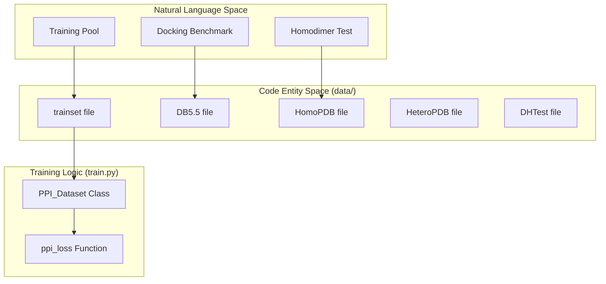
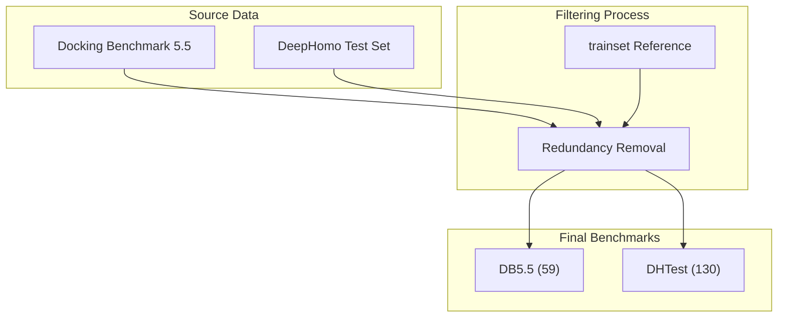

# Datasets and Benchmarks

> **Relevant source files**
> * [data/DB5.5](https://github.com/ChengfeiYan/DRN-1D2D_Inter/blob/a54a43b8/data/DB5.5)
> * [data/DHTest](https://github.com/ChengfeiYan/DRN-1D2D_Inter/blob/a54a43b8/data/DHTest)
> * [data/HeteroPDB](https://github.com/ChengfeiYan/DRN-1D2D_Inter/blob/a54a43b8/data/HeteroPDB)
> * [data/HomoPDB](https://github.com/ChengfeiYan/DRN-1D2D_Inter/blob/a54a43b8/data/HomoPDB)
> * [data/README.md](https://github.com/ChengfeiYan/DRN-1D2D_Inter/blob/a54a43b8/data/README.md?plain=1)
> * [data/trainset](https://github.com/ChengfeiYan/DRN-1D2D_Inter/blob/a54a43b8/data/trainset)

The DRN-1D2D_Inter framework utilizes a diverse collection of protein-protein interaction (PPI) data for training the Dimensional Hybrid Residual Network and evaluating its performance across different biological contexts. The datasets are categorized into a large-scale training set and four distinct benchmark sets designed to test the model's generalization to homodimers, heterodimers, and docking benchmarks.

### Dataset Overview

The following table summarizes the datasets used in the project:

| Dataset Name | Type | Size (Dimers) | Description |
| --- | --- | --- | --- |
| **trainset** | Train/Val | 7,362 | Primary pool for model development. |
| **HomoPDB** | Test | 400 | Homodimeric complexes. |
| **HeteroPDB** | Test | 200 | Heterodimeric complexes. |
| **DB5.5** | Test | 59 | Redundancy-reduced set from Docking Benchmark 5.5. |
| **DHTest** | Test | 130 | Redundancy-reduced set from DeepHomo benchmark. |

Sources: `data/README.md:1-10`

---

### 5.1 Training Set

The training infrastructure relies on a set of 7,362 dimers. During the training phase, this set is partitioned into training and validation subsets to monitor convergence and prevent overfitting.

* **Composition:** Includes both homodimers and heterodimers to ensure the network learns generalized inter-chain contact features.
* **Data Loading:** The `PPI_Dataset` class in `train.py` handles the ingestion of these dimers, applying spatial cropping (max 400 residues) and generating the `mask_map` used in loss calculation.

For details on the partitioning and data loading implementation, see [Training Set](/ChengfeiYan/DRN-1D2D_Inter/5.1-training-set).

Sources: `data/README.md:1`, `data/trainset:1-421`

---

### 5.2 Benchmark Test Sets

To rigorously evaluate the model, four benchmark sets are provided. A critical aspect of these benchmarks is **redundancy control**: samples that were highly similar to the training set were removed to ensure the evaluation reflects the model's ability to generalize to novel interfaces.

#### Redundancy-Reduced Benchmarks

* **DB5.5 (59 dimers):** Derived from the standard Docking Benchmark 5.5. Redundancy was removed relative to the 7,362 training dimers to ensure fair testing.
* **DHTest (130 dimers):** Derived from the DeepHomo test set, similarly filtered against the training set.

#### Standard Benchmarks

* **HomoPDB (400 dimers):** Focused specifically on symmetric interactions within homodimers.
* **HeteroPDB (200 dimers):** Focused on asymmetric interactions between different protein chains.

For details on the specific PDB IDs included and the redundancy removal methodology, see [Benchmark Test Sets](/ChengfeiYan/DRN-1D2D_Inter/5.2-benchmark-test-sets).

Sources: `data/README.md:3-9`, `data/DB5.5:1-60`, `data/DHTest:1-131`, `data/HeteroPDB:1-201`, `data/HomoPDB:1-401`

---

### Data Entity Mapping

The following diagram bridges the biological dataset concepts to the specific files and data structures used within the `DRN-1D2D_Inter` codebase.

**Dataset to Code Entity Mapping**

Sources: `data/README.md:1-10`, `train.py:1-50`

**Redundancy Control Workflow**

Sources: `data/README.md:7-9`