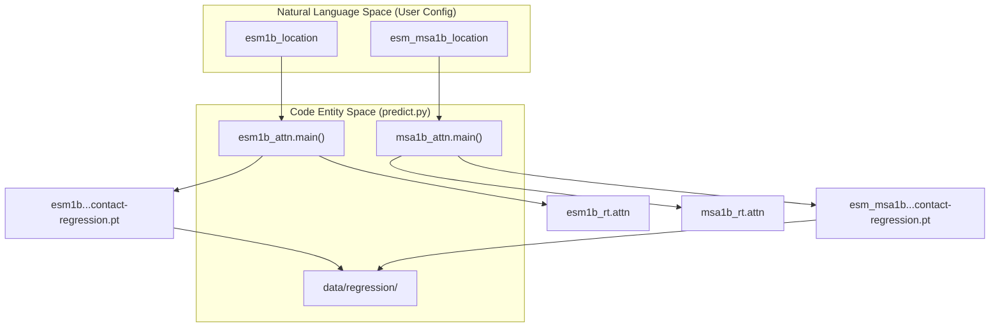
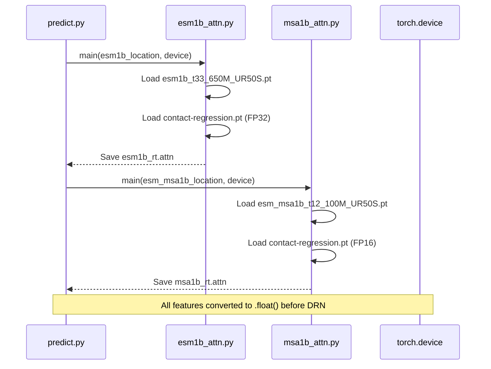

# ESM Model Weights and Contact Regression

> **Relevant source files**
> * [data/regression/esm1b_t33_650M_UR50S-contact-regression.pt](https://github.com/ChengfeiYan/DRN-1D2D_Inter/blob/a54a43b8/data/regression/esm1b_t33_650M_UR50S-contact-regression.pt)
> * [data/regression/esm_msa1b_t12_100M_UR50S-contact-regression.pt](https://github.com/ChengfeiYan/DRN-1D2D_Inter/blob/a54a43b8/data/regression/esm_msa1b_t12_100M_UR50S-contact-regression.pt)
> * [predict.py](https://github.com/ChengfeiYan/DRN-1D2D_Inter/blob/a54a43b8/predict.py)

This section details the configuration and utilization of Evolutionary Scale Modeling (ESM) weights and their corresponding contact regression heads within the DRN-1D2D_Inter pipeline. The system leverages pre-trained Protein Language Models (PLMs) to extract evolutionary and structural information, which is then refined via specialized regression layers before being fed into the residual network.

## ESM Model Weights

The pipeline utilizes two primary ESM models developed by Meta AI. These models must be manually downloaded and their paths configured in the inference scripts.

### Supported Models

1. **ESM-1b (`esm1b_t33_650M_UR50S.pt`)**: A 33-layer transformer model with 650 million parameters trained on the UR50/S dataset. It provides high-resolution per-residue representations and attention maps [predict.py L30](https://github.com/ChengfeiYan/DRN-1D2D_Inter/blob/a54a43b8/predict.py#L30-L30)
2. **ESM-MSA-1b (`esm_msa1b_t12_100M_UR50S.pt`)**: A 12-layer MSA-based transformer model with 100 million parameters. It processes Multiple Sequence Alignments (MSAs) to capture co-evolutionary signals [predict.py L31](https://github.com/ChengfeiYan/DRN-1D2D_Inter/blob/a54a43b8/predict.py#L31-L31)

### Configuration in predict.py

The paths to these weight files are hardcoded as global variables at the beginning of the prediction script:

* `esm1b_location`: Path to the ESM-1b `.pt` file [predict.py L30](https://github.com/ChengfeiYan/DRN-1D2D_Inter/blob/a54a43b8/predict.py#L30-L30)
* `esm_msa1b_location`: Path to the ESM-MSA-1b `.pt` file [predict.py L31](https://github.com/ChengfeiYan/DRN-1D2D_Inter/blob/a54a43b8/predict.py#L31-L31)

**Sources:** [predict.py L30-L31](https://github.com/ChengfeiYan/DRN-1D2D_Inter/blob/a54a43b8/predict.py#L30-L31)

---

## Contact Regression Heads

The contact regression heads are specialized linear layers trained to map the high-dimensional internal attention maps of ESM models to contact probabilities. These are stored in the `data/regression/` directory.

### Weight Files and Precision

The pipeline uses two specific regression head files, which differ in their internal data precision and storage format:

| File Name | Associated Model | Precision | Storage Type |
| --- | --- | --- | --- |
| `esm1b_t33_650M_UR50S-contact-regression.pt` | ESM-1b | **FP32** (Float32) | `FloatStorage` [data/regression/esm1b_t33_650M_UR50S-contact-regression.pt L6-L7](https://github.com/ChengfeiYan/DRN-1D2D_Inter/blob/a54a43b8/data/regression/esm1b_t33_650M_UR50S-contact-regression.pt#L6-L7) |
| `esm_msa1b_t12_100M_UR50S-contact-regression.pt` | ESM-MSA-1b | **FP16** (Half) | `HalfStorage` [data/regression/esm_msa1b_t12_100M_UR50S-contact-regression.pt L4-L5](https://github.com/ChengfeiYan/DRN-1D2D_Inter/blob/a54a43b8/data/regression/esm_msa1b_t12_100M_UR50S-contact-regression.pt#L4-L5) |

### Data Flow: Attention to Regression

The following diagram illustrates how the `predict.py` script orchestrates the flow from ESM weights to regression outputs.

**ESM Feature Extraction Flow**

**Sources:** [predict.py L97-L108](https://github.com/ChengfeiYan/DRN-1D2D_Inter/blob/a54a43b8/predict.py#L97-L108)

 [data/regression/esm1b_t33_650M_UR50S-contact-regression.pt L1-L7](https://github.com/ChengfeiYan/DRN-1D2D_Inter/blob/a54a43b8/data/regression/esm1b_t33_650M_UR50S-contact-regression.pt#L1-L7)

 [data/regression/esm_msa1b_t12_100M_UR50S-contact-regression.pt L1-L5](https://github.com/ChengfeiYan/DRN-1D2D_Inter/blob/a54a43b8/data/regression/esm_msa1b_t12_100M_UR50S-contact-regression.pt#L1-L5)

---

## Device Affinity and Precision Handling

The models and regression heads are sensitive to the `torch.device` specified during runtime.

### GPU/CPU Mapping

* **Device Selection**: The device is passed as a command-line argument and initialized via `torch.device(device)` [predict.py L37-L38](https://github.com/ChengfeiYan/DRN-1D2D_Inter/blob/a54a43b8/predict.py#L37-L38)
* **Weight Loading**: When loading weights, the `map_location` parameter is used to ensure tensors are placed on the correct hardware (e.g., `cuda:0` or `cpu`) [predict.py L167](https://github.com/ChengfeiYan/DRN-1D2D_Inter/blob/a54a43b8/predict.py#L167-L167)
* **Precision Conversion**: Input features are explicitly converted to `float()` (FP32) before being passed to the DRN model to ensure compatibility across different feature sources [predict.py L148-L151](https://github.com/ChengfeiYan/DRN-1D2D_Inter/blob/a54a43b8/predict.py#L148-L151)

### Implementation Detail: Regression Head Structure

The regression files contain `OrderedDict` objects containing the weights and biases for the `contact_head.regression` module:

* `contact_head.regression.weight` [data/regression/esm1b_t33_650M_UR50S-contact-regression.pt L3](https://github.com/ChengfeiYan/DRN-1D2D_Inter/blob/a54a43b8/data/regression/esm1b_t33_650M_UR50S-contact-regression.pt#L3-L3)
* `contact_head.regression.bias` [data/regression/esm1b_t33_650M_UR50S-contact-regression.pt L10](https://github.com/ChengfeiYan/DRN-1D2D_Inter/blob/a54a43b8/data/regression/esm1b_t33_650M_UR50S-contact-regression.pt#L10-L10)

**Sources:** [predict.py L37-L38](https://github.com/ChengfeiYan/DRN-1D2D_Inter/blob/a54a43b8/predict.py#L37-L38)

 [predict.py L148-L151](https://github.com/ChengfeiYan/DRN-1D2D_Inter/blob/a54a43b8/predict.py#L148-L151)

 [predict.py L167](https://github.com/ChengfeiYan/DRN-1D2D_Inter/blob/a54a43b8/predict.py#L167-L167)

 [data/regression/esm1b_t33_650M_UR50S-contact-regression.pt L3-L10](https://github.com/ChengfeiYan/DRN-1D2D_Inter/blob/a54a43b8/data/regression/esm1b_t33_650M_UR50S-contact-regression.pt#L3-L10)

---

## Integration in Inference Pipeline

The ESM weights and regression heads are invoked during the feature preparation stage of the `predict.py` script.

### Sequence of Operations

1. **ESM-1b Attention**: `esm1b_attn.main` uses the ESM-1b weights and the sequence to generate attention-based contact features [predict.py L99-L100](https://github.com/ChengfeiYan/DRN-1D2D_Inter/blob/a54a43b8/predict.py#L99-L100)
2. **ESM-MSA-1b Attention**: `msa1b_attn.main` uses the ESM-MSA-1b weights and the filtered paired MSA to generate evolutionary attention features [predict.py L107-L108](https://github.com/ChengfeiYan/DRN-1D2D_Inter/blob/a54a43b8/predict.py#L107-L108)
3. **Representation Extraction**: `esm1b_repr.main` and `msa1b_repr.main` extract per-residue 1D embeddings [predict.py L130-L140](https://github.com/ChengfeiYan/DRN-1D2D_Inter/blob/a54a43b8/predict.py#L130-L140)

**Feature Orchestration Diagram**

**Sources:** [predict.py L96-L109](https://github.com/ChengfeiYan/DRN-1D2D_Inter/blob/a54a43b8/predict.py#L96-L109)

 [predict.py L126-L141](https://github.com/ChengfeiYan/DRN-1D2D_Inter/blob/a54a43b8/predict.py#L126-L141)

 [predict.py L148-L151](https://github.com/ChengfeiYan/DRN-1D2D_Inter/blob/a54a43b8/predict.py#L148-L151)