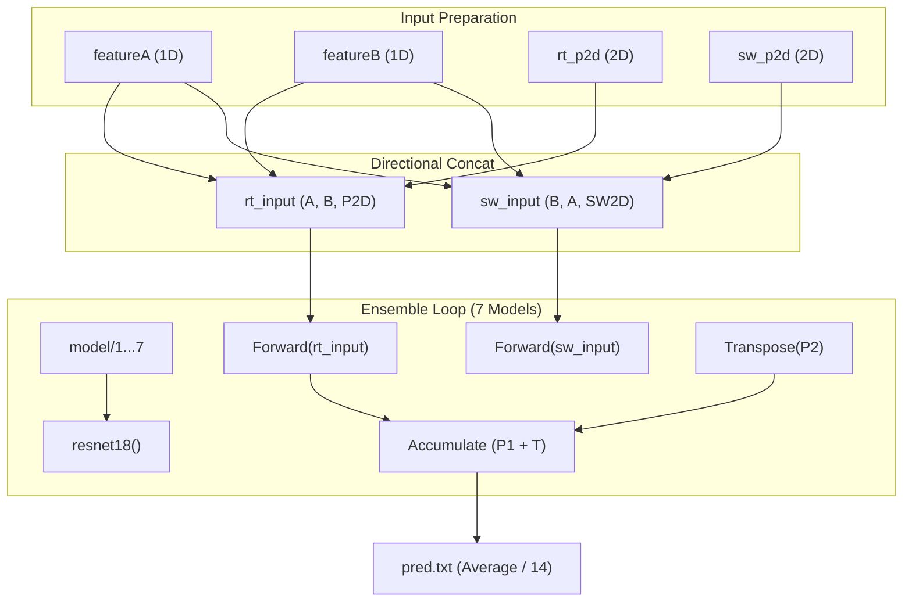
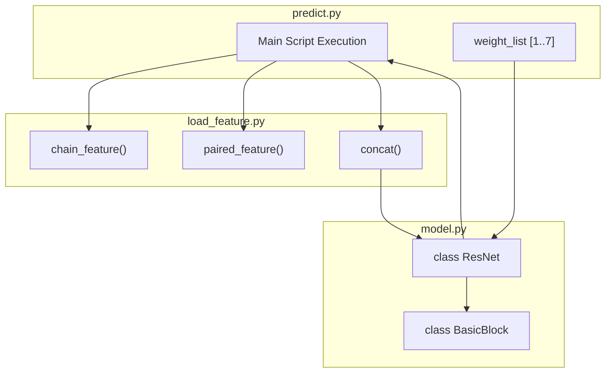

# Ensemble Inference and Output

> **Relevant source files**
> * [load_feature.py](https://github.com/ChengfeiYan/DRN-1D2D_Inter/blob/a54a43b8/load_feature.py)
> * [model.py](https://github.com/ChengfeiYan/DRN-1D2D_Inter/blob/a54a43b8/model.py)
> * [predict.py](https://github.com/ChengfeiYan/DRN-1D2D_Inter/blob/a54a43b8/predict.py)

The final stage of the DRN-1D2D_Inter pipeline performs ensemble inference using seven pre-trained ResNet models. To ensure robust predictions, the system processes input features in two orientations (Chain A $\rightarrow$ Chain B and Chain B $\rightarrow$ Chain A), performs symmetry averaging, and aggregates the results into a final contact probability map.

## Ensemble Workflow

The inference process in `predict.py` orchestrates the loading of model weights, the preparation of directional inputs, and the final output generation.

### 1. Model Initialization and Weight Loading

The system utilizes a Dimensional Hybrid Residual Network defined in `model.py` [model.py L154-L180](https://github.com/ChengfeiYan/DRN-1D2D_Inter/blob/a54a43b8/model.py#L154-L180)

 The ensemble consists of 7 distinct weight files stored in the `model/` directory [predict.py L159](https://github.com/ChengfeiYan/DRN-1D2D_Inter/blob/a54a43b8/predict.py#L159-L159)

### 2. Directional Input Processing

To account for the interaction from both protein perspectives, the system creates two input tensors:

* **`rt_input` (Root)**: Formed by concatenating Chain A features, Chain B features, and the standard 2D features [predict.py L153](https://github.com/ChengfeiYan/DRN-1D2D_Inter/blob/a54a43b8/predict.py#L153-L153)
* **`sw_input` (Swap)**: Formed by concatenating Chain B features, Chain A features, and the transposed (swapped) 2D features [predict.py L154](https://github.com/ChengfeiYan/DRN-1D2D_Inter/blob/a54a43b8/predict.py#L154-L154)

The `load_feature.concat` function handles the expansion of 1D features into the 2D grid by repeating row and column vectors [load_feature.py L16-L27](https://github.com/ChengfeiYan/DRN-1D2D_Inter/blob/a54a43b8/load_feature.py#L16-L27)

### 3. Symmetry Averaging and Aggregation

For each of the 7 models, two forward passes are performed. The prediction from the `sw_input` is transposed back to the original orientation (`preds2.T`) before being added to the running sum [predict.py L173-L174](https://github.com/ChengfeiYan/DRN-1D2D_Inter/blob/a54a43b8/predict.py#L173-L174)

 This ensures that the final prediction is symmetric relative to the input order of the proteins.

### Inference Data Flow

The following diagram illustrates the flow from concatenated features to the final ensemble output.

**Figure 1: Ensemble Prediction Logic**

**Sources:** [predict.py L145-L177](https://github.com/ChengfeiYan/DRN-1D2D_Inter/blob/a54a43b8/predict.py#L145-L177)

 [load_feature.py L16-L27](https://github.com/ChengfeiYan/DRN-1D2D_Inter/blob/a54a43b8/load_feature.py#L16-L27)

 [load_feature.py L92-L102](https://github.com/ChengfeiYan/DRN-1D2D_Inter/blob/a54a43b8/load_feature.py#L92-L102)

---

## Implementation Details

### Directional Feature Loading

The `paired_feature` function in `load_feature.py` prepares both the root and swapped 2D features. The swapped features (`sw_feature_2d`) are generated by applying `swapaxes(-2, -1)` to the CCMpred and alnstats matrices, while the ESM and MSA attention maps are loaded from their respective "sw" (swap) files generated during the PLM extraction phase [load_feature.py L96-L100](https://github.com/ChengfeiYan/DRN-1D2D_Inter/blob/a54a43b8/load_feature.py#L96-L100)

### Mathematical Aggregation

The final probability matrix is calculated as:
$$P_{final} = \frac{1}{14} \sum_{i=1}^{7} (Model_i(Input_{A \rightarrow B}) + Model_i(Input_{B \rightarrow A})^T)$$
This division by 14 (7 models $\times$ 2 orientations) occurs just before saving the text file [predict.py L177](https://github.com/ChengfeiYan/DRN-1D2D_Inter/blob/a54a43b8/predict.py#L177-L177)

### Code Entity Mapping

This diagram maps the logical inference steps to the specific functions and classes in the codebase.

**Figure 2: Inference System Architecture**

**Sources:** [predict.py L159-L160](https://github.com/ChengfeiYan/DRN-1D2D_Inter/blob/a54a43b8/predict.py#L159-L160)

 [load_feature.py L42](https://github.com/ChengfeiYan/DRN-1D2D_Inter/blob/a54a43b8/load_feature.py#L42-L42)

 [load_feature.py L61](https://github.com/ChengfeiYan/DRN-1D2D_Inter/blob/a54a43b8/load_feature.py#L61-L61)

 [model.py L78](https://github.com/ChengfeiYan/DRN-1D2D_Inter/blob/a54a43b8/model.py#L78-L78)

 [model.py L154](https://github.com/ChengfeiYan/DRN-1D2D_Inter/blob/a54a43b8/model.py#L154-L154)

---

## Output Format

The final result is saved as `pred.txt` in the specified `result_path` [predict.py L177](https://github.com/ChengfeiYan/DRN-1D2D_Inter/blob/a54a43b8/predict.py#L177-L177)

| Feature | Detail |
| --- | --- |
| **File Name** | `pred.txt` |
| **Format** | Space-delimited ASCII matrix |
| **Dimensions** | $L_A \times L_B$ |
| **Values** | Floats in range $[0, 1]$ representing contact probability |

**Sources:** [predict.py L176-L177](https://github.com/ChengfeiYan/DRN-1D2D_Inter/blob/a54a43b8/predict.py#L176-L177)

## Summary of Operations

1. **Load 1D Features**: PSSM, ESM-1b representations, and MSA-1b representations for both chains [load_feature.py L42-L58](https://github.com/ChengfeiYan/DRN-1D2D_Inter/blob/a54a43b8/load_feature.py#L42-L58)
2. **Load 2D Features**: CCMpred, alnstats, and attention maps for both orientations [load_feature.py L61-L102](https://github.com/ChengfeiYan/DRN-1D2D_Inter/blob/a54a43b8/load_feature.py#L61-L102)
3. **Construct Tensors**: Use `concat()` to create 4944-channel input tensors [predict.py L153-L154](https://github.com/ChengfeiYan/DRN-1D2D_Inter/blob/a54a43b8/predict.py#L153-L154)
4. **Ensemble Inference**: Iterate through 7 model weights, accumulating predictions for both `rt_input` and the transpose of `sw_input` [predict.py L166-L175](https://github.com/ChengfeiYan/DRN-1D2D_Inter/blob/a54a43b8/predict.py#L166-L175)
5. **Normalize and Save**: Divide the accumulated sum by 14 and save as a text matrix [predict.py L176-L177](https://github.com/ChengfeiYan/DRN-1D2D_Inter/blob/a54a43b8/predict.py#L176-L177)

**Sources:** [predict.py L145-L177](https://github.com/ChengfeiYan/DRN-1D2D_Inter/blob/a54a43b8/predict.py#L145-L177)

 [load_feature.py L1-L102](https://github.com/ChengfeiYan/DRN-1D2D_Inter/blob/a54a43b8/load_feature.py#L1-L102)

 [model.py L154-L180](https://github.com/ChengfeiYan/DRN-1D2D_Inter/blob/a54a43b8/model.py#L154-L180)