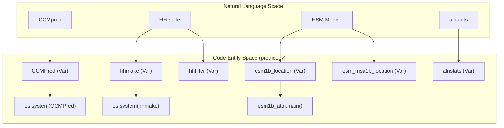
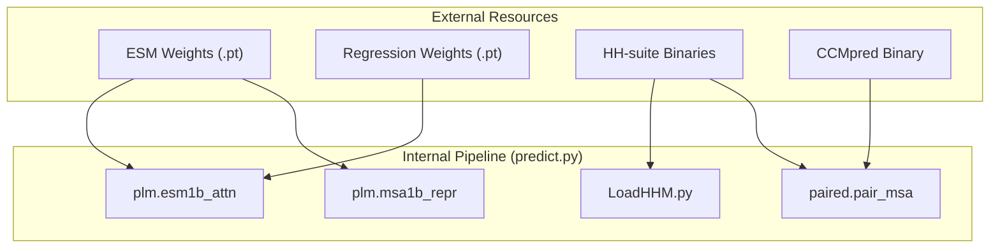

# External Tool Dependencies

> **Relevant source files**
> * [LICENSE](https://github.com/ChengfeiYan/DRN-1D2D_Inter/blob/a54a43b8/LICENSE)
> * [README.md](https://github.com/ChengfeiYan/DRN-1D2D_Inter/blob/a54a43b8/README.md?plain=1)
> * [data/regression/esm1b_t33_650M_UR50S-contact-regression.pt](https://github.com/ChengfeiYan/DRN-1D2D_Inter/blob/a54a43b8/data/regression/esm1b_t33_650M_UR50S-contact-regression.pt)
> * [data/regression/esm_msa1b_t12_100M_UR50S-contact-regression.pt](https://github.com/ChengfeiYan/DRN-1D2D_Inter/blob/a54a43b8/data/regression/esm_msa1b_t12_100M_UR50S-contact-regression.pt)
> * [predict.py](https://github.com/ChengfeiYan/DRN-1D2D_Inter/blob/a54a43b8/predict.py)

The DRN-1D2D_Inter pipeline relies on a suite of external bioinformatics tools and pre-trained protein language model (PLM) weights to generate the high-dimensional features required for inter-protein contact prediction. These dependencies must be manually configured in the environment and linked within the main inference script.

### Configuration Overview

All external binary paths and model weight locations are hardcoded as global variables at the beginning of the inference entry point. Users must modify these variables to match their local installation paths before running predictions.

| Variable Name | Tool / Resource | Default Path in Code |
| --- | --- | --- |
| `CCMPred` | Evolutionary coupling analysis | `/home/yunda_si/self/software_p/CCMpred_pad/bin/ccmpred` |
| `reformat` | `fasta2aln` utility | `/home/Common_softwares/DeepMSA/bin/fasta2aln` |
| `alnstats` | MSA statistics tool | `/home/yunda_si/self/software_p/metapsicov-2.0.3/bin/alnstats` |
| `hhmake` | HH-suite HMM generator | `/home/yunda_si/self/software_p/hh-suite/build/bin/hhmake` |
| `hhfilter` | HH-suite MSA filter | `/home/Common_softwares/hh-suite/build/bin/hhfilter` |
| `esm1b_location` | ESM-1b model weights | `.../esm1b_t33_650M_UR50S.pt` |
| `esm_msa1b_location` | ESM-MSA-1b model weights | `.../esm_msa1b_t12_100M_UR50S.pt` |

**Sources:** [predict.py L22-L31](https://github.com/ChengfeiYan/DRN-1D2D_Inter/blob/a54a43b8/predict.py#L22-L31)

---

### External Tool and Weight Mapping

The following diagram maps the high-level tool names used in the documentation to the specific variables and execution sites within the codebase.

**Tool to Code Entity Mapping**

**Sources:** [predict.py L24-L31](https://github.com/ChengfeiYan/DRN-1D2D_Inter/blob/a54a43b8/predict.py#L24-L31)

 [predict.py L88-L100](https://github.com/ChengfeiYan/DRN-1D2D_Inter/blob/a54a43b8/predict.py#L88-L100)

 [predict.py L120-L123](https://github.com/ChengfeiYan/DRN-1D2D_Inter/blob/a54a43b8/predict.py#L120-L123)

---

### 6.1 ESM Model Weights and Contact Regression

The pipeline utilizes two primary protein language models from Facebook Research: **ESM-1b** and **ESM-MSA-1b**. In addition to the standard model weights, the pipeline requires specific contact regression heads provided in the `data/regression/` directory of this repository. These regression files must be co-located with the main model weights for the extraction scripts to function correctly.

For details on file naming, precision (FP16 vs FP32), and regression head placement, see [ESM Model Weights and Contact Regression](/ChengfeiYan/DRN-1D2D_Inter/6.1-esm-model-weights-and-contact-regression).

**Sources:** [README.md L11](https://github.com/ChengfeiYan/DRN-1D2D_Inter/blob/a54a43b8/README.md?plain=1#L11-L11)

 [README.md L22](https://github.com/ChengfeiYan/DRN-1D2D_Inter/blob/a54a43b8/README.md?plain=1#L22-L22)

 [predict.py L30-L31](https://github.com/ChengfeiYan/DRN-1D2D_Inter/blob/a54a43b8/predict.py#L30-L31)

### 6.2 Bioinformatics Tool Dependencies

The inference process orchestrates several binary tools to process Multiple Sequence Alignments (MSAs). This includes:

* **CCMpred**: Used for calculating evolutionary couplings from the paired MSA.
* **HH-suite**: `hhmake` generates HMM profiles for PSSM features, and `hhfilter` prepares MSAs for PLM processing.
* **alnstats**: Extracts 2D statistics from alignments.
* **fasta2aln**: Reformats A3M files into ALN format for CCMpred.

For details on installation, required versions, and how these tools are invoked via `os.system` calls, see [Bioinformatics Tool Dependencies](/ChengfeiYan/DRN-1D2D_Inter/6.2-bioinformatics-tool-dependencies).

**Sources:** [README.md L12-L16](https://github.com/ChengfeiYan/DRN-1D2D_Inter/blob/a54a43b8/README.md?plain=1#L12-L16)

 [predict.py L62-L92](https://github.com/ChengfeiYan/DRN-1D2D_Inter/blob/a54a43b8/predict.py#L62-L92)

---

### Dependency Flow Diagram

This diagram illustrates how external resources are consumed by the internal modules defined in the `plm/` and `paired/` directories.

**Resource Consumption Pipeline**

**Sources:** [predict.py L11-L15](https://github.com/ChengfeiYan/DRN-1D2D_Inter/blob/a54a43b8/predict.py#L11-L15)

 [predict.py L29-L31](https://github.com/ChengfeiYan/DRN-1D2D_Inter/blob/a54a43b8/predict.py#L29-L31)

 [predict.py L99-L108](https://github.com/ChengfeiYan/DRN-1D2D_Inter/blob/a54a43b8/predict.py#L99-L108)

 [predict.py L121-L123](https://github.com/ChengfeiYan/DRN-1D2D_Inter/blob/a54a43b8/predict.py#L121-L123)