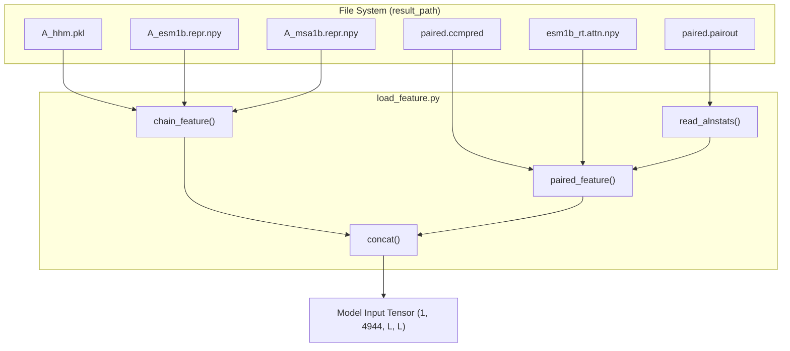
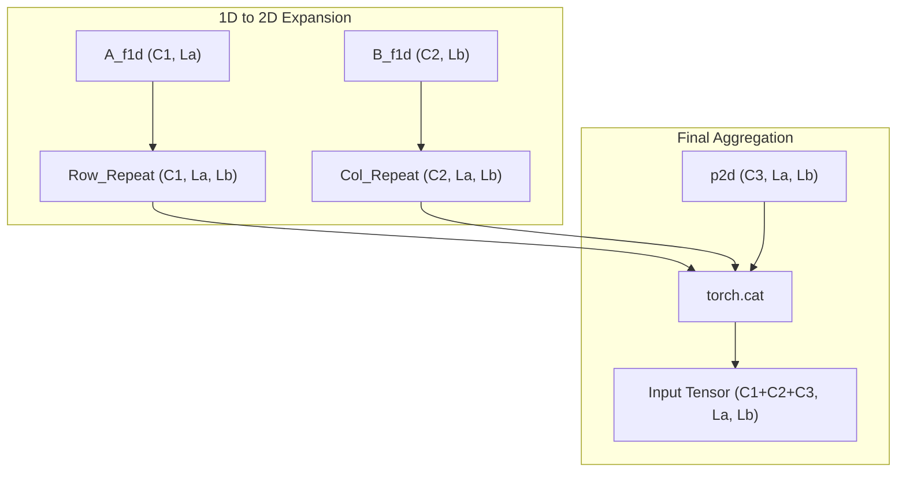

# Feature Loading and Concatenation

> **Relevant source files**
> * [load_feature.py](https://github.com/ChengfeiYan/DRN-1D2D_Inter/blob/a54a43b8/load_feature.py)
> * [model.py](https://github.com/ChengfeiYan/DRN-1D2D_Inter/blob/a54a43b8/model.py)

This section documents the feature engineering and aggregation logic implemented in `load_feature.py`. The pipeline is responsible for loading 1D residue-level features and 2D pair-level features, then transforming them into a unified 2D grid format required by the Dimensional Hybrid Residual Network (DRN).

### Feature Aggregation Workflow

The system processes features through three primary functions:

1. `chain_feature()`: Aggregates 1D features (PSSM and PLM representations) for each protein chain.
2. `paired_feature()`: Loads 2D evolutionary couplings and attention maps.
3. `concat()`: Projects 1D features into 2D space and merges them with existing 2D features.

#### Code Entity Map: Feature Loading

The following diagram illustrates how raw files are processed by specific functions to generate tensors for the model.

**Sources:** [load_feature.py L16-L27](https://github.com/ChengfeiYan/DRN-1D2D_Inter/blob/a54a43b8/load_feature.py#L16-L27)

 [load_feature.py L42-L58](https://github.com/ChengfeiYan/DRN-1D2D_Inter/blob/a54a43b8/load_feature.py#L42-L58)

 [load_feature.py L61-L102](https://github.com/ChengfeiYan/DRN-1D2D_Inter/blob/a54a43b8/load_feature.py#L61-L102)

---

### 1D Feature Loading (chain_feature)

The `chain_feature()` function iterates through both protein chains ('A' and 'B') to build a per-residue feature vector. It horizontally stacks three types of information:

* **PSSM**: Loaded from `.pkl` files generated by HH-suite [load_feature.py L50](https://github.com/ChengfeiYan/DRN-1D2D_Inter/blob/a54a43b8/load_feature.py#L50-L50)
* **ESM-1b Representations**: 1280-dimensional embeddings from the `esm1b_repr.py` stage [load_feature.py L51](https://github.com/ChengfeiYan/DRN-1D2D_Inter/blob/a54a43b8/load_feature.py#L51-L51)
* **MSA-1b Representations**: 768-dimensional embeddings from the `msa1b_repr.py` stage [load_feature.py L52](https://github.com/ChengfeiYan/DRN-1D2D_Inter/blob/a54a43b8/load_feature.py#L52-L52)

These are concatenated using `np.hstack` and transposed to a `(Channel, Length)` format [load_feature.py L54-L56](https://github.com/ChengfeiYan/DRN-1D2D_Inter/blob/a54a43b8/load_feature.py#L54-L56)

**Sources:** [load_feature.py L42-L58](https://github.com/ChengfeiYan/DRN-1D2D_Inter/blob/a54a43b8/load_feature.py#L42-L58)

---

### 2D Feature Loading (paired_feature)

The `paired_feature()` function prepares the interaction-specific features. Because the model predicts inter-protein contacts, it handles two orientations: **rt** (Root: Chain A $\rightarrow$ Chain B) and **sw** (Swap: Chain B $\rightarrow$ Chain A).

| Feature Type | Source File | Description |
| --- | --- | --- |
| **CCMpred** | `paired.ccmpred` | Evolutionary coupling scores [load_feature.py L79](https://github.com/ChengfeiYan/DRN-1D2D_Inter/blob/a54a43b8/load_feature.py#L79-L79) |
| **Alnstats** | `paired.pairout` | Alignment statistics (3 channels) processed via `read_alnstats()` [load_feature.py L81](https://github.com/ChengfeiYan/DRN-1D2D_Inter/blob/a54a43b8/load_feature.py#L81-L81) |
| **ESM-1b Attention** | `esm1b_rt.attn.npy` | Multi-head attention maps reshaped to `(Layers * Heads, La, Lb)` [load_feature.py L71-L73](https://github.com/ChengfeiYan/DRN-1D2D_Inter/blob/a54a43b8/load_feature.py#L71-L73) |
| **MSA-1b Attention** | `msa1b_rt.attn.npy` | Multi-head attention maps reshaped to `(Layers * Heads, La, Lb)` [load_feature.py L75-L77](https://github.com/ChengfeiYan/DRN-1D2D_Inter/blob/a54a43b8/load_feature.py#L75-L77) |

For the `sw_feature_2d` (Swap orientation), the code applies `swapaxes(-2, -1)` to the CCMpred and alnstats matrices to maintain spatial consistency with the B $\rightarrow$ A orientation [load_feature.py L96-L100](https://github.com/ChengfeiYan/DRN-1D2D_Inter/blob/a54a43b8/load_feature.py#L96-L100)

**Sources:** [load_feature.py L61-L102](https://github.com/ChengfeiYan/DRN-1D2D_Inter/blob/a54a43b8/load_feature.py#L61-L102)

 [load_feature.py L31-L38](https://github.com/ChengfeiYan/DRN-1D2D_Inter/blob/a54a43b8/load_feature.py#L31-L38)

---

### Dimensional Expansion and Concatenation (concat)

The `concat()` function is the final step before model inference. It transforms 1D features into a 2D grid that represents all possible residue pairs between Chain A and Chain B.

#### Implementation Logic

To convert 1D vectors into a 2D matrix:

1. **Row Expansion**: Chain A's features are unsqueezed and repeated along the column axis for the length of Chain B [load_feature.py L24](https://github.com/ChengfeiYan/DRN-1D2D_Inter/blob/a54a43b8/load_feature.py#L24-L24)
2. **Column Expansion**: Chain B's features are unsqueezed and repeated along the row axis for the length of Chain A [load_feature.py L25](https://github.com/ChengfeiYan/DRN-1D2D_Inter/blob/a54a43b8/load_feature.py#L25-L25)
3. **Depth Concatenation**: The expanded Chain A features, expanded Chain B features, and the existing 2D features (`p2d`) are stacked along the channel dimension [load_feature.py L27](https://github.com/ChengfeiYan/DRN-1D2D_Inter/blob/a54a43b8/load_feature.py#L27-L27)

**Sources:** [load_feature.py L16-L27](https://github.com/ChengfeiYan/DRN-1D2D_Inter/blob/a54a43b8/load_feature.py#L16-L27)

 [model.py L13-L25](https://github.com/ChengfeiYan/DRN-1D2D_Inter/blob/a54a43b8/model.py#L13-L25)

### Input Dimensionality Summary

The final tensor passed to the `ResNet` has **4944 channels** [model.py L160](https://github.com/ChengfeiYan/DRN-1D2D_Inter/blob/a54a43b8/model.py#L160-L160)

 This high dimensionality is a result of concatenating:

* Expanded 1D features from both chains (PSSM, ESM-1b repr, MSA-1b repr).
* 2D attention maps (multiple layers and heads from two ESM models).
* Evolutionary coupling data (CCMpred and alignment statistics).

**Sources:** [model.py L160-L166](https://github.com/ChengfeiYan/DRN-1D2D_Inter/blob/a54a43b8/model.py#L160-L166)

 [load_feature.py L92-L94](https://github.com/ChengfeiYan/DRN-1D2D_Inter/blob/a54a43b8/load_feature.py#L92-L94)