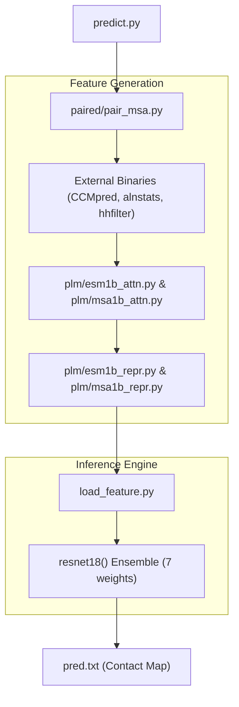
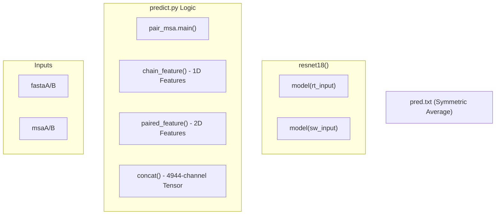

# Getting Started

> **Relevant source files**
> * [LICENSE](https://github.com/ChengfeiYan/DRN-1D2D_Inter/blob/a54a43b8/LICENSE)
> * [README.md](https://github.com/ChengfeiYan/DRN-1D2D_Inter/blob/a54a43b8/README.md?plain=1)
> * [example/1GL1_A.fasta](https://github.com/ChengfeiYan/DRN-1D2D_Inter/blob/a54a43b8/example/1GL1_A.fasta)
> * [example/1GL1_A_uniref100.a3m](https://github.com/ChengfeiYan/DRN-1D2D_Inter/blob/a54a43b8/example/1GL1_A_uniref100.a3m)
> * [example/1GL1_I.fasta](https://github.com/ChengfeiYan/DRN-1D2D_Inter/blob/a54a43b8/example/1GL1_I.fasta)
> * [example/1GL1_I_uniref100.a3m](https://github.com/ChengfeiYan/DRN-1D2D_Inter/blob/a54a43b8/example/1GL1_I_uniref100.a3m)
> * [predict.py](https://github.com/ChengfeiYan/DRN-1D2D_Inter/blob/a54a43b8/predict.py)

This page provides a comprehensive guide for setting up the DRN-1D2D_Inter environment and executing the inter-protein contact prediction pipeline. The system utilizes Dimensional Hybrid Residual Networks combined with Protein Language Models (ESM-1b and ESM-MSA-1b) to predict contact maps between two interacting protein chains.

## Environment Setup

### 1. Python Dependencies

The system requires **Python 3.8** and several specific libraries for deep learning and bioinformatics data processing [README.md L4-L9](https://github.com/ChengfeiYan/DRN-1D2D_Inter/blob/a54a43b8/README.md?plain=1#L4-L9)

.

* **PyTorch (1.9):** Used for model inference and training.
* **Biopython:** Required for sequence and MSA handling.
* **ESM:** The Facebook Research protein language model library.
* **NumPy:** Used for numerical operations and saving final prediction matrices.

### 2. External Bioinformatics Tools

DRN-1D2D_Inter relies on external binaries to generate evolutionary features. These must be downloaded and their paths configured in the source code [README.md L12-L16](https://github.com/ChengfeiYan/DRN-1D2D_Inter/blob/a54a43b8/README.md?plain=1#L12-L16)

.

| Tool | Purpose | Source |
| --- | --- | --- |
| `CCMpred` | Calculates evolutionary coupling (2D feature) | [CCMpred GitHub](https://github.com/ChengfeiYan/DRN-1D2D_Inter/blob/a54a43b8/CCMpred GitHub) |
| `alnstats` | Generates alignment statistics (2D feature) | [MetaPSICOV src](https://github.com/ChengfeiYan/DRN-1D2D_Inter/blob/a54a43b8/MetaPSICOV src) |
| `hh-suite` | Provides `hhmake` (PSSM) and `hhfilter` (MSA filtering) | [HH-suite GitHub](https://github.com/ChengfeiYan/DRN-1D2D_Inter/blob/a54a43b8/HH-suite GitHub) |
| `fasta2aln` | Reformats A3M alignments to ALN format | [HH-suite2 bin](https://github.com/ChengfeiYan/DRN-1D2D_Inter/blob/a54a43b8/HH-suite2 bin) |

## Configuration and Installation

### 1. Clone Repository

```
git clone https://github.com/ChengfeiYan/DRN-1D2D_Inter.git
```

### 2. Configure Hardcoded Paths

The system uses absolute paths for external tools and model weights. You must modify `predict.py` to match your local installation [predict.py L24-L31](https://github.com/ChengfeiYan/DRN-1D2D_Inter/blob/a54a43b8/predict.py#L24-L31)

.

* **Tools:** Update `CCMPred`, `reformat` (fasta2aln), `alnstats`, `hhmake`, and `hhfilter` [predict.py L24-L28](https://github.com/ChengfeiYan/DRN-1D2D_Inter/blob/a54a43b8/predict.py#L24-L28) .
* **PLM Weights:** Update `esm1b_location` and `esm_msa1b_location` [predict.py L30-L31](https://github.com/ChengfeiYan/DRN-1D2D_Inter/blob/a54a43b8/predict.py#L30-L31) .
* **LoadHHM Script:** Ensure `LoadHHM` points to the internal script [predict.py L29](https://github.com/ChengfeiYan/DRN-1D2D_Inter/blob/a54a43b8/predict.py#L29-L29) .

### 3. Model Weight Preparation

1. **ESM Weights:** Download `esm1b_t33_650M_UR50S.pt` and `esm_msa1b_t12_100M_UR50S.pt` from the ESM repository [README.md L11](https://github.com/ChengfeiYan/DRN-1D2D_Inter/blob/a54a43b8/README.md?plain=1#L11-L11) .
2. **Regression Heads:** Copy the provided contact regression files from `data/regression/` to the same directory as the ESM model weights [README.md L22](https://github.com/ChengfeiYan/DRN-1D2D_Inter/blob/a54a43b8/README.md?plain=1#L22-L22) .
3. **DRN Models:** Download the 7 pre-trained DRN models and place them in the `model/` directory (named `1` through `7`) [README.md L24-L25](https://github.com/ChengfeiYan/DRN-1D2D_Inter/blob/a54a43b8/README.md?plain=1#L24-L25)  [predict.py L159](https://github.com/ChengfeiYan/DRN-1D2D_Inter/blob/a54a43b8/predict.py#L159-L159) .

## Execution Workflow

The prediction is initiated via `predict.py`, which orchestrates feature extraction, PLM inference, and the ensemble DRN prediction.

### Prediction Logic Flow

The following diagram maps the logical steps in `predict.py` to the underlying code entities.

**DRN-1D2D_Inter Prediction Pipeline**



**Sources:** [predict.py L44-L177](https://github.com/ChengfeiYan/DRN-1D2D_Inter/blob/a54a43b8/predict.py#L44-L177)

 [predict.py L11-L18](https://github.com/ChengfeiYan/DRN-1D2D_Inter/blob/a54a43b8/predict.py#L11-L18)

### Running the Example (1GL1)

The repository includes example files for the protein complex 1GL1 (Chains A and I) [README.md L38-L39](https://github.com/ChengfeiYan/DRN-1D2D_Inter/blob/a54a43b8/README.md?plain=1#L38-L39)

.

**Command:**

```
python predict.py \    ./example/1GL1_A.fasta \    ./example/1GL1_A_uniref100.a3m \    ./example/1GL1_I.fasta \    ./example/1GL1_I_uniref100.a3m \    ./example/result \    cuda:0
```

### Input and Output Data Flow

The system processes two protein sequences (A and B) and their respective MSAs to produce a 2D probability matrix.

**Data Transformation Flow**



**Sources:** [predict.py L37-L56](https://github.com/ChengfeiYan/DRN-1D2D_Inter/blob/a54a43b8/predict.py#L37-L56)

 [predict.py L145-L154](https://github.com/ChengfeiYan/DRN-1D2D_Inter/blob/a54a43b8/predict.py#L145-L154)

 [predict.py L171-L177](https://github.com/ChengfeiYan/DRN-1D2D_Inter/blob/a54a43b8/predict.py#L171-L177)

## Key Functions and Variables in predict.py

* **`pair_msa.main(file_dict, 0.5, 100000)`**: Pairs the input MSAs based on species information [predict.py L56](https://github.com/ChengfeiYan/DRN-1D2D_Inter/blob/a54a43b8/predict.py#L56-L56) .
* **`load_feature.chain_feature(result_path)`**: Aggregates 1D features including PSSM (from HHM) and PLM representations (ESM-1b, MSA-1b) [predict.py L145](https://github.com/ChengfeiYan/DRN-1D2D_Inter/blob/a54a43b8/predict.py#L145-L145) .
* **`load_feature.paired_feature(result_path)`**: Aggregates 2D features including CCMpred, alnstats, and PLM attention maps [predict.py L146](https://github.com/ChengfeiYan/DRN-1D2D_Inter/blob/a54a43b8/predict.py#L146-L146) .
* **`load_feature.concat(featA, featB, p2d)`**: Expands 1D features into 2D and concatenates them with existing 2D features to form the final input tensor [predict.py L153-L154](https://github.com/ChengfeiYan/DRN-1D2D_Inter/blob/a54a43b8/predict.py#L153-L154) .
* **Ensemble Loop**: Loads weights from `model/1` to `model/7`, running predictions on both the original orientation (`rt_input`) and the swapped orientation (`sw_input`), which are then averaged to ensure symmetry [predict.py L166-L177](https://github.com/ChengfeiYan/DRN-1D2D_Inter/blob/a54a43b8/predict.py#L166-L177) .

**Sources:** [predict.py L1-L177](https://github.com/ChengfeiYan/DRN-1D2D_Inter/blob/a54a43b8/predict.py#L1-L177)

 [README.md L1-L52](https://github.com/ChengfeiYan/DRN-1D2D_Inter/blob/a54a43b8/README.md?plain=1#L1-L52)