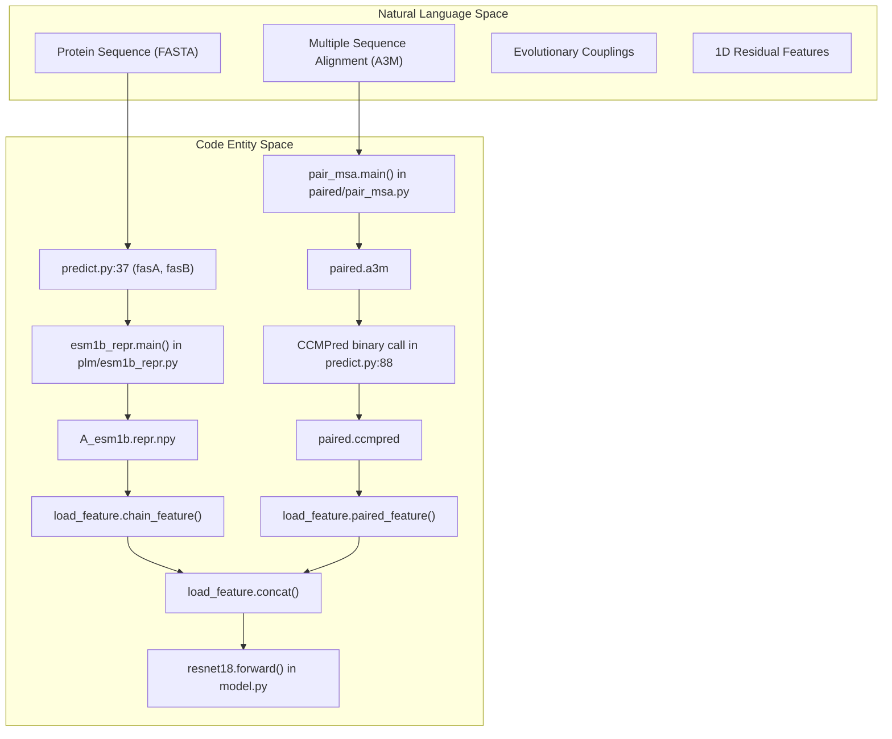
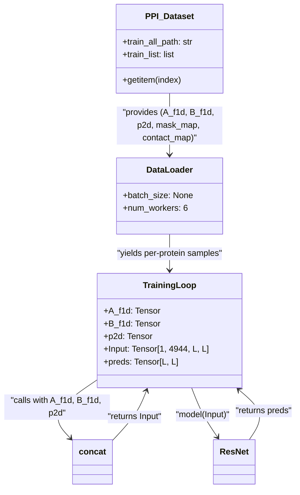

# Glossary

> **Relevant source files**
> * [LICENSE](https://github.com/ChengfeiYan/DRN-1D2D_Inter/blob/a54a43b8/LICENSE)
> * [README.md](https://github.com/ChengfeiYan/DRN-1D2D_Inter/blob/a54a43b8/README.md?plain=1)
> * [data/DB5.5](https://github.com/ChengfeiYan/DRN-1D2D_Inter/blob/a54a43b8/data/DB5.5)
> * [data/DHTest](https://github.com/ChengfeiYan/DRN-1D2D_Inter/blob/a54a43b8/data/DHTest)
> * [data/regression/esm1b_t33_650M_UR50S-contact-regression.pt](https://github.com/ChengfeiYan/DRN-1D2D_Inter/blob/a54a43b8/data/regression/esm1b_t33_650M_UR50S-contact-regression.pt)
> * [data/regression/esm_msa1b_t12_100M_UR50S-contact-regression.pt](https://github.com/ChengfeiYan/DRN-1D2D_Inter/blob/a54a43b8/data/regression/esm_msa1b_t12_100M_UR50S-contact-regression.pt)
> * [load_feature.py](https://github.com/ChengfeiYan/DRN-1D2D_Inter/blob/a54a43b8/load_feature.py)
> * [model.py](https://github.com/ChengfeiYan/DRN-1D2D_Inter/blob/a54a43b8/model.py)
> * [paired/pair_msa.py](https://github.com/ChengfeiYan/DRN-1D2D_Inter/blob/a54a43b8/paired/pair_msa.py)
> * [plm/esm1b_attn.py](https://github.com/ChengfeiYan/DRN-1D2D_Inter/blob/a54a43b8/plm/esm1b_attn.py)
> * [predict.py](https://github.com/ChengfeiYan/DRN-1D2D_Inter/blob/a54a43b8/predict.py)
> * [train.py](https://github.com/ChengfeiYan/DRN-1D2D_Inter/blob/a54a43b8/train.py)

This page provides technical definitions for domain-specific terminology, bioinformatics concepts, and architectural components within the **DRN-1D2D_Inter** codebase.

## System Architecture and Logic Terms

### Dimensional Hybrid Residual Network (DRN)

The core neural network architecture used to predict inter-protein contacts. It is termed "Dimensional Hybrid" because it processes both 1D features (expanded into 2D) and native 2D features through a residual network structure.

* **Implementation**: Defined as the `ResNet` class in `model.py` [model.py L154-L184](https://github.com/ChengfeiYan/DRN-1D2D_Inter/blob/a54a43b8/model.py#L154-L184)
* **Structure**: Consists of a `first_layer` (1x1 convolution to reduce 4944 input channels to 96), followed by 9 `BasicBlock` modules, and an `output_layer` with a `Sigmoid` activation [model.py L160-L179](https://github.com/ChengfeiYan/DRN-1D2D_Inter/blob/a54a43b8/model.py#L160-L179)

### BasicBlock (Multi-path Convolution)

The fundamental building block of the DRN. Unlike standard ResNet blocks, it employs three parallel convolutional paths to capture diverse spatial dependencies.

* **Path 1**: 3x3 square convolution [model.py L93-L99](https://github.com/ChengfeiYan/DRN-1D2D_Inter/blob/a54a43b8/model.py#L93-L99)
* **Path 2**: 1x15 horizontal strip convolution (only if `dilated_rate` is 1, 20, or 40) [model.py L102-L108](https://github.com/ChengfeiYan/DRN-1D2D_Inter/blob/a54a43b8/model.py#L102-L108)
* **Path 3**: 15x1 vertical strip convolution (only if `dilated_rate` is 1, 20, or 40) [model.py L110-L116](https://github.com/ChengfeiYan/DRN-1D2D_Inter/blob/a54a43b8/model.py#L110-L116)
* **Normalization**: Uses `InstanceNorm2d` [model.py L43-L44](https://github.com/ChengfeiYan/DRN-1D2D_Inter/blob/a54a43b8/model.py#L43-L44)

### Symmetry Averaging (rt_input vs sw_input)

A technique used during inference to ensure the contact map is consistent regardless of which protein is "Chain A" or "Chain B".

* **rt_input**: Features for the pair (Protein A, Protein B) [predict.py L153](https://github.com/ChengfeiYan/DRN-1D2D_Inter/blob/a54a43b8/predict.py#L153-L153)
* **sw_input**: Features for the pair (Protein B, Protein A) [predict.py L154](https://github.com/ChengfeiYan/DRN-1D2D_Inter/blob/a54a43b8/predict.py#L154-L154)
* **Mechanism**: The model predicts on both, and the `sw_input` result is transposed (`.T`) and averaged with the `rt_input` result [predict.py L171-L174](https://github.com/ChengfeiYan/DRN-1D2D_Inter/blob/a54a43b8/predict.py#L171-L174)

### Natural Language to Code Entity Mapping

**Diagram 1: Feature Processing Flow**
This diagram maps bioinformatics concepts to the specific functions and files responsible for their transformation.

**Sources**: [predict.py L37-L171](https://github.com/ChengfeiYan/DRN-1D2D_Inter/blob/a54a43b8/predict.py#L37-L171)

 [load_feature.py L42-L102](https://github.com/ChengfeiYan/DRN-1D2D_Inter/blob/a54a43b8/load_feature.py#L42-L102)

 [model.py L127-L151](https://github.com/ChengfeiYan/DRN-1D2D_Inter/blob/a54a43b8/model.py#L127-L151)

---

## Bioinformatics and Feature Terms

### MSA (Multiple Sequence Alignment)

A collection of protein sequences aligned to identify conserved regions.

* **Code Reference**: Handled as `.a3m` files [predict.py L30-L32](https://github.com/ChengfeiYan/DRN-1D2D_Inter/blob/a54a43b8/predict.py#L30-L32)
* **Pairing**: MSAs for Protein A and B are paired by Taxonomic ID using `cluster_species.py` to identify co-evolving residues across the interface [paired/pair_msa.py L59-L60](https://github.com/ChengfeiYan/DRN-1D2D_Inter/blob/a54a43b8/paired/pair_msa.py#L59-L60)

### PSSM (Position-Specific Scoring Matrix)

A matrix representing the log-likelihood of specific amino acids appearing at specific positions in the sequence.

* **Generation**: Produced via `hhmake` from the HH-suite [predict.py L120-L123](https://github.com/ChengfeiYan/DRN-1D2D_Inter/blob/a54a43b8/predict.py#L120-L123)
* **Loading**: Processed by `LoadHHM.py` and stored as `.pkl` files [predict.py L116-L118](https://github.com/ChengfeiYan/DRN-1D2D_Inter/blob/a54a43b8/predict.py#L116-L118)

### PLM (Protein Language Model)

Pre-trained transformer models that extract high-dimensional representations of protein sequences.

* **ESM-1b**: A 33-layer transformer (650M parameters). Used for 1D representations and 2D attention maps [plm/esm1b_attn.py L46](https://github.com/ChengfeiYan/DRN-1D2D_Inter/blob/a54a43b8/plm/esm1b_attn.py#L46-L46)  [plm/esm1b_repr.py L44](https://github.com/ChengfeiYan/DRN-1D2D_Inter/blob/a54a43b8/plm/esm1b_repr.py#L44-L44)
* **ESM-MSA-1b**: A transformer trained specifically on MSAs. Used for extraction of co-evolutionary signals [plm/msa1b_attn.py L55](https://github.com/ChengfeiYan/DRN-1D2D_Inter/blob/a54a43b8/plm/msa1b_attn.py#L55-L55)  [plm/msa1b_repr.py L49](https://github.com/ChengfeiYan/DRN-1D2D_Inter/blob/a54a43b8/plm/msa1b_repr.py#L49-L49)

### Attention Map

A 2D matrix representing how much the PLM "attends" to residue $j$ when processing residue $i$.

* **Cross-chain Attention**: The pipeline specifically extracts the quadrant of the attention matrix representing interactions between Chain A and Chain B [plm/esm1b_attn.py L57-L58](https://github.com/ChengfeiYan/DRN-1D2D_Inter/blob/a54a43b8/plm/esm1b_attn.py#L57-L58)

### CCMpred

A tool for predicting evolutionary couplings from MSAs using pseudo-likelihood maximization.

* **Role**: Provides the primary 2D evolutionary feature [predict.py L88](https://github.com/ChengfeiYan/DRN-1D2D_Inter/blob/a54a43b8/predict.py#L88-L88)
* **Input**: `paired.aln` [predict.py L88](https://github.com/ChengfeiYan/DRN-1D2D_Inter/blob/a54a43b8/predict.py#L88-L88)

---

## Data and Training Terms

### Input Tensor (4944 Channels)

The final 2D grid fed into the DRN.

* **Composition**: * **1D Features (Concatenated/Expanded)**: PSSM, ESM-1b representations, and MSA-1b representations for both chains [load_feature.py L54](https://github.com/ChengfeiYan/DRN-1D2D_Inter/blob/a54a43b8/load_feature.py#L54-L54) * **2D Features**: CCMpred, `alnstats` (3 channels), and attention maps from both ESM models (multi-head, multi-layer) [load_feature.py L92](https://github.com/ChengfeiYan/DRN-1D2D_Inter/blob/a54a43b8/load_feature.py#L92-L92)
* **Concatenation Logic**: The `concat` function uses `torch.repeat_interleave` to tile 1D vectors into a 2D grid [load_feature.py L16-L27](https://github.com/ChengfeiYan/DRN-1D2D_Inter/blob/a54a43b8/load_feature.py#L16-L27)

### PPI Loss

A specialized loss function for protein-protein interaction (PPI) contact prediction.

* **Implementation**: `ppi_loss` [train.py L70](https://github.com/ChengfeiYan/DRN-1D2D_Inter/blob/a54a43b8/train.py#L70-L70)
* **Masking**: Uses a `mask_map` to ignore padding or missing data during backpropagation [train.py L147](https://github.com/ChengfeiYan/DRN-1D2D_Inter/blob/a54a43b8/train.py#L147-L147)

### Top Statistics

Evaluation metrics used to assess the precision of the top-ranked contact predictions.

* **Metrics**: L/5, L/10, L/20 (where L is total sequence length), and fixed counts (Top 50, 20, 10, 5, 1) [train.py L81](https://github.com/ChengfeiYan/DRN-1D2D_Inter/blob/a54a43b8/train.py#L81-L81)
* **Implementation**: `top_statistics_ppi` [train.py L159](https://github.com/ChengfeiYan/DRN-1D2D_Inter/blob/a54a43b8/train.py#L159-L159)

**Diagram 2: Data Entity Space Mapping**
This diagram maps the internal variable names and data structures used during the training loop.

**Sources**: [train.py L55-L61](https://github.com/ChengfeiYan/DRN-1D2D_Inter/blob/a54a43b8/train.py#L55-L61)

 [train.py L121-L146](https://github.com/ChengfeiYan/DRN-1D2D_Inter/blob/a54a43b8/train.py#L121-L146)

 [load_feature.py L16-L28](https://github.com/ChengfeiYan/DRN-1D2D_Inter/blob/a54a43b8/load_feature.py#L16-L28)

---

## Abbreviations

| Abbreviation | Full Term | Context |
| --- | --- | --- |
| **MSA** | Multiple Sequence Alignment | Evolutionary data input |
| **PLM** | Protein Language Model | ESM-1b / ESM-MSA-1b |
| **PSSM** | Position-Specific Scoring Matrix | 1D evolutionary profile |
| **DRN** | Dimensional Hybrid Residual Network | The model architecture |
| **TaxID** | Taxonomic Identifier | Used for MSA pairing in `cluster_species.py` |
| **rt** | Root/Right-to-Left (Standard) | Orientation A $\rightarrow$ B |
| **sw** | Swap/Switch | Orientation B $\rightarrow$ A |

**Sources**: [predict.py L22-L31](https://github.com/ChengfeiYan/DRN-1D2D_Inter/blob/a54a43b8/predict.py#L22-L31)

 [load_feature.py L42-L102](https://github.com/ChengfeiYan/DRN-1D2D_Inter/blob/a54a43b8/load_feature.py#L42-L102)

 [model.py L154-L184](https://github.com/ChengfeiYan/DRN-1D2D_Inter/blob/a54a43b8/model.py#L154-L184)

 [train.py L81-L85](https://github.com/ChengfeiYan/DRN-1D2D_Inter/blob/a54a43b8/train.py#L81-L85)