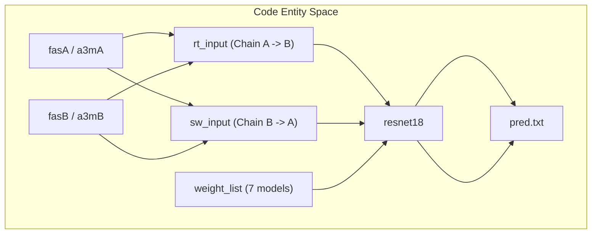
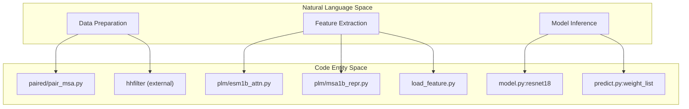

# Inference Pipeline

> **Relevant source files**
> * [LICENSE](https://github.com/ChengfeiYan/DRN-1D2D_Inter/blob/a54a43b8/LICENSE)
> * [README.md](https://github.com/ChengfeiYan/DRN-1D2D_Inter/blob/a54a43b8/README.md?plain=1)
> * [predict.py](https://github.com/ChengfeiYan/DRN-1D2D_Inter/blob/a54a43b8/predict.py)

The inference pipeline in DRN-1D2D_Inter is orchestrated by `predict.py`, which manages the transition from raw biological sequences to a final inter-protein contact map. The workflow integrates traditional bioinformatics tools (like CCMpred and HH-suite) with deep learning features extracted from Protein Language Models (ESM-1b and ESM-MSA-1b).

### Pipeline Orchestration

The script `predict.py` serves as the entry point, accepting FASTA and A3M files for two interacting protein chains (Chain A and Chain B). It executes a multi-stage process: MSA pairing, feature extraction, feature concatenation, and ensemble model prediction [predict.py L35-L177](https://github.com/ChengfeiYan/DRN-1D2D_Inter/blob/a54a43b8/predict.py#L35-L177)

### 1. MSA Pairing and Preprocessing

The first stage involves generating a paired Multiple Sequence Alignment (MSA) by matching sequences from both chains based on their taxonomic identifiers. This process ensures that evolutionary signals between interacting residues are captured.

* **Paired MSA Generation**: Uses `pair_msa.main` to create `paired.a3m` [predict.py L49-L56](https://github.com/ChengfeiYan/DRN-1D2D_Inter/blob/a54a43b8/predict.py#L49-L56)
* **Filtering**: Employs `hhfilter` to reduce redundancy in the alignments [predict.py L61-L71](https://github.com/ChengfeiYan/DRN-1D2D_Inter/blob/a54a43b8/predict.py#L61-L71)
* **Format Conversion**: Converts A3M files to ALN format for downstream tools like CCMpred [predict.py L64-L65](https://github.com/ChengfeiYan/DRN-1D2D_Inter/blob/a54a43b8/predict.py#L64-L65)

For details, see [MSA Pairing and Preprocessing](/ChengfeiYan/DRN-1D2D_Inter/2.1-msa-pairing-and-preprocessing).

**Sources:** [predict.py L44-L73](https://github.com/ChengfeiYan/DRN-1D2D_Inter/blob/a54a43b8/predict.py#L44-L73)

 [README.md L28-L36](https://github.com/ChengfeiYan/DRN-1D2D_Inter/blob/a54a43b8/README.md?plain=1#L28-L36)

### 2. Protein Language Model Feature Extraction

The pipeline extracts high-dimensional representations and attention maps using pre-trained ESM models. These features provide contextual information that complements evolutionary coupling data.

* **ESM-1b**: Extracts per-residue representations (`esm1b_repr`) and cross-chain attention maps (`esm1b_attn`) [predict.py L96-L100](https://github.com/ChengfeiYan/DRN-1D2D_Inter/blob/a54a43b8/predict.py#L96-L100)  [predict.py L126-L131](https://github.com/ChengfeiYan/DRN-1D2D_Inter/blob/a54a43b8/predict.py#L126-L131)
* **ESM-MSA-1b**: Extracts features from the paired MSA (`msa1b_attn`) and individual chain alignments (`msa1b_repr`) [predict.py L104-L108](https://github.com/ChengfeiYan/DRN-1D2D_Inter/blob/a54a43b8/predict.py#L104-L108)  [predict.py L135-L140](https://github.com/ChengfeiYan/DRN-1D2D_Inter/blob/a54a43b8/predict.py#L135-L140)
* **PSSM**: Generates Position-Specific Scoring Matrices using `hhmake` and `LoadHHM.py` [predict.py L114-L123](https://github.com/ChengfeiYan/DRN-1D2D_Inter/blob/a54a43b8/predict.py#L114-L123)

For details, see [Protein Language Model Feature Extraction](/ChengfeiYan/DRN-1D2D_Inter/2.2-protein-language-model-feature-extraction).

**Sources:** [predict.py L96-L141](https://github.com/ChengfeiYan/DRN-1D2D_Inter/blob/a54a43b8/predict.py#L96-L141)

 [README.md L11](https://github.com/ChengfeiYan/DRN-1D2D_Inter/blob/a54a43b8/README.md?plain=1#L11-L11)

### 3. Feature Loading and Concatenation

Before entering the neural network, features must be transformed into a consistent 2D grid representation. The `load_feature` module handles the aggregation of 1D (per-residue) and 2D (pairwise) data.

* **1D Features**: `chain_feature()` aggregates PSSM and ESM representations for each chain [predict.py L145](https://github.com/ChengfeiYan/DRN-1D2D_Inter/blob/a54a43b8/predict.py#L145-L145)
* **2D Features**: `paired_feature()` loads CCMpred outputs, alnstats, and attention maps [predict.py L146](https://github.com/ChengfeiYan/DRN-1D2D_Inter/blob/a54a43b8/predict.py#L146-L146)
* **Concatenation**: The `concat()` function expands 1D features into a 2D matrix by tiling them across rows and columns, merging them with the existing 2D features to create the final model input tensor [predict.py L153-L154](https://github.com/ChengfeiYan/DRN-1D2D_Inter/blob/a54a43b8/predict.py#L153-L154)

For details, see [Feature Loading and Concatenation](/ChengfeiYan/DRN-1D2D_Inter/2.3-feature-loading-and-concatenation).

**Sources:** [predict.py L144-L154](https://github.com/ChengfeiYan/DRN-1D2D_Inter/blob/a54a43b8/predict.py#L144-L154)

### 4. Ensemble Inference and Output

The final stage utilizes a Dimensional Hybrid Residual Network (`resnet18`) to predict contact probabilities.

#### Inference Workflow

* **Symmetry Handling**: The model predicts on two orientations: `rt_input` (A to B) and `sw_input` (B to A). The latter is transposed (`preds2.T`) and averaged with the former to ensure physical symmetry in the contact map [predict.py L153-L154](https://github.com/ChengfeiYan/DRN-1D2D_Inter/blob/a54a43b8/predict.py#L153-L154)  [predict.py L171-L174](https://github.com/ChengfeiYan/DRN-1D2D_Inter/blob/a54a43b8/predict.py#L171-L174)
* **Ensemble Strategy**: The pipeline iterates through 7 different model weights, accumulating predictions to improve robustness [predict.py L159-L174](https://github.com/ChengfeiYan/DRN-1D2D_Inter/blob/a54a43b8/predict.py#L159-L174)
* **Final Output**: The averaged probabilities are saved as a text matrix in `pred.txt` [predict.py L176-L177](https://github.com/ChengfeiYan/DRN-1D2D_Inter/blob/a54a43b8/predict.py#L176-L177)

For details, see [Ensemble Inference and Output](/ChengfeiYan/DRN-1D2D_Inter/2.4-ensemble-inference-and-output).

**Sources:** [predict.py L158-L177](https://github.com/ChengfeiYan/DRN-1D2D_Inter/blob/a54a43b8/predict.py#L158-L177)

 [model.py L1-L20](https://github.com/ChengfeiYan/DRN-1D2D_Inter/blob/a54a43b8/model.py#L1-L20)

 (implied by `resnet18` import)

### System Component Mapping

The following diagram maps high-level pipeline stages to the specific scripts and tools responsible for their execution.

**Sources:** [predict.py L11-L18](https://github.com/ChengfeiYan/DRN-1D2D_Inter/blob/a54a43b8/predict.py#L11-L18)

 [predict.py L159-L160](https://github.com/ChengfeiYan/DRN-1D2D_Inter/blob/a54a43b8/predict.py#L159-L160)