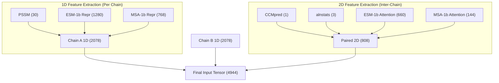
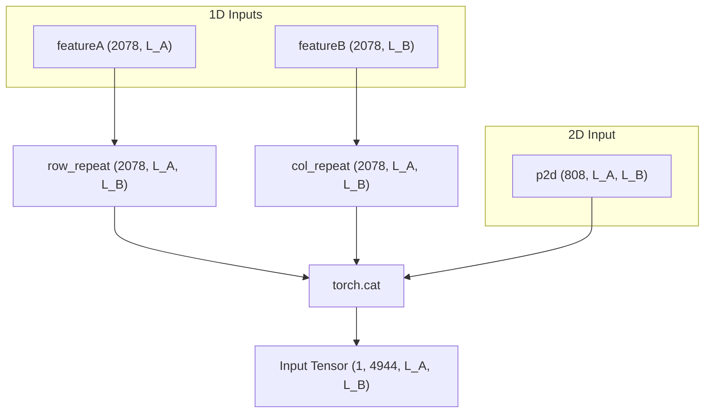

# Input Feature Dimensionality

> **Relevant source files**
> * [load_feature.py](https://github.com/ChengfeiYan/DRN-1D2D_Inter/blob/a54a43b8/load_feature.py)
> * [model.py](https://github.com/ChengfeiYan/DRN-1D2D_Inter/blob/a54a43b8/model.py)
> * [plm/esm1b_attn.py](https://github.com/ChengfeiYan/DRN-1D2D_Inter/blob/a54a43b8/plm/esm1b_attn.py)
> * [plm/msa1b_attn.py](https://github.com/ChengfeiYan/DRN-1D2D_Inter/blob/a54a43b8/plm/msa1b_attn.py)
> * [predict.py](https://github.com/ChengfeiYan/DRN-1D2D_Inter/blob/a54a43b8/predict.py)

This page details the construction and composition of the 4944-channel input tensor used by the DRN-1D2D_Inter model. The system employs a dimensional hybrid approach, where 1D per-residue features from two protein chains are expanded and concatenated with native 2D inter-chain features to form a comprehensive representation of the protein-protein interface.

## Feature Composition Overview

The input tensor is constructed by the `concat` function in `load_feature.py` [load_feature.py L16-L27](https://github.com/ChengfeiYan/DRN-1D2D_Inter/blob/a54a43b8/load_feature.py#L16-L27)

 It aggregates three primary types of data:

1. **1D Features (Chain A)**: Per-residue evolutionary and language model representations for the first protein.
2. **1D Features (Chain B)**: Per-residue evolutionary and language model representations for the second protein.
3. **2D Features**: Direct inter-chain evolutionary couplings, alignment statistics, and cross-chain attention maps from Protein Language Models (PLMs).

### Data Flow for Feature Construction

The following diagram illustrates how raw outputs from bioinformatics tools and PLMs are transformed into the final 4944-channel tensor.

**Feature Assembly Pipeline**

**Sources:** [load_feature.py L42-L58](https://github.com/ChengfeiYan/DRN-1D2D_Inter/blob/a54a43b8/load_feature.py#L42-L58)

 [load_feature.py L61-L102](https://github.com/ChengfeiYan/DRN-1D2D_Inter/blob/a54a43b8/load_feature.py#L61-L102)

 [load_feature.py L16-L27](https://github.com/ChengfeiYan/DRN-1D2D_Inter/blob/a54a43b8/load_feature.py#L16-L27)

---

## Detailed Channel Breakdown

The total 4944 channels are derived from the sum of two 1D feature sets (2078 channels each) and one 2D feature set (808 channels).

### 1. Per-Chain 1D Features (2078 channels per chain)

For each chain, the features are loaded and stacked horizontally in `load_feature.chain_feature` [load_feature.py L54-L55](https://github.com/ChengfeiYan/DRN-1D2D_Inter/blob/a54a43b8/load_feature.py#L54-L55)

| Feature Source | Channels | Description |
| --- | --- | --- |
| **PSSM** | 30 | Position-Specific Scoring Matrix generated via `hhmake` and loaded by `LoadHHM.py` [predict.py L120-L123](https://github.com/ChengfeiYan/DRN-1D2D_Inter/blob/a54a43b8/predict.py#L120-L123) |
| **ESM-1b Representation** | 1280 | Per-residue embeddings from the final layer of ESM-1b [load_feature.py L51](https://github.com/ChengfeiYan/DRN-1D2D_Inter/blob/a54a43b8/load_feature.py#L51-L51) |
| **ESM-MSA-1b Representation** | 768 | Per-residue embeddings from the final layer of ESM-MSA-1b [load_feature.py L52](https://github.com/ChengfeiYan/DRN-1D2D_Inter/blob/a54a43b8/load_feature.py#L52-L52) |
| **Total** | **2078** | Combined 1D vector per residue. |

### 2. Paired 2D Features (808 channels)

These features represent direct relationships between residue $i$ in Chain A and residue $j$ in Chain B. They are loaded in `load_feature.paired_feature` [load_feature.py L61-L102](https://github.com/ChengfeiYan/DRN-1D2D_Inter/blob/a54a43b8/load_feature.py#L61-L102)

| Feature Source | Channels | Logic / Implementation |
| --- | --- | --- |
| **CCMpred** | 1 | Evolutionary coupling matrix from `paired.aln` [predict.py L88](https://github.com/ChengfeiYan/DRN-1D2D_Inter/blob/a54a43b8/predict.py#L88-L88) |
| **alnstats** | 3 | Statistical metrics (e.g., mutual information) from `alnstats` [load_feature.py L34-L38](https://github.com/ChengfeiYan/DRN-1D2D_Inter/blob/a54a43b8/load_feature.py#L34-L38) |
| **ESM-1b Attention** | 660 | Multi-head attention maps (33 layers × 20 heads) [plm/esm1b_attn.py L57-L58](https://github.com/ChengfeiYan/DRN-1D2D_Inter/blob/a54a43b8/plm/esm1b_attn.py#L57-L58) |
| **MSA-1b Attention** | 144 | Multi-head row attention maps (12 layers × 12 heads) [plm/msa1b_attn.py L60-L61](https://github.com/ChengfeiYan/DRN-1D2D_Inter/blob/a54a43b8/plm/msa1b_attn.py#L60-L61) |
| **Total** | **808** | Combined 2D feature volume. |

---

## Dimensional Expansion and Concatenation

To feed these into the 2D Residual Network (`model.py`), the 1D features must be projected into 2D space. The `concat` function performs this transformation [load_feature.py L16-L27](https://github.com/ChengfeiYan/DRN-1D2D_Inter/blob/a54a43b8/load_feature.py#L16-L27)

:

1. **Row Expansion**: Chain A's 1D features ($2078 \times L_A$) are repeated $L_B$ times to form a $2078 \times L_A \times L_B$ tensor [load_feature.py L24](https://github.com/ChengfeiYan/DRN-1D2D_Inter/blob/a54a43b8/load_feature.py#L24-L24)
2. **Column Expansion**: Chain B's 1D features ($2078 \times L_B$) are repeated $L_A$ times to form a $2078 \times L_A \times L_B$ tensor [load_feature.py L25](https://github.com/ChengfeiYan/DRN-1D2D_Inter/blob/a54a43b8/load_feature.py#L25-L25)
3. **Concatenation**: The expanded 1D tensors and the native 2D tensor ($808 \times L_A \times L_B$) are concatenated along the channel axis [load_feature.py L27](https://github.com/ChengfeiYan/DRN-1D2D_Inter/blob/a54a43b8/load_feature.py#L27-L27)

**Total Channels Calculation:**
$2078 (\text{Chain A}) + 2078 (\text{Chain B}) + 808 (\text{Paired 2D}) = 4944$

**Tensor Transformation Logic**

**Sources:** [load_feature.py L16-L27](https://github.com/ChengfeiYan/DRN-1D2D_Inter/blob/a54a43b8/load_feature.py#L16-L27)

 [model.py L13-L25](https://github.com/ChengfeiYan/DRN-1D2D_Inter/blob/a54a43b8/model.py#L13-L25)

---

## Orientation Handling (RT vs SW)

The pipeline performs inference on two orientations to ensure symmetry [predict.py L153-L154](https://github.com/ChengfeiYan/DRN-1D2D_Inter/blob/a54a43b8/predict.py#L153-L154)

:

* **RT (Root)**: Chain A as rows, Chain B as columns.
* **SW (Swap)**: Chain B as rows, Chain A as columns.

The `paired_feature` function handles the internal transposition of 2D features for the `sw_input` by swapping the last two axes of the CCMpred and alnstats matrices [load_feature.py L96-L97](https://github.com/ChengfeiYan/DRN-1D2D_Inter/blob/a54a43b8/load_feature.py#L96-L97)

 The final predictions are averaged after transposing the swapped result back to the original orientation [predict.py L173-L174](https://github.com/ChengfeiYan/DRN-1D2D_Inter/blob/a54a43b8/predict.py#L173-L174)

**Sources:** [load_feature.py L61-L102](https://github.com/ChengfeiYan/DRN-1D2D_Inter/blob/a54a43b8/load_feature.py#L61-L102)

 [predict.py L145-L177](https://github.com/ChengfeiYan/DRN-1D2D_Inter/blob/a54a43b8/predict.py#L145-L177)