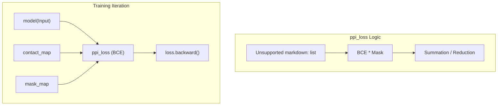
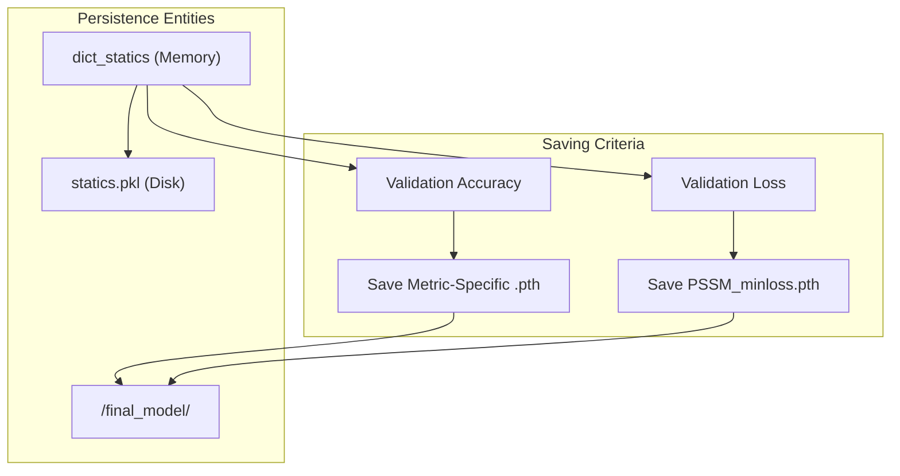

# Loss Function and Evaluation Metrics

> **Relevant source files**
> * [train.py](https://github.com/ChengfeiYan/DRN-1D2D_Inter/blob/a54a43b8/train.py)

This section provides a technical deep dive into the objective functions and evaluation protocols used during the training of the Dimensional Hybrid Residual Network (DRN). The system employs a masked binary cross-entropy loss to handle variable-length protein sequences and a multi-metric evaluation strategy to track model performance across different precision thresholds.

## ppi_loss (Masked Binary Cross-Entropy)

The training process utilizes a custom loss function, `ppi_loss`, defined in `ppi_loss.py`. Because protein contact maps are sparse and the input tensors are often padded or cropped to a fixed `max_aa` (400 residues) [train.py L63](https://github.com/ChengfeiYan/DRN-1D2D_Inter/blob/a54a43b8/train.py#L63-L63)

 the loss function must account for valid interaction areas versus padded regions.

### Implementation Details

The `ppi_loss` class inherits from `torch.nn.modules.loss._Loss`. It implements a binary cross-entropy calculation that is explicitly masked by a `mask_map` [train.py L147](https://github.com/ChengfeiYan/DRN-1D2D_Inter/blob/a54a43b8/train.py#L147-L147)

* **Input**: Predicted contact probability matrix ($P$), ground truth binary contact map ($Y$), and a binary mask ($M$).
* **Logic**: The loss is calculated only for indices $(i, j)$ where $M_{i,j} = 1$.
* **Reduction**: The system supports both 'sum' and 'mean' reductions. In the training script, `reduction='sum'` is used [train.py L70](https://github.com/ChengfeiYan/DRN-1D2D_Inter/blob/a54a43b8/train.py#L70-L70)

### Data Flow for Loss Calculation

**Sources:** [train.py L70](https://github.com/ChengfeiYan/DRN-1D2D_Inter/blob/a54a43b8/train.py#L70-L70)

 [train.py L145-L155](https://github.com/ChengfeiYan/DRN-1D2D_Inter/blob/a54a43b8/train.py#L145-L155)

## Evaluation Metrics (top_statistics_ppi)

The model's performance is evaluated using the `top_statistics_ppi` function [train.py L159](https://github.com/ChengfeiYan/DRN-1D2D_Inter/blob/a54a43b8/train.py#L159-L159)

 This function calculates the precision of the top-$K$ predicted contacts, which is the standard metric in protein contact prediction.

### Metric Categories

The system tracks eight specific metrics defined in the `topk_ppi` list [train.py L81](https://github.com/ChengfeiYan/DRN-1D2D_Inter/blob/a54a43b8/train.py#L81-L81)

:

1. **Length-dependent Metrics**: $L/5$, $L/10$, $L/20$ (where $L$ is the sequence length).
2. **Absolute Top-K Metrics**: Top-50, Top-20, Top-10, Top-5, Top-1 predicted contacts.

### Accuracy Calculation

During both training and validation phases, the `acc_all` matrix stores the precision for every batch, which is then averaged to provide the `mean_acc` for the epoch [train.py L164-L168](https://github.com/ChengfeiYan/DRN-1D2D_Inter/blob/a54a43b8/train.py#L164-L168)

| Metric | Type | Significance |
| --- | --- | --- |
| **L/x** | Relative | Normalizes evaluation for different protein sizes. |
| **Top-K** | Absolute | Evaluates the reliability of the strongest predicted signals. |
| **min_loss** | Loss-based | Tracks the overall convergence of the BCE objective. |

**Sources:** [train.py L81-L87](https://github.com/ChengfeiYan/DRN-1D2D_Inter/blob/a54a43b8/train.py#L81-L87)

 [train.py L159-L160](https://github.com/ChengfeiYan/DRN-1D2D_Inter/blob/a54a43b8/train.py#L159-L160)

## Optimization and Learning Rate Scheduling

The model is optimized using `AdamW` with a specific weight decay to prevent overfitting [train.py L71-L72](https://github.com/ChengfeiYan/DRN-1D2D_Inter/blob/a54a43b8/train.py#L71-L72)

### ReduceLROnPlateau

To handle convergence plateaus, the `ReduceLROnPlateau` scheduler is employed [train.py L74-L75](https://github.com/ChengfeiYan/DRN-1D2D_Inter/blob/a54a43b8/train.py#L74-L75)

* **Mode**: `min` (monitors validation loss).
* **Patience**: 1 epoch.
* **Factor**: 0.1 (reduces LR by 90% when loss stagnates).
* **Threshold**: `eps=1e-6`.

The scheduler is updated specifically after the validation phase using the accumulated `running_loss` [train.py L171-L173](https://github.com/ChengfeiYan/DRN-1D2D_Inter/blob/a54a43b8/train.py#L171-L173)

**Sources:** [train.py L71-L75](https://github.com/ChengfeiYan/DRN-1D2D_Inter/blob/a54a43b8/train.py#L71-L75)

 [train.py L171-L173](https://github.com/ChengfeiYan/DRN-1D2D_Inter/blob/a54a43b8/train.py#L171-L173)

## Model Selection and Persistence

Unlike standard training scripts that save only the "best" model based on total loss, this codebase implements a **Multi-Metric Saving Strategy**.

### Multi-Metric Saving

The system maintains a dictionary, `dict_statics`, to track the "highest" precision achieved for every metric in `topk_ppi` [train.py L84-L85](https://github.com/ChengfeiYan/DRN-1D2D_Inter/blob/a54a43b8/train.py#L84-L85)

* If a new epoch achieves a higher precision for a specific metric (e.g., $L/5$ precision), the model state is saved to a file specific to that metric (e.g., `PSSM_L_5.pth`) [train.py L181-L190](https://github.com/ChengfeiYan/DRN-1D2D_Inter/blob/a54a43b8/train.py#L181-L190)
* A separate checkpoint, `PSSM_minloss.pth`, is maintained for the absolute minimum validation loss [train.py L98](https://github.com/ChengfeiYan/DRN-1D2D_Inter/blob/a54a43b8/train.py#L98-L98)  [train.py L192-L194](https://github.com/ChengfeiYan/DRN-1D2D_Inter/blob/a54a43b8/train.py#L192-L194)

### Persistence Logic

The `dict_statics` object is also persisted as a pickle file (`statics.pkl`) at the end of every epoch, allowing for training resumes and detailed historical analysis of training progress [train.py L196-L197](https://github.com/ChengfeiYan/DRN-1D2D_Inter/blob/a54a43b8/train.py#L196-L197)

### Training State Management

**Sources:** [train.py L82-L85](https://github.com/ChengfeiYan/DRN-1D2D_Inter/blob/a54a43b8/train.py#L82-L85)

 [train.py L94-L98](https://github.com/ChengfeiYan/DRN-1D2D_Inter/blob/a54a43b8/train.py#L94-L98)

 [train.py L181-L197](https://github.com/ChengfeiYan/DRN-1D2D_Inter/blob/a54a43b8/train.py#L181-L197)