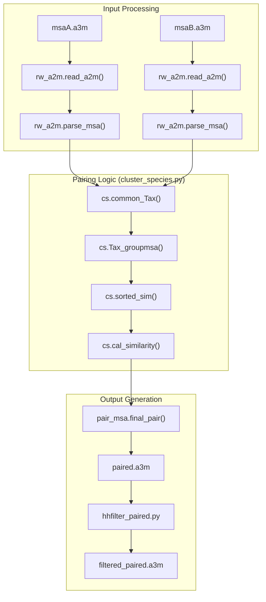
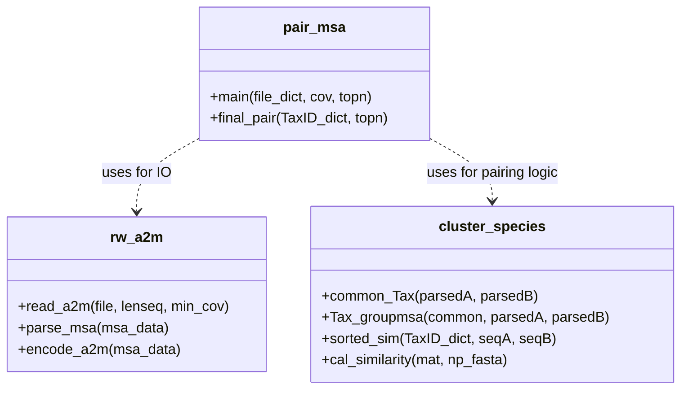

# MSA Pairing and Preprocessing

> **Relevant source files**
> * [paired/cluster_species.py](https://github.com/ChengfeiYan/DRN-1D2D_Inter/blob/a54a43b8/paired/cluster_species.py)
> * [paired/hhfilter_paired.py](https://github.com/ChengfeiYan/DRN-1D2D_Inter/blob/a54a43b8/paired/hhfilter_paired.py)
> * [paired/pair_msa.py](https://github.com/ChengfeiYan/DRN-1D2D_Inter/blob/a54a43b8/paired/pair_msa.py)
> * [paired/rw_a2m.py](https://github.com/ChengfeiYan/DRN-1D2D_Inter/blob/a54a43b8/paired/rw_a2m.py)

The `paired/` module is responsible for generating a joint Multiple Sequence Alignment (MSA) for a protein complex by pairing sequences from two individual MSAs based on taxonomic information. This process ensures that evolutionary signals between interacting proteins are captured by aligning sequences that likely originate from the same organism.

## Overview of the Pairing Workflow

The pairing logic follows a structured data flow:

1. **MSA Loading**: Individual MSAs for Protein A and Protein B are read from A3M files and filtered for gap coverage.
2. **Taxonomic Identification**: Headers are parsed to extract TaxIDs. Sequences sharing the same TaxID in both MSAs are identified as candidates for pairing.
3. **Similarity Sorting**: Within each taxonomic group, sequences are ranked by their sequence identity relative to the target reference sequence.
4. **Concatenation**: Top-ranked sequences from each side are concatenated into a single paired sequence.
5. **HHfilter Post-processing**: The resulting paired MSA is filtered to reduce redundancy and optimize the signal-to-noise ratio for downstream models.

### Data Flow Diagram

The following diagram illustrates the transformation from raw A3M files to the final `filtered_paired.a3m` used for feature extraction.

**MSA Pairing Data Flow**

**Sources:** [paired/pair_msa.py L35-L84](https://github.com/ChengfeiYan/DRN-1D2D_Inter/blob/a54a43b8/paired/pair_msa.py#L35-L84)

 [paired/hhfilter_paired.py L15-L24](https://github.com/ChengfeiYan/DRN-1D2D_Inter/blob/a54a43b8/paired/hhfilter_paired.py#L15-L24)

---

## Taxonomic Pairing Logic

The core of the module resides in `cluster_species.py`, which manages the grouping and ranking of sequences.

### Common TaxID Identification

The function `common_Tax` identifies the intersection of taxonomic IDs present in both protein MSAs. It discards sequences without a valid TaxID (represented as -1) to ensure pairing accuracy [paired/cluster_species.py L43-L59](https://github.com/ChengfeiYan/DRN-1D2D_Inter/blob/a54a43b8/paired/cluster_species.py#L43-L59)

### Sequence Grouping and Similarity Ranking

Once common species are identified, `Tax_groupmsa` organizes the parsed MSA data into a dictionary where keys are TaxIDs and values are lists of sequences for Chain A and Chain B [paired/cluster_species.py L22-L39](https://github.com/ChengfeiYan/DRN-1D2D_Inter/blob/a54a43b8/paired/cluster_species.py#L22-L39)

If a taxonomic group contains multiple sequences, the system employs `sorted_sim` to rank them. This uses `cal_similarity` to calculate the Hamming distance (identity count) between each MSA sequence and the reference sequence (`seqA` or `seqB`) [paired/cluster_species.py L77-L109](https://github.com/ChengfeiYan/DRN-1D2D_Inter/blob/a54a43b8/paired/cluster_species.py#L77-L109)

**Key Entity Mapping**

**Sources:** [paired/rw_a2m.py L12-L92](https://github.com/ChengfeiYan/DRN-1D2D_Inter/blob/a54a43b8/paired/rw_a2m.py#L12-L92)

 [paired/cluster_species.py L13-L109](https://github.com/ChengfeiYan/DRN-1D2D_Inter/blob/a54a43b8/paired/cluster_species.py#L13-L109)

 [paired/pair_msa.py L15-L68](https://github.com/ChengfeiYan/DRN-1D2D_Inter/blob/a54a43b8/paired/pair_msa.py#L15-L68)

---

## MSA Parsing and Formatting

The `rw_a2m.py` utility handles the complexities of the A3M format and metadata extraction.

### Header Parsing

The `parse_msa` function extracts metadata from UniProt/UniRef headers. It specifically looks for the `TaxID=` tag to enable species-based pairing [paired/rw_a2m.py L61-L92](https://github.com/ChengfeiYan/DRN-1D2D_Inter/blob/a54a43b8/paired/rw_a2m.py#L61-L92)

| Field | Extraction Logic | Source |
| --- | --- | --- |
| **UqID** | First string after `>` | [paired/rw_a2m.py L70](https://github.com/ChengfeiYan/DRN-1D2D_Inter/blob/a54a43b8/paired/rw_a2m.py#L70-L70) |
| **TaxID** | Integer following `TaxID=` | [paired/rw_a2m.py L79](https://github.com/ChengfeiYan/DRN-1D2D_Inter/blob/a54a43b8/paired/rw_a2m.py#L79-L79) |
| **Sequence** | Standard amino acid check (ARNDCQEGHILKMFPSTWYV-) | [paired/rw_a2m.py L88](https://github.com/ChengfeiYan/DRN-1D2D_Inter/blob/a54a43b8/paired/rw_a2m.py#L88-L88) |

### Sequence Encoding

For similarity calculations, `encode_a2m` converts string sequences into a `numpy` array of `uint8` integers based on a fixed `residue_constant` mapping [paired/rw_a2m.py L36-L51](https://github.com/ChengfeiYan/DRN-1D2D_Inter/blob/a54a43b8/paired/rw_a2m.py#L36-L51)

**Sources:** [paired/rw_a2m.py L38-L40](https://github.com/ChengfeiYan/DRN-1D2D_Inter/blob/a54a43b8/paired/rw_a2m.py#L38-L40)

 [paired/rw_a2m.py L75-L81](https://github.com/ChengfeiYan/DRN-1D2D_Inter/blob/a54a43b8/paired/rw_a2m.py#L75-L81)

---

## Filtering and Output

### The paired.a3m File

The `final_pair` function concatenates the top `topn` sequences from each side. The header of the paired sequence is constructed by joining the original headers with `||`, while the sequences are simply appended [paired/pair_msa.py L15-L32](https://github.com/ChengfeiYan/DRN-1D2D_Inter/blob/a54a43b8/paired/pair_msa.py#L15-L32)

 The reference sequence (the target complex) is always written as the first entry in the file, with headers joined by `&` [paired/pair_msa.py L71-L77](https://github.com/ChengfeiYan/DRN-1D2D_Inter/blob/a54a43b8/paired/pair_msa.py#L71-L77)

### Post-pairing Filtering

After the paired MSA is generated, `hhfilter_paired.py` invokes the `hhfilter` binary from the HH-suite. It applies a diversity filter (default `-diff 256`) to the `paired.a3m` file to produce `paired_hhfilter_256.a3m` [paired/hhfilter_paired.py L21-L24](https://github.com/ChengfeiYan/DRN-1D2D_Inter/blob/a54a43b8/paired/hhfilter_paired.py#L21-L24)

 This step is crucial for reducing the computational load of the Protein Language Models (PLMs) and reducing redundancy in evolutionary information.

**Sources:** [paired/pair_msa.py L27-L29](https://github.com/ChengfeiYan/DRN-1D2D_Inter/blob/a54a43b8/paired/pair_msa.py#L27-L29)

 [paired/hhfilter_paired.py L11-L24](https://github.com/ChengfeiYan/DRN-1D2D_Inter/blob/a54a43b8/paired/hhfilter_paired.py#L11-L24)