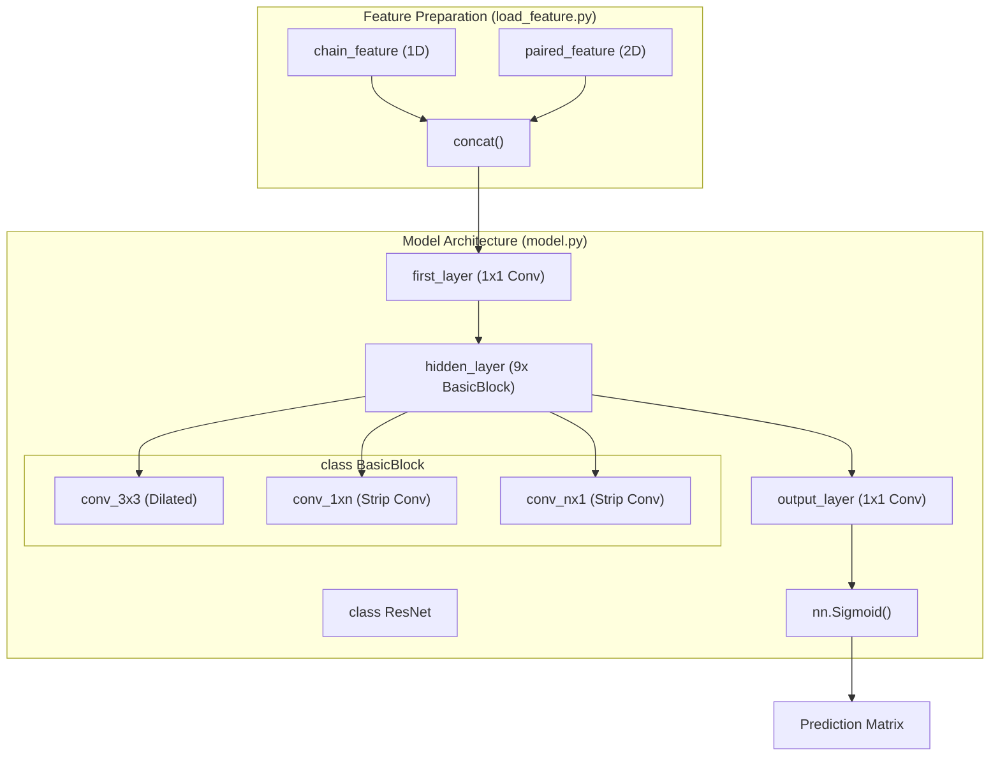
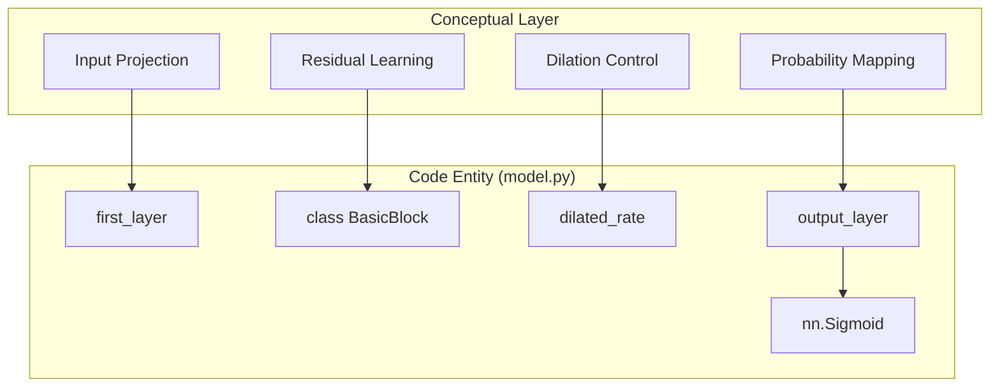

# Model Architecture

> **Relevant source files**
> * [load_feature.py](https://github.com/ChengfeiYan/DRN-1D2D_Inter/blob/a54a43b8/load_feature.py)
> * [model.py](https://github.com/ChengfeiYan/DRN-1D2D_Inter/blob/a54a43b8/model.py)

The **Dimensional Hybrid Residual Network (DRN)** is the core predictive engine of the DRN-1D2D_Inter system. It is designed to process high-dimensional genomic and language model features to predict inter-protein residue contacts. The architecture leverages a 1D-to-2D feature expansion strategy followed by a deep residual network utilizing multi-path dilated convolutions.

## Architectural Overview

The model, defined by the `ResNet` class in `model.py`, transforms a 4944-channel input tensor into a 2D probability map representing the likelihood of contact between residue pairs of two protein chains [model.py L154-L180](https://github.com/ChengfeiYan/DRN-1D2D_Inter/blob/a54a43b8/model.py#L154-L180)

### System Data Flow

The following diagram illustrates how the code entities within `model.py` and `load_feature.py` interact to process input features through the neural network.

**DRN Entity Relationship Diagram**

**Sources:** [model.py L78-L180](https://github.com/ChengfeiYan/DRN-1D2D_Inter/blob/a54a43b8/model.py#L78-L180)

 [load_feature.py L16-L102](https://github.com/ChengfeiYan/DRN-1D2D_Inter/blob/a54a43b8/load_feature.py#L16-L102)

---

## ResNet and BasicBlock Design

The network is composed of a projection layer, a series of 9 residual blocks, and a final output head. The design emphasizes capturing both local and long-range spatial dependencies through varying kernel geometries and dilation rates.

* **Residual Blocks**: The model utilizes 9 `BasicBlock` units [model.py L168-L169](https://github.com/ChengfeiYan/DRN-1D2D_Inter/blob/a54a43b8/model.py#L168-L169)
* **Multi-Path Convolutions**: Within specific `BasicBlock` instances, the model employs a "Dimensional Hybrid" approach, combining standard 3x3 convolutions with 1x15 and 15x1 "strip" convolutions to capture asymmetric contact patterns [model.py L101-L116](https://github.com/ChengfeiYan/DRN-1D2D_Inter/blob/a54a43b8/model.py#L101-L116)
* **Normalization and Activation**: The network uses `InstanceNorm2d` for normalization and `LeakyReLU` (slope 0.01) for non-linearity [model.py L43-L46](https://github.com/ChengfeiYan/DRN-1D2D_Inter/blob/a54a43b8/model.py#L43-L46)
* **Weight Initialization**: Convolutional weights are initialized using the Kaiming Normal method [model.py L182-L183](https://github.com/ChengfeiYan/DRN-1D2D_Inter/blob/a54a43b8/model.py#L182-L183)

For a deep dive into the internal logic of the convolution paths and dilation schedules, see **[ResNet and BasicBlock Design](/ChengfeiYan/DRN-1D2D_Inter/3.1-resnet-and-basicblock-design)**.

**Sources:** [model.py L78-L151](https://github.com/ChengfeiYan/DRN-1D2D_Inter/blob/a54a43b8/model.py#L78-L151)

 [model.py L154-L183](https://github.com/ChengfeiYan/DRN-1D2D_Inter/blob/a54a43b8/model.py#L154-L183)

---

## Input Feature Dimensionality

The model expects a highly specific input tensor shape resulting from the concatenation of evolutionary information and protein language model (PLM) embeddings.

| Feature Type | Source | Channel Count |
| --- | --- | --- |
| **1D Features** | PSSM, ESM-1b, MSA-1b | Expanded to 2D |
| **2D Features** | CCMpred, alnstats | 4 channels |
| **Attention Maps** | ESM-1b & MSA-1b | Multi-head/Multi-layer |
| **Total Input** | `first_layer` in_channels | **4944** |

The `concat` function in `load_feature.py` handles the expansion of 1D per-residue features into the 2D grid by repeating them across rows and columns before merging with native 2D features [load_feature.py L16-L27](https://github.com/ChengfeiYan/DRN-1D2D_Inter/blob/a54a43b8/load_feature.py#L16-L27)

For a detailed breakdown of how the 4944 channels are calculated from ESM and MSA models, see **[Input Feature Dimensionality](/ChengfeiYan/DRN-1D2D_Inter/3.2-input-feature-dimensionality)**.

**Sources:** [load_feature.py L16-L27](https://github.com/ChengfeiYan/DRN-1D2D_Inter/blob/a54a43b8/load_feature.py#L16-L27)

 [load_feature.py L42-L58](https://github.com/ChengfeiYan/DRN-1D2D_Inter/blob/a54a43b8/load_feature.py#L42-L58)

 [model.py L160-L166](https://github.com/ChengfeiYan/DRN-1D2D_Inter/blob/a54a43b8/model.py#L160-L166)

---

## Model Components Mapping

This diagram bridges the conceptual "Natural Language" requirements of the model to the specific "Code Entities" implemented in `model.py`.

**Component Mapping Diagram**

**Sources:** [model.py L78-L180](https://github.com/ChengfeiYan/DRN-1D2D_Inter/blob/a54a43b8/model.py#L78-L180)