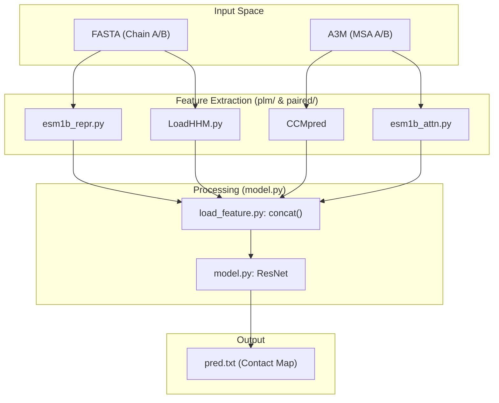
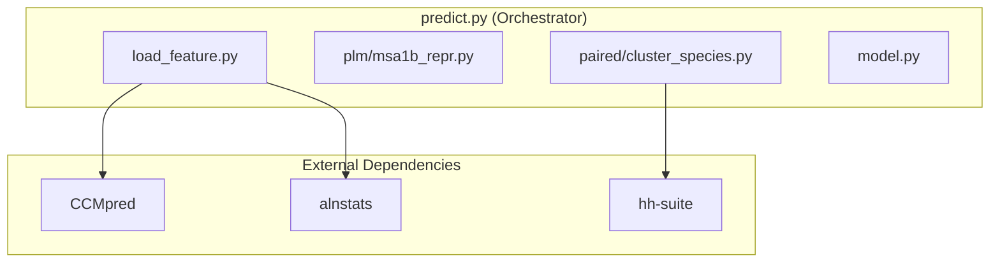

# Overview

> **Relevant source files**
> * [LICENSE](https://github.com/ChengfeiYan/DRN-1D2D_Inter/blob/a54a43b8/LICENSE)
> * [README.md](https://github.com/ChengfeiYan/DRN-1D2D_Inter/blob/a54a43b8/README.md?plain=1)
> * [data/drn.jpg](https://github.com/ChengfeiYan/DRN-1D2D_Inter/blob/a54a43b8/data/drn.jpg)
> * [data/main_fig.jpg](https://github.com/ChengfeiYan/DRN-1D2D_Inter/blob/a54a43b8/data/main_fig.jpg)

DRN-1D2D_Inter is a computational framework designed for **inter-protein contact prediction** using protein sequences as the primary input. It leverages a **Dimensional Hybrid Residual Network (DRN)** combined with features derived from **Protein Language Models (PLMs)** to predict the probability of contact between residues of two interacting proteins [README.md L1-L3](https://github.com/ChengfeiYan/DRN-1D2D_Inter/blob/a54a43b8/README.md?plain=1#L1-L3)

The system integrates evolutionary information from Multiple Sequence Alignments (MSAs) with deep structural representations from ESM-1b and ESM-MSA-1b to produce high-resolution contact maps [README.md L11-L12](https://github.com/ChengfeiYan/DRN-1D2D_Inter/blob/a54a43b8/README.md?plain=1#L11-L12)

### Core Purpose

The primary goal of DRN-1D2D_Inter is to predict physical interactions between two protein chains (Chain A and Chain B). By processing both 1D sequence features and 2D evolutionary coupling data, the model outputs a contact probability matrix where each cell $(i, j)$ represents the likelihood that residue $i$ in Chain A is in contact with residue $j$ in Chain B [README.md L28-L34](https://github.com/ChengfeiYan/DRN-1D2D_Inter/blob/a54a43b8/README.md?plain=1#L28-L34)

### System Architecture Overview

The architecture follows a "Dimensional Hybrid" approach. It transforms 1D per-residue features (like PSSMs and PLM embeddings) into a 2D grid, which is then concatenated with native 2D features (like CCMpred outputs and attention maps) [README.md L1-L3](https://github.com/ChengfeiYan/DRN-1D2D_Inter/blob/a54a43b8/README.md?plain=1#L1-L3)

 This massive feature block (4944 channels) is processed by a specialized ResNet containing multiple `BasicBlock` modules utilizing dilated convolutions of varying kernel sizes (3x3, 1x15, and 15x1) to capture both local and long-range spatial correlations.

For a deep dive into the network layers and feature engineering, see [System Architecture Overview](/ChengfeiYan/DRN-1D2D_Inter/1.2-system-architecture-overview).

#### High-Level Data Flow

The following diagram illustrates the transition from biological sequence data to the final contact prediction, mapping conceptual stages to specific codebase entities.

**Diagram: Pipeline Data Flow**

Sources: [README.md L28-L34](https://github.com/ChengfeiYan/DRN-1D2D_Inter/blob/a54a43b8/README.md?plain=1#L28-L34)

 [README.md L47-L50](https://github.com/ChengfeiYan/DRN-1D2D_Inter/blob/a54a43b8/README.md?plain=1#L47-L50)

### Key Inputs and Outputs

The system requires specific biological data formats for inference:

* **Inputs**: * Target protein sequences in `.fasta` format [README.md L29-L31](https://github.com/ChengfeiYan/DRN-1D2D_Inter/blob/a54a43b8/README.md?plain=1#L29-L31) * Multiple Sequence Alignments (MSAs) in `.a3m` format, typically derived from UniRef databases [README.md L30-L36](https://github.com/ChengfeiYan/DRN-1D2D_Inter/blob/a54a43b8/README.md?plain=1#L30-L36)
* **Outputs**: * A text-based contact map (`pred.txt`) containing the predicted interaction probabilities [README.md L33-L34](https://github.com/ChengfeiYan/DRN-1D2D_Inter/blob/a54a43b8/README.md?plain=1#L33-L34)

### Codebase Entry Points

The project is orchestrated primarily through two top-level scripts:

1. `predict.py`: The main inference engine used to generate predictions for new protein pairs [README.md L21-L28](https://github.com/ChengfeiYan/DRN-1D2D_Inter/blob/a54a43b8/README.md?plain=1#L21-L28)
2. `train.py`: The training script detailing loss calculation (`ppi_loss`) and model selection [README.md L46-L47](https://github.com/ChengfeiYan/DRN-1D2D_Inter/blob/a54a43b8/README.md?plain=1#L46-L47)

**Diagram: System Component Map**

Sources: [README.md L12-L16](https://github.com/ChengfeiYan/DRN-1D2D_Inter/blob/a54a43b8/README.md?plain=1#L12-L16)

 [README.md L21-L22](https://github.com/ChengfeiYan/DRN-1D2D_Inter/blob/a54a43b8/README.md?plain=1#L21-L22)

### Navigation

* **[Getting Started](/ChengfeiYan/DRN-1D2D_Inter/1.1-getting-started)**: Step-by-step setup, including external tool configuration and running the 1GL1 example [README.md L18-L44](https://github.com/ChengfeiYan/DRN-1D2D_Inter/blob/a54a43b8/README.md?plain=1#L18-L44)
* **[System Architecture Overview](/ChengfeiYan/DRN-1D2D_Inter/1.2-system-architecture-overview)**: Detailed breakdown of the 1D-to-2D feature expansion and the ResNet block design [README.md L47-L50](https://github.com/ChengfeiYan/DRN-1D2D_Inter/blob/a54a43b8/README.md?plain=1#L47-L50)