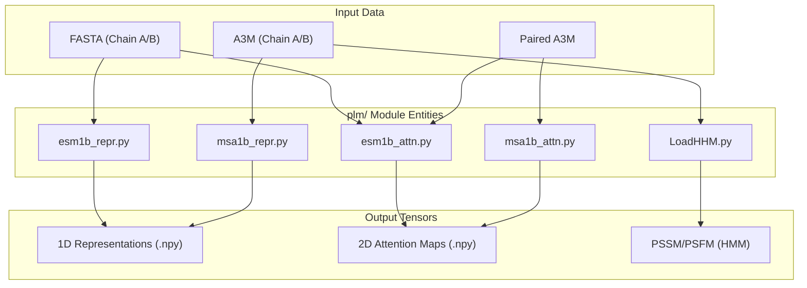
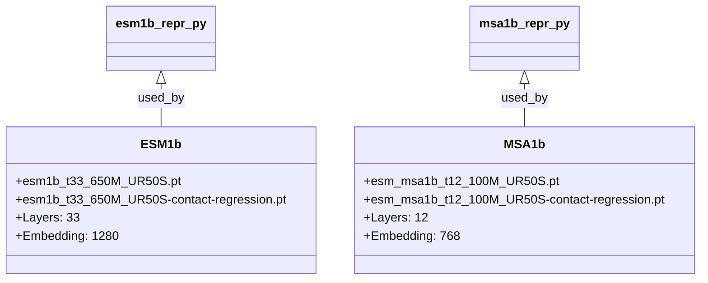

# Protein Language Model Feature Extraction

> **Relevant source files**
> * [data/regression/esm1b_t33_650M_UR50S-contact-regression.pt](https://github.com/ChengfeiYan/DRN-1D2D_Inter/blob/a54a43b8/data/regression/esm1b_t33_650M_UR50S-contact-regression.pt)
> * [data/regression/esm_msa1b_t12_100M_UR50S-contact-regression.pt](https://github.com/ChengfeiYan/DRN-1D2D_Inter/blob/a54a43b8/data/regression/esm_msa1b_t12_100M_UR50S-contact-regression.pt)
> * [plm/LoadHHM.py](https://github.com/ChengfeiYan/DRN-1D2D_Inter/blob/a54a43b8/plm/LoadHHM.py)
> * [plm/esm1b_attn.py](https://github.com/ChengfeiYan/DRN-1D2D_Inter/blob/a54a43b8/plm/esm1b_attn.py)
> * [plm/esm1b_repr.py](https://github.com/ChengfeiYan/DRN-1D2D_Inter/blob/a54a43b8/plm/esm1b_repr.py)
> * [plm/msa1b_attn.py](https://github.com/ChengfeiYan/DRN-1D2D_Inter/blob/a54a43b8/plm/msa1b_attn.py)
> * [plm/msa1b_repr.py](https://github.com/ChengfeiYan/DRN-1D2D_Inter/blob/a54a43b8/plm/msa1b_repr.py)

The `plm/` module is responsible for generating high-dimensional evolutionary and structural representations of protein sequences using state-of-the-art Protein Language Models (PLMs) and Profile Hidden Markov Models (HMMs). These features serve as the primary 1D and 2D inputs for the Dimensional Hybrid Residual Network (DRN).

## PLM Processing Pipeline

The system utilizes two primary models from the Evolutionary Scale Modeling (ESM) family: **ESM-1b** (a single-sequence Transformer) and **ESM-MSA-1b** (a Multiple Sequence Alignment Transformer). These models extract two types of information:

1. **Per-residue representations (1D):** Latent embeddings that capture physicochemical and evolutionary properties of individual residues.
2. **Attention maps (2D):** Cross-chain attention weights that capture potential spatial interactions between residues of Chain A and Chain B.

### Data Flow: Natural Language Space to Code Entity Space

The following diagram illustrates how raw sequence data is transformed into model-ready tensors using specific script entities within the `plm/` module.

**PLM Feature Extraction Workflow**

**Sources:** [plm/esm1b_repr.py L39-L54](https://github.com/ChengfeiYan/DRN-1D2D_Inter/blob/a54a43b8/plm/esm1b_repr.py#L39-L54)

 [plm/msa1b_repr.py L41-L58](https://github.com/ChengfeiYan/DRN-1D2D_Inter/blob/a54a43b8/plm/msa1b_repr.py#L41-L58)

 [plm/esm1b_attn.py L39-L61](https://github.com/ChengfeiYan/DRN-1D2D_Inter/blob/a54a43b8/plm/esm1b_attn.py#L39-L61)

 [plm/msa1b_attn.py L40-L64](https://github.com/ChengfeiYan/DRN-1D2D_Inter/blob/a54a43b8/plm/msa1b_attn.py#L40-L64)

 [plm/LoadHHM.py L6-L15](https://github.com/ChengfeiYan/DRN-1D2D_Inter/blob/a54a43b8/plm/LoadHHM.py#L6-L15)

---

## ESM-1b Feature Extraction

ESM-1b is used to process individual protein chains to generate dense embeddings and cross-chain attention.

### 1D Representations (esm1b_repr.py)

The `main` function loads the `esm1b_t33_650M_UR50S` model [plm/esm1b_repr.py L41-L42](https://github.com/ChengfeiYan/DRN-1D2D_Inter/blob/a54a43b8/plm/esm1b_repr.py#L41-L42)

 It extracts the final hidden state from **layer 33** [plm/esm1b_repr.py L40](https://github.com/ChengfeiYan/DRN-1D2D_Inter/blob/a54a43b8/plm/esm1b_repr.py#L40-L40)

* **Input:** Single chain FASTA file.
* **Processing:** The sequence is converted to tokens via `alphabet.get_batch_converter()` [plm/esm1b_repr.py L43-L46](https://github.com/ChengfeiYan/DRN-1D2D_Inter/blob/a54a43b8/plm/esm1b_repr.py#L43-L46)
* **Output:** A `.npy` file containing a tensor of shape `(L, 1280)`, where `L` is the sequence length [plm/esm1b_repr.py L52-L54](https://github.com/ChengfeiYan/DRN-1D2D_Inter/blob/a54a43b8/plm/esm1b_repr.py#L52-L54)

### 2D Attention Maps (esm1b_attn.py)

This script extracts the internal attention weights of the Transformer when Chain A and Chain B are concatenated as a single input sequence.

* **Logic:** It calculates the attention between the indices corresponding to Chain A and Chain B [plm/esm1b_attn.py L57-L58](https://github.com/ChengfeiYan/DRN-1D2D_Inter/blob/a54a43b8/plm/esm1b_attn.py#L57-L58)
* **Slicing:** `rt_attn` captures $A \to B$ attention, while `sw_attn` captures $B \to A$ attention [plm/esm1b_attn.py L57-L58](https://github.com/ChengfeiYan/DRN-1D2D_Inter/blob/a54a43b8/plm/esm1b_attn.py#L57-L58)
* **Sources:** [plm/esm1b_attn.py L39-L61](https://github.com/ChengfeiYan/DRN-1D2D_Inter/blob/a54a43b8/plm/esm1b_attn.py#L39-L61)

---

## ESM-MSA-1b Feature Extraction

ESM-MSA-1b processes Multiple Sequence Alignments (MSAs) to leverage co-evolutionary signals.

### MSA Representations (msa1b_repr.py)

The model `esm_msa1b_t12_100M_UR50S` is used to process an MSA of up to 256 sequences [plm/msa1b_repr.py L44-L47](https://github.com/ChengfeiYan/DRN-1D2D_Inter/blob/a54a43b8/plm/msa1b_repr.py#L44-L47)

* **Layer:** Features are extracted from **layer 12** [plm/msa1b_repr.py L43](https://github.com/ChengfeiYan/DRN-1D2D_Inter/blob/a54a43b8/plm/msa1b_repr.py#L43-L43)
* **Output:** The representation of the first sequence (the query) in the MSA is saved, resulting in a `(L, 768)` tensor [plm/msa1b_repr.py L56-L58](https://github.com/ChengfeiYan/DRN-1D2D_Inter/blob/a54a43b8/plm/msa1b_repr.py#L56-L58)

### MSA Attention Maps (msa1b_attn.py)

This script extracts `row_attentions` from the MSA Transformer [plm/msa1b_attn.py L60](https://github.com/ChengfeiYan/DRN-1D2D_Inter/blob/a54a43b8/plm/msa1b_attn.py#L60-L60)

* **Interaction Mapping:** Similar to the ESM-1b version, it slices the attention matrix to isolate cross-chain interactions between the paired MSA segments of Chain A and Chain B [plm/msa1b_attn.py L60-L61](https://github.com/ChengfeiYan/DRN-1D2D_Inter/blob/a54a43b8/plm/msa1b_attn.py#L60-L61)
* **Sources:** [plm/msa1b_attn.py L40-L64](https://github.com/ChengfeiYan/DRN-1D2D_Inter/blob/a54a43b8/plm/msa1b_attn.py#L40-L64)

---

## HMM Profile Generation (LoadHHM.py)

Outside of deep learning models, the pipeline incorporates traditional evolutionary profiles via HH-suite `.hhm` files.

### Implementation Details

The `LoadHHM.py` script parses HMM files to generate two types of matrices:

1. **PSFM (Position-Specific Frequency Matrix):** Derived from the HMM transitions and emissions [plm/LoadHHM.py L9](https://github.com/ChengfeiYan/DRN-1D2D_Inter/blob/a54a43b8/plm/LoadHHM.py#L9-L9)
2. **PSSM (Position-Specific Scoring Matrix):** Encodes the profile HMM information into a scoring format [plm/LoadHHM.py L10-L12](https://github.com/ChengfeiYan/DRN-1D2D_Inter/blob/a54a43b8/plm/LoadHHM.py#L10-L12)

### Amino Acid Mapping

The script handles the conversion between 1-letter and 3-letter amino acid codes and maps them to a specific alphabetical order for consistency across all features [plm/LoadHHM.py L22-L33](https://github.com/ChengfeiYan/DRN-1D2D_Inter/blob/a54a43b8/plm/LoadHHM.py#L22-L33)

 It also includes a `gonnet` mutation probability matrix for secondary structural considerations [plm/LoadHHM.py L65-L88](https://github.com/ChengfeiYan/DRN-1D2D_Inter/blob/a54a43b8/plm/LoadHHM.py#L65-L88)

**HMM Feature Components**

| Feature Key | Description | Dimensions |
| --- | --- | --- |
| `PSSM` | Log-odds scores for 20 amino acids | `(L, 20)` |
| `PSFM` | Observed frequencies for 20 amino acids | `(L, 20)` |
| `HMMNull` | Background scores for amino acids | `(20,)` |

**Sources:** [plm/LoadHHM.py L17-L61](https://github.com/ChengfeiYan/DRN-1D2D_Inter/blob/a54a43b8/plm/LoadHHM.py#L17-L61)

 [plm/LoadHHM.py L90-L94](https://github.com/ChengfeiYan/DRN-1D2D_Inter/blob/a54a43b8/plm/LoadHHM.py#L90-L94)

---

## Model Weight Management

The PLM module relies on pre-trained weights and regression heads stored in the `data/regression/` directory.

**PLM Weight Dependencies**

**Sources:** [data/regression/esm1b_t33_650M_UR50S-contact-regression.pt L3-L10](https://github.com/ChengfeiYan/DRN-1D2D_Inter/blob/a54a43b8/data/regression/esm1b_t33_650M_UR50S-contact-regression.pt#L3-L10)

 [data/regression/esm_msa1b_t12_100M_UR50S-contact-regression.pt L1-L8](https://github.com/ChengfeiYan/DRN-1D2D_Inter/blob/a54a43b8/data/regression/esm_msa1b_t12_100M_UR50S-contact-regression.pt#L1-L8)