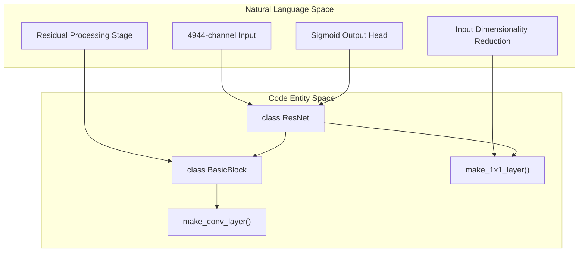
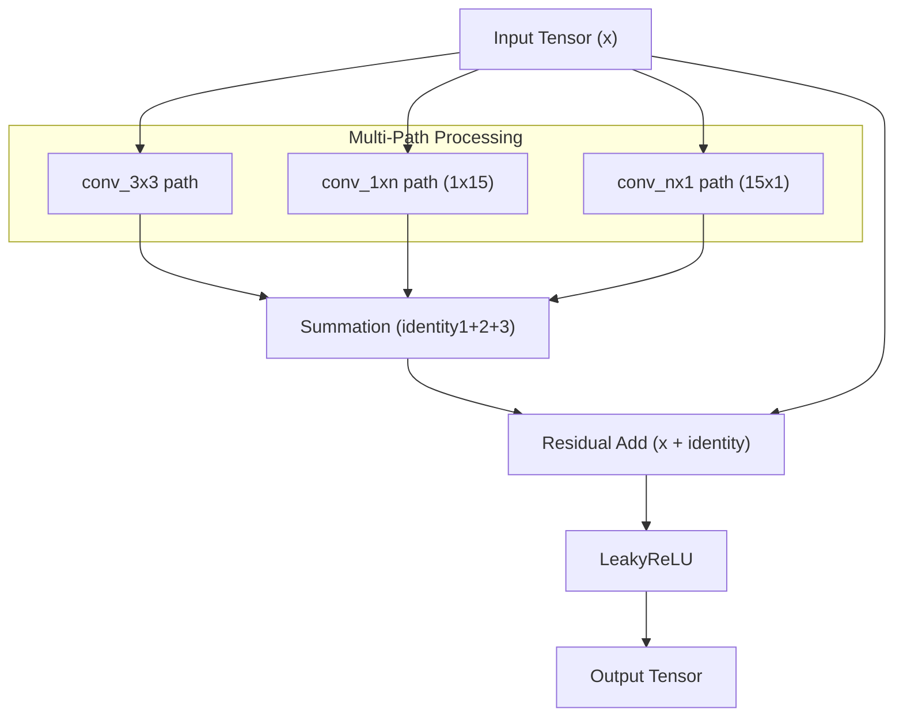

# ResNet and BasicBlock Design

> **Relevant source files**
> * [load_feature.py](https://github.com/ChengfeiYan/DRN-1D2D_Inter/blob/a54a43b8/load_feature.py)
> * [model.py](https://github.com/ChengfeiYan/DRN-1D2D_Inter/blob/a54a43b8/model.py)

This page provides a technical deep dive into the **Dimensional Hybrid Residual Network (DRN)** architecture defined in `model.py`. The model is designed to process high-dimensional genomic and language model features to predict inter-protein contact probabilities. It utilizes a custom residual block strategy that combines standard 2D convolutions with asymmetric kernels to capture both local and long-range spatial dependencies.

## ResNet Architecture

The `ResNet` class in `model.py` serves as the primary backbone for contact prediction. It is characterized by a high-dimensional input projection, a series of deep residual blocks, and a sigmoid output head for binary classification (contact vs. non-contact).

### Global Configuration

The network is configured with the following parameters:

* **Input Channels**: 4944. This reflects the concatenation of 1D features (PSSM, ESM-1b, MSA-1b) and 2D features (CCMpred, alnstats, attention maps) [model.py L160](https://github.com/ChengfeiYan/DRN-1D2D_Inter/blob/a54a43b8/model.py#L160-L160)
* **Hidden Channels**: 96. The input is projected down to this width to maintain computational efficiency through the residual blocks [model.py L158-L166](https://github.com/ChengfeiYan/DRN-1D2D_Inter/blob/a54a43b8/model.py#L158-L166)
* **Depth**: Typically 9 `BasicBlock` units [model.py L156](https://github.com/ChengfeiYan/DRN-1D2D_Inter/blob/a54a43b8/model.py#L156-L156)
* **Output**: A single channel representing the contact probability map [model.py L171-L177](https://github.com/ChengfeiYan/DRN-1D2D_Inter/blob/a54a43b8/model.py#L171-L177)

### Data Flow and Layer Composition

The model processes data through three distinct stages:

1. **First Layer**: A $1 \times 1$ convolution that reduces the input dimensionality from 4944 to 96, followed by `InstanceNorm2d` and `LeakyReLU` [model.py L160-L166](https://github.com/ChengfeiYan/DRN-1D2D_Inter/blob/a54a43b8/model.py#L160-L166)
2. **Hidden Layers**: A sequence of `BasicBlock` modules that perform the bulk of the feature extraction using residual learning [model.py L168-L169](https://github.com/ChengfeiYan/DRN-1D2D_Inter/blob/a54a43b8/model.py#L168-L169)
3. **Output Layer**: A final $1 \times 1$ convolution that reduces the 96 hidden channels to 1, followed by a `Sigmoid` activation to produce probabilities in the range $[0, 1]$ [model.py L171-L179](https://github.com/ChengfeiYan/DRN-1D2D_Inter/blob/a54a43b8/model.py#L171-L179)

### Model Initialization

The network uses **Kaiming Normal Initialization** (also known as He initialization) for all `nn.Conv2d` layers. Specifically, it uses `mode='fan_in'` and a negative slope of 0.01 to match the `LeakyReLU` activations [model.py L181-L183](https://github.com/ChengfeiYan/DRN-1D2D_Inter/blob/a54a43b8/model.py#L181-L183)

**Sources:**

* [model.py L154-L183](https://github.com/ChengfeiYan/DRN-1D2D_Inter/blob/a54a43b8/model.py#L154-L183)

---

## BasicBlock Design

The `BasicBlock` is the core computational unit of the DRN. Unlike standard ResNet blocks that use simple $3 \times 3$ stacks, this implementation employs a multi-path strategy to handle the anisotropic nature of protein-protein interactions.

### Multi-Path Convolution Strategy

Each block contains a standard 3x3 path and, depending on the dilation rate, additional asymmetric paths:

* **3x3 Path**: Captures local 2D spatial context [model.py L93-L99](https://github.com/ChengfeiYan/DRN-1D2D_Inter/blob/a54a43b8/model.py#L93-L99)
* **1x15 Path**: Captures long-range horizontal dependencies (residues in chain B) [model.py L102-L108](https://github.com/ChengfeiYan/DRN-1D2D_Inter/blob/a54a43b8/model.py#L102-L108)
* **15x1 Path**: Captures long-range vertical dependencies (residues in chain A) [model.py L110-L116](https://github.com/ChengfeiYan/DRN-1D2D_Inter/blob/a54a43b8/model.py#L110-L116)

The asymmetric paths ($1 \times 15$ and $15 \times 1$) are only activated if the `dilated_rate` is within the `threshold` list: `[1, 20, 40]` [model.py L89-L101](https://github.com/ChengfeiYan/DRN-1D2D_Inter/blob/a54a43b8/model.py#L89-L101)

### Logic Flow within BasicBlock

The forward pass implements a residual connection where the sum of the multi-path outputs is added back to the input:

1. Calculate `identity1` via `conv_3x3(x)`.
2. If dilation is in threshold, calculate `identity2` ($1 \times 15$) and `identity3` ($15 \times 1$).
3. Sum the paths: `identity = identity1 + identity2 + identity3` [model.py L141](https://github.com/ChengfeiYan/DRN-1D2D_Inter/blob/a54a43b8/model.py#L141-L141)
4. Apply residual connection: `out = x + identity` [model.py L146](https://github.com/ChengfeiYan/DRN-1D2D_Inter/blob/a54a43b8/model.py#L146-L146)
5. Apply final `LeakyReLU` [model.py L149](https://github.com/ChengfeiYan/DRN-1D2D_Inter/blob/a54a43b8/model.py#L149-L149)

### Component Details

* **InstanceNorm2d**: Used for normalization to ensure stability across different protein lengths and feature scales [model.py L43-L44](https://github.com/ChengfeiYan/DRN-1D2D_Inter/blob/a54a43b8/model.py#L43-L44)
* **LeakyReLU**: Uses a negative slope of 0.01 to prevent "dying ReLU" neurons [model.py L46](https://github.com/ChengfeiYan/DRN-1D2D_Inter/blob/a54a43b8/model.py#L46-L46)
* **Dilated Convolutions**: The `dilated_rate` is applied to all paths to expand the receptive field without increasing the number of parameters [model.py L99-L116](https://github.com/ChengfeiYan/DRN-1D2D_Inter/blob/a54a43b8/model.py#L99-L116)

**Sources:**

* [model.py L78-L151](https://github.com/ChengfeiYan/DRN-1D2D_Inter/blob/a54a43b8/model.py#L78-L151)
* [model.py L28-L56](https://github.com/ChengfeiYan/DRN-1D2D_Inter/blob/a54a43b8/model.py#L28-L56)  (make_conv_layer helper)

---

## Architectural Diagrams

### System Entity Mapping

The following diagram bridges the high-level architecture concepts to the specific code entities in `model.py`.

**Model Structure to Code Entity Map**

**Sources:**

* [model.py L154-L183](https://github.com/ChengfeiYan/DRN-1D2D_Inter/blob/a54a43b8/model.py#L154-L183)
* [model.py L78-L83](https://github.com/ChengfeiYan/DRN-1D2D_Inter/blob/a54a43b8/model.py#L78-L83)

### Data Flow in BasicBlock

This diagram illustrates how a single `BasicBlock` processes the input tensor using the multi-path strategy.

**BasicBlock Multi-Path Execution**

**Sources:**

* [model.py L127-L151](https://github.com/ChengfeiYan/DRN-1D2D_Inter/blob/a54a43b8/model.py#L127-L151)
* [model.py L89-L116](https://github.com/ChengfeiYan/DRN-1D2D_Inter/blob/a54a43b8/model.py#L89-L116)

---

## Feature Concatenation Logic

Before entering the `ResNet`, 1D and 2D features must be aligned. The `concat` function performs a "tiling" operation to expand 1D features into the 2D spatial grid.

| Feature Type | Source | Processing Logic |
| --- | --- | --- |
| **1D Chain A** | `A_f1d` | Repeated along the column axis to match Chain B length [model.py L21](https://github.com/ChengfeiYan/DRN-1D2D_Inter/blob/a54a43b8/model.py#L21-L21) |
| **1D Chain B** | `B_f1d` | Repeated along the row axis to match Chain A length [model.py L22](https://github.com/ChengfeiYan/DRN-1D2D_Inter/blob/a54a43b8/model.py#L22-L22) |
| **2D Paired** | `p2d` | Concatenated directly with the expanded 1D features [model.py L25](https://github.com/ChengfeiYan/DRN-1D2D_Inter/blob/a54a43b8/model.py#L25-L25) |

This results in a tensor where every pixel $(i, j)$ contains the concatenated features of residue $i$ from Chain A, residue $j$ from Chain B, and the pairwise features calculated between them.

**Sources:**

* [model.py L13-L25](https://github.com/ChengfeiYan/DRN-1D2D_Inter/blob/a54a43b8/model.py#L13-L25)
* [load_feature.py L16-L27](https://github.com/ChengfeiYan/DRN-1D2D_Inter/blob/a54a43b8/load_feature.py#L16-L27)