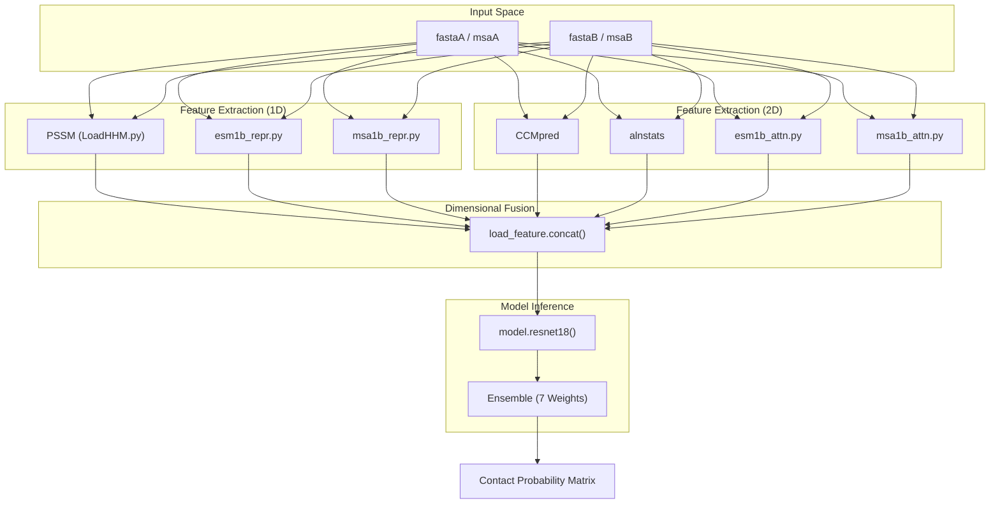
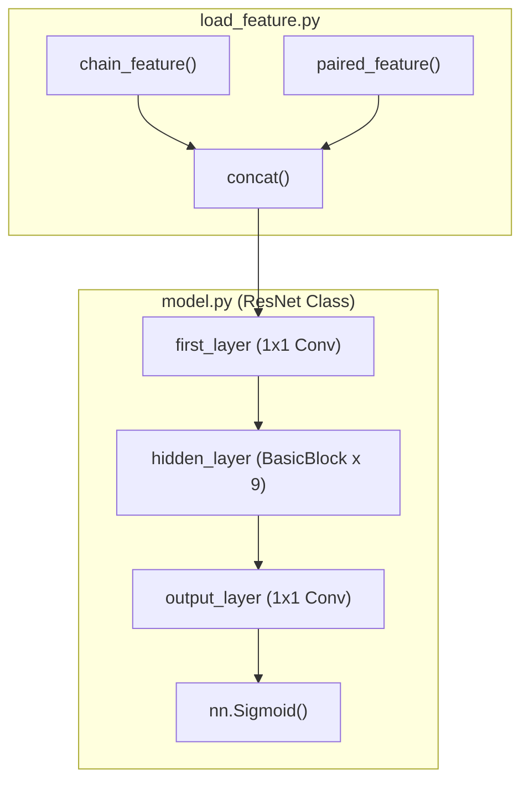

# System Architecture Overview

> **Relevant source files**
> * [LICENSE](https://github.com/ChengfeiYan/DRN-1D2D_Inter/blob/a54a43b8/LICENSE)
> * [README.md](https://github.com/ChengfeiYan/DRN-1D2D_Inter/blob/a54a43b8/README.md?plain=1)
> * [load_feature.py](https://github.com/ChengfeiYan/DRN-1D2D_Inter/blob/a54a43b8/load_feature.py)
> * [model.py](https://github.com/ChengfeiYan/DRN-1D2D_Inter/blob/a54a43b8/model.py)
> * [predict.py](https://github.com/ChengfeiYan/DRN-1D2D_Inter/blob/a54a43b8/predict.py)

The **DRN-1D2D_Inter** system implements a Dimensional Hybrid Residual Network (DRN) designed for inter-protein contact prediction. The core innovation lies in its ability to fuse 1D per-residue features (from Protein Language Models and PSSMs) with 2D evolutionary and attention-based features into a unified 2D interaction map. This map is processed through a specialized ResNet architecture that utilizes multi-path convolutions to capture spatial relationships across protein interfaces.

### Dimensional Hybrid Approach

The architecture operates by transforming sequence-level information into a spatial grid representing the interface between two protein chains (Chain A and Chain B).

1. **1D Feature Extraction**: Per-residue features are extracted for each chain independently, including PSSMs and representations from ESM-1b and ESM-MSA-1b [predict.py L114-L142](https://github.com/ChengfeiYan/DRN-1D2D_Inter/blob/a54a43b8/predict.py#L114-L142)
2. **2D Feature Extraction**: Inter-chain features are derived from paired Multiple Sequence Alignments (MSAs), including CCMpred evolutionary couplings and cross-chain attention maps from transformer-based language models [predict.py L46-L110](https://github.com/ChengfeiYan/DRN-1D2D_Inter/blob/a54a43b8/predict.py#L46-L110)
3. **Dimensional Fusion**: The 1D features of length $L_A$ and $L_B$ are expanded into 2D matrices of shape $(L_A \times L_B)$ and concatenated with the native 2D features to form a high-dimensional input tensor [load_feature.py L16-L27](https://github.com/ChengfeiYan/DRN-1D2D_Inter/blob/a54a43b8/load_feature.py#L16-L27)
4. **Residual Processing**: A Dimensional Hybrid Residual Network processes this tensor using a combination of standard $3 \times 3$ convolutions and asymmetric $1 \times 15 / 15 \times 1$ convolutions to capture long-range dependencies [model.py L93-L116](https://github.com/ChengfeiYan/DRN-1D2D_Inter/blob/a54a43b8/model.py#L93-L116)

#### Data Flow: From Sequence to Contact Map

The following diagram illustrates the transformation of data from raw sequences to the final probability matrix.

**DRN-1D2D_Inter Data Flow**

**Sources:** [predict.py L44-L177](https://github.com/ChengfeiYan/DRN-1D2D_Inter/blob/a54a43b8/predict.py#L44-L177)

 [load_feature.py L16-L27](https://github.com/ChengfeiYan/DRN-1D2D_Inter/blob/a54a43b8/load_feature.py#L16-L27)

 [model.py L160-L179](https://github.com/ChengfeiYan/DRN-1D2D_Inter/blob/a54a43b8/model.py#L160-L179)

---

### Component Architecture

The system is organized into distinct modules for feature generation and deep learning inference.

#### 1. Feature Aggregation (load_feature.py)

The `chain_feature` function aggregates 1D data into a single vector per residue, while `paired_feature` prepares the 2D inter-chain data [load_feature.py L42-L102](https://github.com/ChengfeiYan/DRN-1D2D_Inter/blob/a54a43b8/load_feature.py#L42-L102)

 The critical `concat` function performs the dimensional expansion: it repeats Chain A's features across columns and Chain B's features across rows to create a 2D grid that matches the dimensions of the inter-chain attention and evolutionary maps [load_feature.py L16-L27](https://github.com/ChengfeiYan/DRN-1D2D_Inter/blob/a54a43b8/load_feature.py#L16-L27)

#### 2. Dimensional Hybrid Residual Network (model.py)

The model is a modified ResNet-18 architecture. Unlike standard ResNets, the `BasicBlock` here is "Dimensional Hybrid" because it applies three parallel convolutional paths to the input [model.py L78-L151](https://github.com/ChengfeiYan/DRN-1D2D_Inter/blob/a54a43b8/model.py#L78-L151)

:

* **Square Path**: $3 \times 3$ convolutions for local spatial patterns.
* **Horizontal Path**: $1 \times 15$ convolutions to capture long-range information along one protein chain.
* **Vertical Path**: $15 \times 1$ convolutions to capture long-range information along the partner chain.

**Code Entity Mapping: Feature to Model**

**Sources:** [load_feature.py L16-L102](https://github.com/ChengfeiYan/DRN-1D2D_Inter/blob/a54a43b8/load_feature.py#L16-L102)

 [model.py L154-L180](https://github.com/ChengfeiYan/DRN-1D2D_Inter/blob/a54a43b8/model.py#L154-L180)

### System Specifications

| Component | Specification | Source |
| --- | --- | --- |
| **Input Channels** | 4944 (PSSM, ESM-1b/MSA-1b Repr & Attn, CCMpred, alnstats) | [model.py L160](https://github.com/ChengfeiYan/DRN-1D2D_Inter/blob/a54a43b8/model.py#L160-L160) |
| **Hidden Channels** | 96 | [model.py L158](https://github.com/ChengfeiYan/DRN-1D2D_Inter/blob/a54a43b8/model.py#L158-L158) |
| **Blocks** | 9 `BasicBlock` instances | [predict.py L159-L160](https://github.com/ChengfeiYan/DRN-1D2D_Inter/blob/a54a43b8/predict.py#L159-L160) |
| **Normalization** | `InstanceNorm2d` | [model.py L43-L52](https://github.com/ChengfeiYan/DRN-1D2D_Inter/blob/a54a43b8/model.py#L43-L52) |
| **Activation** | `LeakyReLU` (slope 0.01) | [model.py L46-L86](https://github.com/ChengfeiYan/DRN-1D2D_Inter/blob/a54a43b8/model.py#L46-L86) |
| **Ensemble Size** | 7 models | [predict.py L159](https://github.com/ChengfeiYan/DRN-1D2D_Inter/blob/a54a43b8/predict.py#L159-L159) |

### Inference Logic

During inference in `predict.py`, the system performs two passes for every protein pair:

1. **Real-Time (RT) Input**: Predicts contacts for Chain A $\to$ Chain B orientation [predict.py L153](https://github.com/ChengfeiYan/DRN-1D2D_Inter/blob/a54a43b8/predict.py#L153-L153)
2. **Switch (SW) Input**: Predicts contacts for Chain B $\to$ Chain A orientation [predict.py L154](https://github.com/ChengfeiYan/DRN-1D2D_Inter/blob/a54a43b8/predict.py#L154-L154)

The results are averaged and symmetrized by transposing the SW prediction results before final output [predict.py L171-L177](https://github.com/ChengfeiYan/DRN-1D2D_Inter/blob/a54a43b8/predict.py#L171-L177)

**Sources:** [predict.py L153-L177](https://github.com/ChengfeiYan/DRN-1D2D_Inter/blob/a54a43b8/predict.py#L153-L177)

 [load_feature.py L61-L102](https://github.com/ChengfeiYan/DRN-1D2D_Inter/blob/a54a43b8/load_feature.py#L61-L102)

 [model.py L78-L180](https://github.com/ChengfeiYan/DRN-1D2D_Inter/blob/a54a43b8/model.py#L78-L180)