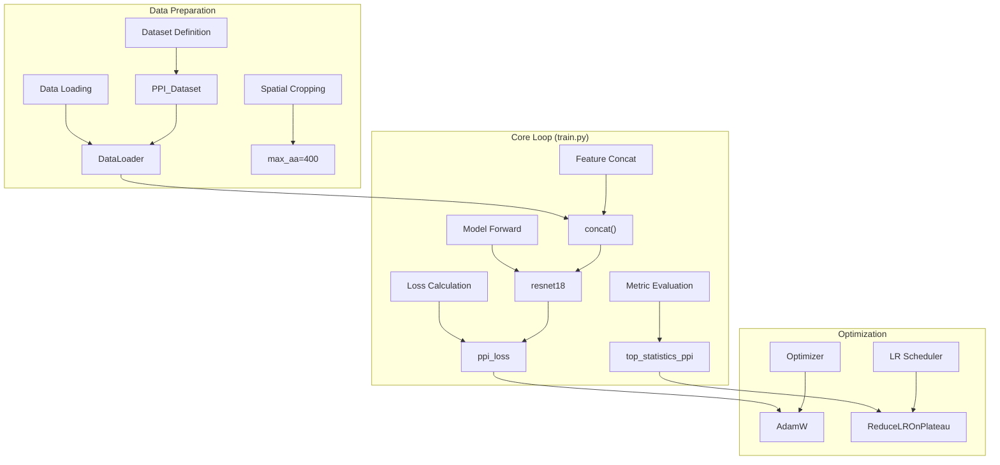
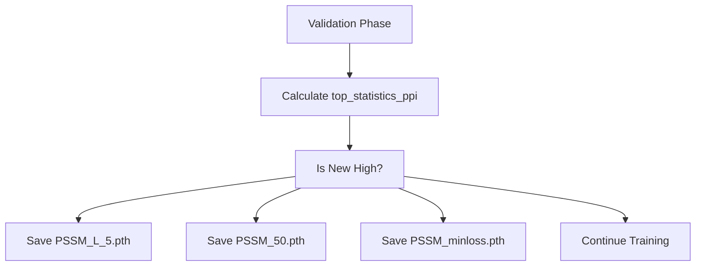

# Training Pipeline

> **Relevant source files**
> * [train.py](https://github.com/ChengfeiYan/DRN-1D2D_Inter/blob/a54a43b8/train.py)

The training system for DRN-1D2D_Inter is implemented in `train.py`. It orchestrates the end-to-end learning process, including dataset management, spatial cropping for memory efficiency, loss calculation, and a multi-metric model selection strategy. The pipeline is designed to handle high-dimensional protein features and predict inter-protein contact maps by optimizing a masked binary cross-entropy loss.

### Training System Overview

The training process utilizes a Dimensional Hybrid Residual Network (DRN) to learn from paired protein features. The pipeline follows a standard deep learning loop but includes specific bioinformatics logic such as handling variable-length protein sequences and applying masks to focus on inter-chain interactions.

#### Data Flow and Code Mapping

The following diagram illustrates how the natural language concepts of the training pipeline map to specific code entities in `train.py`.

**Training System Mapping**

Sources: [train.py L9-L20](https://github.com/ChengfeiYan/DRN-1D2D_Inter/blob/a54a43b8/train.py#L9-L20)

 [train.py L55-L61](https://github.com/ChengfeiYan/DRN-1D2D_Inter/blob/a54a43b8/train.py#L55-L61)

 [train.py L68-L75](https://github.com/ChengfeiYan/DRN-1D2D_Inter/blob/a54a43b8/train.py#L68-L75)

 [train.py L141-L147](https://github.com/ChengfeiYan/DRN-1D2D_Inter/blob/a54a43b8/train.py#L141-L147)

---

### Dataset and Data Loading

The training pipeline uses the `PPI_Dataset` class to manage protein pairs. Data is partitioned into training and validation sets based on predefined lists (`hetero_lists`). To maintain computational efficiency and handle GPU memory constraints, the pipeline implements a spatial cropping mechanism that limits the residue length of protein chains during training.

**Key Components:**

* **Data Split:** The system splits `hetero_lists` into training and validation subsets [train.py L52-L53](https://github.com/ChengfeiYan/DRN-1D2D_Inter/blob/a54a43b8/train.py#L52-L53)
* **DataLoader:** Configured with `num_workers=6` and `prefetch_factor=3` to ensure the GPU remains saturated with data [train.py L56-L61](https://github.com/ChengfeiYan/DRN-1D2D_Inter/blob/a54a43b8/train.py#L56-L61)
* **Spatial Cropping:** Protein sequences exceeding `max_aa = 400` are randomly cropped to a 400x400 window during the training phase to ensure consistent tensor shapes [train.py L130-L138](https://github.com/ChengfeiYan/DRN-1D2D_Inter/blob/a54a43b8/train.py#L130-L138)

For details, see [Dataset and Data Loading](/ChengfeiYan/DRN-1D2D_Inter/4.1-dataset-and-data-loading).

Sources: [train.py L52-L63](https://github.com/ChengfeiYan/DRN-1D2D_Inter/blob/a54a43b8/train.py#L52-L63)

 [train.py L130-L139](https://github.com/ChengfeiYan/DRN-1D2D_Inter/blob/a54a43b8/train.py#L130-L139)

---

### Loss Function and Evaluation Metrics

The model is optimized using a specialized loss function designed for contact prediction and evaluated against multiple precision benchmarks.

**Optimization Logic:**

* **Loss Function:** The `ppi_loss` function computes a masked binary cross-entropy, ensuring that only valid inter-protein residues (defined by `mask_map`) contribute to the gradient [train.py L70](https://github.com/ChengfeiYan/DRN-1D2D_Inter/blob/a54a43b8/train.py#L70-L70)  [train.py L147](https://github.com/ChengfeiYan/DRN-1D2D_Inter/blob/a54a43b8/train.py#L147-L147)
* **Metrics:** Accuracy is tracked using `top_statistics_ppi`, which calculates precision at various thresholds: $L/5, L/10, L/20$ and top-K ($50, 20, 10, 5, 1$) [train.py L81](https://github.com/ChengfeiYan/DRN-1D2D_Inter/blob/a54a43b8/train.py#L81-L81)  [train.py L159](https://github.com/ChengfeiYan/DRN-1D2D_Inter/blob/a54a43b8/train.py#L159-L159)
* **Scheduling:** A `ReduceLROnPlateau` scheduler monitors validation loss and reduces the learning rate by a factor of 0.1 when progress stalls [train.py L74-L75](https://github.com/ChengfeiYan/DRN-1D2D_Inter/blob/a54a43b8/train.py#L74-L75)

For details, see [Loss Function and Evaluation Metrics](/ChengfeiYan/DRN-1D2D_Inter/4.2-loss-function-and-evaluation-metrics).

Sources: [train.py L70-L75](https://github.com/ChengfeiYan/DRN-1D2D_Inter/blob/a54a43b8/train.py#L70-L75)

 [train.py L81-L85](https://github.com/ChengfeiYan/DRN-1D2D_Inter/blob/a54a43b8/train.py#L81-L85)

 [train.py L159-L160](https://github.com/ChengfeiYan/DRN-1D2D_Inter/blob/a54a43b8/train.py#L159-L160)

---

### Model Selection and Persistence

Unlike standard training pipelines that save only the "best" model based on total loss, this system employs a multi-metric saving strategy.

**Saving Strategy:**

1. **Metric-Specific Checkpoints:** The system maintains the best performing weights for *every* metric in `topk_ppi` (e.g., one model optimized for $L/5$ precision, another for Top-50) [train.py L181-L190](https://github.com/ChengfeiYan/DRN-1D2D_Inter/blob/a54a43b8/train.py#L181-L190)
2. **Min-Loss Checkpoint:** A separate checkpoint is saved for the absolute minimum validation loss [train.py L192-L196](https://github.com/ChengfeiYan/DRN-1D2D_Inter/blob/a54a43b8/train.py#L192-L196)
3. **State Persistence:** Training statistics, including loss history and accuracy trends, are persisted in `dict_statics` and periodically saved to disk via `pickle` [train.py L82-L85](https://github.com/ChengfeiYan/DRN-1D2D_Inter/blob/a54a43b8/train.py#L82-L85)  [train.py L198-L200](https://github.com/ChengfeiYan/DRN-1D2D_Inter/blob/a54a43b8/train.py#L198-L200)

**Model Selection Workflow**

Sources: [train.py L88-L100](https://github.com/ChengfeiYan/DRN-1D2D_Inter/blob/a54a43b8/train.py#L88-L100)

 [train.py L181-L196](https://github.com/ChengfeiYan/DRN-1D2D_Inter/blob/a54a43b8/train.py#L181-L196)