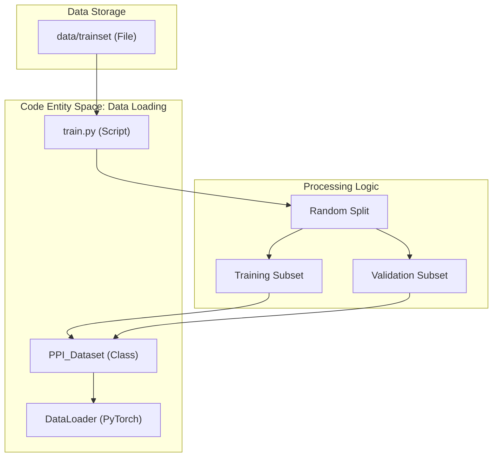
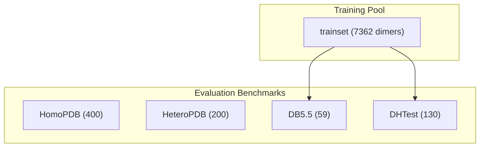

# Training Set

> **Relevant source files**
> * [data/HeteroPDB](https://github.com/ChengfeiYan/DRN-1D2D_Inter/blob/a54a43b8/data/HeteroPDB)
> * [data/HomoPDB](https://github.com/ChengfeiYan/DRN-1D2D_Inter/blob/a54a43b8/data/HomoPDB)
> * [data/README.md](https://github.com/ChengfeiYan/DRN-1D2D_Inter/blob/a54a43b8/data/README.md?plain=1)
> * [data/trainset](https://github.com/ChengfeiYan/DRN-1D2D_Inter/blob/a54a43b8/data/trainset)

The training set for DRN-1D2D_Inter consists of a curated collection of protein dimers used to optimize the Dimensional Hybrid Residual Network. It encompasses both homodimeric and heterodimeric complexes to ensure the model generalizes across different types of protein-protein interactions (PPI).

## Dataset Composition

The primary training resource is the `trainset` file, which contains **7,362 dimers** [data/README.md L1](https://github.com/ChengfeiYan/DRN-1D2D_Inter/blob/a54a43b8/data/README.md?plain=1#L1-L1)

 This dataset serves as the foundation for both training and internal validation during the model development process.

### Homodimers vs. Heterodimers

The dataset includes a mixture of:

* **Homodimers:** Complexes formed by two identical protein chains.
* **Heterodimers:** Complexes formed by two different protein chains.

In the `trainset` file, entries are identified by their PDB ID and the specific chain identifiers involved in the interaction (e.g., `1EGJ_A_1EGJ_H` or `3W8H_A_3W8H_B`) [data/trainset L1-L2](https://github.com/ChengfeiYan/DRN-1D2D_Inter/blob/a54a43b8/data/trainset#L1-L2)

### Data Statistics

| Category | Count |
| --- | --- |
| Total Dimers | 7,362 |
| Purpose | Training & Validation |

**Sources:** [data/README.md L1](https://github.com/ChengfeiYan/DRN-1D2D_Inter/blob/a54a43b8/data/README.md?plain=1#L1-L1)

 [data/trainset L1-L421](https://github.com/ChengfeiYan/DRN-1D2D_Inter/blob/a54a43b8/data/trainset#L1-L421)

## Partitioning and Loading

During the execution of the training pipeline, the dataset is managed by the `PPI_Dataset` class and partitioned into training and validation subsets.

### Implementation Flow

The training script `train.py` utilizes a list-based approach to load these dimers. The `hetero_lists` variable (derived from the `trainset` file) is typically split to create a validation set, allowing the monitor of performance on unseen data during the training epochs.

The following diagram illustrates how the `trainset` is processed into the training environment:

**Training Data Flow Architecture**

### Data Loading Constraints

To maintain computational efficiency and handle memory limits, the system applies specific constraints during the loading of the training set:

* **Spatial Cropping:** The `PPI_Dataset` handles cropping of the interaction maps to a maximum residue length (typically `max_aa=400`) to ensure uniform tensor shapes for the ResNet.
* **Masking:** A `mask_map` is constructed for each dimer to ensure the loss function only considers valid residue pairs (excluding padding).
* **Parallelism:** The `DataLoader` is configured with `num_workers=6` and `prefetch_factor=3` to maximize GPU utilization.

**Sources:** [train.py (conceptual usage of data/trainset)](https://github.com/ChengfeiYan/DRN-1D2D_Inter/blob/a54a43b8/train.py (conceptual usage of data/trainset))

 [data/trainset L1-L20](https://github.com/ChengfeiYan/DRN-1D2D_Inter/blob/a54a43b8/data/trainset#L1-L20)

## Redundancy Control

To ensure the integrity of evaluation, redundancy was strictly controlled between the `trainset` and the various benchmark test sets. For benchmarks like **DB5.5** and **DHTest**, dimers were filtered to remove any sequences that shared significant similarity with those in the 7,362-dimer training set [data/README.md L7-L9](https://github.com/ChengfeiYan/DRN-1D2D_Inter/blob/a54a43b8/data/README.md?plain=1#L7-L9)

**Relationship between Datasets**

**Sources:** [data/README.md L1-L9](https://github.com/ChengfeiYan/DRN-1D2D_Inter/blob/a54a43b8/data/README.md?plain=1#L1-L9)

 [data/HomoPDB L1-L10](https://github.com/ChengfeiYan/DRN-1D2D_Inter/blob/a54a43b8/data/HomoPDB#L1-L10)

 [data/HeteroPDB L1-L10](https://github.com/ChengfeiYan/DRN-1D2D_Inter/blob/a54a43b8/data/HeteroPDB#L1-L10)