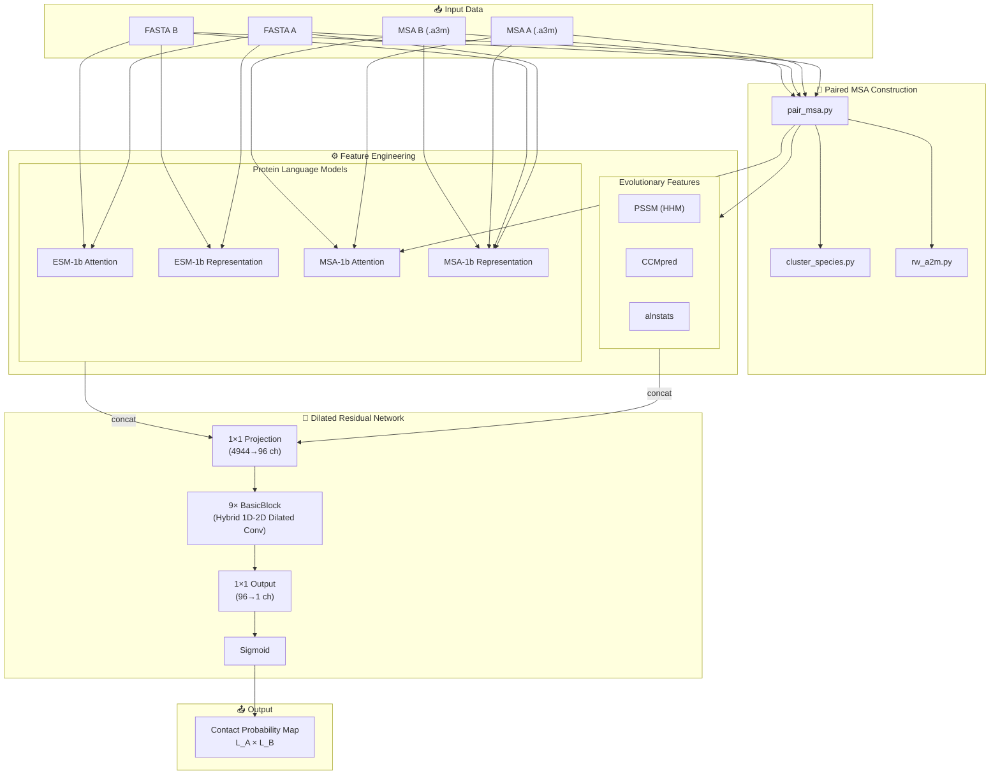

---
slug:1-overview
blog_type:normal
---


**DRN-1D2D_Inter** 是一个用于**蛋白质间接触预测**的深度学习系统——该任务旨在确定两个相互作用蛋白质中哪些残基对在空间上相近。它结合了**带有混合 1D-2D 卷积块的空洞残差网络**和**蛋白质语言模型特征**（ESM-1b 和 ESM-MSA-1b），根据两条相互作用蛋白质链的序列和多重序列比对（MSA）来预测接触概率图。


来源: [README.md](/README.md#L1-L53)

## 项目功能

给定两条相互作用蛋白质链（A 和 B）的 FASTA 序列和 MSA，DRN-1D2D_Inter 会生成一个 **L_A × L_B 接触概率图**，其中每个单元格 (i, j) 表示链 A 中的残基 i 与链 B 中的残基 j 接触的可能性。该系统完全基于序列信息运行——无需输入 3D 结构。

预测流程接收跨越进化、统计和语言模型信号的**九种不同特征来源**，将其转换为**4,944 通道的 2D 输入张量**，并送入一个 9 块空洞残差网络。在推理期间，跨越两种链方向（A→B 和 B→A）集成**7 个训练好的模型**，以获得稳健的预测结果。

来源: [predict.py](/predict.py#L136-L178), [model.py](/model.py#L157-L218)

## 核心架构概览

该系统由四个相互关联的子系统组成。下图说明了数据如何从原始序列输入经过特征工程流入神经网络，最终得到预测的接触图。



来源: [predict.py](/predict.py#L1-L178), [model.py](/model.py#L1-L218), [load_feature.py](/load_feature.py#L1-L131)

## 项目结构

```
DRN-1D2D_Inter/
├── model.py                  # 空洞残差网络 (BasicBlock + ResNet)
├── load_feature.py           # 特征加载、拼接与重塑
├── predict.py                # 端到端预测流程
├── train.py                  # 带有 top-L/k 模型选择的训练循环
├── plm/                      # 蛋白质语言模型特征提取器
│   ├── esm1b_attn.py         #   ESM-1b 交叉注意力 (2D 特征)
│   ├── esm1b_repr.py         #   ESM-1b 逐残基表示 (1D 特征)
│   ├── msa1b_attn.py         #   ESM-MSA-1b 行注意力 (2D 特征)
│   ├── msa1b_repr.py         #   ESM-MSA-1b MSA 表示 (1D 特征)
│   └── LoadHHM.py            #   HMM → PSSM/PSFM 解析器
├── paired/                   # 基于分类学的配对 MSA 构建
│   ├── pair_msa.py           #   主配对编排器
│   ├── cluster_species.py    #   TaxID 分组与相似度排序
│   ├── rw_a2m.py             #   A2M/MSA 文件读取与解析
│   └── hhfilter_paired.py    #   配对后 MSA 过滤
├── data/                     # 基准数据集和回归权重
│   ├── trainset/             #   7,362 个训练二聚体
│   ├── HomoPDB/              #   400 个同源二聚体测试用例
│   ├── HeteroPDB/            #   200 个异源二聚体测试用例
│   ├── DB5.5/                #   59 个 Docking Benchmark 5.5 测试用例
│   ├── DHTest/               #   130 个 DeepHomo 测试用例
│   └── regression/           #   ESM 接触回归权重
├── example/                  # 示例输入文件 (1GL1)
└── model/                    # 训练好的模型权重 (7 个模型，需单独下载)
```

来源: [data/README.md](/data/README.md#L1-L10), [README.md](/README.md#L1-L53)

## 特征类别

系统从两种互补的范式中提取特征——表征单个残基的**单链 (1D)** 信号，以及捕获链间关系的**成对 (2D)** 信号。1D 特征在与原生 2D 特征拼接之前，通过轴向重复广播到 2D 平面。

| 类别 | 特征 | 维度 | 来源 | 描述 |
|----------|---------|:-:|--------|-------------|
| **1D** | PSSM | 每个残基 20 | HH-suite → `LoadHHM.py` | 来自轮廓 HMM 的位置特异性得分矩阵 |
| **1D** | ESM-1b Representation | 每个残基 1,280 | `esm1b_repr.py` | 来自 ESM-1b (第 33 层) 的逐残基嵌入 |
| **1D** | ESM-MSA-1b Representation | 每个残基 768 | `msa1b_repr.py` | 来自 ESM-MSA-1b (第 12 层) 的 MSA 感知嵌入 |
| **2D** | CCMpred | 1 个通道 | CCMpred | 来自配对 MSA 的共进化接触分数 |
| **2D** | alnstats | 3 个通道 | alnstats | 成对统计势 (单体 + 配对) |
| **2D** | ESM-1b Attention | 33×20 = 660 个通道 | `esm1b_attn.py` | 链 A 与链 B 之间的交叉注意力 |
| **2D** | ESM-MSA-1b Attention | 12×20 = 240 个通道 | `msa1b_attn.py` | 跨越链边界的行注意力 |

每条链的 **1D 特征**被拼接 (PSSM + ESM-1b repr + MSA-1b repr = 每条链 2,068 个通道)，然后进行广播：链 A 的 1D 特征沿列重复，链 B 的 1D 特征沿行重复。结合 2D 成对特征 (1 + 3 + 660 + 240 = 904 个通道)，最终生成 **2 × 2,068 + 808 = 4,944 个通道**的总输入 (两个注意力方向共享 CCMpred 和 alnstats，分别贡献给 rt/sw 输入路径)。

来源: [load_feature.py](/load_feature.py#L44-L131), [plm/esm1b_repr.py](/plm/esm1b_repr.py#L44-L56), [plm/msa1b_repr.py](/plm/msa1b_repr.py#L49-L61), [plm/esm1b_attn.py](/plm/esm1b_attn.py#L48-L69), [plm/msa1b_attn.py](/plm/msa1b_attn.py#L50-L71)

## 网络架构摘要

**空洞残差网络**遵循投影-变换-输出模式，包含三个不同阶段：

| 阶段 | 操作 | 形状转换 | 核心细节 |
|-------|-----------|:----------------|------------|
| **投影** | 1×1 Conv + InstanceNorm + LeakyReLU | 4,944 → 96 通道 | 将异构特征压缩至均匀的通道空间 |
| **隐藏层** | 9× BasicBlock (rate 1) | 96 → 96 通道 | 带有残差连接的混合 3×3 + 1×15 + 15×1 空洞卷积 |
| **输出** | 1×1 Conv → Clamp → Sigmoid | 96 → 1 通道 | 生成逐对接触概率 |

每个 **BasicBlock** 包含三个在空洞率 1、20 和 40 下的并行卷积路径：标准 **3×3 空洞卷积**、**1×15 逐行**卷积和 **15×1 逐列**卷积。行/列卷积捕获接触图中的各向异性模式——水平条带（链 A 中的同一残基接触链 B 中的多个残基）和垂直条带（链 B 中的同一残基接触链 A 中的多个残基）。所有路径均使用带有可选 InstanceNorm 和 LeakyReLU 的双卷积，求和后通过残差跳跃连接相加。

来源: [model.py](/model.py#L55-L218)

## 预测策略

在推理期间，系统跨越 **7 个独立训练的模型**和 **2 种链方向**（A→B 和 B→A）集成预测结果，产生 14 个总预测并求平均值。双向策略利用了这样一个观察结果：交换的注意力图（链 B 关注链 A）提供了互补信息。最终输出以纯文本矩阵的形式保存在 `pred.txt` 中。

来源: [predict.py](/predict.py#L155-L178)

## 主要依赖

| 依赖 | 作用 | 备注 |
|------------|------|-------|
| **PyTorch 1.9** | 深度学习框架 | 模型定义、推理、训练 |
| **ESM (Facebook)** | 蛋白质语言模型 | 提供 ESM-1b (650M 参数) 和 ESM-MSA-1b (100M 参数) |
| **Biopython** | 序列 I/O | FASTA/MSA 文件解析 |
| **HH-suite** | HMM 构建 | `hhmake` 用于轮廓 HMM，`hhfilter` 用于 MSA 过滤 |
| **CCMpred** | 共进化分析 | 伪似然共进化接触预测 |
| **alnstats** | 统计势 | 来自比对的单体和成对得分 |

<CgxTip>工具路径 (CCMpred, alnstats, hhmake, hhfilter) 和 ESM 模型权重路径在 `predict.py` 中是硬编码的，在运行预测之前必须修改以匹配你的本地环境。</CgxTip>

来源: [predict.py](/predict.py#L19-L27), [README.md](/README.md#L4-L17)

## 引用

Yunda Si, Chengfei Yan, *Improved inter-protein contact prediction using dimensional hybrid residual networks and protein language models*, Briefings in Bioinformatics, 2023, bbad039, [https://doi.org/10.1093/bib/bbad039](https://doi.org/10.1093/bib/bbad039)

来源: [README.md](/README.md#L49-L51)

## 后续阅读

从实用的设置页面开始，然后深入探索各个子系统：

1. **[快速开始](2-quick-start)** — 使用提供的示例运行你的首次蛋白质间接触预测
2. **[安装与依赖](3-installation-and-dependencies)** — 配置工具路径并下载模型权重
3. **[架构概览](4-architecture-overview)** — 网络数据流和层结构的详细解析
4. **[特征工程流水线](5-feature-engineering-pipeline)** — 9 种特征类型如何计算并组装成输入张量
5. **[预测流水线](13-prediction-pipeline)** — `predict.py` 的逐步执行追踪