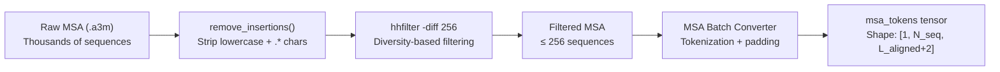
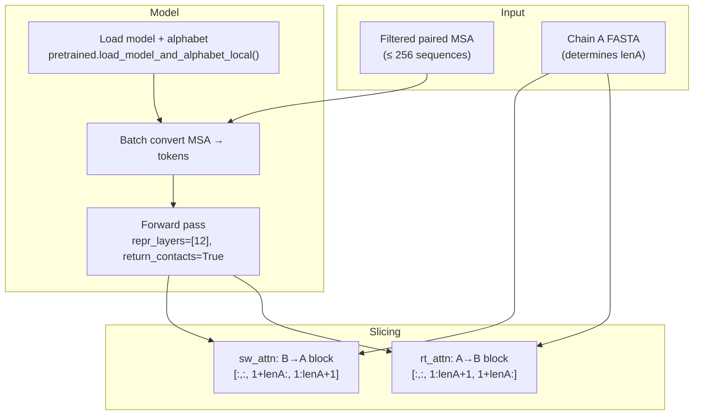
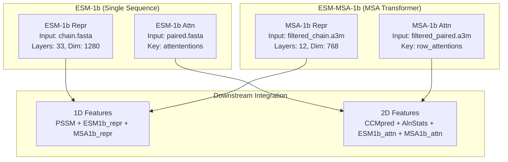

---
slug:10-esm-msa-1b-attention-and-representation
blog_type:normal
---


ESM-MSA-1b 模块从 **ESM-MSA-1b** 蛋白质语言模型（esm_msa1b_t12_100M_UR50S，12 个 Transformer 层，1 亿参数）中提取两种互补的特征类型：用于 2D 成对特征的**跨链注意力图**，以及用于 1D 序列特征的**逐残基表示**。与处理单个拼接序列的 ESM-1b 不同，ESM-MSA-1b 在**多序列比对（MSA）**上运行，利用同源序列间的进化耦合来生成更丰富的、具有共进化感知的嵌入。这一区别正是架构基石，使得 DRN-1D2D_Inter 能够并行捕获单序列语义信号（通过 ESM-1b）和进化上下文信号（通过 ESM-MSA-1b）。

来源：[msa1b_attn.py](plm/msa1b_attn.py#L1-L89)，[msa1b_repr.py](plm/msa1b_repr.py#L1-L85)

## 模型与输入特性

ESM-MSA-1b 模型（`esm_msa1b_t12_100M_UR50S.pt`）是一个 MSA Transformer，它处理完整的多序列比对而非单一序列。其架构参数和输入约定与单序列 ESM-1b 存在根本差异：

| 属性 | ESM-MSA-1b | ESM-1b |
|---|---|---|
| **模型标识符** | `esm_msa1b_t12_100M_UR50S` | `esm1b_t33_650M_UR50S` |
| **参数量** | 1 亿 | 6.5 亿 |
| **Transformer 层数** | 12 | 33 |
| **输入类型** | MSA（`.a3m`，最多 256 条序列） | 单个拼接序列（`.fasta`） |
| **注意力输出键** | `row_attentions` | `attentions` |
| **使用的表示层** | 12（最终层） | 33（最终层） |
| **预训练检查点** | `esm_msa1b_t12_100M_UR50S.pt` | `esm1b_t33_650M_UR50S.pt` |

MSA 输入会通过 `hhfilter -diff 256` 预先筛选至最多 **256 条序列**，以确保注意力计算保持可行，同时保留足够的进化多样性。在分词之前，小写插入字符和空位标记（`.` 和 `*`）会通过基于 `string.ascii_lowercase` 构建的转换表被剔除。

来源：[msa1b_attn.py](plm/msa1b_attn.py#L20-L23)，[msa1b_attn.py](plm/msa1b_attn.py#L44-L49)，[predict.py](predict.py#L31)，[predict.py](predict.py#L62-L71)

## MSA 预处理流水线

在调用 ESM-MSA-1b 之前，必须对原始 MSA 进行清洗和过滤。预处理链按顺序应用三种变换：



`read_msa` 函数负责编排前两步：它使用 `itertools.islice` 遍历 FASTA 记录以将序列数量限制在 `nseq` 条，并对每个序列字符串应用 `remove_insertions`。这种基于转换表的剔除方法是确定性的，并通过 `str.maketrans` 实现了向量化，避免了在大型比对上使用正则表达式的开销。随后，来自 ESM 字母表的批量转换器负责处理分词、填充和特殊词元插入（BOS/EOS），以生成最终的 `msa_tokens` 张量。

来源：[msa1b_attn.py](plm/msa1b_attn.py#L25-L37)，[msa1b_repr.py](plm/msa1b_repr.py#L25-L37)

## 跨链注意力提取

注意力模块（`msa1b_attn.py`）从 MSA Transformer 的行注意力输出中提取**蛋白质间注意力模式**。其核心思想是，当处理配对的 MSA（包含拼接的链 A 和链 B 序列）时，自注意力矩阵自然会在其非对角块中编码跨链依赖关系。



注意力提取对 `out['row_attentions']` 执行精确的 4D 张量切片：

- **`rt_attn`（右注意力）**：切片 `[:,:, 1:lenA+1, 1+lenA:]` —— 对应链 A 残基的行关注对应链 B 残基的列。这捕获了链 A 中每个位置对链 B 中各位置的关注程度。
- **`sw_attn`（交换注意力）**：切片 `[:,:, 1+lenA:, 1:lenA+1]` —— 对应链 B 残基的行关注对应链 A 残基的列。这是方向上的互补。

`+1` 的偏移量用于处理位于位置 0 的 BOS（序列起始）词元。`.squeeze()` 调用移除了批次维度，产生形状为 `(num_layers, num_heads, L_A, L_B)` 的张量，随后该张量被分离至 CPU 并保存为 NumPy 数组。

<CgxTip>将方向分离为 `rt_attn` 和 `sw_attn` 对下游 DRN 模型至关重要：这两个注意力方向分别输入到独立的 2D 特征通道（`rt_feature_2d` 和 `sw_feature_2d`）中，使网络能够学习不对称的链间耦合模式 —— 链 A 残基关注链 B 与链 B 残基关注链 A 并非相同的信号。</CgxTip>

来源：[msa1b_attn.py](plm/msa1b_attn.py#L40-L64)，[predict.py](predict.py#L104-L108)

## 逐残基表示提取

表示模块（`msa1b_repr.py`）从 MSA 的第一条（参考）序列中提取 **1D 序列特征** —— 每个残基一个嵌入向量。提取逻辑如下：

```python
representations = out['representations'][12].cpu().numpy()[0, 0, 1:, :]
```

该表达式中的每个索引都有特定用途：

| 索引 | 含义 |
|---|---|
| `[12]` | 选择第 12 层（即最终 Transformer 层）的输出 |
| `[0]` | 批次维度（单个样本） |
| `[0]` | **MSA 中的第一条序列** —— 参考/查询序列 |
| `[1:]` | 跳过位置 0 处的 BOS 词元 |
| `[:]` | 保留所有嵌入维度（768 维） |

仅提取第一行 MSA 表示的做法是刻意为之：参考序列对应于正在分析的实际蛋白质，而剩余的 MSA 行则作为进化上下文，通过 Transformer 的轴向注意力机制影响表示。结果数组的形状为 `(L_residue, 768)`，并保存为 `.npy` 文件。

<CgxTip>注意 ESM-1b 与 ESM-MSA-1b 之间表示索引的差异：ESM-1b 使用带有显式长度边界结束索引的 `[0, 1:(len_seq+1), :]`，而 ESM-MSA-1b 使用带有额外 MSA 行索引的 `[0, 0, 1:, :]`。这反映了 MSA Transformer 的 3D 输出张量 `(batch, N_seq, L, dim)` 与单序列模型的 2D 输出张量 `(batch, L, dim)` 之间的不同。</CgxTip>

来源：[msa1b_repr.py](plm/msa1b_repr.py#L41-L58)，[esm1b_repr.py](plm/esm1b_repr.py#L39-L54)

## 特征集成至 DRN 流水线

MSA-1b 的注意力和表示均由特征加载模块消费，以构建膨胀残差网络的最终输入张量。1D 和 2D 特征的集成路径有所不同：

### 1D 特征通道（逐链）

对于每条链（A 和 B），MSA-1b 表示与 PSSM 及 ESM-1b 表示进行**水平堆叠**，以构成统一的逐残基特征向量：

```
feature_1d = np.hstack((PSSM, esm1b_repr, msa1b_repr))   # 形状: (L, 20+1280+768) = (L, 2068)
feature_1d = feature_1d.T                                   # 形状: (2068, L)，遵循通道优先约定
```

MSA-1b 表示为 1D 特征贡献了 **768 个通道**，补充了 PSSM 的 20 个通道（位置特异性打分矩阵）和 ESM-1b 的 1280 个通道。这种三源设计确保 DRN 既能接收进化谱信息（PSSM），又能接收单序列语义嵌入（ESM-1b），以及共进化上下文嵌入（ESM-MSA-1b）。

### 2D 特征通道（配对）

对于配对（链间）特征，MSA-1b 注意力在层和头上**展平**，然后与其他 2D 信号拼接：

```
rtattn_msa1b: (layers, heads, L_A, L_B) → reshape → (layers×heads, L_A, L_B)
```

`rt_feature_2d` 和 `sw_feature_2d` 均通过拼接以下内容构成：

| 通道来源 | 维度 | 方向 |
|---|---|---|
| CCMpred | 1 × L_A × L_B | 正向 / 转置 |
| AlnStats | 3 × L_A × L_B | 正向 / 转置 |
| ESM-1b 注意力 | 33×20 × L_A × L_B | rt / sw |
| **ESM-MSA-1b 注意力** | **12×20 × L_A × L_B** | **rt / sw** |

ESM-MSA-1b 注意力为每个方向的 2D 特征贡献了 **240 个通道**（12 层 × 20 头），而 ESM-1b 注意力贡献了 660 个通道（33 层 × 20 头）。随后，这些特征通过 `concat` 函数与广播的 1D 特征相结合，构成 ResNet 最终的 4944 通道输入张量。

来源：[load_feature.py](load_feature.py#L42-L58)，[load_feature.py](load_feature.py#L61-L102)，[model.py](model.py#L160)

## 预测流水线中的调用

在预测流水线（`predict.py`）中，ESM-MSA-1b 会被使用不同 MSA 输入调用两次，这反映了它的双重作用：

1. **注意力提取**（第 6 步）：使用**过滤后的配对 MSA**（`filtered_paired.a3m`） —— 即两条链基于分类学配对的比对 —— 来计算跨链注意力。配对 MSA 捕获了两个相互作用蛋白质间的共进化信号。

2. **表示提取**（第 9 步）：对每条链独立使用**过滤后的单链 MSA**（`filteredA.a3m` 和 `filteredB.a3m`）。每条链的表示是根据其自身的进化上下文计算的，而非配对上下文。

这种分离输入策略在架构上具有重要意义：跨链注意力需要联合 MSA 来检测蛋白质间耦合，而逐链表示则受益于更深的单链 MSA，这些 MSA 每条链包含更多的同源物，而不会因配对约束而产生稀释。

来源：[predict.py](predict.py#L104-L141)

## 对比：ESM-MSA-1b 与 ESM-1b 特征角色

这两个蛋白质语言模型在特征工程流水线中扮演着互补的角色：



| 方面 | ESM-MSA-1b | ESM-1b |
|---|---|---|
| **进化信号** | 显式（MSA 输入，跨序列的轴向注意力） | 隐式（从 UniRef50 预训练中学习） |
| **表征容量** | 768 维（较小，但由 MSA 信息驱动） | 1280 维（较大，单序列） |
| **注意力粒度** | 行注意力（基于 MSA 平均的注意力模式） | 标准注意力（单序列自注意力） |
| **对 MSA 深度的敏感度** | 高 —— 更深的 MSA → 更丰富的共进化信号 | 无 —— 输入始终为单序列 |
| **计算开销** | 较高（同时处理 256 条序列） | 较低（单序列前向传播） |

这两个模型并不冗余 —— 它们捕获的是正交信息。ESM-1b 擅长从序列语义中捕获局部结构倾向，而 ESM-MSA-1b 捕获的则是仅在联合处理多个同源物时才可见的全局共进化约束。它们在 1D 和 2D 特征通道中的拼接，确保了 DRN 能接收到最全频谱的已学习蛋白质信号。

来源：[msa1b_attn.py](plm/msa1b_attn.py#L40-L64)，[esm1b_attn.py](plm/esm1b_attn.py#L39-L61)，[msa1b_repr.py](plm/msa1b_repr.py#L41-L58)，[esm1b_repr.py](plm/esm1b_repr.py#L39-L54)

## 下一步

在理解了 ESM-MSA-1b 如何从 MSA 输入中提取进化信息特征后，自然地进展是探索 **MSA 输入本身是如何构建的** —— 特别是决定每条链中哪些同源物被比对在一起的基于分类学的配对策略。参见[基于分类学的 MSA 配对](11-taxonomy-based-msa-pairing)了解配对算法，或继续前往[预测流水线](13-prediction-pipeline)查看所有特征如何汇聚为最终的接触预测。