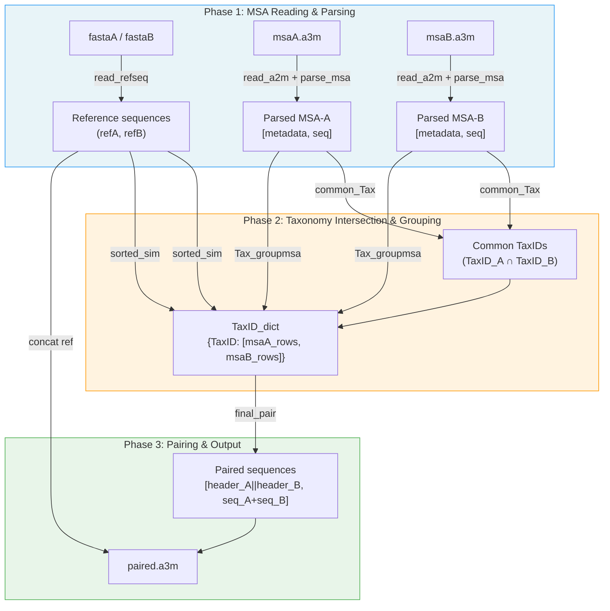
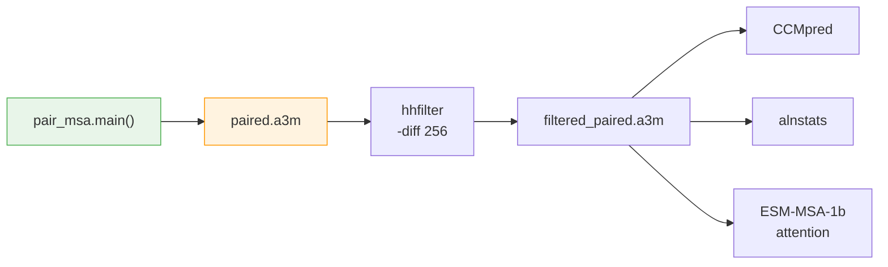

---
slug:11-taxonomy-based-msa-pairing
blog_type:normal
---


蛋白质间接触预测需要两条相互作用链之间的**耦合进化信息**。基于分类学的MSA配对模块通过识别在两条链之间共享共同进化起源的同源序列，构建出**配对多序列比对**。其核心思想很直接：来自**同一生物体**的序列更有可能在相同的选择压力下共同进化，这使得分类学ID成为将两个独立MSA中的行连接成单一联合比对的天然配对键。

来源: [pair_msa.py](paired/pair_msa.py#L1-L101), [cluster_species.py](paired/cluster_species.py#L1-L111)

## 架构概述

配对流程由 `pair_msa.main()` 统一调度，它协调三个顺序阶段中的四个模块。每个阶段逐步转换数据——从原始a3m文件，到基于分类学索引的分组，再到最终拼接的配对比对。



来源: [pair_msa.py](paired/pair_msa.py#L29-L101)

## 作为分类学来源的a3m头信息

配对逻辑严重依赖于由HHblits/UniRef搜索生成的**结构化头信息格式**。每个a3m头信息都编码了分类学元数据，`parse_msa` 会将其提取为一个包含6个元素的元数据元组：

| 字段 | 头信息模式 | 示例 | 元组中的索引 |
|-------|---------------|---------|----------------|
| **UqID** | `>` 之后的第一个标记 | `UniRef100_UPI00187CB339/1-199` | `[0]` |
| **Molecule** | `n=` 之前的部分 | `LOW QUALITY PROTEIN: uncharacterized protein LOC119010001` | `[1]` |
| **Members** | `n=<int>` | `1` | `[2]` |
| **Tax** | `Tax=<species>` | `Acanthopagrus latus` | `[3]` |
| **TaxID** | `TaxID=<int>` | `8177` | **`[4]`** ← 配对键 |
| **RepID** | `RepID=<str>` | `UPI00187CB339` | `[5]` |

索引 `[4]` 处的 **TaxID** 是配对的唯一标准。头信息无法解析（缺少 `n=`、`TaxID=` 或 `Tax=` 字段）的序列会通过 `try/except` 块被静默跳过。此外，任何包含非标准氨基酸（在 `ARNDCQEGHILKMFPFPSTWYV-` 之外）的序列都会被丢弃。

来源: [rw_a2m.py](paired/rw_a2m.py#L60-L102)

## 阶段 1：MSA读取与初始过滤

在分类学分析开始之前，会进行两项操作。首先，`read_a2m()` 加载原始比对，并应用**覆盖率过滤器**——空格比例超过 `1 - cov` 的任何序列都将被排除。这可以防止空缺过多的序列污染配对后的MSA。其次，第一行（即查询序列本身）通过 `msa_data.pop(0)` 被移除，随后 `parse_msa()` 从剩余的头信息中提取结构化元数据。

覆盖率阈值 `cov` 从 `pair_msa.main()` 传入，在生产流程中被设定为 **0.5**——这意味着相对于查询序列长度，空格超过50%的序列将被丢弃。

```
# predict.py 中的生产调用
pair_msa.main(file_dict, cov=0.5, topn=100000)
```

来源: [pair_msa.py](paired/pair_msa.py#L31-L50), [rw_a2m.py](paired/rw_a2m.py#L13-L42), [predict.py](predict.py#L44-L49)

## 阶段 2：分类学交集与相似度排序

此阶段由三个顺序操作组成，用于构建和优化基于分类学索引的分组。

### 公共分类学识别

`common_Tax()` 计算MSA-A和MSA-B中存在的TaxID的**集合交集**。TaxID `-1`（无法解析的头信息的哨兵值）在交集之前会从两个集合中被显式丢弃。只有在**两条**链中都有同源序列的生物体才会被保留——这是确保每个配对行都具有有意义共进化信号的基本约束。

来源: [cluster_species.py](paired/cluster_species.py#L31-L47)

### 基于分类学索引的分组

`Tax_groupmsa()` 将每个解析后的MSA重组为一个以公共TaxID为键的字典，其中每个值是一个双元素列表 `[msaA_rows, msaB_rows]`，仅包含属于该生物体的序列。这是一个对两个MSA进行的 **O(N)** 划分操作。

来源: [cluster_species.py](paired/cluster_species.py#L14-L29)

### 组内相似度排序

`sorted_sim()` 根据序列与参考序列的同一性，对**每个TaxID组内**的序列进行排序。对于包含多个序列的每个组，该函数会执行以下操作：

1. 将参考序列追加到组列表中（作为最后一个元素）
2. 通过 `encode_a2m()` 将所有序列编码为数字矩阵
3. 使用 `cal_similarity()` 计算每个序列与参考序列的同一性
4. 按同一性以**降序**排列索引（相似度最高的排在最前面）
5. 相应地重新排序该组的序列列表

这种排序确保了当序列随后按位置进行拉链式配对时，**最相似的同源序列会优先配对**——这是一种优先处理高置信度进化耦合的启发式方法。

来源: [cluster_species.py](paired/cluster_species.py#L73-L111), [rw_a2m.py](paired/rw_a2m.py#L45-L58)

## 阶段 3：最终配对与拼接

`final_pair()` 执行实际的序列耦合。对于每个TaxID组，它从每一侧提取**前N条**（top-N）序列（由 `topn` 参数截断），并按位置将它们配对：msaA的第1条序列与msaB的第1条序列配对，第2条与第2条配对，依此类推。每个配对行包含：

- **头信息**：`header_A + "||" + header_B`（使用双竖线分隔符连接配对的头信息）
- **序列**：`seq_A + seq_B`（简单拼接，不插入空格）

参考序列对会最先写入（使用 `&` 分隔符），并作为配对比对的查询行。总输出上限为 **100,000** 条配对序列。

| 组件 | 格式 | 示例 |
|-----------|--------|---------|
| 参考头信息 | `headerA & headerB` | `>1GL1_A & 1GL1_I` |
| 配对头信息 | `headerA \|\| headerB` | `>UniRef100_XYZ \|\| UniRef100_ABC` |
| 参考序列 | `seqA + seqB` | `MKT...LVA + KEY...CNA` |
| 配对序列 | `seqA + seqB` | `MKT...LVA + KEY...CNA` |

来源: [pair_msa.py](paired/pair_msa.py#L14-L27), [pair_msa.py](paired/pair_msa.py#L72-L100)

## 未配对序列统计

`unpairedseq()` 是一个诊断函数，用于计算**可以**配对的序列数量。对于两侧至少存在一条序列（即 `faA_num + faB_num > 2`）的每个TaxID组，它会将 `min(faA_num, faB_num)` 添加到计数中。这揭示了最终输出前配对比对的有效深度——由于蛋白质间接触预测的准确性严重依赖于配对MSA的深度，这是一个关键的质量指标。

来源: [cluster_species.py](paired/cluster_species.py#L50-L65)

## 流程集成

配对MSA的构建是完整预测流程的**第一步**。在 `pair_msa.main()` 生成 `paired.a3m` 之后，下游流程会立即应用 `hhfilter -diff 256` 以增加配对比对的多样性，然后使用它来计算CCMpred共进化图、alnstats特征以及ESM-MSA-1b注意力特征。分类学配对的质量直接决定了所有这些下游特征中的信号强度。



来源: [predict.py](predict.py#L44-L72)

## 模块参考

| 模块 | 核心函数 | 职责 |
|--------|--------------|----------------|
| [`pair_msa.py`](paired/pair_msa.py) | `main()`, `final_pair()` | 调度流程；拼接配对行 |
| [`cluster_species.py`](paired/cluster_species.py) | `common_Tax()`, `Tax_groupmsa()`, `sorted_sim()`, `unpairedseq()`, `cal_similarity()` | 分类学交集、分组、相似度排序 |
| [`rw_a2m.py`](paired/rw_a2m.py) | `read_a2m()`, `parse_msa()`, `encode_a2m()`, `read_refseq()` | a3m I/O、头信息解析、数字编码 |
| [`hhfilter_paired.py`](paired/hhfilter_paired.py) | (脚本) | 使用hhfilter进行事后批量过滤 |

<CgxTip>配对是每个TaxID组内的**位置拉链**操作——如果一侧的序列多于另一侧，多余的序列将被静默丢弃。这意味着每个生物体的有效配对深度等于 `min(len(msaA_rows), len(msaB_rows))`，因此保持两侧MSA的平衡对于最大化配对深度至关重要。</CgxTip>

<CgxTip>头信息解析失败（即 `TaxID = -1`）的序列会被完全排除在配对之外。当使用自定义MSA时，请确保所有头信息都遵循带有 `n=`、`Tax=`、`TaxID=` 和 `RepID=` 字段的UniRef格式，否则配对产率将显著下降。</CgxTip>

## 下一步

配对MSA随后会被过滤和解析以进行特征提取。有关 `hhfilter` 和格式转换如何将配对比对转化为DRN-1D2D网络所消费的特征的详情，请参阅[MSA解析与过滤](12-msa-parsing-and-filtering)。