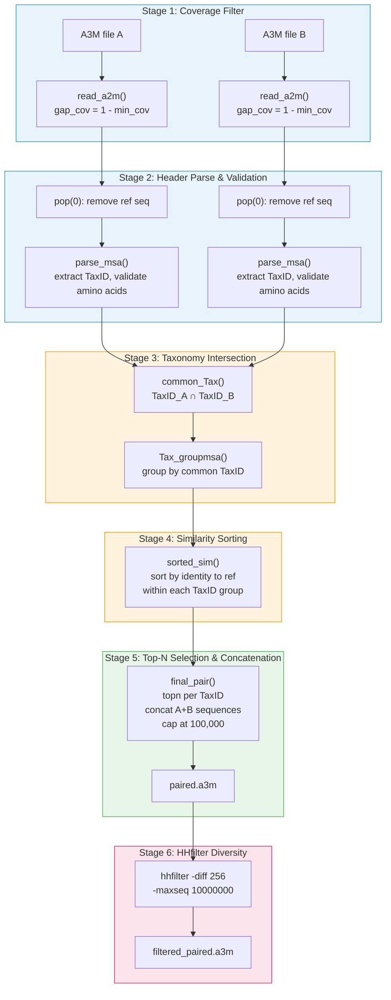

---
slug:12-msa-parsing-and-filtering
blog_type:normal
---


MSA 解析与过滤子系统将原始的 UniRef 多序列比对（A3M 格式）转换为具有分类学配对且冗余度降低的配对 MSA，以适用于蛋白质间接触预测。这是一个**六阶段渐进式过滤流水线**——每个阶段应用不同的过滤标准，所有六个阶段的组合决定了输入到下游特征提取器（ESM-MSA-1b、CCMpred、alnstats）的配对 MSA 的最终质量与多样性。该流水线涵盖四个模块：`rw_a2m`（I/O 与解析）、`cluster_species`（分类学分组与相似度排序）、`pair_msa`（流程编排）和 `hhfilter_paired`（配对后多样性过滤）。

来源: [rw_a2m.py](paired/rw_a2m.py#L1-L102), [cluster_species.py](paired/cluster_species.py#L1-L111), [pair_msa.py](paired/pair_msa.py#L1-L101), [hhfilter_paired.py](paired/hhfilter_paired.py#L1-L24)

## 流水线架构

完整的流水线从原始 A3M 文件出发，经过逐步收窄的过滤器，最终生成配对的 A3M 文件。每个阶段会移除不符合特定标准的序列，各阶段的排列顺序确保计算成本较低的过滤器（覆盖率、字符验证）在成本较高的过滤器（分类学交集、相似度排序、HHfilter）之前执行。



来源: [pair_msa.py](paired/pair_msa.py#L27-L101), [predict.py](predict.py#L68-L69)

## 阶段 1 — 读取时的覆盖率过滤

入口函数 `read_a2m(a2m_file, lenseq, min_cov)` 对 A3M 文件执行**单次流式读取**，并在读取过程中内联执行覆盖率过滤。它使用 8 KB 缓冲区以二进制模式读取文件以提升 I/O 效率，跨可能的多行 FASTA 条目累积序列字符，直到遇到下一个头部行（`>`）。

**过滤逻辑**：对于每条完整的序列，将其空位数量与 `lenseq * gap_cov` 进行比较，其中 `gap_cov = 1 - min_cov`。空位数量**严格小于**此阈值的序列将被保留。这意味着 `min_cov=0.5`（`pair_msa.main` 中使用的默认值）会拒绝空位超过参考序列长度 50% 的序列——这是从 UniRef100 比对中移除片段化命中结果的关键过滤器。`lenseq` 参数是参考序列长度，通过 `len(refA[-1][-1])` 和 `len(refB[-1][-1])` 从外部传入。

该函数使用 `maxlen=2` 的 `collections.deque` 来跟踪头部：每当追加新的头部时，最旧的头部会被自动驱逐。这种基于双端队列的滑动窗口能正确地将每条序列与其前一个头部配对，同时处理第一个条目的边界情况（其头部为空字符串，并通过切片 `msa_data[1:]` 被丢弃）。

| 参数 | 类型 | 描述 |
|-----------|------|-------------|
| `a2m_file` | `str` | 输入 A3M 比对文件的路径 |
| `lenseq` | `int` | 参考序列长度（空位阈值的分母） |
| `min_cov` | `float` | 最小覆盖率比例（默认为 `0`） |
| **返回值** | `list[tuple[str, str]]` | 通过覆盖率过滤的 `(header, sequence)` 对列表 |

来源: [rw_a2m.py](paired/rw_a2m.py#L11-L36)

## 阶段 2 — 头部解析与氨基酸验证

读取完成后，参考序列（第一个条目）通过 `msaA_data.pop(0)` 被移除，剩余序列被传递给 `parse_msa(msa_data)`。该函数执行两轮验证：

**头部字段提取**根据 UniRef A3M 约定解析每个头部行。本项目数据中的代表性头部如下：

```
>UniRef100_UPI00187CB339/1-199 [subseq from] LOW QUALITY PROTEIN: ... n=1 Tax=Acanthopagrus latus TaxID=8177 RepID=UPI00187CB339
```

解析器通过定位头部字符串中的哨兵标记（`n=`、`TaxID=`）来提取五个结构化字段。提取顺序为：

1. **UqID** — UniRef 簇标识符，从 `>` 前缀后的首个空格处拆分获取
2. **Molecule** — 簇 ID 与 `n=` 之间的蛋白质描述
3. **Members** — 簇成员计数，从 `n=` 字段解析
4. **Tax** — 物种名称，通过 `Tax=` 的 `split('=')[1]` 提取
5. **TaxID** — NCBI 分类学 ID，从 `TaxID=` 的 `split('=')[1]` 解析为 `int`
6. **RepID** — 代表序列 ID，为最后一个标记

任何不符合此确切结构的头部（缺少 `n=` 或 `TaxID=` 标记，或字段格式错误）都会触发异常，该异常会被裸 `except: continue` 捕获，从而静默丢弃该条目。这是有意为之——许多 HHblits/HHsearch 的输出条目缺乏分类学注释，因此无法用于配对。

**氨基酸验证**检查是否 `set(sequence) ⊆ standard_amino`，其中 `standard_amino = set('ARNDCQEGHILKMFPSTWYV-')`。包含小写字符（A3M 格式中的插入）或非标准残基（X、B、Z、O、U）的序列将被拒绝。这一点至关重要，因为 `encode_a2m`（稍后在相似度排序中使用）仅将 20 种标准残基加空位映射为整数 0-20，未知字符将被静默映射为 0（空位），从而破坏一致性计算。

每个存活条目的输出结构为嵌套元组：`([UqID, Molecule, Members, Tax, TaxID, RepID], [header, sequence])`。索引 0 处的内部列表提供结构化元数据；索引 1 处的内部列表保留原始数据以供输出。

来源: [rw_a2m.py](paired/rw_a2m.py#L59-L101), [pair_msa.py](paired/pair_msa.py#L41-L50)

## 阶段 3 — 分类学交集过滤

当两条链的 MSA 均被解析为结构化记录后，流水线会识别两条链比对中共同的物种——这是协同进化配对的先决条件。

**`common_Tax(parsed_msaA, parsed_msaB)`** 从每个 MSA 中提取 TaxID 集合（访问 `fasta[0][4]`），丢弃哨兵值 `TaxID=-1`（用于缺少分类学的条目），并返回**集合交集** `TaxID_msaA ∩ TaxID_msaB`。只有属于**两条**链比对中均存在的物种的序列才能存活此阶段——仅存在于一条链的物种的序列将被永久排除。

随后，**`Tax_groupmsa(common_species, parsed_msaA, parsed_msaB)`** 将存活的序列划分到一个以 TaxID 为键的字典中，每个值是一个包含两个元素的列表 `[chain_A_sequences, chain_B_sequences]`。TaxID 不在交集中的序列将被排除。生成的 `TaxID_dict` 是驱动所有后续配对操作的核心数据结构——每个 TaxID 键代表一个候选配对组。

<CgxTip>当 `int(TaxID.split('=')[1])` 在格式错误的头部上执行失败时，`parse_msa` 会静默引入 `TaxID=-1` 哨兵值——但这些条目早已被头部解析的 `try/except` 拒绝。`common_Tax` 中的 `discard(-1)` 是为 TaxID 解析成功但结果为 -1 的边缘情况提供的安全网。</CgxTip>

来源: [cluster_species.py](paired/cluster_species.py#L28-L63)

## 阶段 4 — 组内相似度排序

在选择配对序列之前，`sorted_sim(TaxID_dict, seqA, seqB)` 会根据每个分类学组内序列与参考序列（查询蛋白）的**一致性**对其进行排序。这确保了当后续 `topn` 选择截断列表时，与参考序列最相似（通常也最具信息量）的序列能被优先保留。

对于每个 TaxID 组及每条链（A 和 B 独立处理）：

1. 将参考序列**追加**到该组序列列表的末尾
2. `encode_a2m()` 使用 21 字符映射 `{'-':0, 'A':1, 'C':2, ..., 'Y':20}` 将序列列表转换为 `uint8` NumPy 数组
3. `cal_similarity()` 通过 `np.sum(np_fasta[i] == np_fasta[-1])` 计算每条序列 `i` 相对于索引 `-1` 处参考序列的一致性——这是一个**精确匹配计数**，而非归一化百分比
4. 通过 `argsort()[::-1]` 将一致性分数按**降序**排序，并相应地重排序列列表

参考序列因具有最高的一致性（等于其自身长度），自然会排在最前面。这种排序策略使配对 MSA 偏向于查询序列的近缘同源物，这对于蛋白质间接触预测是理想的，因为其目标是捕获相互作用特异性的协同进化信号，而非远缘同源物的信号。

| 步骤 | 操作 | 复杂度 |
|------|-----------|------------|
| 编码 | 将残基映射为 `uint8` 数组 | O(N × L) |
| 相似度 | 将每行与参考行进行比较 | O(N × L) |
| 排序 | 对一致性分数执行 `argsort()` | O(N log N) |
| **每个 TaxID 组** | **总计** | **O(N × L + N log N)** |

来源: [cluster_species.py](paired/cluster_species.py#L12-L16), [cluster_species.py](paired/cluster_species.py#L74-L111), [rw_a2m.py](paired/rw_a2m.py#L39-L55)

## 阶段 5 — Top-N 选择与序列拼接

**`final_pair(TaxID_dict, topn)`** 通过遍历每个 TaxID 组并为每条链选择最多 `topn` 条序列，然后将它们拉链式配对，从而构建配对比对：

```python
faA_list = faA_list[:topn]
faB_list = faB_list[:topn]
for faA, faB in zip(faA_list, faB_list):
    header = faA[-1][0].strip() + '||' + faB[-1][0].strip()
    seq = faA[-1][1].strip() + faB[-1][1].strip()
    paired.append([header, seq])
```

配对策略是**组内贪心拉链配对**：序列已按与参考序列的一致性排序（阶段 4），因此 `zip` 会将每个物种内与参考序列最相似的链 A 序列与最相似的链 B 序列配对，然后是次相似的配对，依此类推。一个 TaxID 组贡献的配对数为 `min(len(faA_list), len(faB_list))`——如果某条链的序列较少，另一条链的多余序列将被丢弃。

配对头部使用 `||` 作为两个原始头部之间的分隔符，配对序列是链 A 和链 B 序列的**直接拼接**（包括其空位字符）。这种拼接产生了一个联合比对，其中链 A 的位置 `i` 和链 B 的位置 `j` 位于不同的列，使下游协同进化分析（CCMpred、alnstats）能够检测链间耦合。

最终输出**上限为 100,000 条序列**（`return paired[:100000]`），为下游特征提取的内存和计算提供了硬性上限。参考配对在 `main()` 中单独前置，使用 `&` 作为头部分隔符，在配对序列之前写入输出 `paired.a3m` 文件。

<CgxTip>`pair_msa.main(file_dict, cov, topn)` 中的 `topn` 参数直接传递给 `final_pair`，但其作用范围是**每个 TaxID 组**，而非全局。当 `topn=100000`（`predict.py` 中的默认值）时，该各组上限实际上是无限制的——`final_pair` 返回值中的 100,000 全局上限才是真正的硬性约束。</CgxTip>

来源: [pair_msa.py](paired/pair_msa.py#L14-L26), [pair_msa.py](paired/pair_msa.py#L83-L101), [predict.py](predict.py#L68)

## 阶段 6 — 配对后 HHfilter 多样性降低

基于分类学的配对生成 `paired.a3m` 后，使用 HHsuite 的 `hhfilter` 工具应用最终的**多样性过滤器**：

```bash
hhfilter -i paired.a3m -o filtered_paired.a3m -diff 256 -maxseq 10000000
```

`-diff 256` 参数是关键控制项：它最多保留 256 条彼此存在差异的序列，从而有效地选择出具有受控冗余度的代表性子集。`-maxseq 10000000` 为输入处理设定了宽松的上限以避免截断。这种多样性降低对两个下游消费者至关重要：

1. **ESM-MSA-1b 注意力提取** — MSA Transformer 的内存消耗与序列数量呈二次方关系；256 条多样化序列在保留系统发育广度的同时，在计算上是易处理的
2. **协同进化特征提取**（CCMpred、alnstats） — 冗余序列不增加统计信号，但会增加计算量

相同的 `-diff 256` 过滤器也独立应用于每条链的非配对 A3M 文件（`filteredA.a3m`、`filteredB.a3m`），用于单链 MSA-1b 表示提取。`hhfilter_paired.py` 模块提供了一个批处理脚本，可在整个数据集目录中应用此过滤器。

来源: [hhfilter_paired.py](paired/hhfilter_paired.py#L14-L24), [predict.py](predict.py#L71-L78)

## 端到端数据流总结

下表追踪了一对序列从原始输入经过所有六个过滤阶段到最终输出的全过程：

| 阶段 | 函数 | 过滤标准 | 数据结构变化 |
|-------|----------|------------------|-----------------------|
| 1 | `read_a2m` | 空位比例 < (1 − min_cov) | 原始文件 → `[(header, seq)]` |
| 2 | `parse_msa` | 有效头部 + 标准氨基酸 | `(header, seq)` → `([metadata], [header, seq])` |
| 3 | `common_Tax` + `Tax_groupmsa` | TaxID ∈ (TaxIDs_A ∩ TaxIDs_B) | 扁平列表 → `{TaxID: [listA, listB]}` |
| 4 | `sorted_sim` | 与参考序列的一致性（降序） | 组内未排序列表 → 已排序 |
| 5 | `final_pair` | 每组 Top-N，全局上限 100K | 分类学字典 → `[(paired_header, paired_seq)]` |
| 6 | `hhfilter` | `-diff 256` 多样性 | 100K 配对 → ~256 条多样化配对 |

这六个阶段的组合实现了蛋白质间接触预测的标准配对 MSA 构建方法：覆盖率过滤移除片段，头部解析确保分类学可注释性，分类学交集保证协同进化的合理性，相似度排序优先处理信息量大的同源物，Top-N 截断限制计算量，HHfilter 确保统计和神经特征提取器的多样性。

来源: [pair_msa.py](paired/pair_msa.py#L27-L101), [predict.py](predict.py#L60-L78)

## A3M 头部格式契约

`parse_msa` 函数对 A3M 头部格式编码了严格的契约。任何偏差都会导致该条目被静默丢弃。所需格式为：

```
>UqID [optional tokens] n=Members Tax=OrganismName TaxID=Integer RepID=String
```

关键解析依赖：
- **`n=`** 必须在头部字符串中出现在 `TaxID=` 之前
- **`Tax=`** 从 `n=` 的值与 `TaxID=` 之间的片段提取，然后在 `=` 处拆分以获取物种名称
- **`TaxID=`** 后必须跟随一个有效整数
- **`RepID`** 是 `TaxID=` 值之后的最后一个以空格分隔的标记

在实践中，此格式由针对 UniRef100 或 UniRef90 数据库的 HHblits/HHsearch 生成，这些数据库使用 UniProt 分类学交叉引用中的分类学信息注释命中结果。示例文件 `1GL1_A_uniref100.a3m` 和 `1GL1_I_uniref100.a3m` 展示了此格式，包含如 `Tax=Acanthopagrus latus TaxID=8177` 的条目。

来源: [rw_a2m.py](paired/rw_a2m.py#L67-L96), [example/1GL1_A_uniref100.a3m](example/1GL1_A_uniref100.a3m#L1-L2)

## 与预测流水线的集成

MSA 解析与过滤流水线作为 `predict.py` 的**第一步**被调用，先于任何特征提取或模型推理。调用序列为：

```python
pair_msa.main(file_dict, 0.5, 100000)  # 阶段 1–5
os.system(f'{hhfilter} -i {paired_a3m} -o {filter_paired_a3m} -diff 256')  # 阶段 6
```

`file_dict` 参数汇总了所有的输入/输出路径：`fastaA`、`fastaB`（参考序列），`msaA`、`msaB`（原始 A3M 比对），以及 `outpath`（输出目录）。覆盖率阈值 `0.5` 和 Top-N `100000` 在预测脚本中被硬编码。生成的 `filtered_paired.a3m` 直接输入 ESM-MSA-1b 注意力计算，而非配对的过滤 A3M（`filteredA.a3m`、`filteredB.a3m`）则用于单链 MSA-1b 表示提取。

要了解配对 MSA 如何接入更广泛的特征工程系统，请参阅[特征工程流水线](5-feature-engineering-pipeline)。要了解驱动阶段 3–5 的基于分类学的配对策略，请参阅[基于分类学的 MSA 配对](11-taxonomy-based-msa-pairing)。