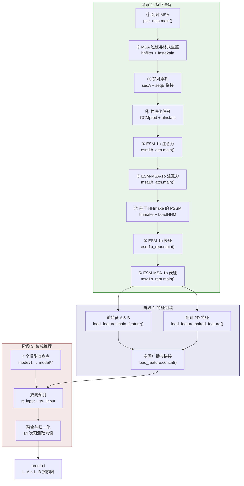

---
slug:13-prediction-pipeline
blog_type:normal
---


预测流水线是 DRN-1D2D_Inter 的运算核心——这是一个确定性的端到端工作流，将原始蛋白质序列及其多序列比对（MSA）转换为蛋白质间接触概率矩阵。该流水线完全由 `predict.py` 编排，依次经历三个架构迥异的阶段：**特征准备**（9 个计算密集型子步骤）、**特征组装**（张量构建与空间广播）以及**集成推理**（7 模型双向平均）。每个阶段均在前一阶段的基础上构建，共同涵盖了从序列到结构的完整推理链。

来源: [predict.py](predict.py#L1-L178)

## 流水线调用与参数

该流水线通过命令行调用，接受六个位置参数，直接从 `sys.argv` 解析，无需包装框架：

```bash
python predict.py sequenceA msaA sequenceB msaB result_path device
```

| 参数 | 类型 | 描述 |
|---|---|---|
| `sequenceA` | 文件路径 | 目标蛋白质链 A 的 FASTA 文件 |
| `msaA` | 文件路径 | 链 A 的 A3M 格式 MSA（源自 UniRef90/UniRef100） |
| `sequenceB` | 文件路径 | 目标蛋白质链 B 的 FASTA 文件 |
| `msaB` | 文件路径 | 链 B 的 A3M 格式 MSA |
| `result_path` | 目录 | 中间文件与最终预测结果的输出目录 |
| `device` | 字符串 | PyTorch 设备——`cpu`、`cuda:0`、`cuda:1` 等 |

调用时，若结果目录不存在则会自动创建，设备字符串会被解析为 `torch.device` 对象。所有中间产物——配对 MSA、注意力图、表征、PSSM 以及最终接触图——均写入该目录，使得流水线完全自包含，并可通过其输出实现完全复现。

来源: [predict.py](predict.py#L37-L41)

## 端到端数据流

下图展示了贯穿三个阶段的完整数据流，其中每个编号步骤对应源码中的特征准备子步骤：



来源: [predict.py](predict.py#L44-L177)

## 阶段 1：特征准备

特征准备是计算开销最大的阶段，依序执行 9 个子步骤以生成所有原始输入信号。这些步骤被组织为两个逻辑组：**配对特征**（步骤 1–6），用于捕获链间共进化与基于注意力的耦合；以及**单链 1D 特征**（步骤 7–9），用于编码各链独立的进化谱与学习表征。

### 配对特征生成（步骤 1–6）

**步骤 ① — 配对 MSA 构建。** 链 A 和链 B 的两个独立 MSA 通过 `pair_msa.main()` 基于共享分类学进行配对。该函数读取两个 A3M 文件，识别两个 MSA 间的共同物种，按 TaxID 对序列分组，依据与参考序列的相似度排序，并配对每个物种的前 *n* 条序列（总数上限为 100,000）。输出的 `paired.a3m` 包含以 `||` 分隔头部的拼接 A+B 序列，为所有下游配对特征奠定了进化耦合基础。

来源: [predict.py](predict.py#L49-L56), [paired/pair_msa.py](paired/pair_msa.py#L35-L83)

**步骤 ② — MSA 过滤与格式重整。** 三次 `hhfilter` 调用将配对 MSA 及各单链 MSA 缩减至最多 256 条多样化序列（`-diff 256`），以防语言模型步骤出现计算爆炸。配对 A3M 额外通过 `fasta2aln` 转换为 ALN 格式，以兼容 CCMpred 和 alnstats，后者要求空位对齐的输入而非 A3M 的小写插入约定。

来源: [predict.py](predict.py#L61-L71)

**步骤 ③ — 配对序列文件。** 通过将链 A 与链 B 的原始氨基酸序列拼接为单一记录（`>paired\nseqA+seqB`），构建一条合成 FASTA。该拼接序列作为 ESM-1b 注意力提取的输入，模型处理此联合序列后，通过索引切片恢复跨链注意力。

来源: [predict.py](predict.py#L76-L83)

**步骤 ④ — 共进化信号。** CCMpred 从配对比对中计算出原始接触预测矩阵，生成 `paired.ccmpred`——一个 L×L 矩阵，其中 L = lenA + lenB。其链间子矩阵（行 1:lenA，列 lenA+1:end）随后被提取为单通道 2D 特征。类似地，alnstats 从比对中计算出三种两两统计势（APC、偏分与组合得分），生成 3 通道 2D 特征。二者共同捕获了与神经注意力互补的传统共进化信号。

来源: [predict.py](predict.py#L87-L92)

**步骤 ⑤ — ESM-1b 跨链注意力。** ESM-1b 处理配对拼接序列并输出全注意力张量。流水线提取两个跨链子矩阵：**右注意力**（`rt`），即链 A 残基对链 B 残基的注意力（形状：33 层 × 20 头 × lenA × lenB）；以及**交换注意力**（`sw`），即链 B 对链 A 的注意力（相同形状，转置关系）。它们分别保存为 `esm1b_rt.attn.npy` 和 `esm1b_sw.attn.npy`。

来源: [predict.py](predict.py#L97-L100), [plm/esm1b_attn.py](plm/esm1b_attn.py#L39-L61)

**步骤 ⑥ — ESM-MSA-1b 跨链注意力。** ESM-MSA-1b 处理过滤后的配对 MSA（256 条序列），并以相同的 rt/sw 分解提取行注意力子矩阵。所得张量形状为 12 层 × 12 头 × lenA × lenB，保存为 `msa1b_rt.attn.npy` 和 `msa1b_sw.attn.npy`。与处理单序列的 ESM-1b 不同，MSA-1b 利用完整比对结构，捕获进化注意力模式。

来源: [predict.py](predict.py#L104-L108), [plm/msa1b_attn.py](plm/msa1b_attn.py#L40-L64)

### 单链 1D 特征生成（步骤 7–9）

**步骤 ⑦ — 位置特异性得分矩阵（PSSM）。** 每条链的 A3M 经 `hhmake` 转换为 HMM 谱，再由 `LoadHHM.py` 解析以提取每个残基的 20 维 PSSM（每个标准氨基酸一个得分，按单字母码的字母序排列）。该 PSSM 通过 Gonnet 替换矩阵引入伪计数正则化，并经 Neff 加权平滑，生成鲁棒的进化谱。输出：`A_hhm.pkl` 与 `B_hhm.pkl`。

来源: [predict.py](predict.py#L115-L123), [plm/LoadHHM.py](plm/LoadHHM.py#L99-L190)

**步骤 ⑧ — ESM-1b 残基表征。** 每条链的 FASTA 独立送入 ESM-1b，提取第 33 层表征——为每个残基生成 1280 维嵌入向量。这些逐残基向量编码了模型对局部与全局序列上下文的理解。输出：`A_esm1b.repr.npy` 与 `B_esm1b.repr.npy`。

来源: [predict.py](predict.py#L127-L131), [plm/esm1b_repr.py](plm/esm1b_repr.py#L39-L54)

**步骤 ⑨ — ESM-MSA-1b 残基表征。** 每条链的过滤 MSA 送入 ESM-MSA-1b，为第一条（查询）序列提取第 12 层表征——为每个残基生成 768 维嵌入向量。这些嵌入整合了 MSA 级别的进化上下文。输出：`A_msa1b.repr.npy` 与 `B_msa1b.repr.npy`。

来源: [predict.py](predict.py#L135-L140), [plm/msa1b_repr.py](plm/msa1b_repr.py#L41-L58)

## 阶段 2：特征组装

特征组装将异构的中间文件集合转换为可供网络消费的两个统一 4D 张量。此阶段由 `load_feature.py` 通过三次函数调用编排完成。

### 链特征构建

`load_feature.chain_feature()` 为每条链加载并水平堆叠三个单链 1D 特征数组：

| 特征 | 每残基维度 | 来源文件 |
|---|---|---|
| PSSM | 20 | `{chain}_hhm.pkl` |
| ESM-1b 表征 | 1280 | `{chain}_esm1b.repr.npy` |
| ESM-MSA-1b 表征 | 768 | `{chain}_msa1b.repr.npy` |
| **每链合计** | **2068** | — |

三个数组经 `np.hstack()` 拼接并转置为 `(2068, L_chain)` 形状，随后转换为 PyTorch 张量。`featureA` 与 `featureB` 均独立生成。

来源: [load_feature.py](load_feature.py#L42-L58)

### 配对 2D 特征构建

`load_feature.paired_feature()` 从六个源文件组装链间 2D 特征。多头注意力张量通过展平层与头维度进行重塑：ESM-1b 注意力从 `(33, 20, L_A, L_B)` 变为 `(660, L_A, L_B)`，ESM-MSA-1b 注意力从 `(12, 12, L_A, L_B)` 变为 `(144, L_A, L_B)`。CCMpred 矩阵与 alnstats 势被切片，仅提取链间子区域（行属链 A，列属链 B）。

构建两组并行的 2D 特征栈：

| 通道组 | rt 特征 (A→B) | sw 特征 (B→A) | 通道数 |
|---|---|---|---|
| CCMpred | `ccmpred[:lenA, lenA:]` | `ccmpred[:lenA, lenA:]` 的转置 | 1 |
| alnstats | `alnstats[:, :lenA, lenA:]` | `alnstats[:, :lenA, lenA:]` 的轴交换 | 3 |
| ESM-1b 注意力 | `rt_attn` 重塑 | `sw_attn` 重塑 | 660 |
| ESM-MSA-1b 注意力 | `rt_attn` 重塑 | `sw_attn` 重塑 | 144 |
| **每方向合计** | — | — | **808** |

**右** 特征表示链 A 对链 B 的注意力，而 **交换** 特征表示反向。CCMpred 与 alnstats 分量在 sw 中进行的是轴交换而非注意力交换，这反映了其对称的统计特性。

来源: [load_feature.py](load_feature.py#L61-L102)

### 空间广播与拼接

`load_feature.concat()` 执行关键的空间广播操作，将单链 1D 特征提升至 2D 链间接触空间。对于每一残基对 (i, j)，其中 i ∈ 链 A 且 j ∈ 链 B：

1. **行复制**：`featureA`（2068 × L_A）沿 B 维度广播 →（2068 × L_A × L_B），使每列 j 携带链 A 在位置 i 的 1D 谱。
2. **列复制**：`featureB`（2068 × L_B）沿 A 维度广播 →（2068 × L_A × L_B），使每行 i 携带链 B 在位置 j 的 1D 谱。
3. **堆叠**：两个 1D 广播与 2D 配对特征沿通道轴拼接，并扩展批次维度。

由此生成两个输入张量：

| 张量 | 构成 | 形状 |
|---|---|---|
| `rt_input` | `concat(featureA, featureB, rt_p2d)` | `(1, 4944, L_A, L_B)` |
| `sw_input` | `concat(featureB, featureA, sw_p2d)` | `(1, 4944, L_A, L_B)` |

总通道数 **4944** = 2068（A 的 1D）+ 2068（B 的 1D）+ 808（配对 2D），与模型首个 1×1 投影层的 `in_channels=4944` 相吻合。`sw_input` 中交换了参数顺序（B 在前，A 在后），确保模型能看到反向注意力方向的对称视角。

<CgxTip>4944 通道输入会在模型首层被 1×1 卷积立即投影至 96 通道。此设计意味着开销高昂的特征准备生成了丰富但冗余的表示，网络在训练中学习最优的压缩嵌入。调试输入形状失配时，请验证每链 PSSM (20) + ESM-1b 表征 (1280) + MSA-1b 表征 (768) = 2068，且所有注意力文件具有预期的 (层数, 头数, L_A, L_B) 形状。</CgxTip>

来源: [load_feature.py](load_feature.py#L16-L27), [model.py](model.py#L160-L166)

## 阶段 3：集成推理

推理阶段实现了 **7 模型集成与双向平均**，产生 14 次独立预测后求和并归一化。该设计同时利用了模型多样性（不同训练检查点）与结构对称性（链 A 残基 i 与链 B 残基 j 的接触，无论从 A→B 还是 B→A 视角应保持一致）。

### 集成配置

```python
weight_list = [f'model/{i}' for i in range(1,8)]  # 7 个检查点
model = resnet18()                                   # 包含 9 个 BasicBlock 的 ResNet
torch.set_grad_enabled(False)                        # 推理模式
```

模型实例化为 `resnet18()`（返回含 9 个 `BasicBlock` 层的 `ResNet`——详见[网络前向传播](8-network-forward-pass)），并全局禁用梯度计算。每个检查点按序加载至同一模型对象，预测结果累积至 `all_preds`。

来源: [predict.py](predict.py#L159-L164)

### 双向预测逻辑

对于 7 个检查点，各执行两次前向传播：

```python
# 方向 1: A→B（右注意力特征）
preds = model(rt_input)
all_preds += preds.detach().cpu()

# 方向 2: B→A（交换注意力特征，转置输出）
preds2 = model(sw_input)
all_preds += preds2.T.detach().cpu()
```

`rt_input` 张量包含链 A 对链 B 的右注意力特征，输出形状为 `(L_A, L_B)` 的预测。`sw_input` 张量反转了此视角——链 B 的 1D 特征位于行维度，交换注意力特征取代了右注意力特征。由于模型期望链 A 信息位于行维度，输出 `preds2` 需转置（`.T`）以映射回 `(L_A, L_B)` 接触空间。

### 聚合与输出

14 次预测（7 模型 × 2 方向）求和后除以 14，生成最终接触概率矩阵：

```python
all_preds = all_preds.numpy()
np.savetxt(os.path.join(result_path, 'pred.txt'), all_preds / 14)
```

输出 `pred.txt` 为形状 `(L_A, L_B)` 的纯文本矩阵，其中每个元素 ∈ (0, 1) 表示对应残基对发生蛋白质间接触的预测概率。模型前向传播中的 Sigmoid 激活与截断（Sigmoid 前截断至 [-15, 15]）保证了数值稳定性。

<CgxTip>除以 14（而非 7）意义重大——这意味着无论集成规模如何，每个方向对最终均值贡献均等。若修改集成规模，请确保除数匹配 `2 × len(weight_list)`。`preds2` 的转置同样关键：若无此操作，sw 方向输出的形状将为 `(L_B, L_A)`，在累积至形状为 `(L_A, L_B)` 的 `all_preds` 时将导致静默的维度失配。</CgxTip>

来源: [predict.py](predict.py#L166-L177), [model.py](model.py#L195-L209)

## 中间文件清单

下表罗列了预测过程中生成的所有中间文件、其生产者及在下游步骤中的角色：

| 文件 | 生产者 | 消费者 | 描述 |
|---|---|---|---|
| `paired.a3m` | 步骤 ① pair_msa | 步骤 ② hhfilter/reformat | 基于分类学配对的拼接 MSA |
| `filtered_paired.a3m` | 步骤 ② hhfilter | 步骤 ⑥ msa1b_attn | 多样性过滤后的配对 MSA（≤256 条序列） |
| `paired.aln` | 步骤 ② fasta2aln | 步骤 ④ CCMpred/alnstats | 供共进化工具使用的空位对齐格式 |
| `paired.fasta` | 步骤 ③ 拼接 | 步骤 ⑤ esm1b_attn | 拼接的 A+B 参考序列 |
| `paired.ccmpred` | 步骤 ④ CCMpred | load_feature | 原始接触预测矩阵 |
| `paired.singout` / `paired.pairout` | 步骤 ④ alnstats | load_feature | 单点与两两统计势 |
| `esm1b_rt.attn.npy` / `esm1b_sw.attn.npy` | 步骤 ⑤ esm1b_attn | load_feature | ESM-1b 跨链注意力（33×20 头） |
| `msa1b_rt.attn.npy` / `msa1b_sw.attn.npy` | 步骤 ⑥ msa1b_attn | load_feature | ESM-MSA-1b 跨链注意力（12×12 头） |
| `A.hhm` / `B.hhm` | 步骤 ⑦ hhmake | LoadHHM | 各链的 HMM 谱 |
| `A_hhm.pkl` / `B_hhm.pkl` | 步骤 ⑦ LoadHHM | load_feature | 解析后的 PSSM/PSFM 字典 |
| `A_esm1b.repr.npy` / `B_esm1b.repr.npy` | 步骤 ⑧ esm1b_repr | load_feature | ESM-1b 1280 维残基嵌入 |
| `A_msa1b.repr.npy` / `B_msa1b.repr.npy` | 步骤 ⑨ msa1b_repr | load_feature | ESM-MSA-1b 768 维残基嵌入 |
| `pred.txt` | 最终输出 | 用户 | L_A × L_B 接触概率矩阵 |

来源: [predict.py](predict.py#L44-L177)

## 调用示例

使用提供的 1GL1 复合物（凝血酶–抑制剂相互作用）示例文件：

```bash
python predict.py \
    ./example/1GL1_A.fasta \
    ./example/1GL1_A_uniref100.a3m \
    ./example/1GL1_I.fasta \
    ./example/1GL1_I_uniref100.a3m \
    ./example/result \
    cpu
```

此命令处理链 A（245 个残基）和链 I（64 个残基），在 `./example/result/pred.txt` 中生成 245×64 的接触概率矩阵。注意，示例 MSA 为控制仓库大小已作降采样；使用完整 UniRef100 MSA 的生产运行将产生更优预测。

来源: [README.md](README.md#L38-L44)

## 流水线架构导览

预测流水线位于本指南中另作阐述的多个子系统的交汇处。特征准备阶段在步骤 ① 中依赖[基于分类学的 MSA 配对](11-taxonomy-based-msa-pairing)与[MSA 解析与过滤](12-msa-parsing-and-filtering)模块，在步骤 ⑤⑥⑧⑨ 中依赖[ESM-1b 注意力与表征](9-esm-1b-attention-and-representation)及[ESM-MSA-1b 注意力与表征](10-esm-msa-1b-attention-and-representation)模块。推理阶段采用 `model.py` 中定义的[混合 1D-2D 残差块](6-hybrid-1d-2d-residual-block)架构。有关集成检查点生成细节，请参阅[训练与模型选择](14-training-and-model-selection)；用于评估预测质量的基准数据集，请参阅[输入数据与基准数据集](15-input-data-and-benchmark-datasets)。