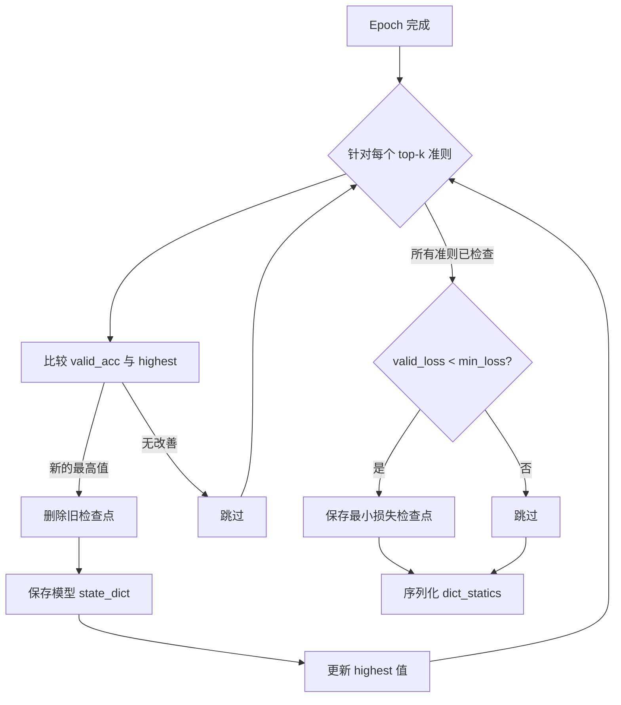
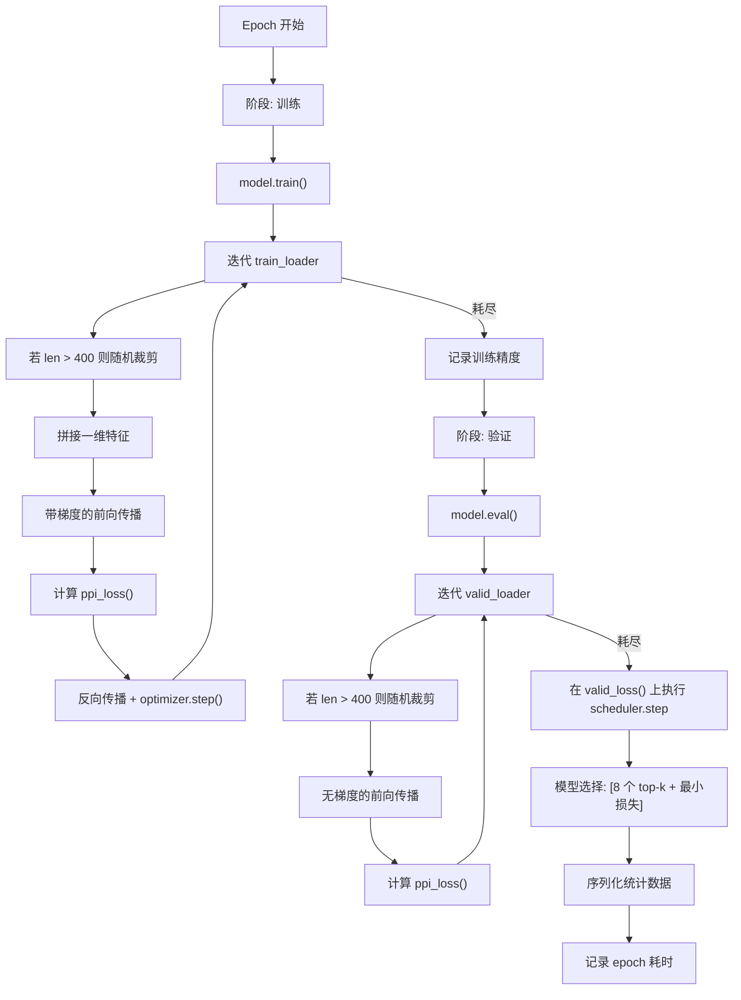

---
slug:14-training-and-model-selection
blog_type:normal
---


DRN-1D2D_Inter 的训练流水线实现了一种多准则模型选择策略，该策略同时跟踪**八个 top-k 精度指标**和**最小验证损失**，从而生成九个独立选择的模型检查点。这一设计反映了蛋白质间接触预测的核心洞察：用于捕获*置信度最高的前 5 个（top-5）*接触的最佳模型，与针对*前 L/5（top-L/5）*覆盖率优化的模型是不同的，且下游对接应用可能更倾向于精度-召回率前沿上的不同工作点。

来源: [train.py](/train.py#L1-L220), [README.md](/README.md#L46-L48)

## 训练配置

训练脚本通过确定性种子和显式的超参数选择来初始化所有组件。`random.seed(42)` 确保了可复现的数据打乱，而优化器和学习率调度器则配置了保守的正则化，以防止在结构多样的二聚体数据集上过拟合。

| 参数 | 值 | 作用 |
|---|---|---|
| 优化器 | AdamW | 解耦权重衰减正则化 |
| 学习率 | 0.001 | 初始步长 |
| Betas | (0.9, 0.999) | 动量估计的指数衰减率 |
| 权重衰减 | 0.1 | L2 正则化强度（高 — 强正则化） |
| 调度器 | ReduceLROnPlateau | 验证损失停滞时自适应降低学习率 |
| 容忍度 | 1 | 1 个 epoch 无改善后降低学习率 |
| 因子 | 0.1 | 停滞时降低 10 倍 |
| eps | 1e-6 | 最小学习率阈值 |
| Epochs | 25 | 总训练周期 |
| max_aa | 400 | 每条链的最大残基维度 |

**0.1 的权重衰减**非常激进 — 比常见的默认值 (0.01) 高出一个数量级 — 这反映了高容量的 9 块残差网络以及从训练二聚体中记忆稀疏接触模式的风险。

来源: [train.py](/train.py#L37-L78)

## 数据划分与加载

训练流水线从异源二聚体子集中构建了一个**保留验证集划分**。在进行 10 轮打乱以实现最大随机化后，前 500 个异源二聚体被保留用于验证，其余的则构成训练集。`PPI_Dataset` 类从磁盘加载预计算的特征张量（一维链特征和二维配对特征），`DataLoader` 以 `batch_size=None` 的方式运行，这意味着每个蛋白质二聚体作为单个样本进行处理 — 鉴于输入张量长度可变，这是必要的。

```
DataLoader 配置:
├── shuffle       = True
├── num_workers   = 6
├── prefetch_factor = 3
├── batch_size    = None   (每个样本的可变长度处理)
└── persistent_workers = True  (避免工作进程重启开销)
```

`persistent_workers=True` 标志对性能至关重要：它使六个工作进程在 epoch 之间保持存活，避免了在 25 个训练周期中重新初始化特征加载流水线的高昂开销。

来源: [train.py](/train.py#L38-L61)

## 随机裁剪策略

在训练期间，每条链残基数超过 `max_aa=400` 限制的蛋白质二聚体会经历**随机裁剪**。对于每次前向传播，从有效范围内均匀采样一个随机起始索引，并相应地裁剪一维特征和二维图谱（掩码、接触）：

```python
= 0 if la <= max_aa else np.random.randint(0, la - max_aa + 1)
startb = 0 if lb <= max_aa else np.random.randint(0, lb - max_aa + 1)
```

这种随机裁剪具有双重目的：它既满足了网络固定空间容量的约束，又充当了**隐式数据增强** — 在不同的训练迭代中暴露接触图谱的不同子区域，教导模型从部分结构上下文中定位接触。在验证期间，同样应用随机裁剪（没有确定性的中心裁剪），这在验证指标中引入了微小的方差，该方差会在 500 个样本的验证集上平均消除。

来源: [train.py](/train.py#L130-L138)

## 损失函数与梯度流

损失通过 `ppi_loss` 计算，该函数以 `alpha=None` 和 `reduction='sum'` 实例化。当 `alpha=None` 时，损失可能默认为接触预测任务的标准加权二元交叉熵公式，其中掩码张量将无效位置（填充区域、链内接触）排除在损失计算之外。`reduction='sum'` 对整个接触图谱的逐像素损失进行求和而非平均，产生更大的梯度幅度，与激进的权重衰减相互作用以维持稳定的优化动态。

训练循环遵循**逐样本梯度更新**模式：在每个单独的二聚体之后累加并应用梯度（对于可变长度输入，有效批次大小 = 1）。`optimizer.zero_grad()` 在前向传播之前（第 119 行）和 `optimizer.step()` 之后（第 154 行）均被调用，以确保每个样本的梯度累加是干净的。

来源: [train.py](/train.py#L70-L154)

## 多准则模型选择

模型选择框架是训练流水线在架构上最具特色的部分。它定义了**八个 top-k 精度指标**和**一个基于损失的准则**，每个都独立跟踪其表现最佳的检查点：

| 指标 | 描述 | 物理解释 |
|---|---|---|
| L/5 | 前 L/5 预测 | 广泛覆盖 — 适用于初始对接姿态 |
| L/10 | 前 L/10 预测 | 中等覆盖 — 平衡的精度/召回率 |
| L/20 | 前 L/20 预测 | 集中 — 更高置信度的接触 |
| 50 | 前 50 预测 | 固定数量 — 针对小蛋白 |
| 20 | 前 20 预测 | 稀疏的高置信度区间 |
| 10 | 前 10 预测 | 非常稀疏 — 仅最具置信度的接触 |
| 5 | 前 5 预测 | 超稀疏 — 前 5 个残基对 |
| 1 | 前 1 预测 | 单个最具置信度的接触 |
| min_loss | 最小验证损失 | 全局最优损失曲面点 |

每个准则跟踪一个 `highest` 精度值和对应的保存路径。在每个 epoch 结束时，评估所有八个 top-k 检查点：如果某个准则的当前验证精度超过其历史最佳，则删除之前的检查点并保存当前模型状态。最小损失检查点遵循相同的替换逻辑，但与 `running_loss` 而非精度进行比较。一个经序列化的 `dict_statics` 文件持久化保存了跨运行的完整训练历史。

来源: [train.py](/train.py#L81-L98), [train.py](/train.py#L180-L199)



## 学习率调度动态

`ReduceLROnPlateau` 调度器通过 **factor=0.1 的衰减**来响应验证损失的停滞，这意味着每当验证损失在 `patience=1` 个 epoch 内未改善时，学习率就会下降一个数量级。从 `lr=0.001` 开始，可能的轨迹为：

| 阶段 | 学习率 | 处于此学习率的 Epochs |
|---|---|---|
| 初始 | 1e-3 | 直至首次停滞 |
| 第一次衰减 | 1e-4 | 直至第二次停滞 |
| 第二次衰减 | 1e-5 | 直至第三次停滞 |
| 第三次衰减 | 1e-6 | 达到 eps 下限 |

由于 `patience=1`，调度器的响应极其灵敏 — 在仅一个 epoch 损失无改善后即触发衰减。在 25 个 epoch 的预算下，这种激进的调度通常会产生 2-3 次衰减，从探索性优化 (1e-3) 转变为精细收敛 (1e-5 或 1e-6)。

来源: [train.py](/train.py#L74-L75), [train.py](/train.py#L171-L172)

## 推理集成策略

模型选择策略直接促成了预测期间使用的**多模型集成**。正如[预测流水线](13-prediction-pipeline)中所揭示的，预测阶段加载**七个独立训练的模型权重**（`model/1` 到 `model/7`），并在原生和交换的链顺序上平均其输出：

```python
for weight_file in weight_list:         # 7 个模型
    model.load_state_dict(torch.load(weight_file))
    preds = model(rt_input)             # 原生顺序
    all_preds += preds.detach().cpu()
    preds2 = model(sw_input)            # 交换顺序
    all_preds += preds2.T.detach().cpu()

final_prediction = all_preds / 14       # 7 个模型 × 2 种顺序 = 14 次预测
```

**14 次预测平均**（7 个模型 × 2 个对称方向）作为一种测试时增强形式。来自交换输入的转置预测（`preds2.T`）在几何上等价于原生预测，对两者进行平均减少了膨胀卷积感受野中的方向偏差。这七个模型可能对应于独立训练运行中不同 top-k 选择的检查点，从而确保集成的多样性。

<CgxTip>多准则检查点选择意味着你可以为不同的下游任务选择不同的已保存模型 — top-1 检查点用于超精确的约束生成，或 top-L/5 检查点用于粗粒度对接中的广泛界面覆盖。</CgxTip>

<CgxTip>训练中的 `concat` 函数仅组合一维特征（外积展开），而 `model.py` 和 `load_feature.py` 中的版本还拼接了二维配对特征。这种差异表明训练脚本可能代表一种消融变体；请确保你的训练配置与预期的特征集相匹配。</CgxTip>

来源: [predict.py](/predict.py#L158-L177), [train.py](/train.py#L23-L34), [model.py](/model.py#L13-L25)

## 检查点与统计持久化

所有模型构件均保存在 `./final_model/` 目录下，前缀为 `PSSM_`。命名约定编码了选择准则：

| 文件 | 准则 |
|---|---|
| `PSSM_L_5.pth` | 最佳 top-L/5 精度 |
| `PSSM_L_10.pth` | 最佳 top-L/10 精度 |
| `PSSM_L_20.pth` | 最佳 top-L/20 精度 |
| `PSSM_50.pth` | 最佳 top-50 精度 |
| `PSSM_20.pth` | 最佳 top-20 精度 |
| `PSSM_10.pth` | 最佳 top-10 精度 |
| `PSSM_5.pth` | 最佳 top-5 精度 |
| `PSSM_1.pth` | 最佳 top-1 精度 |
| `PSSM__minloss.pth` | 最小验证损失 |

`PSSM__dict_statics.pkl` 序列化文件记录了完整的训练轨迹：所有八个 top-k 指标的逐 epoch 训练/验证精度、验证损失历史以及运行最佳值。这无需重新训练即可对收敛行为和准则相关性进行事后分析。

训练结束时，会打印一条汇总行，显示每个准则达到的最高精度，提供了各个工作点模型质量的一目了然的比较。

来源: [train.py](/train.py#L88-L98), [train.py](/train.py#L196-L208)

## 训练循环架构

完整的逐 epoch 训练循环遵循严格的先训练后验证顺序，并带有依赖阶段的梯度计算：



`torch.set_grad_enabled(phase == 'train')` 上下文管理器确保验证运行具有充分的内存效率 — 在评估阶段不构建计算图。鉴于蛋白质语言模型表示会产生大型特征张量，这一点尤为重要。