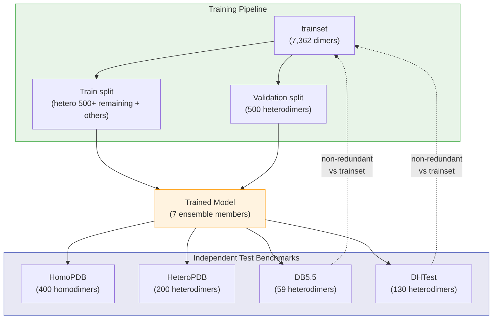

---
slug:15-input-data-and-benchmark-datasets
blog_type:normal
---


DRN-1D2D_Inter 从两个相互作用蛋白质的氨基酸序列中预测**蛋白质间接触**。该模型的输入极其精简——仅需一对 FASTA 序列及其对应的多序列比对（MSA）——然而，这种稀疏的输入驱动了一个丰富的特征工程流水线，生成一维（1D）逐残基表征和二维（2D）成对表征。本页记录了所需的输入格式、用于训练和评估的基准数据集，以及原始输入与网络所消费的派生特征产物之间的关系。

## 所需输入文件

对于每个预测目标（一对相互作用的蛋白质 A 和 B），该模型需要**四个文件**：每条链各一个 FASTA 文件和一个 A3M 文件。这些文件将作为命令行参数直接传递给 `predict.py`：

```
python predict.py sequenceA msaA sequenceB msaB result_path device
```

| 参数 | 描述 | 格式 | 示例 |
|----------|-------------|--------|---------|
| `sequenceA` | 链 A 的 FASTA 文件 | `.fasta` | `1GL1_A.fasta` |
| `msaA` | 链 A 的 MSA | `.a3m` | `1GL1_A_uniref100.a3m` |
| `sequenceB` | 链 B 的 FASTA 文件 | `.fasta` | `1GL1_I.fasta` |
| `msaB` | 链 B 的 MSA | `.a3m` | `1GL1_I_uniref100.a3m` |
| `result_path` | 输出目录 | — | `./example/result` |
| `device` | 计算设备 | — | `cpu`, `cuda:0` |

来源: [predict.py](/predict.py#L22-L28), [README.md](/README.md#L26-L37)

### FASTA 格式

每个 FASTA 文件包含一条以标准单字母编码表示的**单链氨基酸序列**。头部行以 `>` 开头，下一行为蛋白质序列。以 1GL1 示例目标（牛胰凝乳蛋白酶-PSTI 复合物）为例，链 A 是一条含 199 个残基的丝氨酸蛋白酶，链 I 是一条含 36 个残基的胰胰蛋白酶抑制剂：

```
>1GL1
CGVPAIQPVLSGLSRIVNGEEAVPGSWPWQVSLQDKTGFHFCGGSLINENWVVTAAH...
```

```
>1GL1
EISCEPGKTFKDKCNTCRCGADGKSAACTLKACPNQ
```

链之间序列长度的不对称是预期内的，且能被自然处理——网络在 L_A × L_B 的接触图上运行，其中 L_A 和 L_B 可能存在显著差异。

来源: [1GL1_A.fasta](/example/1GL1_A.fasta#L1-L2), [1GL1_I.fasta](/example/1GL1_I.fasta#L1-L2)

### A3M（比对 MSA）格式

`.a3m` 文件包含 A3M 格式的**多序列比对**——这是一种紧凑的 MSA 表示，其中空位表示为 `-`（相对于查询序列的插入序列用小写字母表示，可被移除）。每个条目以 `>` 为前缀的头部行开始，包含元数据（UniRef 聚类 ID、序列范围、分类信息），下一行则为比对序列。本项目 A3M 文件的关键结构特征：

- **头部格式**：`>UniRef100_<ID>/<range> [subseq from] <description> n=<count> Tax=<species> TaxID=<id> RepID=<representative>`
- **序列主体**：大写字母表示比对列，`-` 表示空位，小写字母表示插入
- **数据库来源**：MSA 应从 **UniRef90 或 UniRef100** 数据库派生，如项目 README 中所述
- **深度**：示例 A3M 文件包含数万条序列（链 A 有 131,782 行；链 I 有 143,537 行），但出于 GitHub 存储限制，这些已被**降采样**——实际应用中的完整 MSA 会更深

MSA 深度直接影响进化耦合特征（CCMpred、PSSM）的质量以及 ESM-MSA-1b 表征的信息量，这使得全面的 MSA 构建成为至关重要的上游步骤。

来源: [1GL1_A_uniref100.a3m](/example/1GL1_A_uniref100.a3m#L1-L20), [1GL1_I_uniref100.a3m](/example/1GL1_I_uniref100.a3m#L1-L20), [README.md](/README.md#L36-L37)

## 基准数据集

项目在 `data/` 目录下提供了五个基准数据集，每个数据集在“训练-验证-测试”流水线中各司其职。数据集按**二聚体类型**（同源二聚体 vs. 异源二聚体）和**来源**（经筛选的 PDB 复合物、Docking Benchmark、DeepHomo 测试集）进行组织。

| 数据集 | 位置 | 大小 | 二聚体类型 | 角色 | 来源 |
|---------|----------|------|------------|------|------------|
| **trainset** | `data/trainset/` | 7,362 个二聚体 | 混合 | 训练 + 验证 | 筛选的 PDB 二聚体 |
| **HomoPDB** | `data/HomoPDB/` | 400 个二聚体 | 同源二聚体 | 独立测试 | PDB 同源二聚体 |
| **HeteroPDB** | `data/HeteroPDB/` | 200 个二聚体 | 异源二聚体 | 独立测试 | PDB 异源二聚体 |
| **DB5.5** | `data/DB5.5/` | 59 个二聚体 | 异源二聚体 | 独立测试 | Docking Benchmark 5.5（非冗余） |
| **DHTest** | `data/DHTest/` | 130 个二聚体 | 异源二聚体 | 独立测试 | DeepHomo 测试集（非冗余） |

来源: [data/README.md](/data/README.md#L1-L10)

### 数据集关系与冗余控制

测试基准集经过精心构建，以避免与训练集发生信息泄露。**DB5.5** 和 **DHTest** 通过对训练集**移除冗余**显式派生——这确保了测试性能反映的是真正的泛化能力，而非对进化邻近项的死记硬背。以下 Mermaid 图展示了这些数据集如何划分评估格局：



### 训练/验证集划分策略

训练脚本展示了一种具体的划分策略：从异源二聚体子集中，**前 500 个条目**（在使用 `random.seed(42)` 打乱后）被留出用于验证，而剩余部分加上额外的训练复合物则构成训练划分。这产生了一个能代表异源二聚体接触预测的验证集，同时保留了大部分数据用于参数优化。

<CgxTip>基准目录（`data/trainset/`、`data/HomoPDB/` 等）在 GitHub 仓库中是占位目录——实际的预计算特征文件对版本控制而言过大。训练时，特征必须经过预计算并存储在 `train.py` 引用的路径中；预测时，`predict.py` 中的特征流水线会从四个输入文件即时计算它们。</CgxTip>

来源: [train.py](/train.py#L38-L52), [data/README.md](/data/README.md#L1-L10)

## 从原始输入到模型可消费特征

四个原始输入文件（2× FASTA + 2× A3M）**并未直接**输入神经网络。相反，`predict.py` 编排了一个多阶段特征派生流水线，将其转换为 DRN 所消费的一维和二维特征张量。下表总结了从原始输入生成的每一个中间产物：

| 阶段 | 工具/模块 | 输入 | 输出产物 | 特征类型 |
|-------|-------------|----------|-----------------|--------------|
| 1 | `pair_msa` | `fastaA`, `fastaB`, `msaA`, `msaB` | `paired.a3m` | 配对 MSA |
| 2 | `hhfilter` | `paired.a3m` | `filtered_paired.a3m` | 筛选的配对 MSA（≤256 差异） |
| 3 | `fasta2aln` | `paired.a3m` | `paired.aln` | 供 CCMpred 使用的 ALN 格式 |
| 4 | `hhfilter` | `msaA`, `msaB` | `filteredA.a3m`, `filteredB.a3m` | 筛选的单链 MSA |
| 5 | 序列拼接 | `fastaA`, `fastaB` | `paired.fasta` | 拼接的 A+B 序列 |
| 6 | `CCMpred` | `paired.aln` | `paired.ccmpred` | 二维共进化（1 通道） |
| 7 | `alnstats` | `paired.aln` | `paired.pairout` | 二维统计势（3 通道） |
| 8 | `esm1b_attn` | `paired.fasta` | `esm1b_rt.attn`, `esm1b_sw.attn` | 二维 ESM-1b 注意力（2× 通道） |
| 9 | `msa1b_attn` | `filtered_paired.a3m` | `msa1b_rt.attn`, `msa1b_sw.attn` | 二维 ESM-MSA-1b 注意力（2× 通道） |
| 10 | `hhmake` | `msaA`, `msaB` | `A.hhm`, `B.hhm` → `A_hhm.pkl`, `B_hhm.pkl` | 每条链的一维 PSSM |
| 11 | `esm1b_repr` | `fastaA`, `fastaB` | `A_esm1b.repr`, `B_esm1b.repr` | 每条链的一维 ESM-1b 嵌入 |
| 12 | `msa1b_repr` | `filteredA.a3m`, `filteredB.a3m` | `A_msa1b.repr`, `B_msa1b.repr` | 每条链的一维 ESM-MSA-1b 嵌入 |

来源: [predict.py](/predict.py#L30-L120)

### 一维特征（逐残基）

每条链的一维特征向量通过水平堆叠三个逐残基表征构建，如 `load_feature.chain_feature()` 中所实现：

```
feature_1d = hstack(PSSM, ESM-1b_repr, ESM-MSA-1b_repr)   # shape: (L, C_1d)
```

PSSM 从 `hhmake` 生成的 HMM 特征中提取，而两个 PLM 表征则来自 ESM-1b（单序列）和 ESM-MSA-1b（感知 MSA）。然后，这些一维特征通过重复交错（repeat-interleave）沿接触图维度**广播**，以形成最终输入张量的行重复和列重复分量。

来源: [load_feature.py](/load_feature.py#L57-L73)

### 二维特征（成对）

二维特征图将**共进化信号**（CCMpred、alnstats）与**基于注意力的链间模式**（ESM-1b 注意力、ESM-MSA-1b 注意力）结合，如 `load_feature.paired_feature()` 中所组装：

```
rt_feature_2d = cat(ccmpred, alnstats, esm1b_rt_attn, msa1b_rt_attn)
sw_feature_2d = cat(ccmpred.T, alnstats.T, esm1b_sw_attn, msa1b_sw_attn)
```

**rt**（right）和 **sw**（swap）变体表示 A×B 接触图的两个非对称视角。最终的模型输入通过拼接广播后的一维特征与二维特征构建：

```
Input = unsqueeze(cat(A_broadcast, B_broadcast, p2d), dim=0)   # shape: (1, C_total, L_A, L_B)
```

<CgxTip>`hhfilter -diff 256` 步骤对于在 ESM-MSA-1b 推理前控制 MSA 深度至关重要，因为其内存消耗与 MSA 深度呈二次方缩放关系。若没有此筛选，大型 MSA 在注意力计算阶段可能会耗尽 GPU 内存。</CgxTip>

来源: [load_feature.py](/load_feature.py#L76-L131), [load_feature.py](/load_feature.py#L8-L18)

## 回归权重文件

`data/regression/` 目录包含两个 **ESM 接触回归权重文件**，它们必须与相应的 ESM 模型权重放置在一起：

| 文件 | 关联 PLM | 用途 |
|------|----------------|---------|
| `esm1b_t33_650M_UR50S-contact-regression.pt` | ESM-1b（650M 参数） | 接触头回归权重 |
| `esm_msa1b_t12_100M_UR50S-contact-regression.pt` | ESM-MSA-1b（100M 参数） | 接触头回归权重 |

这些文件**并非完整的 PLM 权重**——它们是各模型接触预测头的补充回归参数。完整的模型权重必须从 ESM 仓库单独下载，并放置在 `predict.py` 中配置的路径下。

来源: [README.md](/README.md#L13-L17), [predict.py](/predict.py#L22-L27)

## 示例目标：1GL1

`example/` 目录提供了一个使用 PDB 条目 **1GL1**（牛胰凝乳蛋白酶与胰分泌型胰蛋白酶抑制剂复合物）的完整示例。这是一个具有明确表征界面的经典异源二聚体，是理想的演示案例：

| 文件 | 链 | 长度 | 描述 |
|------|-------|--------|-------------|
| `1GL1_A.fasta` | A（胰凝乳蛋白酶） | 199 个残基 | 丝氨酸蛋白酶链 |
| `1GL1_I.fasta` | I（PSTI） | 36 个残基 | 胰蛋白酶抑制剂链 |
| `1GL1_A_uniref100.a3m` | A | 65,890 条序列 | 来自 UniRef100 的 MSA（降采样） |
| `1GL1_I_uniref100.a3m` | I | 71,768 条序列 | 来自 UniRef100 的 MSA（降采样） |

由于 GitHub 文件大小限制，示例中的 MSA 已被**降采样**。正如项目 README 中所述：*"由于 github 文件大小限制，我们对示例目标的 MSA 进行了降采样。在实际应用中，DRN-1D2D_Inter 对所提供示例的真实性能应该更好。"* 在生产环境中，应使用通过 HHblits 或 Jackhmmer 针对 UniRef90/UniRef100 搜索获得的完整深度 MSA。

来源: [README.md](/README.md#L40-L49), [1GL1_A.fasta](/example/1GL1_A.fasta#L1-L2), [1GL1_I.fasta](/example/1GL1_I.fasta#L1-L2)

## 准备你自己的输入数据

要为新目标预测蛋白质间接触，你必须准备四个输入文件。关键的上游步骤是 **MSA 构建**，它决定了进化特征的质量。推荐的工作流为：

1. **获取序列**：为每个相互作用的链准备 FASTA 文件（每个文件单条序列，标准单字母氨基酸编码）
2. **生成 MSA**：针对 **UniRef90 或 UniRef100** 运行 HHblits 或 Jackhmmer，为每条链独立生成 A3M 格式的比对
3. **运行预测**：使用这四个文件执行 `predict.py`——特征流水线将自动处理所有下游派生

MSA 数据库的选择至关重要：UniRef100 能产生更深的比对（序列更多），但计算成本更高；而 UniRef90 提供了一种减少冗余的折中方案。如项目文档所述，两者均被明确支持。

来源: [README.md](/README.md#L36-L37)

## 进一步导航

要了解派生特征如何流经网络架构，请参阅[特征工程流水线](5-feature-engineering-pipeline)。有关基于 PLM 的特征提取器详情，请查阅[ESM-1b 注意力与表征](9-esm-1b-attention-and-representation)和[ESM-MSA-1b 注意力与表征](10-esm-msa-1b-attention-and-representation)。将特定链的 MSA 组合成链间比对的配对 MSA 构建过程，记录于[基于分类学的 MSA 配对](11-taxonomy-based-msa-pairing)。