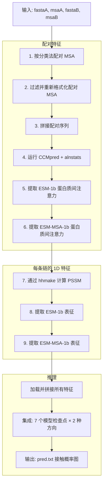

---
slug:2-quick-start
blog_type:normal
---


五分钟内运行起 DRN-1D2D_Inter。本页将带你了解如何克隆仓库、配置外部工具路径、下载模型权重，并使用附带的示例数据执行你的首次蛋白质间接触预测。最终目标是完成一个端到端的预测，生成如下所示的接触概率图。


来源：[README.md](/README.md#L1-L53), [predict.py](/predict.py#L1-L178)

## 前置条件速览

在接触代码之前，请验证你的环境是否满足这些要求。DRN-1D2D_Inter 同时依赖 **Python 包**和**编译好的生物信息学工具**——后者对于特征生成是不可或缺的。

| 类别 | 依赖项 | 版本 / 备注 | 用途 |
|---|---|---|---|
| **Python** | Python | 3.8 | 运行时环境 |
| | PyTorch | 1.9 | 深度学习框架 |
| | Biopython | — | FASTA/MSA 解析 |
| | esm (Facebook) | — | ESM-1b 与 ESM-MSA-1b 模型 |
| | NumPy | — | 数值计算 |
| **外部工具** | CCMpred | 可执行二进制文件 | 共进化接触得分 |
| | alnstats | 可执行二进制文件 | 比对统计（单点/成对） |
| | fasta2aln | 可执行二进制文件 | MSA 格式转换 |
| | hh-suite | 已编译 | HMM 生成与 MSA 过滤 |

<CgxTip>ESM-1b 和 ESM-MSA-1b 模型权重必须从 [esm 仓库的 "Available Models and Datasets" 表格](https://github.com/facebookresearch/esm)单独下载。`data/regression/` 中附带的回归检查点文件也需要放置在这些权重所在的目录下。</CgxTip>

来源：[README.md](/README.md#L4-L17)

## 步骤 1 — 克隆仓库

```bash
git clone https://github.com/ChengfeiYan/DRN-1D2D_Inter.git
cd DRN-1D2D_Inter
```

你将看到的顶层目录结构：

```
DRN-1D2D_Inter/
├── predict.py          ← 主预测入口
├── train.py            ← 训练脚本
├── model.py            ← DRN-1D2D 网络定义
├── load_feature.py     ← 特征加载与拼接
├── plm/                ← 蛋白质语言模型模块
│   ├── esm1b_attn.py   ← ESM-1b 注意力提取
│   ├── esm1b_repr.py   ← ESM-1b 表征提取
│   ├── msa1b_attn.py   ← ESM-MSA-1b 注意力提取
│   └── msa1b_repr.py   ← ESM-MSA-1b 表征提取
├── paired/             ← 配对 MSA 构建
├── example/            ← 附带示例 (1GL1)
└── data/               ← 回归权重与基准测试数据
```

来源：[README.md](/README.md#L19-L21), [predict.py](/predict.py#L1-L19)

## 步骤 2 — 下载训练好的模型权重

该仓库**不包含** 7 个训练好的模型检查点文件。请从 Google Drive 链接下载它们，并解压到项目根目录的 `model/` 目录中：

```bash
# 下载链接: https://drive.google.com/file/d/1ICqJSNc01E2cGYhVj1IxzIkmnS-FMT2C/view
# 下载后，解压至项目根目录 —— 这将创建包含 7 个权重文件的 model/ 目录
unzip trained_models.zip -d .
```

预测脚本需要在 `model/1` 到 `model/7` 路径下精确存在 7 个权重文件，它们将作为集成模型被加载以进行最终平均。

来源：[README.md](/README.md#L24-L25), [predict.py](/predict.py#L158-L177)

## 步骤 3 — 配置工具与模型路径

打开 [predict.py](predict.py) 并更新文件顶部（第 24–31 行）的**路径变量**以匹配你的系统。这些路径告诉流水线去哪里查找外部二进制文件和 ESM 模型权重。

| 变量 | 当前默认值 | 应设置为何值 |
|---|---|---|
| `CCMPred` | `/home/.../ccmpred` | CCMpred 二进制文件的绝对路径 |
| `reformat` | `/home/.../fasta2aln` | fasta2aln 二进制文件的绝对路径 |
| `alnstats` | `/home/.../alnstats` | alnstats 二进制文件的绝对路径 |
| `hhmake` | `/home/.../hhmake` | hhmake 二进制文件的绝对路径 |
| `hhfilter` | `/home/.../hhfilter` | hhfilter 二进制文件的绝对路径 |
| `LoadHHM` | `/home/.../LoadHHM.py` | 本仓库中 `plm/LoadHHM.py` 的绝对路径 |
| `esm1b_location` | `/home/.../esm1b_t33_650M_UR50S.pt` | ESM-1b 模型权重的绝对路径 |
| `esm_msa1b_location` | `/home/.../esm_msa1b_t12_100M_UR50S.pt` | ESM-MSA-1b 模型权重的绝对路径 |

<CgxTip>`LoadHHM` 变量必须指向本仓库内 `plm/LoadHHM.py` 的**本地副本**（例如 `/your/path/DRN-1D2D_Inter/plm/LoadHHM.py`），而非远程位置。该脚本在特征准备阶段负责将 `.hhm` 文件解析为 PSSM pickle 文件。</CgxTip>

此外，将 ESM-1b **接触回归检查点**从仓库中复制到与你的 ESM-1b 模型权重相同的目录下：

```bash
cp data/regression/esm1b_t33_650M_UR50S-contact-regression.pt /path/to/esm/weights/
```

来源：[predict.py](/predict.py#L22-L31), [README.md](/README.md#L22-L23)

## 步骤 4 — 运行你的首次预测

预测流水线接受六个命令行参数：

```bash
python predict.py sequenceA msaA sequenceB msaB result_path device
```

| 参数 | 描述 | 示例 |
|---|---|---|
| `sequenceA` | 蛋白质链 A 的 FASTA 文件 | `./example/1GL1_A.fasta` |
| `msaA` | 链 A 的 A3M 多序列比对 (UniRef90/100) | `./example/1GL1_A_uniref100.a3m` |
| `sequenceB` | 蛋白质链 B 的 FASTA 文件 | `./example/1GL1_I.fasta` |
| `msaB` | 链 B 的 A3M 多序列比对 | `./example/1GL1_I_uniref100.a3m` |
| `result_path` | 输出目录（若不存在则会创建） | `./example/result` |
| `device` | PyTorch 设备标识符 | `cpu` 或 `cuda:0` |

执行附带示例：

```bash
python predict.py \
  ./example/1GL1_A.fasta ./example/1GL1_A_uniref100.a3m \
  ./example/1GL1_I.fasta ./example/1GL1_I_uniref100.a3m \
  ./example/result cpu
```

示例目标是 **1GL1**，一个胰凝乳蛋白酶–BPTI 复合体。链 A（胰凝乳蛋白酶，199 个残基）和链 I（BPTI，36 个残基）构成了一个经典的蛋白质-蛋白质相互作用，具有被充分研究的蛋白质间接触。

来源：[predict.py](/predict.py#L35-L41), [README.md](/README.md#L27-L39), [example/1GL1_A.fasta](/example/1GL1_A.fasta#L1-L2), [example/1GL1_I.fasta](/example/1GL1_I.fasta#L1-L2)

## 预测过程中的运作机制

`predict.py` 脚本编排了一个**九阶段特征工程流水线**，随后是一个**集成推理**步骤。以下是完整流程：



每个阶段都会在 `result_path` 目录下生成中间文件。最终输出为 **`pred.txt`**——一个矩阵，其中条目 *(i, j)* 表示链 A 的残基 *i* 与链 B 的残基 *j* 发生接触的预测概率。

来源：[predict.py](/predict.py#L44-L177), [load_feature.py](/load_feature.py#L42-L102)

## 理解输出结果

流水线会将以下关键文件写入你的 `result_path` 目录：

| 文件 | 格式 | 描述 |
|---|---|---|
| `pred.txt` | 纯文本矩阵 | **最终预测** — 蛋白质间接触概率 (0–1) |
| `paired.a3m` | A3M | 通过基于分类法配对构建的配对 MSA |
| `paired.ccmpred` | 文本 | 配对 MSA 的 CCMpred 共进化得分 |
| `paired.pairout` | 文本 | alnstats 成对统计信息 |
| `esm1b_rt.attn.npy` | NumPy | ESM-1b 右向交叉注意力图 |
| `esm1b_sw.attn.npy` | NumPy | ESM-1b 交换交叉注意力图 |
| `msa1b_rt.attn.npy` | NumPy | ESM-MSA-1b 右向交叉注意力图 |
| `msa1b_sw.attn.npy` | NumPy | ESM-MSA-1b 交换交叉注意力图 |
| `A_esm1b.repr.npy` | NumPy | 链 A 的 ESM-1b 逐残基表征 |
| `B_esm1b.repr.npy` | NumPy | 链 B 的 ESM-1b 逐残基表征 |

预测集成模型加载全部 7 个检查点，在每个检查点上同时运行右向（A→B）和交换（B→A）两种输入方向，并将得到的 14 个预测结果取平均。这种具有对称性感知的集成机制，正是最终在代码中除以 14（`all_preds/14`）的原因。

来源：[predict.py](/predict.py#L158-L177), [load_feature.py](/load_feature.py#L16-L27)

## 准备你自己的数据

若要为一对新颖的蛋白质预测接触，你需要四个输入文件：

1. **链 A 的 FASTA** — 包含蛋白质 A 氨基酸序列的单序列 FASTA 文件
2. **链 A 的 MSA** — 使用 HHblits 或 JackHMMER 等工具从 **UniRef90 或 UniRef100** 派生出的 A3M 格式多序列比对
3. **链 B 的 FASTA** — 格式同上，对应蛋白质 B
4. **链 B 的 MSA** — 格式同上，对应蛋白质 B

FASTA 文件必须刚好包含两行：标题行（以 `>` 开头）和序列行。MSA 的质量直接影响预测准确度——越深、越多样的比对能产生更好的共进化信号。

```bash
python predict.py \
  /path/to/your/proteinA.fasta /path/to/your/proteinA_uniref100.a3m \
  /path/to/your/proteinB.fasta /path/to/your/proteinB_uniref100.a3m \
  /path/to/output_dir cuda:0
```

来源：[README.md](/README.md#L27-L36), [example/1GL1_A.fasta](/example/1GL1_A.fasta#L1-L2)

## 常见问题排查

| 症状 | 可能原因 | 解决方法 |
|---|---|---|
| CCMpred/alnstats 出现 `FileNotFoundError` | 工具路径未配置 | 更新 [predict.py](/predict.py#L24-L31) 中的路径变量 |
| ESM 模型权重出现 `FileNotFoundError` | 权重未下载 | 从 [esm 仓库](https://github.com/facebookresearch/esm)下载并设置 `esm1b_location` / `esm_msa1b_location` |
| 回归检查点出现 `FileNotFoundError` | 缺少 `.pt` 文件 | 将 `data/regression/esm1b_t33_650M_UR50S-contact-regression.pt` 复制到 ESM 权重目录 |
| 找不到 `model/1` | 训练模型未下载 | 从 [Google Drive](https://drive.google.com/file/d/1ICqJSNc01E2cGYhVj1IxzIkmnS-FMT2C/view)下载并解压至 `model/` 目录 |
| CUDA 内存不足 | ESM-MSA-1b 非常占用内存 | 使用 `cpu` 设备或显存 ≥16 GB 的 GPU |
| 预测结果为空/稀疏 | MSA 太浅 | 确保 MSA 源自 UniRef90/100 且具有足够的序列多样性 |

来源：[predict.py](/predict.py#L22-L31), [README.md](/README.md#L22-L25)

## 接下来的去向

现在你已经成功运行了一次预测，可以深入探索该系统：

- **[安装与依赖](3-installation-and-dependencies)** — 所有外部工具和 Python 包的详细配置
- **[架构概览](4-architecture-overview)** — 了解膨胀残差网络如何处理 1D 和 2D 特征
- **[特征工程流水线](5-feature-engineering-pipeline)** — 深入剖析九个特征计算阶段
- **[预测流水线](13-prediction-pipeline)** — 完整的端到端推理演练