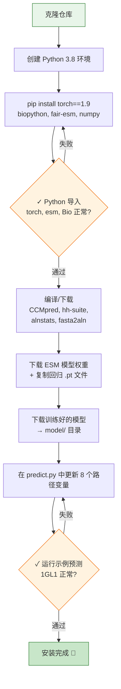

---
slug:3-installation-and-dependencies
blog_type:normal
---


设置 DRN-1D2D_Inter 涉及三个不同的软件层：带有深度学习和生物信息学包的 **Python 环境**、一组用于 MSA 处理和共进化分析的**编译外部生物信息学工具**，以及蛋白质语言模型和 DRN-1D2D_Inter 网络本身的**预训练模型权重**。本指南将逐步引导你完成每一层的配置，并提供明确的验证检查点，以便你在运行预测之前及早发现问题。

## 系统要求

DRN-1D2D_Inter 使用 PyTorch 在 CPU 或 GPU 上执行推理。蛋白质语言模型（参数量为 650M 的 ESM-1b 和参数量为 100M 的 ESM-MSA-1b）是内存密集型的——强烈建议使用具有 **≥16 GB VRAM** 且支持 CUDA 的 GPU，以获得实际的运行耗时。支持 CPU 推理，但在执行 ESM 前向传播时会显著变慢。确保你的系统拥有 **≥32 GB RAM**，以满足 MSA 处理和特征组装的需求。

| 需求 | 最低要求 | 推荐配置 |
|---|---|---|
| Python | 3.8 | 3.8 |
| GPU VRAM | 8 GB | ≥16 GB |
| 系统 RAM | 16 GB | ≥32 GB |
| 磁盘空间 | 5 GB | 10 GB |

来源: [README.md](/README.md#L4-L10), [predict.py](/predict.py#L17-L19)

## 步骤 1 — 克隆仓库

```bash
git clone https://github.com/ChengfeiYan/DRN-1D2D_Inter.git
cd DRN-1D2D_Inter
```

这将为你提供项目源代码、示例数据，以及 `data/regression/` 下的 ESM 回归权重占位文件。本仓库基于 **Apache 2.0** 许可证授权。

来源: [README.md](/README.md#L19-L20), [LICENSE](/LICENSE#L1-L2)

## 步骤 2 — 创建 Python 环境

项目指定 **Python 3.8** 为目标版本。使用你首选的环境管理器来创建一个隔离环境：

```bash
# 使用 conda（推荐）
conda create -n drn python=3.8
conda activate drn

# 或使用 venv
python3.8 -m venv drn-env
source drn-env/bin/activate
```

核心 Python 依赖项及其在项目中的作用总结如下：

| 包 | 版本 | 作用 | 使用位置 |
|---|---|---|---|
| **PyTorch** | 1.9 | 张量操作、模型推理、CUDA 调度 | `predict.py`, `model.py`, `load_feature.py` |
| **esm** | （与 PyTorch 1.9 兼容） | Facebook Research 的蛋白质语言模型库 — 提供 `pretrained.load_model_and_alphabet_local()` | `plm/esm1b_attn.py`, `plm/esm1b_repr.py`, `plm/msa1b_attn.py`, `plm/msa1b_repr.py` |
| **Biopython** | — | `Bio.SeqIO`，用于 FASTA/MSA 文件解析 | `plm/esm1b_attn.py`, `plm/esm1b_repr.py`, `plm/msa1b_attn.py`, `plm/msa1b_repr.py` |
| **NumPy** | — | 数组 I/O（`np.load`, `np.savetxt`），贯穿特征加载过程的数值计算 | `load_feature.py`, `predict.py`, `paired/cluster_species.py`, `plm/LoadHHM.py` |

使用以下命令安装它们：

```bash
# PyTorch 1.9 配合 CUDA 11.1（根据你的驱动调整 CUDA 版本）
pip install torch==1.9.0+cu111 -f https://download.pytorch.org/whl/torch_stable.html

# 或仅使用 CPU
pip install torch==1.9.0

# 生物信息学和语言模型包
pip install biopython
pip install "fair-esm[all]"   # 从 Facebook Research 安装 esm 包
pip install numpy
```

<CgxTip>PyPI 上的 `esm` 包发布名称为 `fair-esm`。在安装 `fair-esm` 后，`plm/` 中通篇使用的 `import esm` 语句将能正确解析。请确保你的 PyTorch 和 esm 版本兼容 — esm ≥ 1.0 需要 PyTorch ≥ 1.8，而本项目是基于 PyTorch 1.9 开发的。</CgxTip>

通过运行以下命令**验证 Python 环境**：

```bash
python -c "import torch; print(f'PyTorch {torch.__version__}, CUDA: {torch.cuda.is_available()}')"
python -c "import esm; print('esm OK')"
python -c "from Bio import SeqIO; print('Biopython OK')"
```

来源: [README.md](/README.md#L5-L9), [plm/esm1b_attn.py](/plm/esm1b_attn.py#L9-L14), [plm/msa1b_repr.py](/plm/msa1b_repr.py#L13-L14)

## 步骤 3 — 安装外部生物信息学工具

DRN-1D2D_Inter 在预测流程中通过 `os.system()` 调用四个编译好的生物信息学工具。它们**不是** Python 包 — 而是必须单独编译或下载的独立 C/C++ 可执行文件。

| 工具 | 来源 | 流程中的作用 | 调用位置 |
|---|---|---|---|
| **CCMpred** | [soedinglab/CCMpred](https://github.com/soedinglab/CCMpred) | 对配对的 MSA 进行伪似然共进化接触预测 | `predict.py` 第 88 行 |
| **alnstats** | [psipred/metapsicov `src/alnstats`](https://github.com/psipred/metapsicov/tree/master/src/alnstats) | 计算单点和双点比对统计量 | `predict.py` 第 92 行 |
| **hh-suite** | [soedinglab/hh-suite](https://github.com/soedinglab/hh-suite) | 提供 `hhmake`（HMM 构建）和 `hhfilter`（MSA 过滤） | `predict.py` 第 62, 68, 70, 120, 122 行 |
| **fasta2aln** | [kad-ecoli/hhsuite2 `bin/fasta2aln`](https://github.com/kad-ecoli/hhsuite2/blob/master/bin/fasta2aln) | 将 a3m MSA 重新格式化为 CCMpred/alnstats 所需的 a3l 比对格式 | `predict.py` 第 65 行 |

### 安装命令

```bash
# 1. CCMpred — 从源码编译
git clone https://github.com/soedinglab/CCMpred.git
cd CCMpred && mkdir build && cd build
cmake -DCMAKE_BUILD_TYPE=Release ..
make -j$(nproc)
# 可执行文件: CCMpred/build/bin/ccmpred

# 2. hh-suite — 从源码编译（提供 hhmake 和 hhfilter）
git clone https://github.com/soedinglab/hh-suite.git
cd hh-suite && mkdir build && cd build
cmake -DCMAKE_BUILD_TYPE=Release ..
make -j$(nproc)
# 可执行文件: hh-suite/build/bin/hhmake, hh-suite/build/bin/hhfilter

# 3. alnstats — 从 metapsicov 下载预编译二进制文件
git clone https://github.com/psipred/metapsicov.git
# 可执行文件: metapsicov/src/alnstats/alnstats  （若无二进制文件则进行编译）
chmod +x metapsicov/src/alnstats/alnstats

# 4. fasta2aln — 下载预编译二进制文件
wget https://github.com/kad-ecoli/hhsuite2/raw/master/bin/fasta2aln
chmod +x fasta2aln
```

<CgxTip>`alnstats` 和 `fasta2aln` 工具以预编译二进制文件的形式分发。下载后，你**必须**使用 `chmod +x` 赋予其可执行权限。如果这些二进制文件与你的平台不兼容，请使用提供的 Makefile 从 metapsicov 源码编译 `alnstats`。</CgxTip>

**记录每个可执行文件的绝对路径** — 你将在步骤 4 中用到它们：

| 变量 | 示例路径 |
|---|---|
| `CCMPred` | `/path/to/CCMpred/build/bin/ccmpred` |
| `alnstats` | `/path/to/metapsicov/bin/alnstats` |
| `hhmake` | `/path/to/hh-suite/build/bin/hhmake` |
| `hhfilter` | `/path/to/hh-suite/build/bin/hhfilter` |
| `reformat` | `/path/to/fasta2aln` |

来源: [README.md](/README.md#L12-L16), [predict.py](/predict.py#L24-L28), [predict.py](/predict.py#L62-L92)

## 步骤 4 — 下载 ESM 模型权重

两个蛋白质语言模型需要其预训练权重文件，这些文件**未**包含在本仓库中。请从 [esm GitHub 页面](https://github.com/facebookresearch/esm)的 "Available Models and Datasets" 表格中下载它们：

| 模型 | 权重文件 | 参数量 |
|---|---|---|
| **ESM-1b** | `esm1b_t33_650M_UR50S.pt` | 650M |
| **ESM-MSA-1b** | `esm_msa1b_t12_100M_UR50S.pt` | 100M |

将这些 `.pt` 文件放置在专用目录中，例如 `~/esm_models/`，并记录它们的完整路径。

### 复制 ESM 回归权重

仓库在 `data/regression/` 下包含两个**回归检查点**占位文件，必须将它们复制到与相应模型权重相同的目录中：

```bash
# 将回归权重复制到你的 ESM 模型目录
cp data/regression/esm1b_t33_650M_UR50S-contact-regression.pt ~/esm_models/
cp data/regression/esm_msa1b_t12_100M_UR50S-contact-regression.pt ~/esm_models/
```

这一点至关重要 — `esm` 库会从主模型权重旁边带有 `-contact-regression.pt` 后缀的同级文件中加载接触回归头。如果缺少这些文件，ESM 注意力提取将会失败。

来源: [README.md](/README.md#L11-L22), [data/regression/](/data/regression/)

## 步骤 5 — 下载训练好的 DRN-1D2D_Inter 模型

预测流程会从 `model/` 目录加载一个由 7 个模型组成的**集成模型**（模型文件命名为 `1` 到 `7`）：

```python
weight_list = [f'model/{i}' for i in range(1,8)]
```

从 [Google Drive 链接](https://drive.google.com/file/d/1ICqJSNc01E2cGYhVj1IxzIkmnS-FMT2C/view?usp=sharing)下载训练好的模型，然后解压到项目根目录的 `model/` 文件夹中：

```bash
# 从 Google Drive 下载后
unzip trained_models.zip -d model/
# 验证: 你应该看到 model/1, model/2, ..., model/7
ls model/
```

来源: [README.md](/README.md#L24-L25), [predict.py](/predict.py#L159-L160)

## 步骤 6 — 配置 predict.py 中的路径

打开 [predict.py](predict.py) 并更新第 24–31 行的**六个路径变量**，使其与你的系统相匹配：

```python
# 修改前（原作者的占位路径）
CCMPred = '/home/yunda_si/self/software_p/CCMpred_pad/bin/ccmpred'
reformat = '/home/Common_softwares/DeepMSA/bin/fasta2aln'
alnstats = '/home/yunda_si/self/software_p/metapsicov-2.0.3/bin/alnstats'
hhmake   = '/home/yunda_si/self/software_p/hh-suite/build/bin/hhmake'
hhfilter = '/home/Common_softwares/hh-suite/build/bin/hhfilter'
LoadHHM  = '/mnt/data/yunda_si/self/PythonProjects/PPI_contact/github/plm/LoadHHM.py'
esm1b_location      = "/mnt/data/yunda_si/self/software_p/esm/model/esm1b_t33_650M_UR50S.pt"
esm_msa1b_location  = "/mnt/data/yunda_si/self/software_p/esm/model/esm_msa1b_t12_100M_UR50S.pt"
```

将它们替换为你实际的绝对路径：

```python
# 修改后（你的系统路径）
CCMPred = '/your/path/to/CCMpred/build/bin/ccmpred'
reformat = '/your/path/to/fasta2aln'
alnstats = '/your/path/to/metapsicov/bin/alnstats'
hhmake   = '/your/path/to/hh-suite/build/bin/hhmake'
hhfilter = '/your/path/to/hh-suite/build/bin/hhfilter'
LoadHHM  = '/your/path/to/DRN-1D2D_Inter/plm/LoadHHM.py'
esm1b_location      = "/your/path/to/esm_models/esm1b_t33_650M_UR50S.pt"
esm_msa1b_location  = "/your/path/to/esm_models/esm_msa1b_t12_100M_UR50S.pt"
```

请注意，`LoadHHM` 指向的是**本仓库内**的 `plm/LoadHHM.py` 脚本 — 请将其更新为你克隆仓库的实际位置。

来源: [predict.py](/predict.py#L22-L31)

## 完整安装流程

下图总结了完整的设置流程及其验证检查点：



## 验证 — 运行示例

完成所有步骤后，使用内置示例验证你的安装：

```bash
python predict.py ./example/1GL1_A.fasta ./example/1GL1_A_uniref100.a3m \
                   ./example/1GL1_I.fasta ./example/1GL1_I_uniref100.a3m \
                   ./example/result cpu
```

如果一切配置正确，这将在 `./example/result/pred.txt` 生成一个接触概率图。如果有可用的 GPU，请使用 `cuda:0` 代替 `cpu`。请注意，示例 MSA 因 GitHub 文件大小限制而被下采样，因此在实际应用中使用完整深度的 MSA 性能会更好。

来源: [README.md](/README.md#L28-L44), [predict.py](/predict.py#L37-L41)

## 故障排除

| 症状 | 可能原因 | 解决方案 |
|---|---|---|
| `ModuleNotFoundError: No module named 'esm'` | 未安装 `fair-esm` | `pip install "fair-esm[all]"` |
| 在 ESM `.pt` 文件上出现 `FileNotFoundError` | 模型权重路径错误或文件缺失 | 验证 `predict.py` 中的 `esm1b_location` / `esm_msa1b_location` 指向了存在的 `.pt` 文件 |
| 工具调用时出现 `OSError` 或 `Permission denied` | 外部工具无执行权限 | 对该二进制文件执行 `chmod +x`，并验证 `predict.py` 中的路径 |
| `RuntimeError: CUDA out of memory` | GPU VRAM 不足以运行 ESM-1b (650M) | 使用 `cpu` 设备，或使用 `hhfilter -diff` 降低 MSA 深度 |
| 找不到回归头（`-contact-regression.pt`） | 回归权重未复制到模型目录 | 将 `data/regression/` 中的文件复制到主 `.pt` 权重所在目录 |
| 找不到 `model/1` | 未下载训练好的集成模型 | 从 [Google Drive](https://drive.google.com/file/d/1ICqJSNc01E2cGYhVj1IxzIkmnS-FMT2C/view?usp=sharing) 下载并解压到 `model/` 目录 |

## 后续步骤

环境完全配置好后，你就可以运行预测了。逻辑上的下一步是了解流程如何编排特征提取和模型推理：

- **[快速开始](2-quick-start)** — 使用自定义输入运行你的首次蛋白质间接触预测
- **[架构概览](4-architecture-overview)** — 了解 1D 特征、2D 配对特征和 DRN 网络是如何协同工作的
- **[特征工程流程](5-feature-engineering-pipeline)** — 深入剖析 `predict.py` 内部的 9 步特征计算链