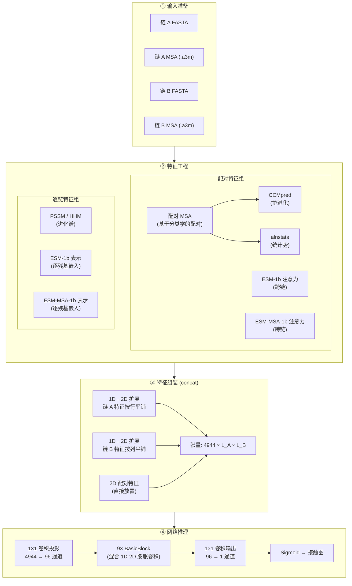
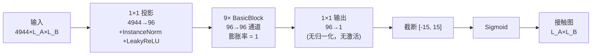

---
slug:4-architecture-overview
blog_type:normal
---


DRN-1D2D_Inter 是一个用于**蛋白质间接触预测**的深度学习系统——给定两个相互作用蛋白质（链 A 和链 B）的氨基酸序列，它预测界面两侧哪些残基对存在空间接触。该架构通过**混合 1D-2D 卷积的膨胀残差网络**，融合了来自蛋白质语言模型、进化谱和协进化信号的异构特征，最终输出一张逐残基对的概率图。

来源: [README.md](/README.md#L1-L3), [model.py](/model.py#L1-L10)

## 系统架构

该系统作为一个四阶段的流水线运行：**输入准备 → 特征工程 → 特征组装 → 网络推理**。每个阶段将数据从原始序列层面逐步转换为更具结构化的表示，最终生成 2D 接触概率图。



上图展示了端到端的数据流。阶段 ①–② 的详细信息见[特征工程流水线](5-feature-engineering-pipeline)；阶段 ④ 的内部机制在[混合 1D-2D 残差块](6-hybrid-1d-2d-residual-block)、[膨胀率策略](7-dilation-rate-strategy)和[网络前向传播](8-network-forward-pass)中介绍。

来源: [predict.py](/predict.py#L35-L178), [model.py](/model.py#L154-L209)

## 特征架构

模型接收形状为 `(1, 4944, L_A, L_B)` 的 **4944 通道**输入张量，其中 `L_A` 和 `L_B` 分别为两条链的序列长度。该张量由三个特征流组装而成，这些特征流捕获了关于蛋白质间接触的互补信息。

### 逐链 1D 特征 (→ 通过平铺转为 2D)

每条链独立生成一个 **2068 维**的逐残基特征向量。这些 1D 特征通过平铺扩展为 2D：链 A 的特征沿列复制（每行相同），链 B 的特征沿行复制（每列相同）。这种扩展使 2D 卷积网络能够学习两条链的逐残基特征之间的相互作用。

| 特征来源 | 维度 | 来源 | 捕获信息 |
|---|---|---|---|
| PSSM (HHM) | 20 | HHblits 谱 HMM → 得分矩阵 | 每个位置的进化保守性 |
| ESM-1b 表示 | 1280 | ESM-1b 第 33 层输出 | 来自单序列的上下文残基语义 |
| ESM-MSA-1b 表示 | 768 | ESM-MSA-1b 第 12 层输出 | 来自 MSA 的上下文残基语义 |
| **逐链总计** | **2068** | | |

两条链平铺后：2068 × 2 = **4136 通道**。

### 配对 2D 特征 (直接)

配对特征在**联合 MSA**（通过分类学配对两条链的 MSA 序列构建）上计算，并具有固有的 2D 结构——每个值对应于跨两条链的残基对 `(i, j)`。

| 特征来源 | 通道数 | 来源 | 捕获信息 |
|---|---|---|---|
| CCMpred | 1 | 配对 MSA 上的伪似然协进化 | 直接协进化耦合 |
| alnstats | 3 | 统计势 (3 个打分函数) | 成对统计偏好 |
| ESM-1b 注意力 | 660 | 33 层 × 20 头，跨链切片 | 链间 Transformer 注意力 |
| ESM-MSA-1b 注意力 | 144 | 12 层 × 12 头，跨链切片 | 链间 MSA 感知注意力 |
| **配对总计** | **808** | | |

### 输入总体构成

| 流 | 通道数 | 方法 |
|---|---|---|
| 链 A 1D → 2D | 2068 | 通过 `repeat_interleave` 进行走平铺 |
| 链 B 1D → 2D | 2068 | 通过 `repeat_interleave` 进行列平铺 |
| 配对 2D | 808 | 直接放置 |
| **总计** | **4944** | 沿通道轴拼接 |

`concat` 函数执行此组装：它沿列维度重复链 A 的 1D 特征，沿行维度重复链 B 的 1D 特征，然后将两者与配对 2D 特征沿通道轴进行拼接。

来源: [load_feature.py](/load_feature.py#L16-L27), [load_feature.py](/load_feature.py#L42-L102), [model.py](/model.py#L13-L25)

## 网络架构: DRN-1D2D

该网络是一个**膨胀残差网络**，由三个连续阶段组成：



### 阶段 1: 输入投影

1×1 卷积将 4944 通道输入降维至 **96 通道**，随后进行实例归一化和 LeakyReLU 激活。此投影充当一个可学习的特征选择层，将异构的输入通道压缩至统一的表示空间。

### 阶段 2: 膨胀残差块

九个 `BasicBlock` 模块在 96 通道下以膨胀率 1 运行。每个 `BasicBlock` 包含一个**混合 1D-2D 卷积**方案——一个 3×3 膨胀 2D 卷积加上 1×15 和 15×1 膨胀 1D 卷积——它们的输出被求和，并通过残差连接加回至输入。由于膨胀率 (1) 落在激活阈值 `[1, 20, 40]` 内，所有九个块均采用完整的混合卷积。

### 阶段 3: 输出投影与激活

1×1 卷积将 96 通道映射为 1 通道，随后截断至 `[-15, 15]`（以保障数值稳定性），并经 Sigmoid 激活生成区间 `[0, 1]` 内的逐对接触概率。

<CgxTip>混合 1D-2D 设计是有意为之：1×15 和 15×1 卷积捕获了沿每条链序列维度的条形感受野，这对于蛋白质间接触具有结构意义，因为一条链上的残基会与另一条链的特定区域发生相互作用。3×3 卷积则捕获局部 2D 空间模式。</CgxTip>

来源: [model.py](/model.py#L154-L209), [model.py](/model.py#L78-L151), [model.py](/model.py#L28-L55)

## 预测策略: 对称平均

预测流水线利用了**注意力特征的不对称性**，从同一特征集构建两个输入张量：

| 输入张量 | 1D 特征 | 2D 配对特征 | 语义含义 |
|---|---|---|---|
| `rt_input` | A 行，B 列 | 从右至左注意力 | "A 关注 B" 方向 |
| `sw_input` | B 行，A 列 | 交换的注意力 | "B 关注 A" 方向 |

加载七个独立训练的模型检查点。每个检查点对 `rt_input` 和 `sw_input` 均进行预测，所有 14 个预测结果取平均（除以 14）。`sw_input` 预测结果的转置将其重新对齐至 `(L_A, L_B)` 坐标系。这种集成策略通过覆盖蛋白质间界面的两个方向视图，提升了鲁棒性。

来源: [predict.py](/predict.py#L153-L177), [load_feature.py](/load_feature.py#L61-L102)

## 模块清单

代码库被组织为四个功能模块，每个模块具有明确的职责边界：

```
DRN-1D2D_Inter/
├── model.py                  # 网络定义 (ResNet, BasicBlock, 卷积工厂)
├── load_feature.py           # 特征加载与 1D→2D 组装 (concat)
├── predict.py                # 端到端预测流水线
├── train.py                  # 带 top-K 模型选择的训练循环
├── plm/                      # 蛋白质语言模型特征提取器
│   ├── LoadHHM.py            # HHM → PSSM/PSFM 解析器
│   ├── esm1b_repr.py         # ESM-1b 逐残基表示
│   ├── esm1b_attn.py         # ESM-1b 跨链注意力图
│   ├── msa1b_repr.py         # ESM-MSA-1b 逐残基表示
│   └── msa1b_attn.py         # ESM-MSA-1b 跨链注意力图
├── paired/                   # 配对 MSA 构建
│   ├── pair_msa.py           # 编排器: MSA 配对流水线
│   ├── cluster_species.py    # 分类学分组与相似度排序
│   ├── rw_a2m.py             # MSA/a2m 文件 I/O 与解析
│   └── hhfilter_paired.py    # 批量 hhfilter 工具
├── data/                     # 基准数据集与模型回归权重
└── example/                  # 示例输入文件 (1GL1 异源二聚体)
```

| 模块 | 核心抽象 | 依赖 |
|---|---|---|
| `model.py` | `ResNet`, `BasicBlock` | PyTorch |
| `load_feature.py` | `chain_feature`, `paired_feature`, `concat` | NumPy, PyTorch |
| `plm/` | ESM-1b / MSA-1b 注意力与表示提取器 | Facebook ESM, BioPython |
| `paired/` | 基于分类学的 MSA 配对 | 内部 (rw_a2m, cluster_species) |

来源: [model.py](/model.py#L1-L218), [load_feature.py](/load_feature.py#L1-L131), [predict.py](/predict.py#L1-L20), [paired/pair_msa.py](/paired/pair_msa.py#L1-L10)

## 建议阅读路径

要建立对该系统的有效心智模型，请按照以下顺序阅读文档：

1. **[特征工程流水线](5-feature-engineering-pipeline)** — 了解哪些数据流入网络以及每个特征为何重要
2. **[混合 1D-2D 残差块](6-hybrid-1d-2d-residual-block)** — 核心架构创新；1D 和 2D 卷积如何结合
3. **[膨胀率策略](7-dilation-rate-strategy)** — 感受野在网络深度上如何构建
4. **[网络前向传播](8-network-forward-pass)** — 从输入张量到接触图的完整前向计算
5. **[预测流水线](13-prediction-pipeline)** — 包括特征准备和集成平均在内的完整推理工作流
6. **[训练与模型选择](14-training-and-model-selection)** — 网络如何优化及检查点如何选择