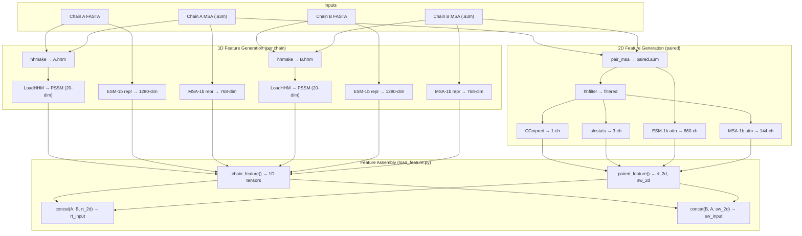
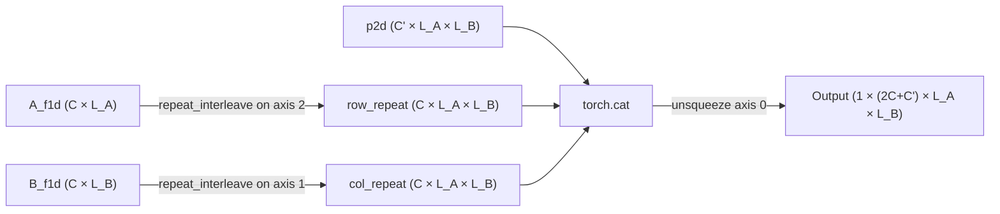

---
slug:5-feature-engineering-pipeline
blog_type:normal
---


特征工程流水线是 DRN-1D2D_Inter 的数据骨干，它将原始蛋白质序列和多重序列比对转换为结构化的 **4944 通道二维接触图张量**，以馈入膨胀残差网络。该流水线融合了三种不同的信息来源 —— **进化谱**（来自 HHblits 的 PSSM）、**单链蛋白质语言模型嵌入**（ESM-1b）和 **MSA 感知语言模型嵌入**（ESM-MSA-1b）—— 将其转化为逐残基（1D）和成对（2D）特征通道，随后将 1D 信号扩展至二维平面，生成最终的输入张量。

## 特征类别与维度

该流水线产生两类特征，并最终合并为单一的二维张量。**1D（逐残基）特征**独立捕获每条链的局部序列上下文，而 **2D（成对）特征**则从配对的 MSA 中编码链间共进化与基于注意力的信号。

| 特征 | 来源模块 | 维度 | 范围 | 生成方式 |
|---------|--------------|-----------|-------|------------|
| PSSM | HHblits → `LoadHHM.py` | 20 | 单链 1D | 进化谱 |
| ESM-1b 表示 | `esm1b_repr.py` | 1280 | 单链 1D | PLM 逐残基嵌入 |
| MSA-1b 表示 | `msa1b_repr.py` | 768 | 单链 1D | MSA 感知 PLM 嵌入 |
| CCmpred | 外部二进制文件 | 1 | 配对 2D | 共进化耦合 |
| 比对统计量 | 外部 `alnstats` | 3 | 配对 2D | 协方差统计量 |
| ESM-1b 注意力 | `esm1b_attn.py` | 660 (33×20) | 配对 2D | 链间注意力头 |
| MSA-1b 注意力 | `msa1b_attn.py` | 144 (12×12) | 配对 2D | MSA 感知链间注意力 |

**每条链的总 1D 特征维度**为 20 + 1280 + 768 = **2068**。**总 2D 配对特征维度**为 1 + 3 + 660 + 144 = **808**。最终输入张量的通道数为：2068 × 2（两条链）+ 808 = **4944**，这与网络中 `first_layer` 的输入规范相匹配。

来源: [model.py](model.py#L160-L166), [load_feature.py](load_feature.py#L42-L58)

## 流水线架构

下图展示了从原始输入到最终模型可用张量的完整特征生成与组装流程：



来源: [predict.py](predict.py#L44-L154), [load_feature.py](load_feature.py#L16-L102)

## 1D 特征构建：`chain_feature()`

`chain_feature()` 函数为每条链加载并拼接三种逐残基特征。对于给定的链，它从 HHM pickle 文件中读取 PSSM，从 `.npy` 文件中读取 ESM-1b 表示和 MSA-1b 表示，然后将它们水平堆叠为单一矩阵并转置，生成一个 **(2068 × L)** 张量，其中 L 为链长。

```python
# 单链 1D 组装（源码简化版）
PSSM = pickle.load(open(pssm_file, 'rb'))['PSSM']       # (L, 20)
esm1b_repr = np.load(esm1b_repr_file)                     # (L, 1280)
msa1b_repr = np.load(msa1b_repr_file)                     # (L, 768)
feature_1d = np.hstack((PSSM, esm1b_repr, msa1b_repr)).T # (2068, L)
```

该函数遍历链 `['A', 'B']` 并返回包含两个张量的列表 —— `[A_feature, B_feature]`，每个张量的形状为 `(2068, L_chain)`。`.T` 转置操作至关重要：它将 **通道维度置于首位**，以匹配下游 `concat()` 的扩展逻辑。

**PSSM 生成**首先由 `hhmake` 将输入的 `.a3m` MSA 转换为 `.hhm` profile HMM 文件，随后 `LoadHHM.py` 解析 HMM 发射分数，利用 Gonnet 替换矩阵应用伪计数校正，重新归一化概率，最后计算位置特异性得分矩阵，公式为 `PSSM = log2(PSFM) + HMMNull`。结果存储为 pickle 字典，其 `'PSSM'` 键包含一个 `(L, 20)` 数组 —— 即每个残基对应每个标准氨基酸的一个得分。

来源: [load_feature.py](load_feature.py#L42-L58), [plm/LoadHHM.py](plm/LoadHHM.py#L188-L190)

## 2D 特征构建：`paired_feature()`

`paired_feature()` 函数组装链间成对特征，并生成 **两个对称的二维张量** —— `rt_feature_2d`（右向）和 `sw_feature_2d`（交换）—— 它们捕获了 A→B 界面的互补方向视图。

### 共进化特征

**CCmpred** 根据配对的 MSA 比对计算原始共进化耦合，生成一个完整的 `(L_A+L_B) × (L_A+L_B)` 矩阵。该函数仅提取 **链间块** `[:L_A, L_A:]` —— 即捕获链 A 残基与链 B 残基之间耦合的子矩阵 —— 从而产生单一的 `(L_A × L_B)` 通道。

**比对统计量**（`alnstats`）从三列文件中解析而得，文件中每行指定一个残基对的 `(i, j, stat1, stat2, stat3)`。该函数构建一个对称的 `(3 × (L_A+L_B) × (L_A+L_B))` 张量，随后切片出链间部分 `[:, :L_A, L_A:]`，生成形状为 `(L_A × L_B)` 的 **3 个通道**。

### 蛋白质语言模型注意力特征

ESM-1b 和 ESM-MSA-1b 注意力特征是信息最丰富的 2D 通道。它们各自从拼接配对序列的 **跨链注意力块** 中生成形状为 `(num_layers, num_heads, L_A, L_B)` 的注意力张量。这些张量通过展平层数和头数维度进行重塑：

- **ESM-1b 注意力**：`(33, 20, L_A, L_B)` → 重塑为 `(660, L_A, L_B)` —— 33 层 × 20 头
- **MSA-1b 注意力**：`(12, 12, L_A, L_B)` → 重塑为 `(144, L_A, L_B)` —— 12 层 × 12 头

跨链提取的机制是：在 **拼接序列**（链 A 后接链 B）上运行语言模型，然后切片注意力矩阵，仅隔离出 **链 A 查询关注链 B 键** 的区域（右向注意力）以及反之亦然的区域（交换注意力）。这正是将单链语言模型转化为链间相互作用信号提取器的机制。

### 双视图组装

关键的设计决策是构建两个独立的 2D 特征张量：

| 视图 | 2D 组件 | 形状 |
|------|--------------|-------|
| `rt_feature_2d` | `[ccmpred, alnstats, esm1b_rt_attn, msa1b_rt_attn]` | `(808, L_A, L_B)` |
| `sw_feature_2d` | `[ccmpred.T, alnstats.T, esm1b_sw_attn, msa1b_sw_attn]` | `(808, L_B, L_A)` |

**右向视图**（`rt`）使用具有原生方向共进化特征的 A→B 方向注意力。**交换视图**（`sw`）转置了共进化特征并使用 B→A 方向注意力，有效地镜像了整个特征图。这种双视图策略利用了 **注意力的不对称性**（A 关注 B ≠ B 关注 A），同时确保捕获了界面的两种方向，这对于异二聚体界面尤其重要，因为其相互作用的不对称性具有生物学意义。

来源: [load_feature.py](load_feature.py#L61-L102), [plm/esm1b_attn.py](plm/esm1b_attn.py#L54-L61), [plm/msa1b_attn.py](plm/msa1b_attn.py#L57-L64)

## 1D 到 2D 扩展：`concat()`

`concat()` 函数是最终的组装步骤，它将 1D 逐残基特征与 2D 成对特征合并为单一的模型可用张量。它对每条链的 1D 特征在二维平面上执行 **广播扩展**：



对于链 A 的 1D 特征 `(C, L_A)`，每个残基的特征向量沿新的列维度 **复制 L_B 次**，生成一个 `(C, L_A, L_B)` 的映射图，其中每个列位置承载相同的 A 残基信号。链 B 的 1D 特征则进行互补扩展 —— 沿行维度复制 `L_A` 次。这意味着生成的 2D 映射图中的每个单元格 `(i, j)` 包含 **链 A 的残基 i** 和 **链 B 的残基 j** 的拼接特征，以及该位置的成对特征。

最终输出形状为 **(1, 4944, L_A, L_B)** —— 一个具有批次维度 1、4944 个通道，且空间维度与链间接触图相匹配的四维张量。4944 个通道可分解为：2068（扩展后的 A）+ 2068（扩展后的 B）+ 808（配对的 2D）。

来源: [load_feature.py](load_feature.py#L16-L27), [model.py](model.py#L13-L25)

## 预测中的端到端特征流

`predict.py` 中的预测流水线编排了完整的特征工程序列。1D 和 2D 特征通过外部工具和语言模型推理独立生成，随后通过 `load_feature.py` 加载并组装：

```python
# 从磁盘加载预生成的特征
featureA, featureB = load_feature.chain_feature(result_path)   # 每条链的 1D
rt_p2d, sw_p2d = load_feature.paired_feature(result_path)      # 2D 配对视图

# 组装两个对称的输入张量
rt_input = load_feature.concat(featureA, featureB, rt_p2d)     # (1, 4944, L_A, L_B)
sw_input = load_feature.concat(featureB, featureA, sw_p2d)     # (1, 4944, L_B, L_A)
```

注意第二次 `concat()` 调用中的 **参数顺序交换**：`concat(featureB, featureA, sw_p2d)` 将链 B 的特征置于行扩展位置，链 A 的特征置于列扩展位置，以匹配 `sw_p2d` 的转置几何结构。随后这两个输入被传入同一个模型，并通过转置校正（`preds2.T`）对它们的预测结果求平均，从而生成最终对称的接触概率图。

<CgxTip>双视图预测（`rt_input` + `sw_input`）有效地在推理时将集成规模翻倍。由于加载了 7 个模型检查点，且每个检查点从两个视图生成预测（共 14 次前向传播），最终预测会对所有 14 个输出求平均，这显著改善了对非对称界面的校准效果。</CgxTip>

来源: [predict.py](predict.py#L145-L177)

## 特征生成依赖

特征工程流水线依赖于多种外部工具和预训练模型检查点。下表总结了各项依赖及其在流水线中的作用：

| 依赖 | 作用 | 输出格式 |
|-----------|------|--------------|
| `hhmake` (HH-suite) | 将 MSA 转换为 profile HMM | `.hhm` 文件 |
| `hhfilter` (HH-suite) | 将 MSA 过滤至最多 256 条序列 | `.a3m` 文件 |
| `CCMpred` | 计算共进化耦合 | `.ccmpred` 矩阵 |
| `alnstats` (metapsicov) | 计算比对统计量 | `.singout` / `.pairout` |
| ESM-1b 检查点 (650M 参数) | 单序列 PLM | `.repr.npy` / `.attn.npy` |
| ESM-MSA-1b 检查点 (100M 参数) | MSA 感知 PLM | `.repr.npy` / `.attn.npy` |

ESM 检查点作为接触回归参数文件存储在 `data/regression/` 目录下，而完整的模型权重需按照 ESM 库的约定单独下载。

来源: [predict.py](predict.py#L24-L31), [data/regression](data/regression)

## 特征维度验证

追踪流水线中的确切通道数可确认网络 1×1 投影层的 4944 通道输入：

| 组件 | 通道数 | 计算过程 |
|-----------|----------|-------------|
| 每条链的 PSSM | 20 | 20 种标准氨基酸 |
| 每条链的 ESM-1b 表示 | 1280 | ESM-1b 嵌入维度 |
| 每条链的 MSA-1b 表示 | 768 | ESM-MSA-1b 嵌入维度 |
| **每条链的 1D 总数** | **2068** | 20 + 1280 + 768 |
| CCmpred | 1 | 单一耦合通道 |
| 比对统计量 | 3 | 三种协方差统计量 |
| ESM-1b 注意力 | 660 | 33 层 × 20 头 |
| MSA-1b 注意力 | 144 | 12 层 × 12 头 |
| **2D 总数** | **808** | 1 + 3 + 660 + 144 |
| **总计** | **4944** | 2068 × 2 + 808 |

此 4944 通道张量由网络的 `first_layer`（一个带有 InstanceNorm 和 LeakyReLU 的 1×1 卷积）投影至 96 个通道，随后进入膨胀残差块。

<CgxTip>2D 注意力通道（660 + 144 = 804）主导了 2D 特征预算，而 1D PLM 表示（1280 + 768 = 2048）则主导了 1D 特征预算。这一设计反映了经验发现：对于链间接触预测，语言模型嵌入比传统进化谱携带着更丰富的信号。</CgxTip>

来源: [model.py](model.py#L160-L166), [load_feature.py](load_feature.py#L42-L102)

## 下一步

特征工程流水线生成 4944 通道输入张量，直接馈入膨胀残差网络。若要了解该张量如何通过具有受控感受野增长的混合 1D-2D 卷积进行逐步精炼，请继续阅读 [混合 1D-2D 残差块](6-hybrid-1d-2d-residual-block)。有关每个 PLM 特征计算方式的详情，请参见 [ESM-1b 注意力与表示](9-esm-1b-attention-and-representation) 和 [ESM-MSA-1b 注意力与表示](10-esm-msa-1b-attention-and-representation)。如需了解包含双视图预测的完整推理工作流，请参见 [预测流水线](13-prediction-pipeline)。