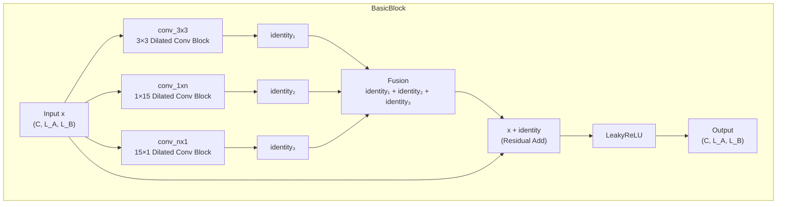
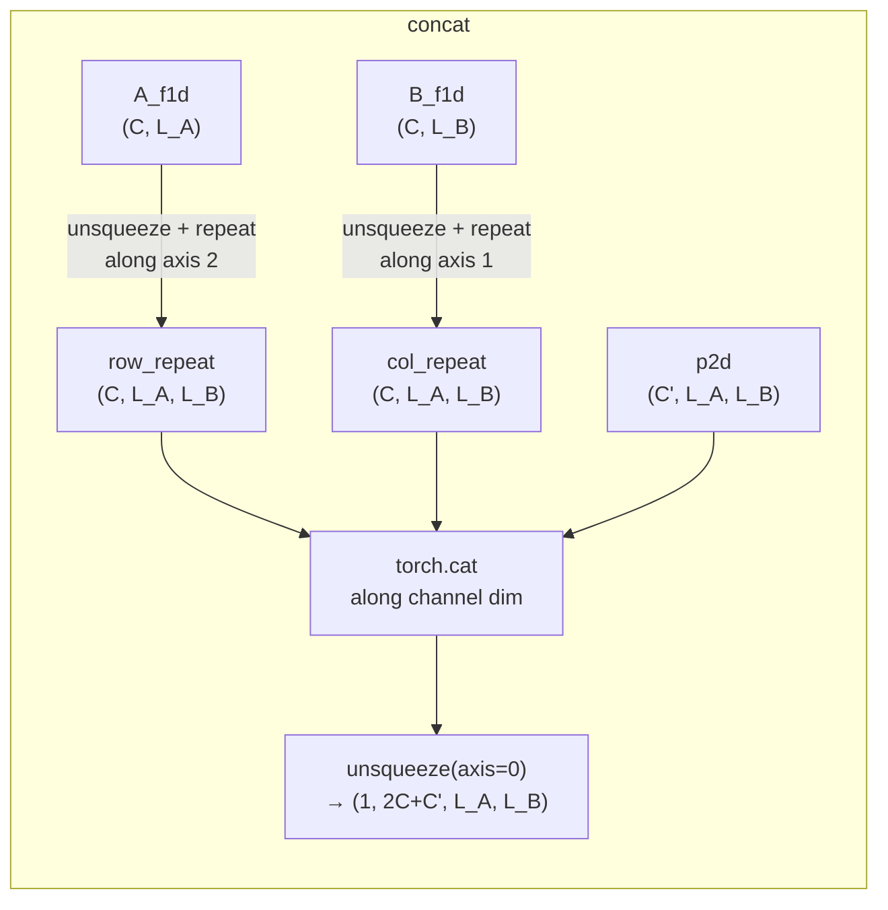

---
slug:6-hybrid-1d-2d-residual-block
blog_type:normal
---


**混合 1D-2D 残差块**（`BasicBlock`）是 DRN-1D2D_Inter 的核心架构创新。它通过**三个并行的卷积分支**处理 2D 接触图形状的张量——一个 2D 分支用于捕获局部空间模式，两个 1D 导向分支用于沿各自轴独立捕获长程依赖——然后通过残差连接融合它们的输出。这种维度混合设计是使网络能够同时学习细粒度成对相互作用和跨蛋白质残差对的扩展序列相关性的关键机制，这种二元性对于蛋白质间接触预测至关重要。

来源：[model.py](model.py#L78-L151)

## 动机：为什么混合 1D 和 2D？

蛋白质间接触图是 2D 矩阵，其中每个条目 (i, j) 表示蛋白质 A 中的残基 i 接触蛋白质 B 中的残基 j 的概率。在这种表示中并存着两种不同的信号尺度：

- **局部 2D 模式**：跨越 2D 图中较小邻域的接触簇和协同进化斑块——自然由标准 3×3 卷积捕获。
- **长程 1D 相关性**：沿一条蛋白质链的残基通常表现出跨越多个位置的序列保守性或结构周期性（例如螺旋重复）——最好通过沿单轴应用的细长 1D 导向核来捕获。

具有小感受野的纯 2D 卷积在没有深层堆叠的情况下无法高效触及长程相关性。相反，纯 1D 方法忽略了联合空间结构。混合块通过**与 3×3 膨胀卷积并行运行 1×15 和 15×1 膨胀卷积**来解决这一矛盾，使网络在单个残差单元内能同时访问这两种信号尺度。

来源：[model.py](model.py#L93-L116)

## 架构概览

下图说明了当膨胀率激活所有三个分支时，`BasicBlock` 的内部数据流：



当膨胀率落在阈值集合 `{1, 20, 40}` 之外时，仅 3×3 分支处于激活状态，该块退化为标准的 2D 残差块。

来源：[model.py](model.py#L127-L151)

## 卷积子块：`make_conv_layer`

每个分支不是单个卷积，而是由 `make_conv_layer` 构建的**双层子块**。该工厂函数构建以下顺序链：

| 步骤 | 层 | 配置 |
|------|-------|--------------|
| 1 | `Conv2d` | `in_channels → out_channels`，指定的核/填充/膨胀，**bias=False** |
| 2 | `InstanceNorm2d` | `momentum=0.1`，`affine=True`，`track_running_stats=False` *(可选)* |
| 3 | `LeakyReLU` | `negative_slope=0.01` *(可选)* |
| 4 | `Conv2d` | `out_channels → out_channels`，相同的核/填充/膨胀，**bias=False** |
| 5 | `InstanceNorm2d` | 与步骤 2 配置相同 *(可选)* |

关键设计选择：使用**实例归一化（Instance Normalization）**而非批归一化（Batch Normalization）——这适用于蛋白质结构预测中尺寸可变的接触图，因为此时批次统计量并不可靠。`affine=True` 标志允许学习缩放/偏移参数，而 `track_running_stats=False` 确保归一化仅使用当前实例的统计量。两个卷积共享相同的核大小、填充和膨胀率，这意味着感受野在两层之间是复合的。

来源：[model.py](model.py#L28-L55)

## 三个并行分支

### 分支 1：2D 局部路径（`conv_3x3`）

无论膨胀率如何，始终实例化。使用具有均匀膨胀 `(d, d)` 和填充 `(1, 1)` 的 **3×3 核**以维持空间维度。该分支捕获每个残基对直接邻域内的局部 2D 协同进化和接触模式。

```python
self.conv_3x3 = make_conv_layer(
    in_channels=in_channels, out_channels=out_channels,
    kernel_size=(3,3), padding_size=(1,1),
    dilated_rate=(dilated_rate, dilated_rate))
```

### 分支 2：逐行 1D 路径（`conv_1xn`）

有条件创建——仅在 `dilated_rate ∈ {1, 20, 40}` 时创建。使用具有膨胀 `(1, d)` 和填充 `(0, 7×d)` 的 **1×15 核**。行维度的核大小为 1 且膨胀率为 1，意味着不跨行聚合信息。列维度使用细长的 15 宽核且膨胀率为 `d`，沿 B 链轴扫描，以捕获链 A 中每个固定位置的长程序列模式。

```python
self.conv_1xn = make_conv_layer(
    in_channels=in_channels, out_channels=out_channels,
    kernel_size=(1,15), padding_size=(0, 7*dilated_rate),
    dilated_rate=(1, dilated_rate))
```

### 分支 3：逐列 1D 路径（`conv_nx1`）

有条件创建——仅在 `dilated_rate ∈ {1, 20, 40}` 时创建。使用具有膨胀 `(d, 1)` 和填充 `(7×d, 0)` 的 **15×1 核**。这是分支 2 的转置：它沿 A 链轴扫描，同时保持每个 B 链位置独立，从而捕获链 A 中的长程序列相关性。

```python
self.conv_nx1 = make_conv_layer(
    in_channels=in_channels, out_channels=out_channels,
    kernel_size=(15,1), padding_size=(7*dilated_rate, 0),
    dilated_rate=(dilated_rate, 1))
```

下表总结了每个分支在不同膨胀率下的感受野特征：

| 膨胀率 | 3×3 有效感受野 | 1×15 有效感受野（每个子层） | 15×1 有效感受野（每个子层） |
|:---:|:---:|:---:|:---:|
| 1 | 3×3 | 1×15 | 15×1 |
| 20 | 41×41 | 1×281 | 281×1 |
| 40 | 81×81 | 1×561 | 561×1 |

由于每个 `make_conv_layer` 包含**两**个卷积层，子块后的实际感受野甚至更大。例如，在膨胀率为 20 时，沿行膨胀率为 1、沿列膨胀率为 20 的两个堆叠 1×15 卷积，可产生约 **1×547** 个位置的有效列覆盖。

来源：[model.py](model.py#L93-L116)

## 膨胀激活的分支门控

一个关键的架构细节是**阈值门控分支激活**。`BasicBlock` 定义了：

```python
self.threshold = [1, 20, 40]
```

只有当块的 `dilated_rate` 匹配这三个值之一时，1D 导向分支（`conv_1xn`、`conv_nx1`）才会被实例化。对于任何其他膨胀率，该块作为仅包含 `conv_3x3` 的纯 2D 残差块运行。此设计同时实现了两个目标：

1. **选择性的参数效率**：并非每个膨胀级别都需要 1D 分支。中间膨胀率（例如 2、4、8）仅依赖 2D 路径，在长程 1D 建模不太关键的地方减少了参数量。
2. **策略性的长程覆盖**：阈值 {1, 20, 40} 被选择以覆盖短程 (d=1)、中程 (d=20) 和长程 (d=40) 序列相关性，确保 1D 路径能够跨越典型蛋白质链的全长（100–400 个残基）。

<CgxTip>阈值列表 `[1, 20, 40]` 充当架构超参数，控制维度混合在膨胀时间表中*何处*发生。修改此列表会直接改变哪些膨胀阶段接收 1D 分支——增加更多值会增加模型容量，但同时也会增加参数量和内存使用。</CgxTip>

来源：[model.py](model.py#L89-L101)

## 融合策略：求和与拼接

`BasicBlock` 支持由 `self.concatenate` 标志控制的两种融合模式：

| 模式 | `concatenate` | 操作 | 1×1 投影 | 参数开销 |
|------|:---:|-----------|:---:|----------------|
| **逐元素求和** | `False` | `identity₁ + identity₂ + identity₃` | 不需要 | 零开销 |
| **拼接** | `True` | 沿通道维度 `cat(identity₁, identity₂, identity₃)` | `1×1 Conv: 3C → C` | 额外 3C² 个参数 |

在当前配置中，**`concatenate = False`**，因此三个分支的输出被相加。此选择优先考虑参数效率和训练稳定性——逐元素相加不需要额外参数，并自然地鼓励每个分支学习互补的残差校正。拼接路径作为架构选项保留在代码中：启用时，它应用 `make_1x1_layer` 将拼接的 3×C 通道投影回 C 通道，然后再与输入相加。

```python
# 求和模式（默认）
identity = identity1 + identity2 + identity3

# 拼接模式（备选）
identity = torch.cat((identity1, identity2, identity3), 1)
identity = self.conv_1x1(identity)
```

来源：[model.py](model.py#L118-L141)

## 残差连接与激活

前向传播通过标准的加性跳跃连接及随后的激活来完成残差块：

```python
out = x + identity        # 残差相加
out = self.leakyrelu(out) # LeakyReLU (negative_slope=0.01)
```

使用**恒等快捷连接（identity shortcut）**（无投影），因为所有分支都通过适当的填充保留空间维度，且输入/输出通道数相等（在当前网络配置中 `in_channels == out_channels`）。带有小负斜率 (0.01) 的 **LeakyReLU** 防止了神经元死亡，同时对负激活保持接近零的梯度——这是一个保守的选择，可稳定深度堆叠残差网络的训练。

来源：[model.py](model.py#L127-L151)

## 从 1D 特征到 2D 输入：`concat` 函数

混合块在 2D 张量上运行，但特征管线产生的是**1D 单链特征**（PSSM、ESM-1b 表示、ESM-MSA-1b 表示）以及**2D 成对特征**（CCMpred、alnstats、PLM attentions）。`concat` 函数通过**轴对齐广播**弥合了这一维度差距：



对于形状为 `(C, L_A)` 的链 A 的 1D 特征 `A_f1d`，它被 unsqueeze 至 `(C, L_A, 1)` 并沿轴 2 重复 `L_B` 次，产生 `(C, L_A, L_B)`——每一列将链 A 的特征复制到链 B 的所有位置。相同逻辑对称地应用于链 B。这三个张量（行广播的 A、列广播的 B、成对的 2D）沿通道维度拼接，并 unsqueeze 以添加批次维度。这构造了 `ResNet.first_layer` 向下投影至 96 个通道的 **4944 通道输入**。

<CgxTip>广播模式编码了强烈的归纳偏置：2D 图中的每个位置 (i, j) 都接收 {链 A 在位置 i 的特征，链 B 在位置 j 的特征，(i, j) 处的成对特征} 的并集。这确保了 1D 导向的卷积分支即使输入是 2D 张量，也能提取单链的序列模式。</CgxTip>

来源：[model.py](model.py#L13-L25)，[load_feature.py](load_feature.py#L16-L27)

## 完整网络中的块实例化

`ResNet` 类通过以下层堆栈组装完整的预测网络：

| 层 | 操作 | 通道 |
|-------|-----------|----------|
| `first_layer` | 1×1 Conv + InstanceNorm + LeakyReLU | 4944 → 96 |
| `hidden_layer` | `BasicBlock` 单元序列 | 96 → 96 |
| `output_layer` | 1×1 Conv（无归一化，无激活） | 96 → 1 |
| 最终 | Clamp(−15, 15) + Sigmoid | 1 → [0, 1] |

`resnet18()` 工厂创建了一个具有 **9 个 BasicBlock 单元**的 `ResNet`，所有单元共享相同的膨胀率（通过 `_make_layer` 外部设置）。对所有 `Conv2d` 模块应用了 `a=0.01` 且 `mode='fan_in'` 的 Kaiming 正态初始化，与 LeakyReLU 负斜率匹配，以在初始化时实现正确的信号传播。

来源：[model.py](model.py#L154-L218)

## 设计原理总结

| 设计选择 | 原理 |
|---------------|-----------|
| 1×15 和 15×1 核 | 细长的感受野沿每条蛋白质链捕获序列相关性，而不发生跨轴混合 |
| 1D 分支仅在其轴向上膨胀 | 保持正交轴上的逐位置独立性——真正的 1D 扫描 |
| 阈值门控激活 | 选择性混合平衡了各膨胀级别的容量与参数效率 |
| 逐元素求和融合 | 零开销的分支组合；鼓励互补的残差学习 |
| 实例归一化 | 适用于尺寸可变的接触图；避免对批次统计量的依赖 |
| 每个分支的双卷积子块 | 在每个分支内复合感受野，同时维持梯度流 |
| 恒等快捷连接 | 无投影的干净残差学习；因通道保持不变而可行 |

---

**下一步**：了解膨胀率如何在整个网络中进行策略性调度，请参阅[膨胀率策略](7-dilation-rate-strategy)，或查看所有块如何端到端组合，请参阅[网络前向传播](8-network-forward-pass)。